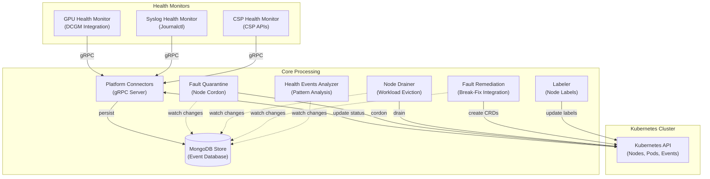

# NVSentinel

[](LICENSE)
[](https://kubernetes.io/)
[](https://helm.sh/)

**GPU Node Resilience System for Kubernetes**

NVSentinel is a comprehensive collection of Kubernetes services that automatically detect, classify, and remediate hardware and software faults in GPU nodes. Designed for GPU clusters, it ensures maximum uptime and seamless fault recovery in high-performance computing environments.

> [!WARNING]
> **Experimental Preview Release**
> This is an experimental/preview release of NVSentinel. Use at your own risk in production environments. The software is provided "as is" without warranties of any kind. Features, APIs, and configurations may change without notice in future releases. For production deployments, thoroughly test in non-critical environments first.

## 🚀 Quick Start

### Prerequisites

- Kubernetes 1.25+
- Helm 3.0+
- NVIDIA GPU Operator (includes DCGM for GPU monitoring)

### Installation

```bash
# Install from GitHub Container Registry
helm install nvsentinel oci://ghcr.io/nvidia/nvsentinel \
  --version v0.2.0 \
  --namespace nvsentinel \
  --create-namespace

# View chart information
helm show chart oci://ghcr.io/nvidia/nvsentinel --version v0.2.0
```

## ✨ Key Features

- **🔍 Comprehensive Monitoring**: Real-time detection of GPU, NVSwitch, and system-level failures
- **🔧 Automated Remediation**: Intelligent fault handling with cordon, drain, and break-fix workflows
- **📦 Modular Architecture**: Pluggable health monitors with standardized gRPC interfaces
- **🔄 High Availability**: Kubernetes-native design with replica support and leader election
- **⚡ Real-time Processing**: Event-driven architecture with immediate fault response
- **📊 Persistent Storage**: MongoDB-based event store with change streams for real-time updates
- **🛡️ Graceful Handling**: Coordinated workload eviction with configurable timeouts

## 🧪 Complete Setup Guide

For a full installation with all dependencies, follow these steps:

### 1. Install cert-manager (for TLS)

```bash
helm repo add jetstack https://charts.jetstack.io --force-update
helm upgrade --install cert-manager jetstack/cert-manager \
  --namespace cert-manager --create-namespace \
  --version v1.19.1 --set installCRDs=true \
  --wait
```

### 2. Install Prometheus (for metrics)

```bash
helm repo add prometheus-community https://prometheus-community.github.io/helm-charts --force-update
helm upgrade --install prometheus prometheus-community/kube-prometheus-stack \
  --namespace monitoring --create-namespace \
  --set prometheus.enabled=true \
  --set alertmanager.enabled=false \
  --set grafana.enabled=false \
  --set kubeStateMetrics.enabled=false \
  --set nodeExporter.enabled=false \
  --wait
```

### 3. Install NVSentinel

```bash
NVSENTINEL_VERSION=v0.2.0

helm upgrade --install nvsentinel oci://ghcr.io/nvidia/nvsentinel \
  --namespace nvsentinel --create-namespace \
  --version "$NVSENTINEL_VERSION" \
  --timeout 15m \
  --wait
```

### 4. Verify Installation

```bash
kubectl get pods -n nvsentinel
kubectl get nodes  # Verify GPU nodes are visible

# Run comprehensive validation
./scripts/validate-nvsentinel.sh --version v0.2.0 --verbose
```

> **Testing**: The example above uses default settings. For production, customize values for your environment.

> **Production**: By default, only health monitoring is enabled. Enable fault quarantine and remediation modules via Helm values. See [Configuration](#-configuration) below.


## 🏗️ Architecture

NVSentinel follows a microservices architecture with modular health monitors and core processing modules:



**Data Flow**:
1. **Health Monitors** detect hardware/software faults and send events via gRPC to Platform Connectors
2. **Platform Connectors** validate, persist events to MongoDB, and update Kubernetes node conditions
3. **Core Modules** independently watch MongoDB change streams for relevant events
4. **Modules** interact with Kubernetes API to cordon, drain, label nodes, and create remediation CRDs
5. **Labeler** monitors pods to automatically label nodes with DCGM and driver versions

> **Note**: All modules operate independently without direct communication. Coordination happens through MongoDB change streams and Kubernetes API.

## ⚙️ Configuration

NVSentinel is highly configurable with options for each module. For complete configuration documentation, see the **[Helm Chart README](distros/kubernetes/README.md)**.

### Quick Configuration Overview

```yaml
global:
  dryRun: false  # Test mode - log actions without executing
  
  # Health Monitors (enabled by default)
  gpuHealthMonitor:
    enabled: true
  syslogHealthMonitor:
    enabled: true

  # Core Modules (disabled by default - enable for production)
  faultQuarantine:
    enabled: false
  nodeDrainer:
    enabled: false
  faultRemediation:
    enabled: false
  janitor:
    enabled: false
  mongodbStore:
    enabled: false 
```

**Configuration Resources**:
- **[Helm Chart Configuration Guide](distros/kubernetes/README.md#configuration)**: Complete configuration reference
- **[values-full.yaml](distros/kubernetes/nvsentinel/values-full.yaml)**: Detailed reference with all options
- **[values.yaml](distros/kubernetes/nvsentinel/values.yaml)**: Default values

## 📦 Module Details

For detailed module configuration, see the **[Helm Chart Configuration Guide](distros/kubernetes/README.md#module-specific-configuration)**.

### 🔍 Health Monitors

- **GPU Health Monitor**: Monitors GPU hardware health via DCGM - detects thermal issues, ECC errors, and XID events
- **Syslog Health Monitor**: Analyzes system logs for hardware and software fault patterns via journalctl
- **CSP Health Monitor**: Integrates with cloud provider APIs (GCP/AWS) for maintenance events

### 🏗️ Core Modules

- **Platform Connectors**: Receives health events from monitors via gRPC, persists to MongoDB, and updates Kubernetes node status
- **Fault Quarantine**: Watches MongoDB for health events and cordons nodes based on configurable CEL rules
- **Node Drainer**: Gracefully evicts workloads from cordoned nodes with per-namespace eviction strategies
- **Fault Remediation**: Triggers external break-fix systems by creating maintenance CRDs after drain completion
- **Janitor**: Executes node reboots and terminations via cloud provider APIs
- **Health Events Analyzer**: Analyzes event patterns and generates recommended actions
- **MongoDB Store**: Persistent storage for health events with real-time change streams
- **Labeler**: Automatically labels nodes with DCGM and driver versions

## 📋 Requirements

- **Kubernetes**: 1.25 or later
- **Helm**: 3.0 or later
- **NVIDIA GPU Operator**: For GPU monitoring capabilities (includes DCGM)
- **Storage**: Persistent storage for MongoDB (recommended 10GB+)
- **Network**: Cluster networking for inter-service communication

## 🤝 Contributing

We welcome contributions! Here's how to get started:

**Ways to Contribute**:
- 🐛 Report bugs and request features via [issues](https://github.com/NVIDIA/NVSentinel/issues)
- 🧭 See what we're working on in the [roadmap](ROADMAP.md)
- 📝 Improve documentation
- 🧪 Add tests and increase coverage
- 🔧 Submit pull requests to fix issues
- 💬 Help others in [discussions](https://github.com/NVIDIA/NVSentinel/discussions)

**Getting Started**:
1. Read the [Contributing Guide](CONTRIBUTING.md) for guidelines
2. Check the [Development Guide](DEVELOPMENT.md) for setup instructions
3. Browse [open issues](https://github.com/NVIDIA/NVSentinel/issues) for opportunities

All contributors must sign their commits (DCO). See the contributing guide for details.

## 💬 Support

- 🐛 **Bug Reports**: [Create an issue](https://github.com/NVIDIA/NVSentinel/issues/new)
- ❓ **Questions**: [Start a discussion](https://github.com/NVIDIA/NVSentinel/discussions/new?category=q-a)
- 🔒 **Security**: See [Security Policy](SECURITY.md)

### Stay Connected

- ⭐ **Star this repository** to show your support
- 👀 **Watch** for updates on releases and announcements
- 🔗 **Share** NVSentinel with others who might benefit

## 📄 License

This project is licensed under the Apache License 2.0 - see the [LICENSE](LICENSE) file for details.

---

*Built with ❤️ by NVIDIA for GPU infrastructure reliability*
