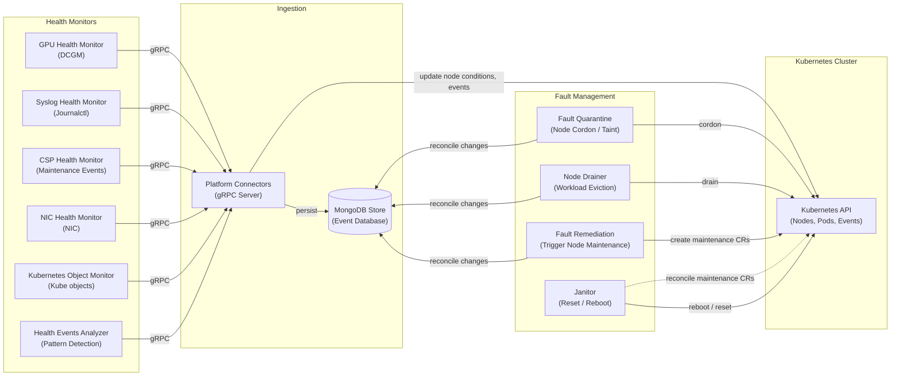

# NVSentinel

[](LICENSE)
[](https://kubernetes.io/)
[](https://helm.sh/)

**NVSentinel detects and remediates GPU faults on Kubernetes nodes**

A single bad GPU can silently corrupt a training run or leave a node sitting idle for hours before anyone notices. NVSentinel catches these faults as they happen, cordons and drains the affected node, then fixes it with a GPU reset or a reboot, and puts it back into service, no paging required.

> [!NOTE]
> **Beta / Stable**
> NVSentinel is ready for production testing and use. APIs, configurations, and features may change between releases. If you encounter issues, please [open an issue](https://github.com/NVIDIA/NVSentinel/issues) or [start a discussion](https://github.com/NVIDIA/NVSentinel/discussions).

## Prerequisites

- Kubernetes 1.34+ 
- Helm 3.0+
- [NVIDIA GPU Operator](https://github.com/NVIDIA/gpu-operator)
- [cert-manager](https://cert-manager.io/) v1.19+
- Persistent storage support for a database

```bash
# GPU Operator: enable DCGM standalone mode (required)
# By default the GPU Operator embeds DCGM inside dcgm-exporter and doesn't
# expose it as its own service. NVSentinel connects to DCGM directly, so add
# `dcgm.enabled=true` to however you already install/upgrade the GPU Operator:
helm repo add nvidia https://helm.ngc.nvidia.com/nvidia --force-update
helm upgrade --install gpu-operator nvidia/gpu-operator \
  --namespace gpu-operator --create-namespace \
  --set dcgm.enabled=true \
  --wait

# cert-manager (required)
helm repo add jetstack https://charts.jetstack.io --force-update
helm upgrade --install cert-manager jetstack/cert-manager \
  --namespace cert-manager --create-namespace \
  --version v1.19.1 --set installCRDs=true \
  --wait
```

## Quick Start

Most teams roll NVSentinel out in stages:

### Stage 1: Monitor

This turns on health monitoring only. NVSentinel watches your GPUs and system logs and reports faults as Kubernetes node conditions. It won't cordon a node, evict a pod or reboot a machine. Nothing here can disrupt a workload, so it's safe to run anywhere while you get a feel for what it reports. The defaults below are all you need.

> [!NOTE]
> **Host installed drivers**
> If your GPU nodes get their NVIDIA driver from the host image instead of the GPU Operator's driver DaemonSet, add `--set labeler.assumeDriverInstalled=true` to every NVSentinel install/upgrade command below.

```bash
NVSENTINEL_VERSION=v1.19.0

# Drop the --set podMonitor.enabled=false flag if prometheus is installed
helm install nvsentinel oci://ghcr.io/nvidia/nvsentinel \
  --version "$NVSENTINEL_VERSION" \
  --namespace nvsentinel --create-namespace \
  --set podMonitor.enabled=false \
  --wait
```

Verify it's running:

```bash
kubectl get pods -n nvsentinel
```

### Stage 2: Remediate

Once you trust what it's reporting, turn on remediation too. NVSentinel will now cordon a faulty node, drain its workloads, and fix it automatically:

- Faults that don't need a full restart get an GPU reset, so the rest of the node's GPUs stay in service.
- Everything else gets a node reboot.

By default, both actions run as a privileged job right on the node itself, so this works on day one with no cloud credentials to set up, on any infrastructure: on-prem, or any cloud. 

```bash
# Drop the --set podMonitor.enabled=false flag if prometheus is installed
helm upgrade --install nvsentinel oci://ghcr.io/nvidia/nvsentinel \
  --version "$NVSENTINEL_VERSION" \
  --namespace nvsentinel --create-namespace \
  -f distros/kubernetes/nvsentinel/values-remediation.yaml \
  --set podMonitor.enabled=false \
  --wait
```

To reboot nodes through your cloud provider's API instead, see the [cloud provider configuration guide](https://docs.nvidia.com/nvsentinel/configuration/janitor-provider/#cloud-provider-selection).

Verify it's running:

```bash
kubectl get pods -n nvsentinel
```

### Stage 3: Preflight (optional)

Preflight is an active check that runs as an init container in the workload pod to confirm the node is ready to take that workload. A job never lands on bad hardware in the first place.

Multi-node checks also need to know which pods belong to the same distributed job, so setup depends on the scheduler you use:

1. **Check your scheduler.** By default, NVSentinel uses Kubernetes' native gang scheduling, covered by [values-preflight-kube.yaml](distros/kubernetes/nvsentinel/values-preflight-kube.yaml) (Note: the `GenericWorkload` and `GangScheduling` feature gates should enabled by a cluster admin). For different schedulers (KAI, Volcano, etc.), see the [gang discovery guide](https://docs.nvidia.com/nvsentinel/configuration/preflight/#gang-discovery) for configuration options.

2. **Enable preflight:**

   ```bash
   # Drop the --set podMonitor.enabled=false flag if prometheus is installed
   helm upgrade --install nvsentinel oci://ghcr.io/nvidia/nvsentinel \
     --version "$NVSENTINEL_VERSION" \
     --namespace nvsentinel --create-namespace \
     -f distros/kubernetes/nvsentinel/values-remediation.yaml \
     -f distros/kubernetes/nvsentinel/values-preflight-kube.yaml \
     --set podMonitor.enabled=false \
     --wait
   ```

   Swap in your scheduler's values file from step 1 if you're not on native Kubernetes gang scheduling.

3. **Label the namespaces that should run it.** It's opt-in per namespace, so nothing changes until you do this:

   ```bash
   kubectl label namespace <your-namespace> nvsentinel.nvidia.com/preflight=enabled
   ```

Verify it's running: submit a GPU pod in the labeled namespace, then check that preflight added its init containers.

```bash
kubectl get pod <pod-name> -n <your-namespace> -o jsonpath='{.spec.initContainers[*].name}'
```

## Architecture

NVSentinel is a set of independent modules coordinated through a shared MongoDB event store and the Kubernetes API; no module talks to another directly.


```mermaid
graph LR
    subgraph "Health Monitors"
        GPU["GPU Health Monitor<br/>(DCGM)"]
        SYS["Syslog Health Monitor<br/>(Journalctl)"]
        CSP["CSP Health Monitor<br/>(Maintenance Events)"]
        NIC["NIC Health Monitor<br/>(NIC)"]
        HEA["Health Events Analyzer<br/>(Pattern Detection)"]
        KOM["Kubernetes Object Monitor<br/>(Kube objects)"]
    end

    subgraph "Ingestion"
        PC["Platform Connectors<br/>(gRPC Server)"]
        STORE[("MongoDB Store<br/>(Event Database)")]
    end

    subgraph "Fault Management"
        FQ["Fault Quarantine<br/>(Node Cordon / Taint)"]
        ND["Node Drainer<br/>(Workload Eviction)"]
        FR["Fault Remediation<br/>(Trigger Node Maintenance)"]
        JAN["Janitor<br/>(Reset / Reboot)"]
    end

    subgraph "Kubernetes Cluster"
        K8S["Kubernetes API<br/>(Nodes, Pods, Events)"]
    end

    GPU -->|gRPC| PC
    SYS -->|gRPC| PC
    CSP -->|gRPC| PC
    NIC -->|gRPC| PC
    KOM -->|gRPC| PC
    HEA -->|gRPC| PC

    PC -->|persist| STORE
    PC -->|update node conditions, events| K8S
    STORE ~~~ FQ
    STORE ~~~ ND
    STORE ~~~ FR
    STORE ~~~ JAN

    FQ -->|reconcile changes| STORE
    FQ -->|cordon| K8S

    ND -->|reconcile changes| STORE
    ND -->|drain| K8S

    FR -->|reconcile changes| STORE
    FR -->|create maintenance CRs| K8S

    JAN -.->|reconcile maintenance CRs| K8S
    JAN -->|reboot / reset| K8S
```


## Try the Demo

### Demo Videos

See NVSentinel in action: click any thumbnail to watch.

<table>
<tr>
<td align="center" width="33%">
<a href="https://youtu.be/6HHYMF-YfqY">

<br/><b>End-to-End</b>
</a>
</td>
<td align="center" width="33%">
<a href="https://youtu.be/0qmrHUmxNPQ">

<br/><b>Custom Health Monitors</b>
</a>
</td>
<td align="center" width="33%">
<a href="https://youtu.be/G1j4NV5IMkY">

<br/><b>Custom Drain Plugins</b>
</a>
</td>
</tr>
<tr>
<td align="center" width="33%">
<a href="https://youtu.be/VVAtON7ERHQ">

<br/><b>Extensible Remediation</b>
</a>
</td>
<td align="center" width="33%">
<a href="https://youtu.be/kwWnC0SEFEI">

<br/><b>Health Events Analyzer</b>
</a>
</td>
<td></td>
</tr>
</table>

See the [demos directory](demos/) for full descriptions.

### Run It Locally

Want to try NVSentinel without GPU hardware? Run our **[Local Fault Injection Demo](demos/local-fault-injection-demo/README.md)**:

- 🚀 **5-minute setup** - runs entirely in a local KIND cluster
- 🔍 **Real pipeline** - see fault detection → quarantine → node cordon
- 🎯 **No GPU required** - uses simulated DCGM for testing

```bash
cd demos/local-fault-injection-demo
make demo  # Automated: creates cluster, installs NVSentinel, injects fault, verifies cordon
```

## Supported GPUs

Validated on NVIDIA Volta, Ampere, Hopper, Ada Lovelace and Blackwell architectures. See the [GPU support](https://docs.nvidia.com/nvsentinel/getting-started/overview/#gpu-support) for more information.

## Learn more

For more, including configuration options, external database setup, writing custom health checks, and operational runbooks, visit [docs.nvidia.com/nvsentinel](https://docs.nvidia.com/nvsentinel/).


## Contributing

We welcome contributions! Here's how to get started:

Ways to Contribute:
- 🐛 Report bugs and request features via [issues](https://github.com/NVIDIA/NVSentinel/issues)
- 🧭 See what we're working on in the [roadmap](ROADMAP.md)
- 📝 Improve documentation
- 🧪 Add tests and increase coverage
- 🔧 Submit pull requests to fix issues
- 💬 Help others in [discussions](https://github.com/NVIDIA/NVSentinel/discussions)

Getting Started:
1. Read the [Contributing Guide](CONTRIBUTING.md) for guidelines
2. Check the [Development Guide](DEVELOPMENT.md) for setup instructions
3. Browse [open issues](https://github.com/NVIDIA/NVSentinel/issues) for opportunities

## Support

- 🐛 Bug Reports: [Create an issue](https://github.com/NVIDIA/NVSentinel/issues/new)
- ❓ Questions: [Start a discussion](https://github.com/NVIDIA/NVSentinel/discussions/new?category=q-a)
- 🔒 Security: See [Security Policy](SECURITY.md)

### Stay Connected

- ⭐ **Star** this repository to show your support
- 👀 **Watch** for updates on releases and announcements
- 🔗 **Share** NVSentinel with others who might benefit

## License

Apache License 2.0. See [LICENSE](LICENSE).

---

*Built with ❤️ by NVIDIA for GPU infrastructure reliability*
