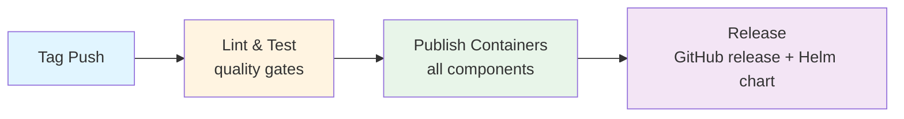

# Release Process

This document outlines the release process for NVSentinel.

## Prerequisites

- Repository admin access with write permissions
- Understanding of semantic versioning (vMAJOR.MINOR.PATCH)
- Access to GitHub Actions workflows

## Release Methods

### Method 1: Automatic Release (Recommended)

For standard releases from the main branch.

**Steps**:
1. **Create and push a version tag**:
   ```bash
   git checkout main
   git pull origin main
   git tag v1.2.3
   git push origin v1.2.3
   ```

2. **Automatic workflows trigger**:
   - Lint and Test workflow validates code quality
   - Publish Containers workflow builds and publishes all images
   - Release workflow creates GitHub release and publishes Helm chart

3. **Verify artifacts**:
   - Container images in GitHub Container Registry
   - GitHub release with `versions.txt`
   - Helm chart at `oci://ghcr.io/nvidia/nvsentinel`

### Method 2: Manual Release

For rebuilding from existing tags or emergency releases.

**Container Publishing**:
1. Navigate to **Actions** → **Publish Containers**
2. Click **Run workflow** → Enter tag (e.g., `v1.2.3`) → **Run workflow**
3. Monitor build progress

**GitHub Release**:
1. Navigate to **Actions** → **Release**
2. Click **Run workflow** → Enter tag (e.g., `v1.2.3`) → **Run workflow**
3. Verify release creation

## Workflow Pipeline



## Released Components

**Container Images** (13 components):
- `gpu-health-monitor-dcgm3` / `gpu-health-monitor-dcgm4`
- `syslog-health-monitor`
- `csp-health-monitor`
- `health-event-client`
- `platform-connectors`
- `health-events-analyzer`
- `fault-quarantine-module`
- `labeler-module`
- `node-drainer-module`
- `fault-remediation-module`
- `log-collector`
- `file-server-cleanup`

**Artifacts**:
- GitHub release with `versions.txt`
- Helm chart at `oci://ghcr.io/nvidia/nvsentinel`

## Quality Gates

All releases must pass:
- **Lint checks**: Code style, license headers, protobuf validation
- **Unit tests**: All Go modules and Python packages
- **Container builds**: All 13 components must build successfully
- **E2E tests**: Integration testing (on PR/push)

## Troubleshooting

**Failed Automatic Release**:
- Check **Lint and Test** workflow logs
- Review **Publish Containers** for build failures
- Use manual workflows to retry specific steps

**Manual Rebuild**:
- Use manual triggers with existing tag
- No need to create new tags for rebuilds

**Release Validation**:
```bash
# Verify versions.txt contains all components
# Check container registry for images
# Test Helm chart installation
helm install nvsentinel oci://ghcr.io/nvidia/nvsentinel --version v1.2.3
```

## Release Artifacts

### Generated Artifacts (Example: v1.2.3)

**Container Images** published to `ghcr.io/nvidia/`:
- All 13 components tagged with `v1.2.3`
- Example: `fault-quarantine-module:v1.2.3`

**Helm Chart**: `oci://ghcr.io/nvidia/nvsentinel:v1.2.3`

**GitHub Release**: Includes `versions.txt` with complete artifact list and SHAs

### Verification

**View in GitHub**:
- **Packages** tab: All containers with version tag
- **Releases** tab: Release with `versions.txt`
- **Actions** tab: Workflow run logs

**Commands**:
```bash
# Pull container image
docker pull ghcr.io/nvidia/syslog-health-monitor:v1.2.3

# Install Helm chart
helm install test oci://ghcr.io/nvidia/nvsentinel --version v1.2.3

# View chart metadata
helm show chart oci://ghcr.io/nvidia/nvsentinel --version v1.2.3
```

### Authentication

No custom secrets required:
- `GITHUB_TOKEN` automatically authenticates to `ghcr.io`
- Ensure repository **Settings** → **Actions** has "Read and write permissions"

## Version Management

- **Semantic versioning**: `vMAJOR.MINOR.PATCH`
- **Pre-releases**: `v1.2.3-rc1`, `v1.2.3-beta1` (automatically marked in GitHub)

## Emergency Hotfix Procedure

For urgent fixes:

1. **Fix in main first**:
   ```bash
   git checkout main
   git checkout -b fix/critical-issue
   # Apply fix and create PR to main
   ```

2. **Create hotfix branch from release tag**:
   ```bash
   git checkout v1.2.3
   git checkout -b hotfix/v1.2.4
   ```

3. **Cherry-pick and release**:
   ```bash
   git cherry-pick <commit-hash-from-main>
   git tag v1.2.4
   git push origin v1.2.4  # Triggers automatic workflows
   ```
