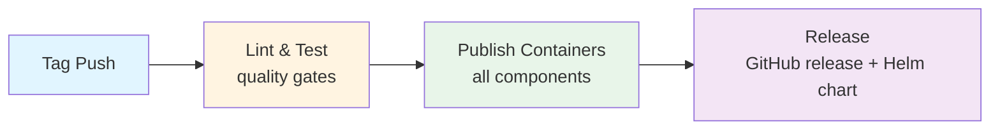

# Release Process

This document outlines the release process for NVSentinel.

## Prerequisites

- Repository admin access with write permissions
- Understanding of semantic versioning (vMAJOR.MINOR.PATCH)
- Access to GitHub Actions workflows

## Release Methods

### Method 1: Automatic Release (Recommended)

For standard releases from the main branch.

**Steps**:
1. **Create and push a version tag**:
   ```bash
   git checkout main
   git pull origin main
   git tag v1.2.3
   git push origin v1.2.3
   ```

2. **Automatic workflows trigger**:
   - Lint and Test workflow validates code quality
   - Publish Containers workflow builds and publishes all images
   - Release workflow creates GitHub release and publishes Helm chart

3. **Verify artifacts**:
   - Container images in GitHub Container Registry
   - GitHub release with `versions.txt`
   - Helm chart at `oci://ghcr.io/nvidia/nvsentinel`

### Method 2: Manual Release

For rebuilding from existing tags or emergency releases.

**Container Publishing**:
1. Navigate to **Actions** → **Publish Containers**
2. Click **Run workflow** → Enter tag (e.g., `v1.2.3`) → **Run workflow**
3. Monitor build progress

**GitHub Release**:
1. Navigate to **Actions** → **Release**
2. Click **Run workflow** → Enter tag (e.g., `v1.2.3`) → **Run workflow**
3. Verify release creation

## Workflow Pipeline


```mermaid
graph LR
    A[Tag Push] --> B[Lint & Test<br/>quality gates]
    B --> C[Publish Containers<br/>all components]
    C --> D[Release<br/>GitHub release + Helm chart]
    
    style A fill:#e1f5ff
    style B fill:#fff4e1
    style C fill:#e8f5e9
    style D fill:#f3e5f5
```

## Released Components

**Container Images** are published under `ghcr.io/nvidia/nvsentinel/`. This document deliberately does not list them — a static inventory drifts. There are two sources of truth:

- **For a released version**: the `versions.txt` asset on that [GitHub release](https://github.com/NVIDIA/NVSentinel/releases), which pins every image and tag actually published.
- **For what a release will contain**: [`scripts/build-image-list.sh`](scripts/build-image-list.sh), which generates `versions.txt`. Adding a component means adding it there.

**Artifacts**:
- GitHub release with `versions.txt`
- Helm chart at `oci://ghcr.io/nvidia/nvsentinel`

## Quality Gates

All releases must pass:
- **Lint checks**: Code style, license headers, protobuf validation
- **Unit tests**: All Go modules and Python packages
- **Container builds**: All component images must build successfully
- **E2E tests**: Integration testing (on PR/push)
- **Bundled datastore versions**: if they changed, the release notes carry the callout described in [Release Notes](#release-notes)

## Release Notes

### Bundled datastore version changes

The chart bundles the Percona Server for MongoDB operator and its `PerconaServerMongoDB`
custom resource as subcharts. Their versions are independent of the NVSentinel release number,
so a release can move them without that being visible from the version alone.

**If a release changes any of these four values, the release notes must say so explicitly:**

| Value | Subchart |
| --- | --- |
| operator image tag | `charts/mongodb-store/charts/psmdb-operator` |
| `crVersion` | `charts/mongodb-store/charts/psmdb-db` |
| mongod image tag | `charts/mongodb-store/charts/psmdb-db` |
| init image tag | `charts/mongodb-store/charts/psmdb-db` |

The callout must cover three things:

1. **Whether the replica set will roll, and say which of the four changed.** `crVersion`,
   `initImage` and the mongod image are fields of the `PerconaServerMongoDB` resource, so changing
   any of them changes the desired state of every replica-set member. The **operator image tag is
   different**: it changes only the operator Deployment, so on its own it restarts the operator pod
   and leaves the replica set alone. Distinguishing the two is the most useful thing the note can
   do, because it tells a reader whether they are taking a datastore outage or not.

   When the members do change, whether and when they actually restart depends on
   `spec.updateStrategy` on the resource, which the chart sets to `SmartUpdate` by default but
   which an operator can override:

   - **`SmartUpdate`** (chart default): the operator drives the rollout, secondaries first, then a
     primary step-down, so the exposure is one brief election.
   - **`RollingUpdate`**: Kubernetes drives the StatefulSet rollout, with no primary step-down
     coordination.
   - **`OnDelete`**: existing pods are left alone. The new values apply only as each pod is deleted
     by hand, so adopting the release changes nothing until an operator acts.

   Write the sentence to match the case, rather than reaching for a stock phrase:

   - **A resource field changed and `updateStrategy` is `SmartUpdate` or `RollingUpdate`:** say
     plainly that **this will roll your replica set**. That is the sentence that matters, because
     an operator adopting a release to pick up a monitoring fix has no reason to expect their
     health-event datastore to fail over, and that datastore holds every health event.
   - **A resource field changed and `updateStrategy` is `OnDelete`:** say the new values apply only
     as pods are deleted by hand, so adopting the release changes nothing on its own.
   - **Only the operator image tag changed:** say the operator pod restarts and the replica set is
     untouched.

   Getting this wrong in either direction misleads: a reader promised a roll that does not happen
   stops trusting the notes, and a reader not warned about one takes an unplanned failover.
2. **That the operator upgrade cannot skip a minor version.** Percona's
   [upgrade documentation](https://docs.percona.com/percona-operator-for-mongodb/update-operator.html)
   permits moving only to the nearest `major.minor`. A deployment more than one minor behind the
   new bundled operator cannot adopt the release directly: it needs intermediate hops, one minor
   at a time, moving `crVersion` with the operator. Name the versions involved so a reader can
   tell whether this applies to them.
3. **Which mongod version the new operator certifies.** Operator and mongod compatibility is a
   matrix, published at `https://check.percona.com/versions/v1/psmdb-operator/<version>`. Moving
   one without the other can produce an uncertified pairing that renders and runs without
   complaint.

### Finding the bundled versions

The NVSentinel release number says nothing about them. Unpack the published chart and read the two
subcharts directly:

```bash
helm pull oci://ghcr.io/nvidia/nvsentinel --version <release> --untar
C=nvsentinel/charts/mongodb-store/charts
```

| Value | File | Key |
| --- | --- | --- |
| operator image tag | `$C/psmdb-operator/values.yaml` | top-level `image.tag` |
| `crVersion` | `$C/psmdb-db/values.yaml` | top-level `crVersion` |
| mongod image tag | `$C/psmdb-db/values.yaml` | top-level `image.tag` |
| init image tag | `$C/psmdb-db/values.yaml` | top-level `initImage.tag` |
| subchart versions | `$C/psmdb-{operator,db}/Chart.yaml` | `version`, `appVersion` |

**Read the top-level keys, not a grep for `tag:`.** `psmdb-db/values.yaml` contains several other
`image:` blocks further down for the backup, PMM and fluentbit sidecars, so a bare `grep 'tag:'`
returns those too and it is easy to report the wrong one. The mongod tag is the one inside the
top-level `image:` block.

Note also that `initImage` is commented out by default, and what the operator derives when it is
unset depends on whether `crVersion` matches the operator's own version
(`pkg/psmdb/init/init.go`):

- **Versions match:** the init container uses the **operator pod's own image**, verbatim. A
  deployment that mirrors the operator image therefore needs nothing extra.
- **Versions differ:** the operator keeps its own image *repository* but substitutes the tag,
  giving `<operator-repository>:<crVersion>`.

The second case is the one worth a release note, because it is exactly the state an existing
deployment lands in when a release bumps the bundled operator ahead of a pinned `crVersion`. The
repository is whatever the operator runs from, so it stays inside a private mirror, but the **tag
is one a mirror-only deployment has no reason to have mirrored**, since operators mirror the
versions they run rather than older `crVersion` values. Say so when a release changes either
version, and note that pinning `initImage` explicitly avoids the question entirely.

`charts/mongodb-store/Chart.yaml` also carries the rule that `psmdb-operator` and `psmdb-db` must
be bumped together and kept matched.

The v1.22.0 note for #1741 is the precedent to follow: that release moved `psmdb-db` and did carry
an upgrade warning, which is how at least one deployment caught the skipped minor before syncing
it.

## Troubleshooting

**Failed Automatic Release**:
- Check **Lint and Test** workflow logs
- Review **Publish Containers** for build failures
- Use manual workflows to retry specific steps

**Manual Rebuild**:
- Use manual triggers with existing tag
- No need to create new tags for rebuilds

**Release Validation**:
```bash
# Verify versions.txt contains all components
# Check container registry for images
# Test Helm chart installation
helm install nvsentinel oci://ghcr.io/nvidia/nvsentinel --version v1.2.3
```

## Release Artifacts

### Generated Artifacts (Example: v1.2.3)

**Container Images** published to `ghcr.io/nvidia/nvsentinel/`:
- Most component images are tagged with the release tag, e.g. `ghcr.io/nvidia/nvsentinel/fault-quarantine:v1.2.3`
- `gpu-health-monitor` is the exception: it ships one image per DCGM major version, tagged `v1.2.3-dcgm-3.x` and `v1.2.3-dcgm-4.x`
- See the release's `versions.txt` for the exact set

**Helm Chart**: `oci://ghcr.io/nvidia/nvsentinel:v1.2.3`

**GitHub Release**: Includes `versions.txt` with complete artifact list and SHAs

### Verification

**View in GitHub**:
- **Packages** tab: All containers with version tag
- **Releases** tab: Release with `versions.txt`
- **Actions** tab: Workflow run logs

**Commands**:
```bash
# Pull container image
docker pull ghcr.io/nvidia/nvsentinel/syslog-health-monitor:v1.2.3

# Install Helm chart
helm install test oci://ghcr.io/nvidia/nvsentinel --version v1.2.3

# View chart metadata
helm show chart oci://ghcr.io/nvidia/nvsentinel --version v1.2.3
```

### Authentication

No custom secrets required:
- `GITHUB_TOKEN` automatically authenticates to `ghcr.io`
- Ensure repository **Settings** → **Actions** has "Read and write permissions"

## Version Management

- **Semantic versioning**: `vMAJOR.MINOR.PATCH`
- **Pre-releases**: `v1.2.3-rc1`, `v1.2.3-beta1` (automatically marked in GitHub)

## Emergency Hotfix Procedure

For urgent fixes:

1. **Fix in main first**:
   ```bash
   git checkout main
   git checkout -b fix/critical-issue
   # Apply fix and create PR to main
   ```

2. **Create hotfix branch from release tag**:
   ```bash
   git checkout v1.2.3
   git checkout -b hotfix/v1.2.4
   ```

3. **Cherry-pick and release**:
   ```bash
   git cherry-pick <commit-hash-from-main>
   git tag v1.2.4
   git push origin v1.2.4  # Triggers automatic workflows
   ```
