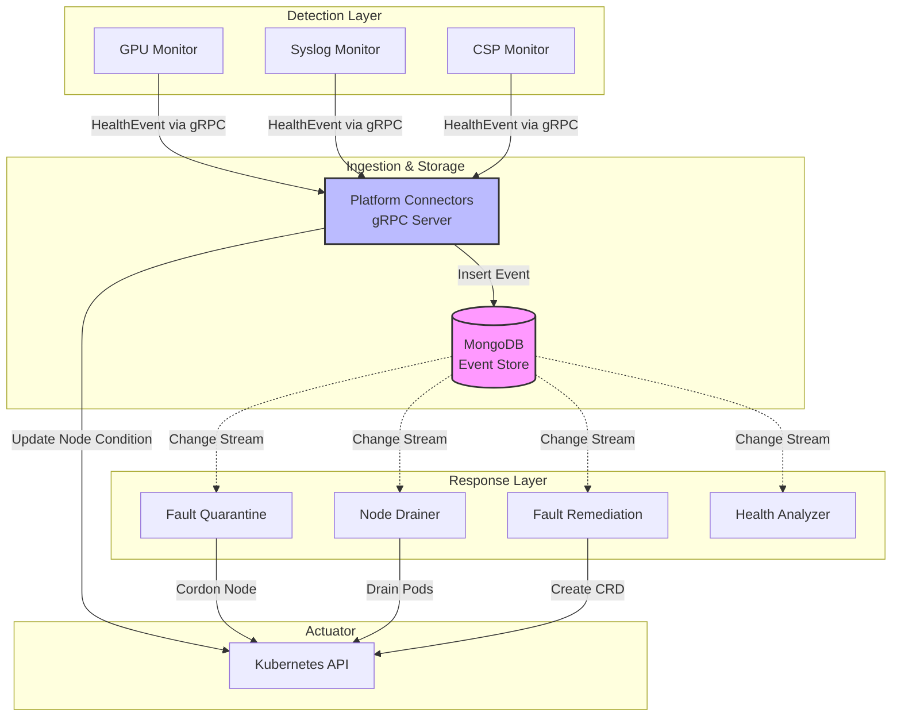
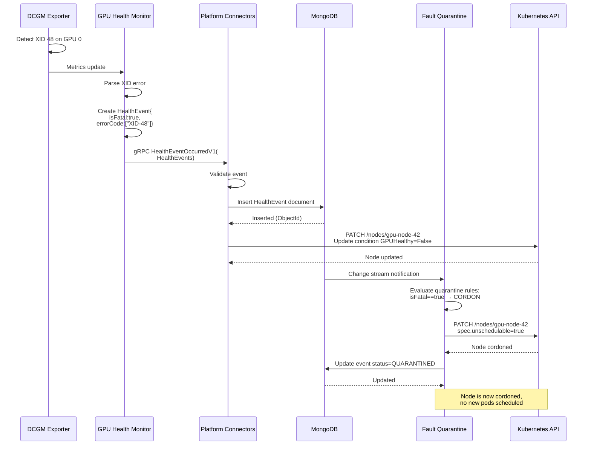
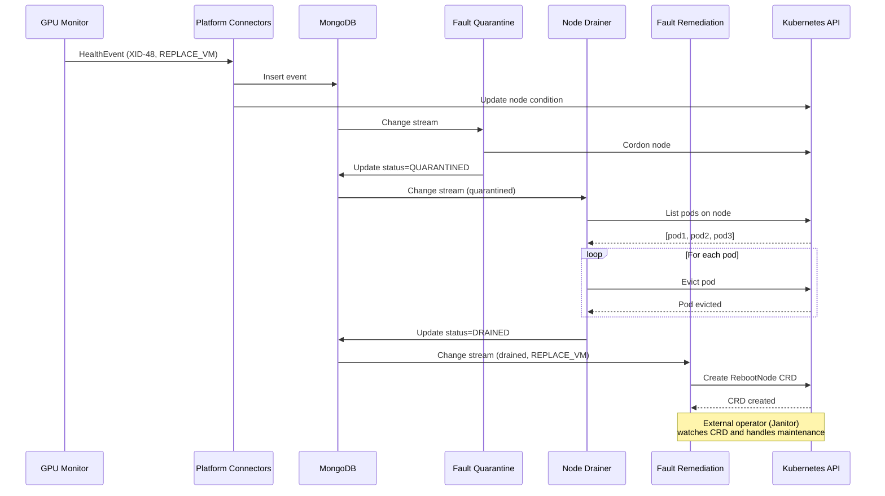

# NVSentinel Data Flow Documentation

This document illustrates how data flows through the NVSentinel system, from detection through remediation.

## Table of Contents

- [Overview](#overview)
- [Core Data Structure: HealthEvent](#core-data-structure-healthevent)
- [Component Data Flow](#component-data-flow)
- [Detailed Sequence Diagrams](#detailed-sequence-diagrams)
- [Data Transformations](#data-transformations)

---

## Overview

NVSentinel uses a **publish-subscribe** pattern through MongoDB change streams:

1. **Health Monitors** detect issues and publish `HealthEvent` messages via gRPC
2. **Platform Connectors** persist events to MongoDB and update Kubernetes
3. **Core Modules** subscribe to MongoDB change streams and react independently
4. **Kubernetes API** is the final actuator for all remediation actions



---

## Core Data Structure: HealthEvent

All data flowing through NVSentinel is based on the `HealthEvent` protobuf message:

### HealthEvent Message Structure

```protobuf
message HealthEvent {
  uint32 version = 1;                          // Protocol version
  
  // Source identification
  string agent = 2;                            // Monitor name (e.g., "gpu-health-monitor")
  string componentClass = 3;                   // Component type (e.g., "GPU", "NIC")
  string nodeName = 13;                        // Kubernetes node name
  
  // Health status
  string checkName = 4;                        // Specific check (e.g., "XID_ERROR")
  bool isFatal = 5;                           // Critical failure
  bool isHealthy = 6;                         // Current health state
  string message = 7;                         // Human-readable description
  
  // Classification
  RecommendedAction recommendedAction = 8;    // What should be done
  repeated string errorCode = 9;              // Error identifiers (e.g., ["XID-48"])
  repeated Entity entitiesImpacted = 10;      // Affected resources
  
  // Metadata
  map<string, string> metadata = 11;          // Key-value pairs (GPU UUID, driver version, etc.)
  google.protobuf.Timestamp generatedTimestamp = 12;
  
  // Behavior overrides
  BehaviourOverrides quarantineOverrides = 14;
  BehaviourOverrides drainOverrides = 15;
}

enum RecommendedAction {
  NONE = 0;
  COMPONENT_RESET = 2;
  CONTACT_SUPPORT = 5;
  RESTART_VM = 15;
  RESTART_BM = 24;
  REPLACE_VM = 25;
  UNKNOWN = 99;
}

message Entity {
  string entityType = 1;    // e.g., "GPU", "NODE", "POD"
  string entityValue = 2;   // e.g., GPU UUID, node name
}
```

### Example HealthEvent: GPU XID Error

```json
{
  "version": 1,
  "agent": "gpu-health-monitor",
  "componentClass": "GPU",
  "checkName": "XID_ERROR_48",
  "isFatal": true,
  "isHealthy": false,
  "message": "GPU 0 reported XID 48 (Double Bit ECC Error)",
  "recommendedAction": "REPLACE_VM",
  "errorCode": ["XID-48"],
  "entitiesImpacted": [
    {
      "entityType": "GPU",
      "entityValue": "GPU-12345678-abcd-1234-abcd-123456789abc"
    }
  ],
  "metadata": {
    "gpu_uuid": "GPU-12345678-abcd-1234-abcd-123456789abc",
    "gpu_index": "0",
    "driver_version": "535.104.05",
    "severity": "CRITICAL"
  },
  "generatedTimestamp": "2025-10-28T10:15:30Z",
  "nodeName": "gpu-node-42",
  "quarantineOverrides": null,
  "drainOverrides": null
}
```

---

## Component Data Flow

### 1. GPU Health Monitor

**What it captures:**
- GPU temperature and power
- ECC errors (single-bit, double-bit)
- GPU throttling events

**What it emits:**
- `HealthEvent` via gRPC to Platform Connectors
- Metrics to Prometheus (separate path)

**Example flow:**
```
DCGM reports ECC error on GPU 0
  ↓
Monitor creates HealthEvent:
  - agent: "gpu-health-monitor"
  - componentClass: "GPU"
  - checkName: "ECC_ERROR"
  - isFatal: false
  - recommendedAction: MONITOR
  - errorCode: ["ECC-DBE"]
  ↓
Sends via gRPC: HealthEventOccurredV1(HealthEvents)
```

### 2. Syslog Health Monitor

**What it captures:**
- XID errors (GPU hardware faults)
- SXID errors (GPU software errors)
- GPU fell off the bus events

**What it emits:**
- `HealthEvent` via gRPC to Platform Connectors

**Example flow:**
```
journalctl shows XID 48 error
  ↓
Monitor creates HealthEvent:
  - agent: "syslog-health-monitor"
  - componentClass: "GPU"
  - checkName: "XID_ERROR_48"
  - isFatal: true
  - recommendedAction: REPLACE_VM
  - errorCode: ["XID-48"]
  ↓
Sends via gRPC
```

### 3. CSP Health Monitor

**What it captures:**
- Cloud provider maintenance schedules (GCP, AWS, OCI)
- Upcoming VM migrations
- Hardware replacement notices

**What it emits:**
- `HealthEvent` via gRPC to Platform Connectors

**Example flow:**
```
GCP API reports scheduled maintenance
  ↓
Monitor creates HealthEvent:
  - agent: "csp-health-monitor"
  - componentClass: "CSP"
  - checkName: "SCHEDULED_MAINTENANCE"
  - isFatal: false
  - recommendedAction: NONE
  - metadata: {"maintenance_start": "2025-11-01T00:00:00Z"}
  ↓
Sends via gRPC
```

### 4. Platform Connectors

**What it receives:**
- `HealthEvents` message via gRPC (array of HealthEvent)
- gRPC method: `HealthEventOccurredV1(HealthEvents) returns (Empty)`

**What it does:**
1. Validates the event (schema, required fields)
2. Inserts event into MongoDB `health_events` collection
3. Updates Kubernetes node condition (if applicable)
4. Updates Kubernetes node events (if applicable)

**What it emits:**
- MongoDB document (HealthEvent serialized)
- Kubernetes Node condition update (for fatal failures)
- Kubernetes Node events (for non-fatal issues)
- Metrics to Prometheus

**Data transformation:**
```go
gRPC HealthEvents
  ↓
Validate each HealthEvent
  ↓
MongoDB Insert: {
  "_id": ObjectId("..."),
  "createdAt": ISODate("2025-10-28T10:15:30Z"),
  "healthevent": {
    "version": 1,
    "agent": "gpu-health-monitor",
    "nodeName": "gpu-node-42",
    // ... all other HealthEvent fields
  },
  "healtheventstatus": {
    "nodequarantined": null,                    // null, "Quarantined", "UnQuarantined", or "AlreadyQuarantined"
    "userpodsevictionstatus": {
      "status": "NotStarted",                   // "NotStarted", "InProgress", "Failed", "Succeeded", or "AlreadyDrained"
      "message": ""                             // Optional error/status message
    },
    "faultremediated": null,                    // null or boolean
    "lastremediationtimestamp": null            // null or ISODate
  }
}
  ↓
If isFatal == true:
  Kubernetes Node Condition: {
    "type": "GPUHealthy",
    "status": "False",
    "reason": "XID_ERROR_48",
    "message": "GPU 0 reported XID 48"
  }
Else:
  Kubernetes Node Event: {
    "type": "Warning",
    "reason": "GPUHealthIssue",
    "message": "GPU 0 reported ECC error",
    "involvedObject": {Node}
  }
```

### 5. Fault Quarantine Module

**What it receives:**
**What it receives:**
- MongoDB change stream events
- Watches for: new HealthEvents with `isFatal: true` or specific error codes

**Decision logic:**
```go
// Evaluate CEL-based policy first
policy := getCELPolicy(event.NodeName)
if policy.Evaluate(event) {
  // CEL policy determines if quarantine is needed
  if !event.QuarantineOverrides.Skip {
    cordon node
  }
}

// Fallback to built-in logic
if event.IsFatal || event.RecommendedAction == REPLACE_VM {
  if !event.QuarantineOverrides.Skip {
    cordon node
  }
}
```

**CEL Policy Evaluation:**
- Uses Common Expression Language (CEL) for flexible policy definitions
- Policies can be defined per-node via annotations or cluster-wide via ConfigMap
- CEL expressions can evaluate any HealthEvent field (errorCode, componentClass, metadata, etc.)
- Example policy: `event.errorCode.contains("XID-48") || (event.componentClass == "GPU" && event.isFatal)`

**What it emits:**
- Kubernetes API call: `PATCH /api/v1/nodes/{nodeName}`
  - Sets `spec.unschedulable = true` (cordon)
  - Optionally sets taints based on configuration
- MongoDB update: Sets event `status = "QUARANTINED"`
- Node annotation with quarantine reason

**Example API payload:**
```json
PATCH /api/v1/nodes/gpu-node-42
{
  "spec": {
    "unschedulable": true,
    "taints": [
      {
        "key": "nvsentinel.nvidia.com/unhealthy",
        "value": "XID_ERROR_48",
        "effect": "NoSchedule"
      }
    ]
  },
  "metadata": {
    "annotations": {
      "nvsentinel.nvidia.com/quarantined": "true",
      "nvsentinel.nvidia.com/quarantine-reason": "XID_ERROR_48",
      "nvsentinel.nvidia.com/quarantine-timestamp": "2025-10-28T10:15:35Z"
    }
  }
}
```

### 6. Node Drainer Module

**What it receives:**
- MongoDB change stream events
- Watches for: nodes cordoned by Quarantine Module

**Decision logic:**
```go
if node.IsQuarantined && !event.DrainOverrides.Skip {
  drain node pods gracefully
}
```

**What it emits:**
- Kubernetes API calls:
  - `GET /api/v1/pods` (list pods on node)
  - `DELETE /api/v1/namespaces/{ns}/pods/{pod}` (evict each pod)
- MongoDB update: Sets event `status = "DRAINED"`

**Eviction payload:**
```json
POST /api/v1/namespaces/default/pods/training-job-xyz/eviction
{
  "apiVersion": "policy/v1",
  "kind": "Eviction",
  "metadata": {
    "name": "training-job-xyz",
    "namespace": "default"
  },
  "deleteOptions": {
    "gracePeriodSeconds": 300
  }
}
```

### 7. Fault Remediation Module

**What it receives:**
- MongoDB change stream events
- Watches for: events with specific RecommendedActions

**Decision logic:**
```go
if event.RecommendedAction == REPLACE_VM {
  create break-fix ticket CRD
}
```

**What it emits:**
- Kubernetes Custom Resource (CRD):
```yaml
apiVersion: janitor.dgxc.nvidia.com/v1alpha1
kind: RebootNode
metadata:
  name: maintenance-gpu-node-42-6720abc123def456789
spec:
  nodeName: gpu-node-42
```

**Note:** The CRD is consumed by an external operator (e.g., Janitor) that handles the actual maintenance workflow.

### 8. Health Events Analyzer

**What it receives:**
- MongoDB change stream events (all events)

**What it does:**
- Pattern detection (recurring errors)
- Trend analysis (error frequency increasing)
- Correlation (multiple failures on same rack)

**What it emits:**
- New HealthEvents (for correlated/aggregated issues)
- Aggregated metrics to Prometheus
- Alert annotations to HealthEvents
- Dashboard data

---

## Detailed Sequence Diagrams

### Scenario 1: GPU XID Error Detection to Node Quarantine



### Scenario 2: Full Remediation Flow



---

## Data Transformations

### gRPC to MongoDB

**Input (gRPC):**
```protobuf
HealthEvents {
  version: 1
  events: [
    HealthEvent {
      agent: "gpu-health-monitor"
      nodeName: "gpu-node-42"
      isFatal: true
      // ... other fields
    }
  ]
}
```

**Output (MongoDB):**
```json
{
  "_id": ObjectId("6720abc123def456789"),
  "createdAt": ISODate("2025-10-28T10:15:30.123Z"),
  "healthevent": {
    "version": 1,
    "agent": "gpu-health-monitor",
    "nodeName": "gpu-node-42",
    "isFatal": true
    // ... all HealthEvent fields preserved
  },
  "healtheventstatus": {
    "nodequarantined": null,                    // null, "Quarantined", "UnQuarantined", or "AlreadyQuarantined"
    "userpodsevictionstatus": {
      "status": "NotStarted",                   // "NotStarted", "InProgress", "Failed", "Succeeded", or "AlreadyDrained"
      "message": ""                             // Optional error/status message
    },
    "faultremediated": null,                    // null or boolean
    "lastremediationtimestamp": null            // null or ISODate
  }
}
```

### MongoDB Change Stream to Module

**Change Stream Event:**
```json
{
  "_id": {"_data": "..."},
  "operationType": "insert",
  "fullDocument": {
    "_id": ObjectId("6720abc123def456789"),
    "healthevent": {
      "version": 1,
      "agent": "gpu-health-monitor",
      "isFatal": true,
      "nodeName": "gpu-node-42"
      // ... full HealthEvent
    },
    "healtheventstatus": {
      // ... status fields as in MongoDB document
    },
    "createdAt": ISODate("2025-10-28T10:15:30.123Z")
  }
}
```

**Module receives:**
- Deserializes `fullDocument` into `HealthEvent` struct
- Evaluates based on module-specific logic
- Takes action via Kubernetes API

### HealthEvent to Kubernetes Node Condition

**HealthEvent:**
```json
{
  "checkName": "XID_ERROR_48",
  "isFatal": true,
  "message": "GPU 0 reported XID 48"
}
```

**Kubernetes Node Condition:**
```yaml
conditions:
- type: GPUHealthy
  status: "False"
  reason: XID_ERROR_48
  message: "GPU 0 reported XID 48"
  lastTransitionTime: "2025-10-28T10:15:30Z"
```

### HealthEvent to Kubernetes CRD

**HealthEvent:**
```json
{
  "nodeName": "gpu-node-42",
  "checkName": "XID_ERROR_48",
  "recommendedAction": "RESTART_BM"
}
```

**RebootNode CRD:**
```yaml
apiVersion: janitor.dgxc.nvidia.com/v1alpha1
kind: RebootNode
metadata:
  name: maintenance-gpu-node-42-6720abc123def456789
spec:
  nodeName: gpu-node-42
```

---

## Data Flow Summary

| Source | Data Format | Transport | Destination | Action |
|--------|-------------|-----------|-------------|--------|
| GPU Monitor | HealthEvent (protobuf) | gRPC | Platform Connectors | Publish event |
| Syslog Monitor | HealthEvent (protobuf) | gRPC | Platform Connectors | Publish event |
| CSP Monitor | HealthEvent (protobuf) | gRPC | Platform Connectors | Publish event |
| Platform Connectors | HealthEvent (BSON) | MongoDB insert | MongoDB | Persist event |
| Platform Connectors | Node (JSON) | Kubernetes API | K8s Nodes | Update condition |
| MongoDB | ChangeStream (BSON) | MongoDB change stream | All modules | Subscribe to events |
| Fault Quarantine | Node (JSON) | Kubernetes API | K8s Nodes | Cordon node |
| Node Drainer | Pod Eviction (JSON) | Kubernetes API | K8s Pods | Evict pods |
| Fault Remediation | CRD (YAML) | Kubernetes API | K8s CRDs | Create repair request |

---

## Connection Methods

### gRPC Connections
- **Protocol**: HTTP/2 + Protocol Buffers
- **Service Definition**: `PlatformConnector.HealthEventOccurredV1`
- **Client**: Health Monitors (GPU, Syslog, CSP)
- **Server**: Platform Connectors
- **Port**: Configurable (default: 50051)
- **TLS**: Optional (cert-manager integration)

### MongoDB Connections
- **Write Path**: Platform Connectors → MongoDB (insert)
- **Read Path**: All core modules ← MongoDB (change streams)
- **Connection String**: `mongodb://nvsentinel-mongodb:27017/nvsentinel`
- **Collection**: `health_events`
- **Indexes**: `nodeName`, `agent`, `created_at`, `status`

### Kubernetes API Connections
- **Authentication**: ServiceAccount tokens
- **Authorization**: RBAC (Roles/ClusterRoles)
- **API Groups**: `v1` (core), `policy/v1` (eviction), custom CRDs
- **Operations**: GET, PATCH, DELETE, CREATE, WATCH

---

## Key Insights

1. **Decoupled Architecture**: Monitors don't know about modules, modules don't know about monitors
2. **Single Data Model**: HealthEvent is the universal language
3. **Event Sourcing**: MongoDB change streams enable reactive processing
4. **Kubernetes-Native**: Final actions all go through K8s API (auditability)
5. **Idempotent Operations**: Modules can re-process events safely
6. **Metadata Rich**: HealthEvent metadata field allows extensibility without schema changes
