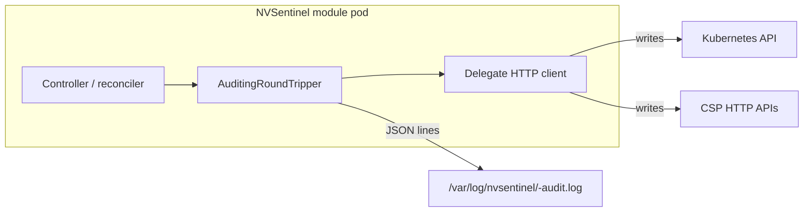

# Audit Logging

## Overview

NVSentinel can record a **durable, file-based audit trail** of **HTTP write operations** (POST, PUT, PATCH, DELETE) made by its controllers against the **Kubernetes API** and **cloud provider (CSP) HTTP APIs**. Each line in the audit log is a JSON object with a timestamp, the NVSentinel component name, the HTTP method and URL, the response status code, and optionally the request body when explicitly enabled.

### Why Do You Need This?

- **Forensics and accountability**: When investigating who cordoned a node, what actions Nvsentinel has taken, a dedicated audit file avoids hunting through high-volume application logs.
- **Separation from debug logs**: Audit entries are **structured JSON** (one object per line) at a known path, independent of `slog` verbosity or log pipeline drops.
- **CSP and Kubernetes coverage**: Audit logs is also logging CSP API calls for janitor and janitor provider actions.

## How It Works

1. **Initialization**: Each component that supports audit logging calls `auditlogger.InitAuditLogger("<component>")` at startup. If `AUDIT_ENABLED` is not true, initialization is a no-op and no log file is created.
2. **HTTP wrapping**: Controllers register `auditlogger.NewAuditingRoundTripper` on their `http.RoundTripper` (typically via `rest.Config.Wrap` for client-go, or on the CSP `http.Client` transport). Only **write** methods are audited: POST, PUT, PATCH, DELETE.
3. **Execution**: On each such request, after the response returns, a single JSON **audit entry** is appended to a rotating file (see [Log file location and format](#log-file-location-and-format)).

## Architecture



When Helm enables audit logging, the chart also mounts a **hostPath** volume at `/var/log/nvsentinel` (and runs an init container to set permissions) so logs persist on the node and can be collected by your log agent.

## What Gets Logged

| Field | Description |
|-------|-------------|
| **Method** | One of POST, PUT, PATCH, DELETE |
| **URL** | Full request URL of the write |
| **Response code** | HTTP status code from the server (or `0` if unavailable) |
| **Component** | NVSentinel service name (e.g. `fault-quarantine`, `node-drainer`) |
| **Timestamp** | UTC, RFC3339 |
| **Request body** | Only if `logRequestBody` / `AUDIT_LOG_REQUEST_BODY` is enabled (see [Security considerations](#security-considerations)) |

**Not audited** by this mechanism: only **write** methods are recorded; read-only calls (e.g. GET, list, watch) do not produce audit log lines.

**Modules** that wire the audit logger include **fault-quarantine**, **node-drainer**, **fault-remediation**, **platform-connectors**, **janitor** (K8s client), **janitor-provider** (CSP HTTP clients), and **labeler**, subject to your Helm subchart enablement. 

## Log file location and format

- **Default directory**: `/var/log/nvsentinel` (override with `AUDIT_LOG_BASE_PATH` if you extend the chart to set it).
- **Default file name**: `<POD_NAME>-audit.log` (if `POD_NAME` is unset, the component name is used).
- **Rotation**: [lumberjack](https://github.com/natefinch/lumberjack)-style rotation: max file size, retained backups, max age, optional gzip of rotated files — controlled by Helm values mapped to `AUDIT_LOG_*` environment variables (see [Configuration](#configuration)).

Example line (pretty-printed; on disk it is a single line per request):

```json
{
  "timestamp": "2026-04-22T12:00:00Z",
  "component": "fault-quarantine",
  "method": "PATCH",
  "url": "https://10.96.0.1:443/apis/nvidia.com/v1alpha1/namespaces/nvsentinel/healthwithevents/...",
  "response_code": 200
}
```

With request body logging enabled, a `requestBody` field may appear — treat these files as **highly sensitive**.

## Configuration

Configure audit logging in Helm under `global.auditLogging`:

```yaml
global:
  auditLogging:
    enabled: false       # Master switch: if false, no audit file and no AUDIT_ENABLED=true
    logRequestBody: false  # If true, may log secrets or PII in request bodies — use only when required
    maxSizeMB: 100        # Max size in MB per log file before rotation
    maxBackups: 7         # Number of old log files to keep
    maxAgeDays: 30        # Max age in days for rotated files
    compress: true        # Gzip rotated files
```

The umbrella chart injects the following **environment variables** into components that support audit (values mirror the table above; exact wiring is in `distros/kubernetes/nvsentinel/templates/_helpers.tpl` under `nvsentinel.auditLogging.envVars`):

| Environment variable | Meaning |
|----------------------|--------|
| `AUDIT_ENABLED` | `"true"` / `"false"` — must be true for any audit file to be written |
| `AUDIT_LOG_REQUEST_BODY` | Log HTTP bodies for write requests when `true` |
| `AUDIT_LOG_MAX_SIZE_MB` | Log file size threshold for rotation |
| `AUDIT_LOG_MAX_BACKUPS` | Number of rotated files to retain |
| `AUDIT_LOG_MAX_AGE_DAYS` | Max age of rotated files |
| `AUDIT_LOG_COMPRESS` | Compress rotated files |
| `AUDIT_LOG_BASE_PATH` | (Optional) Base directory; default in code is `/var/log/nvsentinel` |
| `POD_NAME` | Used to build the log file name `<pod>-audit.log` |

### Tenant / platform integration

DGX Cloud and similar platforms often surface NVSentinel settings through a **cluster spec** and templates that render into this Helm `global` section. The exact keys (e.g. `auditLoggingEnabled` and `auditLogging` blocks) are documented in your platform’s NVSentinel config schema; the **runtime behavior** is always the same Helm `global.auditLogging` and environment variables above.

## Security considerations

- **Request bodies** can contain very long texts which include much more detailed informations. Keep `logRequestBody: false` unless a compliance requirement explicitly needs bodies.
- **Host path** storage means **any process with host access** to that directory could read logs; use node-level permissions and your organization’s log-shipping and retention policies.

## Operations

### Verifying that audit logging is active

- Confirm the target pod has `AUDIT_ENABLED=true` in its environment.
- On the node, or via a debug sidecar, list `/var/log/nvsentinel/` and look for `*audit.log`.

### Collecting and retaining logs

Point your log forwarder (DaemonSet agent, node-level Fluent Bit, etc.) at `/var/log/nvsentinel/*.log` (and rotated `*.gz` if `compress: true`) according to your retention and compliance requirements.

## Troubleshooting

**Q: I enabled `global.auditLogging.enabled` but the audit file is empty or missing**  
- Confirm the container’s env has `AUDIT_ENABLED=true` and that the component actually performs **write** HTTP calls during the window you are observing.  
- Confirm the `audit-logs` volume mount and hostPath are present in the pod spec (the umbrella chart only adds them when audit logging is enabled for that workload).  
- Check **disk space** and **permissions** on `/var/log/nvsentinel` (the init container should `chown` for the non-root UID used by the workload).


**Q: Do audit logs include database or gRPC calls?**  
- This feature records **HTTP write** operations on transports wrapped with the auditing `RoundTripper`. It does not replace database audit products or gRPC-level logging.

**Q: What is the performance impact?**  
- Each audited write appends a small JSON line and uses **lumberjack** rotation. Overhead is usually modest relative to the HTTP call itself; enabling **request body** logging adds body buffering and should only be used when necessary.
