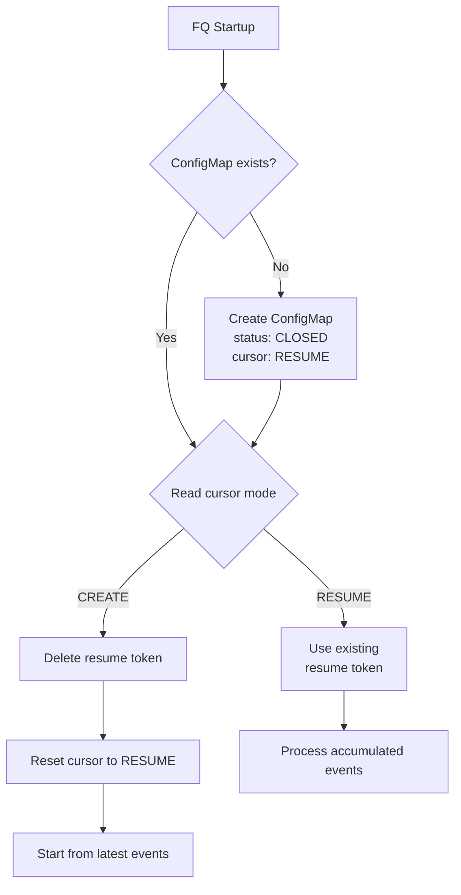

# ADR-022: Circuit Breaker — Reset Mechanism

## Context

Circuit breaker is a safety mechanism that prevents NVSentinel from cordoning too many nodes at once. When the circuit breaker is tripped, it will block all new node remediation actions and remain in the TRIPPED state until a human operator investigates the issue and manually resets it. 

The reset mechanism in the current system is to either delete the circuit breaker configmap or edit the status field to CLOSED, followed by a restart of the fault quarantine deployment. When the circuit breaker is closed, fault quarantine starts processing accumulated events from the last time the circuit breaker was tripped. This can be problematic if the circuit breaker was tripped for a long time and there are lot of accumulated fatal events. This can cause the circuit breaker to trip again immediately or continue cordoning nodes.

## Decision

Add a new field `cursor` to the circuit breaker configmap. The value of this field can be either `CREATE` or `RESUME`. `CREATE` means that fault quarantine will skip accumulated events and start processing from the latest event whereas `RESUME` means that fault quarantine will process accumulated events from the last time the circuit breaker was tripped. 

```yaml
apiVersion: v1
data:
  status: CLOSED    # Can be either CLOSED or TRIPPED
  cursor: RESUME   # Can be either RESUME or CREATE
kind: ConfigMap
metadata:
  name: circuit-breaker
  namespace: nvsentinel
```

Unless the cursor mode is explicitly set to `CREATE`, the default mode will be `RESUME` in all the cases. 



## Implementation

### Components Modified

**1. Circuit Breaker Types** - Added `CursorMode` enum (`RESUME`/`CREATE`) and interface methods (`GetCursorMode`, `SetCursorMode`)

**2. Kubernetes Client** - ConfigMap creation defaults to `cursor: RESUME`, added `ReadCursorMode`/`WriteCursorMode` methods

**3. Reconciler Startup** - New `handleCircuitBreakerCursorMode()` function:
- If `cursor=CREATE`: delete resume token, reset cursor to `RESUME`
- If `cursor=RESUME`: use existing resume token

### Operator Workflows

**Normal crash recovery:**
- ConfigMap has `cursor=RESUME` (default)
- Processes all accumulated events

**Manual reset after trip:**
```bash
kubectl patch configmap fault-quarantine-circuit-breaker \
  -p '{"data":{"status":"CLOSED","cursor":"CREATE"}}'
kubectl rollout restart deployment fault-quarantine
```
- Deletes resume token
- Skips accumulated events
- Resets cursor to `RESUME` for next restart

## Consequences

**Positive:**
- Prevents immediate re-trip from accumulated events
- Operator control over event replay behavior
- Safe default (`RESUME`) preserves events during crashes
- Simple single-field interface

**Negative:**
- Manual intervention required to set `cursor=CREATE`
- Events may be skipped when using `CREATE` mode
- Additional ConfigMap field to manage

## Alternatives

**1. Timestamp-based filtering** - Skip events older than `lastResetTime`
- Rejected: More complex, requires timestamp comparison on every event

**2. ConfigMap watcher** - Watch changes, auto-delete token on state change
- Deferred: Still requires cursor field for operator to specify CREATE vs RESUME intent (situation-dependent choice), adds complexity without eliminating the need for explicit operator control
