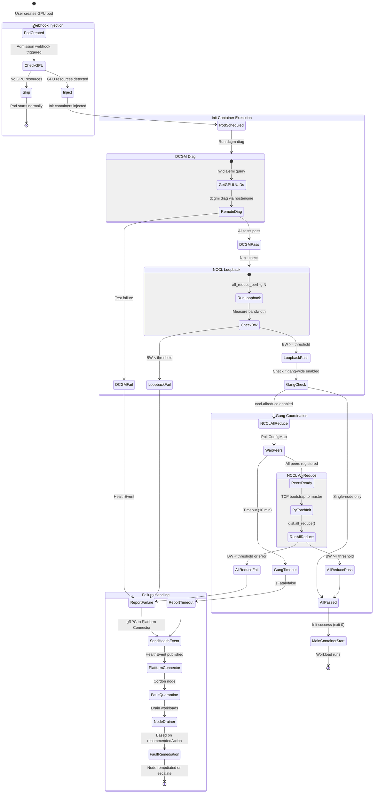
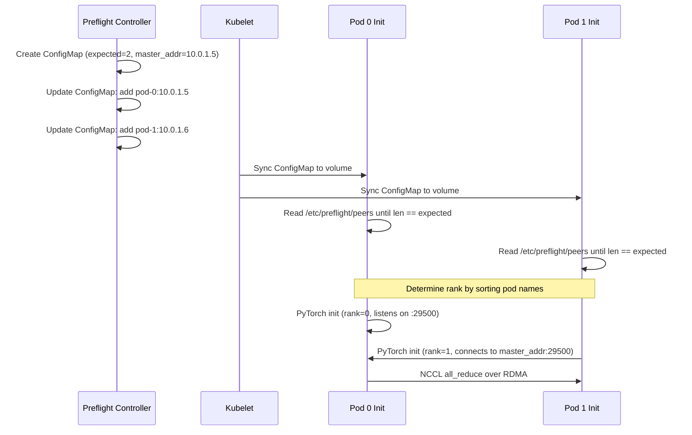

# ADR-026: Feature — Preflight Checks

## Context

GPU failures during training waste compute time. Running diagnostics before the workload starts catches bad GPUs early.

Gang-wide NCCL tests require discovering all pods in a gang. Kubernetes 1.35 introduced `spec.workloadRef` as a native gang identifier, but users may also use Volcano, Kueue, or other schedulers with their own mechanisms.

### Distinction from Health Monitors

NVSentinel already has health monitors (GPU Health Monitor, Syslog Health Monitor) that detect GPU issues. This is different:

|            | Health Monitors        | Preflight Checks              |
|------------|------------------------|-------------------------------|
| When       | Continuous             | Once at pod start             |
| Check type | Passive                | Active diagnostics            |
| Detects    | Failures as they occur | Latent issues before starting |
| Purpose    | Reactive remediation   | Prevent bad starts            |

Preflight asks "is this GPU healthy enough to start?" Health monitors ask "did this GPU fail while running?"

## Decision

Implement a MutatingAdmissionWebhook that injects preflight check init containers into GPU pods in configured namespaces.

### Key points

- Injection trigger: GPU resources (extended resources or DRA claims) + namespace
- Gang discovery: Pluggable (supports `workloadRef`; can be extended to Volcano, Kueue .etc.)
- Resource detection: Configurable lists for extended resource names and DRA device classes

## Architecture

### Components

```
preflight/
└── controller/              # Webhook + gang controller (controller-runtime)
    ├── Dockerfile
    ├── main.go
    └── pkg/
        ├── webhook/         # Admission handler
        ├── injection/       # Pod mutation, DRA detection
        ├── gang/            # Gang discovery implementations
        └── coordination/    # ConfigMap management

preflight-checks/
├── dcgm-diag/
│   ├── Dockerfile
│   ├── main.go
│   └── pkg/
│
├── nccl-loopback/
│   ├── Dockerfile
│   ├── nccl-topologies/
│   ├── main.go
│   └── pkg/
│
└── nccl-allreduce/
    ├── Dockerfile
    ├── nccl-topologies/
    ├── main.go
    └── pkg/
```

### Overall flow



### MutatingWebhookConfiguration (sketch)

```yaml
apiVersion: admissionregistration.k8s.io/v1
kind: MutatingWebhookConfiguration
metadata:
  name: preflight-injector
webhooks:
  - name: preflight.nvsentinel.nvidia.com
    clientConfig:
      service:
        name: preflight-injector
        namespace: nvsentinel
        path: /mutate-pod
    rules:
      - apiGroups: [""]
        apiVersions: ["v1"]
        resources: ["pods"]
        operations: ["CREATE"]
    namespaceSelector:
      matchExpressions:
        - key: kubernetes.io/metadata.name
          operator: In
          values: []  # Populated from Helm values
        - key: kubernetes.io/metadata.name
          operator: NotIn
          values: []  # Excluded namespaces (systemNamespaces, nvsentinel, etc.)
    failurePolicy: Fail
    sideEffects: None
    admissionReviewVersions: ["v1"]
```

## Resource detection and injection

### Detection logic

1. Extended resources (device plugins): check `resources.limits`/`resources.requests` for configured names (e.g. `nvidia.com/gpu`)
2. DRA: check `spec.resourceClaims`, resolve claim/template, match `deviceClassName` against configured list

### Injected init containers (sketch)

One init container per enabled check with be prepended to the pod's init containers:

```yaml
initContainers:
  - name: preflight-dcgm-diag
    image: ghcr.io/nvidia/nvsentinel/preflight-dcgm-diag:v1
    env:
      - name: DCGM_DIAG_LEVEL
        value: "1"
      - name: DCGM_HOSTENGINE_ADDR
        value: "dcgm-hostengine.nvsentinel.svc:5555"
      - name: PLATFORM_CONNECTOR_SOCKET
        value: "unix:///var/run/nvsentinel.sock"
    resources:
      limits:
        nvidia.com/gpu: 8  # Max across all containers
    volumeMounts:
      - name: platform-connector-socket
        mountPath: /var/run

  - name: preflight-nccl-allreduce
    image: ghcr.io/nvidia/nvsentinel/preflight-nccl-allreduce:v1
    env:
      - name: NCCL_ALLREDUCE_THRESHOLD_GBPS
        value: "5.0"
      - name: GANG_TIMEOUT
        value: "600s"
      - name: MY_POD_NAME
        valueFrom:
          fieldRef:
            fieldPath: metadata.name
    resources:
      limits:
        nvidia.com/gpu: 8
        nvidia.com/mlnxnics: 4
    volumeMounts:
      - name: platform-connector-socket
        mountPath: /var/run
      - name: preflight-gang-config      # ConfigMap: peers, master_addr, rank, world_size
        mountPath: /etc/preflight
```

### Resource handling

- GPUs / extended resources: inject max across all containers
- Network / extended resources: inject max across all containers for configured names
- DRA: inject all referenced GPU/network claims into init container

## Check types

| Check            | Scope       | Coordination |
|------------------|-------------|--------------|
| `dcgm-diag`      | Single node | None         |
| `nccl-loopback`  | Single node | None         |
| `nccl-allreduce` | Gang-wide   | ConfigMap    |

Third-party checks follow the same pattern: separate image, configured in Helm.

### DCGM Diag

Runs DCGM diagnostics on allocated GPUs via remote DCGM hostengine Service.

**How it works:**
1. Init container gets GPU UUIDs: `nvidia-smi --query-gpu=uuid --format=csv,noheader`
2. Calls DCGM hostengine via Service: `dcgmi diag -r <level> --host $DCGM_HOSTENGINE_ADDR -i <gpu-uuids>`
3. Parses results, maps failures to HealthEvents

**Requirements:**
- DCGM hostengine DaemonSet running (privileged, with GPU access)
- DCGM Service exposing hostengine (port 5555)
- NetworkPolicy allowing init container → DCGM Service

**Diag levels:**
- Level 1 (~30s): Quick hardware validation (memory, PCIe bandwidth)
- Level 2 (~2-3min): Extended tests (stress, targeted diagnostics)

Init container remains unprivileged; hostengine performs diagnostics.

### NCCL Loopback

Tests intra-node GPU-to-GPU communication (NVLink/PCIe paths) without network.

**How it works:**
1. Init container runs `all_reduce_perf` (from nccl-tests) with all allocated GPUs
2. Command: `all_reduce_perf -b 8 -e 256M -f 2 -g <num_gpus>`
3. Validates bandwidth meets threshold set in Helm values
4. No coordination needed — single node only

**What it catches:**
- NVLink failures between GPUs
- PCIe bandwidth degradation
- GPU memory errors during collective ops

**Requirements:**
- GPU allocation (device plugin)
- `nccl-tests` binary in checker image

**Example output parsing:**
```
# nccl-tests output format:
#       size    count   type   redop    time   algbw   busbw
         8M    2097152  float     sum    1.23   6.50    12.19
```
Checker validates `busbw` (bus bandwidth) against configured threshold.

### NCCL All-Reduce (Gang-Wide)

Tests cross-node GPU collective communication over RDMA/InfiniBand.

**Why PyTorch over MPI:**
- MPI-based tests require `pods/exec` to spawn processes on peer pods
- `pods/exec` is high privilege — allows executing commands in any pod in the namespace
- PyTorch's `torchrun` handles coordination via TCP without cross-pod exec
- Each init container runs independently; NCCL uses RDMA for actual data transfer

**How it works:**
1. **Gang formation**: All pods register in shared ConfigMap (see Gang Coordination section)
2. **Wait for peers**: Each init container polls ConfigMap (mounted volume) until all peers registered
3. **torchrun bootstrap**: Each pod runs `torchrun` connecting to master (rank 0) via TCP
4. **Single communicator**: All GPUs form one NCCL communicator (e.g., 2 nodes × 8 GPUs = 16 ranks)
5. **Run test**: `dist.all_reduce()` runs across all ranks; NCCL uses RDMA

**Test script (PyTorch-based):**
```python
#!/usr/bin/env python3
"""
NCCL All-Reduce benchmark - single communicator spanning all GPUs.
Env vars set by torchrun: RANK, LOCAL_RANK, WORLD_SIZE
"""
import os, time, torch
import torch.distributed as dist

def benchmark_allreduce(size_bytes, iters=20, warmup=5):
    local_rank = int(os.environ.get("LOCAL_RANK", 0))
    tensor = torch.randn(size_bytes // 4, dtype=torch.float32, 
                         device=f"cuda:{local_rank}")
    
    for _ in range(warmup):
        dist.all_reduce(tensor, op=dist.ReduceOp.SUM)
    torch.cuda.synchronize()
    
    start = time.perf_counter()
    for _ in range(iters):
        dist.all_reduce(tensor, op=dist.ReduceOp.SUM)
    torch.cuda.synchronize()
    elapsed = time.perf_counter() - start
    
    world_size = dist.get_world_size()
    algo_bw = (size_bytes * iters) / elapsed / 1e9
    bus_bw = algo_bw * (2 * (world_size - 1) / world_size)
    return bus_bw

def main():
    dist.init_process_group(backend="nccl")
    torch.cuda.set_device(int(os.environ.get("LOCAL_RANK", 0)))
    
    bus_bw = benchmark_allreduce(4 * 1024**3)  # 4GB
    threshold = float(os.environ.get("BW_THRESHOLD_GBPS", "100"))
    
    if dist.get_rank() == 0 and bus_bw < threshold:
        # Report failure to Platform Connector via gRPC
        ...
    
    dist.destroy_process_group()

if __name__ == "__main__":
    main()
```

**Invocation (per pod):**
```bash
torchrun --nnodes=$NNODES --nproc_per_node=$GPUS_PER_NODE \
  --node_rank=$MY_RANK --master_addr=$MASTER_ADDR --master_port=29500 \
  /scripts/bench.py
```

Each pod runs `torchrun` independently. No MPI, no `pods/exec`, no special RBAC.

**Benchmark results (Azure NDv4, A100):**

| Nodes | MPI-based (GB/s) | PyTorch (GB/s) |
|-------|------------------|----------------|
| 2     | 164              | 169            |
| 3     | 160              | 168            |

**What it catches:**
- InfiniBand/RDMA link failures
- Network topology misconfigurations
- Cross-node NVLink (when present)
- NCCL algorithm/protocol issues

**Requirements:**
- Gang discovery (`workloadRef`, Volcano, or Kueue)
- Network device allocation (InfiniBand NICs)
- NCCL topology file (auto-detected or user-provided)

**Timeout handling:**
- `GANG_TIMEOUT` sets max wait for all peers to register
- If timeout expires before gang forms → exit with `isFatal: false` (not a hardware issue)

### Third-Party Checks

Third-party checks follow the same pattern as built-in checks. Register in Helm:

```yaml
preflight-injector:
  checks:
    - name: dcgm-diag
      image: ghcr.io/nvidia/nvsentinel/preflight-dcgm-diag:v1
    - name: nccl-loopback
      image: ghcr.io/nvidia/nvsentinel/preflight-nccl-loopback:v1
    - name: bandwidth-check  # third-party
      image: myregistry/bandwidth-check:v1
```

**Check contract:**
- Exit codes: `0` (passed), `1` (check failed), `2` (config error)
- Report failures via gRPC to Platform Connector:
  - Unix socket: `unix:///var/run/nvsentinel.sock`
  - RPC: `HealthEventOccurredV1` (proto: `data-models/protobufs/health_event.proto`)
  - Set `isFatal`, `recommendedAction`, `errorCode` in HealthEvent
- Webhook mounts: GPU devices, Platform Connector socket, network devices

### Configuration

Configured at deployment time via Helm values. No per-workload annotations.

### Gang Discovery

Gang discovery is pluggable. Given one pod, return all pods in the gang.

**Interface:**
```go
type GangDiscoverer interface {
    DiscoverGang(pod *corev1.Pod) ([]PeerInfo, error)
}

type PeerInfo struct {
    PodName  string
    PodIP    string
    NodeName string
}
```

**Implementations:**

| Scheduler       | Discovery chain                                                          |
|-----------------|--------------------------------------------------------------------------|
| K8s 1.35 native | Pod → `spec.workloadRef` → list pods with same ref                       |
| Volcano         | Pod → `volcano.sh/pod-group` annotation → list pods with same annotation |
| Kueue           | Pod → `kueue.x-k8s.io/workload-name` label → list pods with same label   |
| Label-based     | Pod → configurable labels → list pods with same labels                   |

Controller selects implementation based on Helm config. If no gang identifier found, pod is treated as singleton (skip gang-wide tests).

### Gang Coordination

For gang-wide checks like `nccl-allreduce`, the preflight controller maintains a ConfigMap. Webhook mounts it as a volume; init containers read from filesystem.



**Flow:**
1. Controller creates/updates ConfigMap `preflight-<gangID>` with `expected_count`, `peers`, `master_addr`
2. Webhook mounts ConfigMap as volume at `/etc/preflight/`
3. Init containers poll filesystem until all peers registered (kubelet syncs ~1 min)
4. Each pod determines rank by sorting pod names alphabetically
5. PyTorch connects to `master_addr` for NCCL bootstrap (TCP), then NCCL uses RDMA

**ConfigMap structure:**
```yaml
apiVersion: v1
kind: ConfigMap
metadata:
  name: preflight-myworkload-group1
data:
  expected_count: "2"
  master_addr: "10.0.1.5"  # Rank 0's IP for PyTorch TCP bootstrap
  peers: |
    pod-0:10.0.1.5
    pod-1:10.0.1.6
```

**Gang coordination timeout:** 10 minutes. If gang doesn't form, init fails with `isFatal: false` (not a hardware issue).

### RBAC

**Controller ClusterRole:**
```yaml
rules:
  - apiGroups: [""]
    resources: ["configmaps"]
    verbs: ["get", "create", "patch"]
  - apiGroups: [""]
    resources: ["pods"]
    verbs: ["get", "list", "watch"]
  # Additional rules based on gang discoverer:
  # workloadRef: scheduling.k8s.io/workloads (get)
  # Volcano: scheduling.volcano.sh/podgroups (get)
  # Kueue: kueue.x-k8s.io/workloads (get)
```

Controller only touches ConfigMaps with `preflight-` prefix (enforced by code).

### DRA Integration

For pods using Dynamic Resource Allocation (DRA), the webhook copies resource claim references to the init container.

**Device claim detection:**
Webhook checks pod's `spec.resourceClaims`, retrieves each ResourceClaim or ResourceClaimTemplate, and matches `deviceClassName` against configured lists for GPUs and network devices:

```yaml
# Helm values
preflight-injector:
  gpuDetection:
    # Extended resources (current, no DRA)
    resourceNames:
      - "nvidia.com/gpu"
    
    # DRA device classes (requires operator configuration)
    deviceClasses:
      - "gpu.nvidia.com"
      - "nvidia.com/gpu"
      # Operators add their DeviceClass names here
```

**Init container injection with DRA:**
```yaml
apiVersion: v1
kind: Pod
spec:
  # Pod-level claims
  resourceClaims:
    - name: gpu-claim
      resourceClaimName: training-gpus
    - name: rdma-claim
      resourceClaimName: training-rdma
  
  initContainers:
    - name: nvsentinel-preflight
      resources:
        claims:
          - name: gpu-claim   # References same GPU claim
          - name: rdma-claim  # References same network claim
  
  containers:
    - name: main
      resources:
        claims:
          - name: gpu-claim
          - name: rdma-claim
```

**Detection logic:**
1. Check if pod uses extended resources (`nvidia.com/gpu`, `nvidia.com/mlnxnics`) → inject with max counts across all containers
2. Check if pod has DRA claims with matching `deviceClassName` → inject with all unique GPU and network claim references
3. If neither → skip injection

Network devices (InfiniBand, RDMA) can be exposed via DRA claims or extended resources. Webhook uses same detection pattern for both.

DRA device class names are not standardized. Operators configure `gpuDetection.deviceClasses` and `networkDetection.deviceClasses` to match cluster DeviceClass names.

### Network Resources for NCCL Tests

NCCL tests require access to RDMA/InfiniBand devices for efficient GPU-to-GPU communication.

**Network device exposure methods:**

1. **Extended resources (device plugins):**
   - Example: `nvidia.com/mlnxnics` (common on GPU+IB clusters)
   - Resource names are cluster-specific; configure `networkDetection.resourceNames` accordingly

2. **DRA claims:**
   - Network devices can also be exposed via DRA claims (DeviceClass names are cluster-specific)
   - Webhook matches claim `deviceClassName` against `networkDetection.deviceClasses`

**Webhook behavior for NCCL checks:**
If `nccl-loopback` or `nccl-allreduce` is enabled, webhook:
1. Copies all network device resources (extended resources using max count, or DRA claim references)
2. Scans all container env vars, copies those matching `ncclEnvPatterns` (glob patterns from Helm config)
3. Copies volume mounts referenced by `NCCL_TOPO_FILE` (if present)

**NCCL topology file handling:**
The init container image includes common topology files for major cloud platforms:
```
/opt/nvsentinel/nccl-topologies/
├── azure-ndv4.xml
├── azure-ndv5.xml
├── aws-p5.48xlarge.xml
├── gcp-a3-mega.xml
└── oci-bm-gpu-a100.xml
```

**Topology selection priority:**
1. **User-provided**: Webhook checks if any container has `NCCL_TOPO_FILE` env var with a corresponding volume mount at that path → copy that volume mount to init container
2. **Auto-detect**: If no `NCCL_TOPO_FILE` + volume mount found, init container reads node label `node.kubernetes.io/instance-type`, maps to built-in topology file via Helm config
3. **Fallback**: If instance type unknown or not in mapping, don't set `NCCL_TOPO_FILE` (NCCL auto-detects topology)

If pod has no network device resources, NCCL tests are skipped (DCGM diag runs).

### Failure Behavior

Init container exit codes:
- `0`: All checks passed
- `1`: Check failed
- `2`: Configuration error

On failure:
- Pod stays in `Init:Error` state
- **HealthEvent created** via Platform Connector (same as health monitors)
- Kubernetes Event created with failure details
- Metrics incremented (`preflight_check_failures_total`)

HealthEvent feeds into existing NVSentinel workflow (quarantine, correlation, etc).

### Error to Recommended Action Mapping

**DCGM Diag** :

| Test   | Result | Recommended Action |
|--------|--------|--------------------|
| Memory | `FAIL` | `CONTACT_SUPPORT`  |
| PCIe   | `FAIL` | `CONTACT_SUPPORT`  |
| NVLink | `FAIL` | `CONTACT_SUPPORT`  |
| Stress | `FAIL` | `RUN_DCGMEUD`      |
| Any    | `WARN` | `NONE`             |


**NCCL Checks**:

| Error                 | Recommended Action |
|-----------------------|--------------------|
| `NCCL_SYSTEM_ERROR`   | `CONTACT_SUPPORT`  |
| `NCCL_INTERNAL_ERROR` | `RUN_DCGMEUD`      |
| `NCCL_INVALID_USAGE`  | `NONE`             |
| `NCCL_TIMEOUT`        | `NONE`             |
| `NCCL_REMOTE_ERROR`   | `CONTACT_SUPPORT`  |

**isFatal determination**:
- DCGM diag `FAIL` → `isFatal: true`
- DCGM diag `WARN` → `isFatal: false`
- NCCL hardware errors (`SYSTEM_ERROR`, `INTERNAL_ERROR`, `REMOTE_ERROR`) → `isFatal: true`
- NCCL timeout/config errors → `isFatal: false`

### Helm Values

```yaml
preflight-injector:
  enabled: false  # Opt-in
  
  checks:
    - name: dcgm-diag
      image: ghcr.io/nvidia/nvsentinel/preflight-dcgm-diag:v1
    - name: nccl-loopback
      image: ghcr.io/nvidia/nvsentinel/preflight-nccl-loopback:v1
    # - name: nccl-allreduce
    #   image: ghcr.io/nvidia/nvsentinel/preflight-nccl-allreduce:v1
  
  # DCGM configuration
  dcgm:
    hostengineAddr: "dcgm-hostengine.nvsentinel.svc:5555"  # DCGM Service address
    diagLevel: 1       # 1 (quick, ~30s) or 2 (extended, ~2-3min)
  
  # NCCL test configuration
  nccl:
    loopbackThresholdGBps: 10.0   # Min bus bandwidth for loopback pass
    allreduceThresholdGBps: 5.0   # Min bus bandwidth for all-reduce pass
  
  checkTimeout: "300s"   # Per-check timeout
  gangTimeout: "600s"    # Gang coordination timeout
  
  # Gang discovery configuration
  gangDiscovery:
    # Options: workloadRef, volcano, kueue, labels
    method: "workloadRef"
    # For label-based discovery:
    # labels:
    #   gangIdLabel: "app.kubernetes.io/gang-id"
    #   gangSizeLabel: "app.kubernetes.io/gang-size"
  
  # GPU detection configuration
  gpuDetection:
    # Extended resources (current approach)
    resourceNames:
      - "nvidia.com/gpu"
    
    # DRA device classes (add your cluster's DeviceClass names)
    deviceClasses: []
    # Example:
    # - "gpu.nvidia.com"
    # - "nvidia.com/gpu"
  
  # Network device resources (for NCCL tests)
  networkDetection:
    # Extended resources (cluster-specific, configure for your environment)
    resourceNames:
      - "nvidia.com/mlnxnics"  # Mellanox/NVIDIA InfiniBand NICs
      # Add other network device plugin resources used in your cluster
    
    # DRA device classes (if using DRA for network devices)
    deviceClasses: []
    # Example:
    # - "rdma.nvidia.com"
    # - "infiniband.mellanox.com"
  
  # NCCL environment variable patterns to copy (glob patterns)
  # Webhook scans container env vars, copies those matching any pattern
  ncclEnvPatterns:
    - "NCCL_*"      # Matches NCCL_TOPO_FILE, NCCL_IB_*, etc.
    - "UCX_*"       # Matches UCX_TLS, UCX_NET_DEVICES, etc.
    - "OMPI_*"      # Matches OMPI_MCA_*, etc.
  
  # NCCL topology auto-detection (if user doesn't provide topology file)
  ncclTopology:
    # Node label to detect instance type
    instanceTypeLabel: "node.kubernetes.io/instance-type"
    # Map instance types to built-in topology files
    instanceTypeMapping:
      "Standard_ND96isr_H100_v5": "azure-ndv5.xml"
      "Standard_ND96amsr_A100_v4": "azure-ndv4.xml"
      "p5.48xlarge": "aws-p5.48xlarge.xml"
      "a3-megagpu-8g": "gcp-a3-mega.xml"
    # Fallback: use NCCL auto-detection if instance type unknown
    enableFallback: true
  
  # Namespaces where preflight checks apply
  namespaces:
    - training

  # Namespaces to exclude (system namespaces). Recommended to reuse node-drainer `systemNamespaces`.
  excludeNamespaces:
    - nvsentinel
    - kube-system
    - kube-public
    - kube-node-lease
  
  webhook:
    failurePolicy: Fail  # or Ignore
```

All GPU pods in listed namespaces get the configured checks.

### Metrics

**Check containers** (exposed via pushgateway or scraped from pod annotations):

| Metric                             | Type      | Labels                        |
|------------------------------------|-----------|-------------------------------|
| `preflight_check_total`            | Counter   | `check`, `result`             |
| `preflight_check_duration_seconds` | Histogram | `check`                       |
| `preflight_check_failures_total`   | Counter   | `check`, `node`, `error_code` |
| `preflight_gang_wait_seconds`      | Histogram | `workload`                    |
| `preflight_config_errors_total`    | Counter   | `error`                       |


**preflight/injector** (standard Prometheus endpoint):

| Metric                              | Type      | Labels   |
|-------------------------------------|-----------|----------|
| `preflight_injection_total`         | Counter   | `result` |
| `preflight_webhook_latency_seconds` | Histogram | -        |


## Rationale

- Mutating webhook for transparent injection
- Non-privileged init containers (DCGM diag runs via remote hostengine)
- Namespace selector opt-in
- Deployment-level config (no per-workload changes)

## Consequences

### Positive
- Catches GPU failures before workload starts
- Works with any workload controller
- Unprivileged init container (uses DCGM hostengine)
- Built-in NCCL topology files for major cloud platforms

### Negative
- Adds 30-60s pod startup latency (DCGM diag level 1)
- Requires DCGM hostengine DaemonSet for diag checks
- Webhook downtime blocks pod creation (if `failurePolicy: Fail`)
- NCCL tests require network device plugins (InfiniBand/RDMA) to be configured
- Gang-wide NCCL tests require K8s 1.35+ (`workloadRef`)

### Mitigations
- **Latency**: Use DCGM level 1 (~30s) vs level 2 (~2-3min); skip expensive checks for non-critical workloads
- **DCGM dependency**: Most GPU clusters already run DCGM for monitoring; expose as Service
- **Webhook availability**: HA deployment (replicas, PDB); `failurePolicy: Ignore` for graceful degradation
- **Network resources**: NCCL tests skipped if network devices unavailable; DCGM diag runs regardless
- **K8s version**: NCCL loopback (single-node) works without `workloadRef`; gang tests are opt-in

## Alternatives Considered

### Kyverno Policy
Rejected: External dependency.

### User-managed init containers
Rejected: No enforcement. Users forget.

### Custom CRD wrapper
Rejected: Requires changing how workloads are deployed.

## Out of Scope

- **Repeated failure handling**: Health Event Analyzer handles pattern detection. Preflight emits events.
- **Automatic DRA DeviceClass discovery**: Requires operator configuration. Device class names are not standardized.

## References

- K8s 1.35 Workload API: https://kubernetes.io/blog/2025/12/29/kubernetes-v1-35-introducing-workload-aware-scheduling/
- GitHub Issue: https://github.com/NVIDIA/NVSentinel/issues/658

