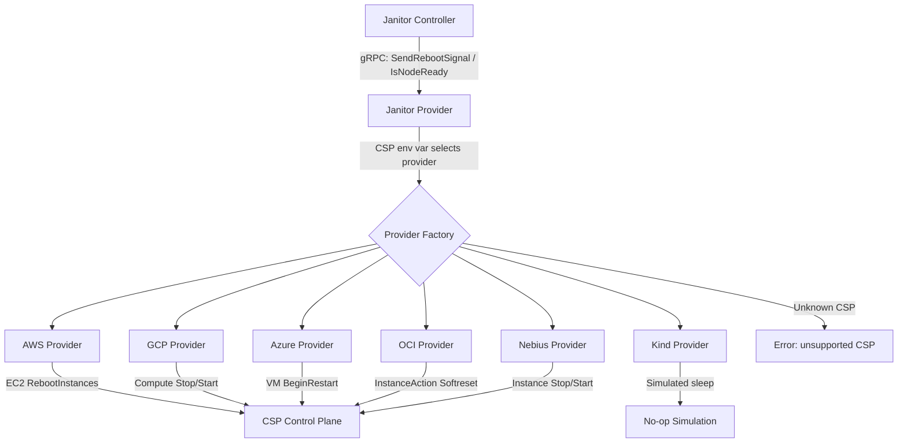
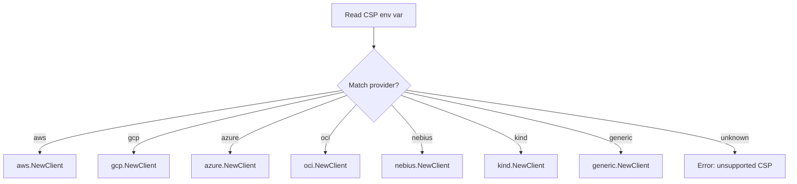
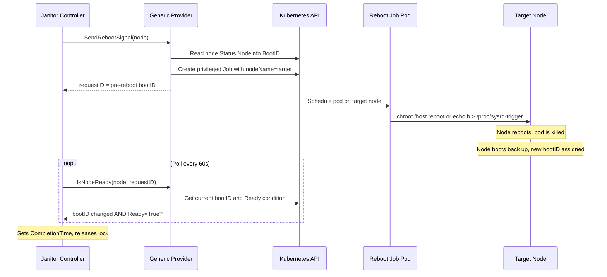
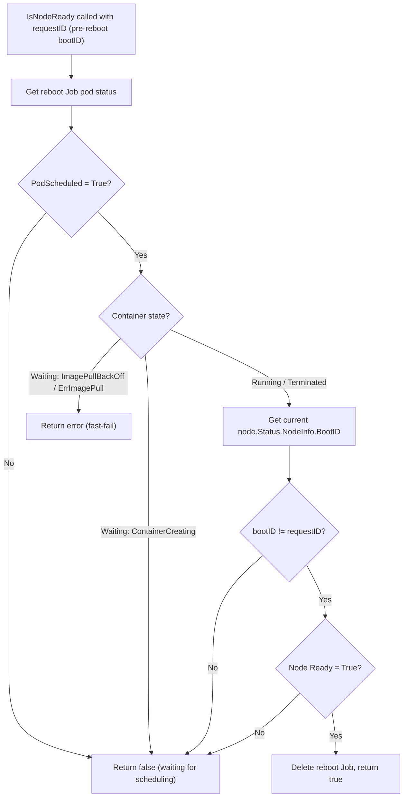

# ADR-028: Janitor — Generic Bare-Metal Reboot Provider

## Context

The janitor-provider supports node reboots through CSP APIs (AWS EC2, GCP Compute, Azure, OCI, Nebius). If the `CSP` environment variable is set to an unrecognized value, the provider returns an error and refuses to start.

This doesn't work for environments without a CSP reboot API:

- On-premises bare-metal clusters
- Infrastructure providers that do not expose a reboot API
- Self-managed Kubernetes clusters on physical hardware

### Current Architecture



## Decision

Add a **generic provider** (`CSP=generic`) that reboots nodes via a privileged Kubernetes Job. By default the Job runs `chroot /host reboot`; deployments can opt into a Linux Magic SysRq reboot for environments where the normal reboot path wedges the node. This follows the Job-based pattern from GPU Reset ([ADR-019](019-janitor-gpu-reset.md)). It is a named provider in the factory switch, just like `aws`, `gcp`, or `kind`.

## Implementation

### 1. Provider Factory




### 2. Generic Provider — Reboot via Privileged Job



#### SendRebootSignal

Records the node's current `bootID` from `node.Status.NodeInfo.BootID`, creates a privileged Job on the target node, and returns the pre-reboot `bootID` as the `requestID`.

The reboot Job supports two reboot paths:

- Default: `chroot /host reboot`
- SysRq opt-in: `echo b > /proc/sysrq-trigger` via the host `/proc` mount

The SysRq path is intended for bare-metal environments where the standard reboot command is accepted but leaves the node stuck `NotReady`. It bypasses the normal userspace shutdown path, so it is controlled by an explicit feature flag.

**Job specification:**

```yaml
apiVersion: batch/v1
kind: Job
metadata:
  name: reboot-<node-name>-<short-hash>
  namespace: <configured-namespace>
  labels:
    nvsentinel.nvidia.com/reboot-job: "true"
spec:
  backoffLimit: 0
  ttlSecondsAfterFinished: 3600
  template:
    spec:
      nodeName: <target-node>
      restartPolicy: Never
      tolerations:
        - operator: "Exists"
      containers:
        - name: reboot
          image: busybox:1.37
          command: ["chroot", "/host", "reboot"]
          securityContext:
            privileged: true
          volumeMounts:
            - name: host-root
              mountPath: /host
      volumes:
        - name: host-root
          hostPath:
            path: /
```

**Design choices (mirroring GPU Reset):**

| Choice | Value | Rationale |
|--------|-------|-----------|
| `privileged` | `true` | Required for `chroot` syscall and reboot |
| `hostPath: /` | mounted at `/host` | Access to host filesystem for `chroot` |
| `backoffLimit` | `0` | Reboot kills the pod — retrying would double-reboot |
| `ttlSecondsAfterFinished` | `3600` | Auto-cleanup after 1h |
| `tolerations` | `[{operator: Exists}]` | Target node is likely cordoned/tainted |
| `restartPolicy` | `Never` | Do not restart after reboot |
| Image | `busybox:1.37` | Only needs `chroot` and the host `reboot` command |

#### IsNodeReady

The `requestID` is the pre-reboot `bootID`. The check first verifies the reboot Job pod reached the node and started, then confirms the reboot via `bootID` change.



A changed `bootID` is definitive proof that the node rebooted — unlike `lastTransitionTime`, it cannot change due to network blips or other non-reboot events. If the reboot never happened, `bootID` stays the same and the janitor controller will eventually time out.

Once a successful reboot is confirmed, the Job is deleted to avoid a lingering "Failed" Job (the pod is killed by the reboot, so the Job always ends in a failed state).

### 3. Helm Configuration

```yaml
# distros/kubernetes/nvsentinel/charts/janitor-provider/values.yaml
csp:
  provider: "kind"              # set to "generic" for bare-metal host reboot

  generic:                      # config for the generic provider (when provider=generic)
    rebootImage: "busybox:1.37"
    useSysrqReboot: false       # true to use echo b > /proc/sysrq-trigger
    rebootJobNamespace: ""      # defaults to the janitor-provider's own namespace
    rebootJobTTLSeconds: 3600
```

```yaml
# deployment.yaml env injection
env:
  - name: CSP
    value: {{ .Values.csp.provider | default "kind" | quote }}
  - name: GENERIC_REBOOT_IMAGE
    value: {{ .Values.csp.generic.rebootImage | default "busybox:1.37" | quote }}
  - name: GENERIC_REBOOT_USE_SYSRQ
    value: {{ .Values.csp.generic.useSysrqReboot | default false | quote }}
  - name: GENERIC_REBOOT_JOB_NAMESPACE
    value: {{ .Values.csp.generic.rebootJobNamespace | quote }}
  - name: GENERIC_REBOOT_JOB_TTL
    value: {{ .Values.csp.generic.rebootJobTTLSeconds | default 3600 | quote }}
```

### 4. RBAC

Today the janitor-provider is a read-only gRPC service — its ClusterRole only grants `get`/`list`/`watch` on `nodes`, and all Kubernetes write operations (creating RebootNode CRs, managing Leases) belong to the janitor controller. The generic provider changes this boundary: the janitor-provider now creates and deletes Jobs.

This is scoped as tightly as possible. The janitor-provider retains its existing ClusterRole for read-only node access. Job permissions are granted via a separate namespaced **Role**, limiting writes to the provider's own namespace:

```yaml
apiVersion: rbac.authorization.k8s.io/v1
kind: Role
metadata:
  name: {{ include "provider.fullname" . }}-jobs
rules:
  - apiGroups: ["batch"]
    resources: ["jobs"]
    verbs: ["create", "get", "list", "watch", "delete"]
```

The janitor controller's RBAC is unchanged — it continues to own RebootNode lifecycle and distributed locking. The provider's new write scope is limited to ephemeral reboot Jobs in a single namespace.

### 5. File Locations

| File | Change |
|------|--------|
| `janitor-provider/pkg/csp/generic/generic.go` | New — generic provider implementation |
| `janitor-provider/pkg/csp/generic/generic_test.go` | New — unit tests |
| `janitor-provider/pkg/csp/client.go` | Modified — add `generic` case to factory switch |
| `janitor-provider/pkg/csp/client_test.go` | Modified — tests for generic provider routing |
| `distros/.../charts/janitor-provider/values.yaml` | Modified — add `csp.generic` config block |
| `distros/.../charts/janitor-provider/templates/deployment.yaml` | Modified — inject generic provider env vars |
| `distros/.../charts/janitor-provider/templates/role.yaml` | New — namespaced Role for `batch/jobs` permissions |
| `distros/.../charts/janitor-provider/templates/rolebinding.yaml` | New — RoleBinding for the above |

## Rationale

- **Proven pattern**: Same Job-based architecture as GPU Reset ([ADR-019](019-janitor-gpu-reset.md)), validated in production
- **No custom image**: `busybox` with `nsenter` is sufficient
- **Minimal interface changes**: Generic provider creates its own K8s client internally

## Consequences

### Positive
- Enables automated reboot remediation on bare-metal and non-cloud environments
- Consistent remediation workflow regardless of infrastructure type
- Kubernetes-native (Jobs, RBAC, tolerations)

### Negative
- Requires **privileged pod with hostPID**
- No `SendTerminateSignal` support for bare-metal nodes

### Mitigations
- **Security**: Ephemeral Job with TTL cleanup, RBAC-restricted RebootNode creation. Matches GPU Reset security model.
- **No terminate**: Bare-metal deployments should set `terminateNodeController.enabled=false`.

## Alternatives Considered

### SSH-Based Reboot
**Rejected**: Requires SSH key management and network access to all nodes.

### Privileged DaemonSet Agent
**Rejected**: Larger security surface than an ephemeral Job, wastes resources while idle. Also rejected in [ADR-019](019-janitor-gpu-reset.md).


## Testing

- **Unit**: Job spec generation, `IsNodeReady` bootID comparison logic, factory routing for `CSP=generic`, config loading
- **Integration**: Mock K8s client, verify Job creation with correct spec, verify `IsNodeReady` for various node conditions
- **E2E**: Deploy with `CSP=generic` on kind, create RebootNode CR, verify reboot Job creation

## Notes

- `busybox:1.37` is overridable via Helm for custom image registries
- Job TTL (1h default) is tunable per-environment
- Future providers (IPMI, Redfish) can be added as named factory cases

## References

- [ADR-019: Janitor GPU Reset](019-janitor-gpu-reset.md) — Job-based pattern for host-level operations
- [ADR-020: NVSentinel GPU Reset](020-nvsentinel-gpu-reset.md) — End-to-end GPU reset in NVSentinel
- [ADR-008: Cloud Provider Integration](008-cloud-provider-integration.md) — Current CSP architecture
- [Kubernetes Jobs](https://kubernetes.io/docs/concepts/workloads/controllers/job/)
- [nsenter](https://man7.org/linux/man-pages/man1/nsenter.1.html)
