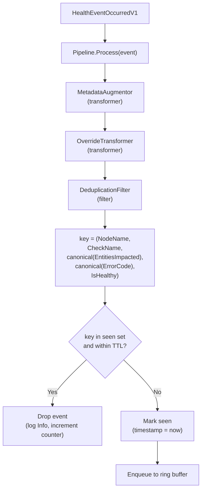

# ADR-039: Platform Connector — Health Event Deduplication

## Context

Health monitors poll their sources on a periodic loop and forward each derived `HealthEvent` to the platform connector via gRPC. When a fault persists, the upstream source typically emits the same observation repeatedly. The clearest example is the syslog monitor: when a GPU enters a persistent error state, the kernel logs the *same* XID/SXID line every poll, differing only in the kernel timestamp prefix:

```
Poll 1:  [ 1108.858286] NVRM: Xid (PCI:0000:b3:00.0): 79, pid=1234, name=nv-hostengine
Poll 2:  [ 1843.308145] NVRM: Xid (PCI:0000:b3:00.0): 79, pid=1234, name=nv-hostengine
Poll 3:  [ 2501.556012] NVRM: Xid (PCI:0000:b3:00.0): 79, pid=1234, name=nv-hostengine
```

These reach fault-quarantine and node-drainer as distinct events: redundant drain evaluations, inflated event counts, audit-log noise. The platform connector compacts node-condition annotations but does not deduplicate the gRPC stream itself, and the same problem exists in principle for any monitor whose source signal repeats while a fault persists.

## Decision

Add a **deduplication filter** to the platform-connector event-processing pipeline (see [ADR-023](./023-health-event-transformer-pipeline.md)), after the existing transformers `MetadataAugmentor` and `OverrideTransformer`. The filter uses a generic key derived from the event itself:

```
key = (NodeName, CheckName, canonical(EntitiesImpacted), canonical(ErrorCode), IsHealthy)
```

Within a configurable **burst window** TTL, an event whose key is already in the seen set is suppressed. Once the entry expires, the next event with that key emits as the start of a fresh burst.



### Canonicalisation

- `CheckName` is included so that two distinct checks producing the same `(entities, ErrorCode)` for the same physical resource don't collide. NIC monitor is the canonical example: `InfiniBandStateCheck` and `InfiniBandDegradationCheck` can both fire for the same port, neither sets `ErrorCode`, and without `CheckName` in the key they would suppress each other.
- `EntitiesImpacted` is a slice; the same logical set may arrive in different orders. The dedup stage sorts entities lexicographically by `(EntityType, EntityValue)` before hashing.
- `ErrorCode` is `[]string`; sorted lexicographically before hashing.
- `IsHealthy` is a bool; included so healthy events with the same `(node, check, entities, ErrorCode)` shape as a prior unhealthy event are not suppressed against it. This matters for the synthetic healthy events emitted by the cancellation rules in [ADR-038](./038-health-monitor-cancellation-rules.md), which by design carry the same `ErrorCode` as the unhealthy event they cancel.
- The hash function (e.g., FNV-1a over the canonical encoding) is deterministic so the same event always maps to the same key.

### What clears the dedup

| Signal                                                          | Cleared                                                                                              |
|-----------------------------------------------------------------|------------------------------------------------------------------------------------------------------|
| Healthy event passes the filter for `(node, check, entities, ErrorCode)` | The corresponding unhealthy entry (same tuple, `IsHealthy=false`) — fresh recurrence emits as new   |
| TTL elapses on a seen entry                                     | That entry only — next identical event re-emits                                                      |
| Platform-connector pod restart                                  | All entries (state is in-memory only)                                                                |

A healthy event clears the entry whose key matches `(node, check, entities, ErrorCode)` with `IsHealthy=false` before its own duplicate check runs, so a fresh recurrence of the unhealthy condition after the healthy emits as a new event. Repeated healthy events still dedup against each other.

### TTL semantics

The TTL is the **burst window** — the smallest gap between two events that should still count as the same burst. Default: **3 minutes**. Configurable via the helm value `platformConnector.dedup.burstWindow` (Go duration string, e.g. `"3m"`, `"180s"`).

## Implementation

### `commons/pkg/dedup` (new)

```go
package dedup

type Tracker struct {
    mu     sync.RWMutex
    seen   map[uint64]time.Time   // canonical-key hash → first-seen
    ttl    time.Duration
    now    func() time.Time       // injectable for tests
}

func NewTracker(ttl time.Duration) *Tracker

// Key extracts the canonical key from an event.
func Key(event *pb.HealthEvent) uint64

// IsDuplicate is true iff the event's key is already in the tracker and within ttl.
// Side effect: evicts the queried key if expired (lazy eviction).
func (t *Tracker) IsDuplicate(event *pb.HealthEvent) bool

// Mark records the event's key.
func (t *Tracker) Mark(event *pb.HealthEvent)

// ClearUnhealthyCounterpart removes the seen entry that matches the given
// healthy event with IsHealthy flipped to false. No-op if no match.
func (t *Tracker) ClearUnhealthyCounterpart(event *pb.HealthEvent)

// EvictExpired walks the entire seen set and removes entries past ttl.
// Required because IsDuplicate only evicts keys it queries — keys whose
// events never recur would otherwise stay in memory indefinitely.
// The platform connector calls this on a timer (default: every 60s).
func (t *Tracker) EvictExpired()

func (t *Tracker) Clear()
```

The tracker holds no persistent state; on platform-connector pod restart it starts empty.

### Pipeline extension

The pipeline today (per ADR-023) has only one stage kind: `Transformer`, which mutates an event in place and returns an error. Dedup needs to *drop* events, so this ADR introduces a second stage kind, `Filter`, with its own interface:

```go
// Filter inspects an event and returns whether to keep it. Filters never
// mutate the event; that's a transformer's job.
type Filter interface {
    Filter(ctx context.Context, event *pb.HealthEvent) (keep bool, err error)
    Name() string
}
```

`pipeline.Pipeline.Process` is extended to run all transformers in order, then all filters in order, against the same event. If any filter returns `keep == false`, the event is dropped from the outgoing batch and subsequent filters are not run for that event. Filter errors are logged and treated as `keep`.

### Dedup filter

`Deduplicator` implements `Filter`:

```go
type Deduplicator struct {
    tracker *dedup.Tracker
    skip    map[string]bool   // checks excluded from dedup
}

func (d *Deduplicator) Filter(ctx context.Context, event *pb.HealthEvent) (bool, error) {
    if d.skip[event.CheckName] {
        return true, nil
    }

    // A healthy event always invalidates its unhealthy counterpart, even if
    // this particular healthy event is itself a duplicate of a recent one.
    // Otherwise an unhealthy recurrence between two healthy emissions can
    // remain stuck behind the first healthy's TTL.
    if event.IsHealthy {
        d.tracker.ClearUnhealthyCounterpart(event)
    }

    if d.tracker.IsDuplicate(event) {
        dedupSuppressedCounter.WithLabelValues(event.CheckName, event.NodeName, errCodeLabel(event)).Inc()
        return false, nil
    }
    d.tracker.Mark(event)
    return true, nil
}
```

`platform-connectors/pkg/pipeline/pipeline.go` adds the `Filter` interface, a `filters []Filter` field on `Pipeline`, and the post-transform loop. The gRPC handler in `platform_connector_server.go` collects per-event drop verdicts from filters before enqueueing to ring buffers.

### Per-check opt-out

Some checks already run their own correlation (e.g., `SysLogsGPUFallenOff`'s 5-minute PCI-keyed map, where source-side correlation is the right semantic). Helm config:

```yaml
platformConnector:
  dedup:
    enabled: true
    burstWindow: "3m"
    skipChecks:
      - SysLogsGPUFallenOff
```

### Suppressed-event metric

```go
var dedupSuppressedCounter = promauto.NewCounterVec(
    prometheus.CounterOpts{
        Name: "nvsentinel_platform_connector_dedup_suppressed_total",
        Help: "Total number of health events suppressed by deduplication.",
    },
    []string{"check", "node", "err_code"},
)
```

Suppression rate as a fraction of true error rate (using each monitor's existing kernel-rate counter, e.g. `syslog_health_monitor_xid_errors`):

```promql
rate(nvsentinel_platform_connector_dedup_suppressed_total{check="SysLogsXIDError", node="gpu-node-1"}[5m])
  /
rate(syslog_health_monitor_xid_errors{node="gpu-node-1"}[5m])
```

### Lifecycle

The dedup tracker lives entirely in memory. A single background goroutine calls `EvictExpired()` on a timer (default every 60s) so entries whose events stop recurring don't accumulate past `BurstWindow`. There is no on-disk state, no boot-id detection, and no startup restore: pod restart and node reboot both result in an empty tracker, and currently-active faults re-emit once each as the kernel re-observes them.

### Files touched

| File                                                          | Change                                                                                   |
|---------------------------------------------------------------|------------------------------------------------------------------------------------------|
| `commons/pkg/dedup/tracker.go`                                | **New** — `Tracker`, `Key`, canonicalisation                                             |
| `commons/pkg/dedup/tracker_test.go`                           | **New** — unit tests: TTL eviction, canonicalisation, healthy-clears-unhealthy           |
| `platform-connectors/pkg/pipeline/pipeline.go`                | Add `Filter` interface and `filters` field on `Pipeline`; run filters after transformers |
| `platform-connectors/pkg/filters/dedup/factory.go`            | **New** — registers `Deduplicator` in pipeline registry                                  |
| `platform-connectors/pkg/filters/dedup/filter.go`             | **New** — `Deduplicator.Filter`, periodic `EvictExpired` timer                           |
| `platform-connectors/pkg/server/platform_connector_server.go` | Collect per-event drop verdicts from filters before ring-buffer enqueue                  |
| `distros/kubernetes/nvsentinel/charts/platform-connectors/values.yaml` | Add `dedup` config block                                                        |

## Consequences

### Positive
- Eliminates redundant gRPC traffic, store rows, and audit-log entries within a burst, for every monitor that flows through the platform connector.
- Single implementation, single configuration point. Adding dedup for a new monitor is opt-out only — by default it works.
- One event still emerges per burst, so any consumer that counts bursts (or correlates faults over time) continues to work.
- No per-monitor source code change; monitors are unaware of dedup.

### Negative
- Events still travel monitor → platform-connector before being suppressed; the gRPC traffic between them is unchanged. The hop is a co-located Unix socket, not a network call.
- Dedup behaviour is governed entirely by what producers put in `EntitiesImpacted` and `ErrorCode`. Two events with the same triple are treated as the same fault — including two XID 79 emissions whose only difference is `pid` in the `Message` text. A monitor that needs to distinguish those must include pid as an entity.
- Entity and `ErrorCode` slices are now canonicalised by sorting; producers must treat them as sets, not ordered lists.
- Dedup state is in-memory only. On a platform-connector pod restart, currently-active faults re-emit once each as their next emission arrives, then dedup picks up from there.

In-memory size is bounded by `O(distinct active faults across all monitors on the node)`.

## Alternatives Considered

### Monitor-side dedup with a domain-specific key
Use `(GPU_UUID, XID, normalized message)` for syslog and a different key for each future monitor.

**Rejected:** the generic `(node, check, EntitiesImpacted, ErrorCode)` tuple captures the same identity for syslog and works for every other monitor without per-monitor key design. The kernel-timestamp normalisation regex, the per-GPU slot model, and the XID-change reset all become unnecessary.

## Notes

- The platform connector runs as a DaemonSet; each monitor connects to its co-located pod via Unix socket. Centrally-deployed monitors (e.g., `kubernetes-object-monitor`) route events about every affected node through a single platform-connector pod, so `NodeName` in the dedup key is what keeps those events distinct.
- The dedup stage runs *after* `MetadataAugmentor` and `OverrideTransformer`, so any event mutation those perform (e.g., overriding `IsFatal`, augmenting metadata) is in place before keying.

## References

- [ADR-023: Health Event Transformer Pipeline](./023-health-event-transformer-pipeline.md) — the pipeline this ADR adds a stage to.
- [ADR-038: Health Monitor Cancellation Rules](./038-health-monitor-cancellation-rules.md) — produces synthetic healthy events whose dedup key collides with the targeted unhealthy event on `(node, check, entities, ErrorCode)`; the `IsHealthy` component of the key keeps them distinct.
- [ADR-020: NVSentinel GPU Reset](./020-nvsentinel-gpu-reset.md) — the GPU reset detection that produces the canonical "healthy event" pattern.
- [ADR-001: Health Event Detection Interface](./001-health-event-detection-interface.md) — the `Handler` interface this ADR leaves unchanged.
