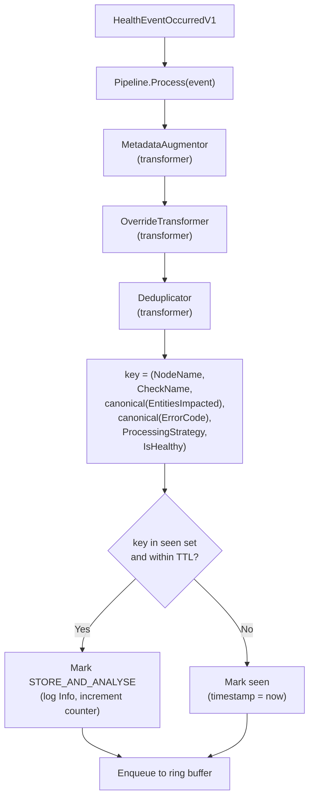

# ADR-039: Platform Connector — Health Event Deduplication

## Context

Health monitors poll their sources on a periodic loop and forward each derived `HealthEvent` to the platform connector via gRPC. When a fault persists, the upstream source typically emits the same observation repeatedly. The clearest example is the syslog monitor: when a GPU enters a persistent error state, the kernel logs the *same* XID/SXID line every poll, differing only in the kernel timestamp prefix:

```
Poll 1:  [ 1108.858286] NVRM: Xid (PCI:0000:b3:00.0): 79, pid=1234, name=nv-hostengine
Poll 2:  [ 1843.308145] NVRM: Xid (PCI:0000:b3:00.0): 79, pid=1234, name=nv-hostengine
Poll 3:  [ 2501.556012] NVRM: Xid (PCI:0000:b3:00.0): 79, pid=1234, name=nv-hostengine
```

These reach fault-quarantine and node-drainer as distinct events: redundant drain evaluations, inflated event counts, audit-log noise. The platform connector compacts node-condition annotations but does not deduplicate the gRPC stream itself, and the same problem exists in principle for any monitor whose source signal repeats while a fault persists.

## Decision

Add a **deduplication transformer** to the platform-connector event-processing pipeline (see [ADR-023](./023-health-event-transformer-pipeline.md)), after the existing transformers `MetadataAugmentor` and `OverrideTransformer`. The transformer uses a generic key derived from the event itself:

```
key = (NodeName, CheckName, canonical(EntitiesImpacted), canonical(ErrorCode), ProcessingStrategy, IsHealthy)
```

Within a configurable **suppression window** TTL, an unhealthy event whose key is already in the seen set is marked `STORE_AND_ANALYSE`. Once the entry expires, the next event with that key remains `EXECUTE_REMEDIATION` and starts a fresh window.



### Canonicalisation

- `CheckName` is included so that two distinct checks producing the same `(entities, ErrorCode)` for the same physical resource don't collide. NIC monitor is the canonical example: `InfiniBandStateCheck` and `InfiniBandDegradationCheck` can both fire for the same port, neither sets `ErrorCode`, and without `CheckName` in the key they would suppress each other.
- `EntitiesImpacted` is a slice; the same logical set may arrive in different orders. The dedup stage sorts entities lexicographically by `(EntityType, EntityValue)` before encoding.
- `ErrorCode` is `[]string`; sorted lexicographically before encoding.
- `ProcessingStrategy` is included so a `STORE_AND_ANALYSE` observation cannot deduplicate a later `EXECUTE_REMEDIATION` event for the same fault identity. This matters for tests and workflows that intentionally send both forms to verify downstream behavior.
- `IsHealthy` is a bool; included so healthy events with the same `(node, check, entities, ErrorCode, ProcessingStrategy)` shape as a prior unhealthy event are not deduplicated against it. This matters for the synthetic healthy events emitted by the cancellation rules in [ADR-038](./038-health-monitor-cancellation-rules.md), which by design carry the same `ErrorCode` as the unhealthy event they cancel.
- The entities and error codes are encoded into fixed, length-prefixed strings (so `"ab" + "c"` can never collide with `"a" + "bc"`) and stored as fields of a comparable `eventKey` struct, which Go uses directly as a map key — deterministic by construction, with no hashing step and no collision risk.

### What clears the dedup

| Signal                                                          | Cleared                                                                                              |
|-----------------------------------------------------------------|------------------------------------------------------------------------------------------------------|
| Healthy event passes the transformer for `(node, check, entities, ErrorCode, ProcessingStrategy)` | The corresponding unhealthy entry (same tuple, `IsHealthy=false`) — fresh recurrence emits as new   |
| TTL elapses on a seen entry                                     | That entry only — next identical event re-emits                                                      |
| Platform-connector pod restart                                  | All entries (state is in-memory only)                                                                |

A healthy event clears entries whose keys match `(node, check, entities, ErrorCode, ProcessingStrategy)` with `IsHealthy=false` before it continues downstream. Healthy events are never downgraded, because platform-connector cannot know whether a previous healthy baseline or recovery event updated every downstream consumer. Repeated unhealthy fault observations are deduplicated by downgrading duplicates to `STORE_AND_ANALYSE`.

### TTL semantics

The TTL is the **suppression window** — the duration for which repeated events with the same dedup key are downgraded to `STORE_AND_ANALYSE`. Default: **3 minutes**. Configurable via the helm value `platformConnector.dedup.suppressionWindow` (Go duration string, e.g. `"3m"`, `"180s"`).

## Implementation

### `platform-connectors/pkg/transformers/dedup` (new)

The tracker is a package-private type; it has no callers outside the `Deduplicator` transformer, so nothing here is exported.

```go
package dedup

type tracker struct {
    mu   sync.RWMutex
    seen map[eventKey]time.Time // canonical key → first-seen
    ttl  time.Duration
    now  func() time.Time       // injectable for tests
}

func newTracker(ttl time.Duration, opts ...trackerOption) *tracker

// checkAndMark returns true iff the event's key is already tracked within ttl
// (a duplicate). Otherwise it records the key and returns false. The check
// and mark happen under one lock so concurrent callers can't both treat the
// same new key as unique.
func (t *tracker) checkAndMark(event *pb.HealthEvent) bool

// clearUnhealthyCounterpart removes the prior unhealthy entry that a healthy
// recovery event resolves. Returns true when an entry was removed.
func (t *tracker) clearUnhealthyCounterpart(event *pb.HealthEvent) bool

// evictExpired walks the entire seen set and removes entries past ttl.
// Required because checkAndMark only evicts the key it queries — keys whose
// events never recur would otherwise stay in memory indefinitely. The
// platform connector runs this on a timer (default: every 60s).
func (t *tracker) evictExpired()
```

`eventKey` is the canonicalised `(NodeName, CheckName, EntitiesImpacted, ErrorCode, ProcessingStrategy, IsHealthy)` tuple described above, encoded as a comparable Go struct of strings (length-prefixed to avoid delimiter collisions) rather than a hash — collisions are impossible by construction, at the cost of a larger map key.

The tracker holds no persistent state; on platform-connector pod restart it starts empty.

### Dedup transformer

`Deduplicator` implements the existing `pipeline.Transformer` interface (see [ADR-023](./023-health-event-transformer-pipeline.md)). It mutates duplicate unhealthy events in place by setting `ProcessingStrategy=STORE_AND_ANALYSE`; downstream connectors already understand that strategy. The store connector still persists the duplicate and health-events-analyzer still consumes it for pattern analysis, while the Kubernetes connector and fault-quarantine skip cluster-mutating side effects for `STORE_AND_ANALYSE` events, exactly as they do for `STORE_ONLY`.

```go
type Deduplicator struct {
    tracker *tracker
    include map[string]bool // checks eligible for dedup; empty means all
    cancel  context.CancelFunc
}

func (d *Deduplicator) Transform(ctx context.Context, event *pb.HealthEvent) error {
    if len(d.include) > 0 && !d.include[event.GetCheckName()] {
        return nil
    }

    // A healthy event always invalidates its unhealthy counterpart, even if
    // this particular healthy event is itself a duplicate of a recent one.
    // Otherwise an unhealthy recurrence between two healthy emissions can
    // remain stuck behind the first healthy's TTL.
    if event.GetIsHealthy() {
        d.tracker.clearUnhealthyCounterpart(event)
        return nil
    }

    if d.tracker.checkAndMark(event) {
        dedupStoreAndAnalyseCounter.WithLabelValues(
            event.GetCheckName(), event.GetNodeName(), errCodeLabel(event),
        ).Inc()
        event.ProcessingStrategy = pb.ProcessingStrategy_STORE_AND_ANALYSE

        return nil
    }

    return nil
}
```

The existing transformer pipeline is sufficient; no new filter/drop stage is needed — the `Filter` interface that used to let pipeline stages drop events entirely has been removed from `platform-connectors/pkg/pipeline`, since every stage (including dedup) is now a transformer that mutates events in place.

### Per-check opt-in

Dedup is scoped to configured check names so the transformer does not accidentally change semantics for checks where every repeated event is meaningful. Helm config:

```yaml
platformConnector:
  dedup:
    enabled: true
    suppressionWindow: "3m"
    cleanupInterval: "60s"
    includeChecks:
      - SysLogsXIDError
      - SysLogsSXIDError
```

### Dedup STORE_AND_ANALYSE metric

```go
var dedupStoreAndAnalyseCounter = promauto.NewCounterVec(
    prometheus.CounterOpts{
        Name: "nvsentinel_platform_connector_dedup_store_and_analyse_total",
        Help: "Total number of duplicate health events marked STORE_AND_ANALYSE by deduplication.",
    },
    []string{"check", "node", "err_code"},
)
```

Dedup rate as a fraction of true error rate (using each monitor's existing kernel-rate counter, e.g. `syslog_health_monitor_xid_errors`):

```promql
rate(nvsentinel_platform_connector_dedup_store_and_analyse_total{check="SysLogsXIDError", node="gpu-node-1"}[5m])
  /
rate(syslog_health_monitor_xid_errors{node="gpu-node-1"}[5m])
```

### Lifecycle

The dedup tracker lives entirely in memory. A single background goroutine, started by the factory alongside the transformer, calls `evictExpired()` on a cleanup interval (default every 60s) so entries whose events stop recurring don't accumulate past `suppressionWindow`. There is no on-disk state, no boot-id detection, and no startup restore: pod restart and node reboot both result in an empty tracker, and currently-active faults re-emit once each as the kernel re-observes them.

### Files touched

| File                                                          | Change                                                                                   |
|---------------------------------------------------------------|------------------------------------------------------------------------------------------|
| `data-models/protobufs/health_event.proto`                    | Add `STORE_AND_ANALYSE` to the `ProcessingStrategy` enum                                 |
| `platform-connectors/pkg/transformers/dedup/tracker.go`        | **New** — `tracker`, `eventKey`, canonicalisation (all package-private)                 |
| `platform-connectors/pkg/transformers/dedup/tracker_test.go`   | **New** — unit tests: TTL eviction, canonicalisation, healthy-clears-unhealthy           |
| `platform-connectors/pkg/transformers/dedup/config.go`         | **New** — `Config`, `LoadConfig`, defaults and validation                                |
| `platform-connectors/pkg/transformers/dedup/metrics.go`        | **New** — `nvsentinel_platform_connector_dedup_store_and_analyse_total` counter          |
| `platform-connectors/pkg/transformers/dedup/factory.go`        | **New** — registers `Deduplicator` in the pipeline registry                              |
| `platform-connectors/pkg/transformers/dedup/transformer.go`    | **New** — `Deduplicator.Transform`, periodic `evictExpired` timer                        |
| `platform-connectors/pkg/pipeline/pipeline.go`                 | Removed the `Filter` interface; every pipeline stage is now a `Transformer`              |
| `distros/kubernetes/nvsentinel/values.yaml`, `values-full.yaml`, `values-tilt.yaml` | Add `platformConnector.dedup` config block                          |

## Consequences

### Positive
- Eliminates redundant Kubernetes/remediation side effects within a burst, for every monitor that flows through the platform connector.
- Single implementation, single configuration point. Adding dedup for a new monitor is opt-out only — by default it works.
- One event still emerges per burst, so any consumer that counts bursts (or correlates faults over time) continues to work.
- No per-monitor source code change; monitors are unaware of dedup.

### Negative
- Events still travel monitor → platform-connector and are still stored; dedup only downgrades duplicate remediation behavior. The hop is a co-located Unix socket, not a network call.
- Dedup behaviour is governed entirely by what producers put in `EntitiesImpacted`, `ErrorCode`, and `ProcessingStrategy`. Two events with the same tuple are treated as the same fault — including two XID 79 emissions whose only difference is `pid` in the `Message` text. A monitor that needs to distinguish those must include pid as an entity.
- Entity and `ErrorCode` slices are now canonicalised by sorting; producers must treat them as sets, not ordered lists.
- Dedup state is in-memory only. On a platform-connector pod restart, currently-active faults re-emit once each as their next emission arrives, then dedup picks up from there.

In-memory size is bounded by `O(distinct active faults across all monitors on the node)`.

## Alternatives Considered

### Monitor-side dedup with a domain-specific key
Use `(GPU_UUID, XID, normalized message)` for syslog and a different key for each future monitor.

**Rejected:** the generic `(node, check, EntitiesImpacted, ErrorCode)` tuple captures the same identity for syslog and works for every other monitor without per-monitor key design. The kernel-timestamp normalisation regex, the per-GPU slot model, and the XID-change reset all become unnecessary.

## Notes

- The platform connector runs as a DaemonSet; each monitor connects to its co-located pod via Unix socket. Centrally-deployed monitors (e.g., `kubernetes-object-monitor`) route events about every affected node through a single platform-connector pod, so `NodeName` in the dedup key is what keeps those events distinct.
- The dedup stage runs *after* `MetadataAugmentor` and `OverrideTransformer`, so any event mutation those perform (e.g., overriding `IsFatal`, augmenting metadata) is in place before keying.

## References

- [ADR-023: Health Event Transformer Pipeline](./023-health-event-transformer-pipeline.md) — the pipeline this ADR adds a stage to.
- [ADR-038: Health Monitor Cancellation Rules](./038-health-monitor-cancellation-rules.md) — produces synthetic healthy events whose dedup key collides with the targeted unhealthy event on `(node, check, entities, ErrorCode)`; the `IsHealthy` component of the key keeps them distinct.
- [ADR-020: NVSentinel GPU Reset](./020-nvsentinel-gpu-reset.md) — the GPU reset detection that produces the canonical "healthy event" pattern.
- [ADR-001: Health Event Detection Interface](./001-health-event-detection-interface.md) — the `Handler` interface this ADR leaves unchanged.
