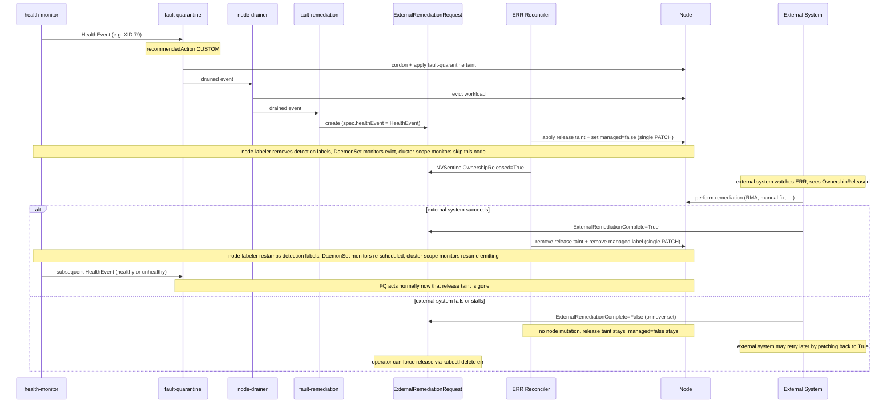

# ADR-040: API — External Remediation Request (ERR)

## Context

NVSentinel is the primary owner of nodes in the clusters where it operates: when a node joins, NVSentinel owns it, and any cordon/drain/reboot/terminate flows through NVSentinel's pipeline (health-monitor → fault-quarantine → node-drainer → fault-remediation).

For most failure modes, NVSentinel can remediate end-to-end with the existing maintenance CRs — `RebootNode`, `GPUReset`, `TerminateNode`. But there is a class of remediations NVSentinel cannot perform itself:

- CSP-side hardware repair (out-of-cluster work driven by a cloud provider's support workflow)
- Long-running orchestrated workflows handled by external automation
- Manual operator intervention on physical infrastructure

In each case the remediation lives outside NVSentinel's control plane. Today, coordination between NVSentinel and the external party performing the work is ad-hoc — operators manually uncordon nodes, fight over taints, or use side-channel notifications. There is no in-band mechanism for NVSentinel to declare "I am releasing this node; another system is now responsible for it." Nor is there a way for that external system to declare back "I am done, the node is yours again."

A node must be owned by **exactly one** system at any point in time. Without a formal handoff, NVSentinel and an external system can both decide to act on the same node and race — duplicating remediation work, fighting over taints, or interleaving operations that corrupt cluster state.

The design must be agnostic to which external system is on the other side. NVSentinel cannot make assumptions about how, when, or whether an external system completes its work; the protocol must work for automated orchestrators, vendor support teams, and individual human operators alike.

## Decision

Introduce a new CRD, `ExternalRemediationRequest` (ERR), in the existing `nvsentinel.nvidia.com/v1alpha1` API group. ERR is the **exit door** from NVSentinel ownership:

- Created by `fault-remediation` when triage maps a fault to the `CUSTOM` recommended action (per [ADR-036](036-custom-remediation-actions.md)) with a `customRecommendedAction` configured to produce an ERR.
- The ERR's `spec.healthEvent` carries the triaged `HealthEvent` — the same `datamodels.HealthEvent` proto already emitted by every health-monitor and consumed by every downstream stage. `spec` is a small wrapper struct so future ERR-specific fields can be added without modifying the `HealthEvent` proto.
- The ERR reconciler applies a release taint to the target node and sets `NVSentinelOwnershipReleased=True`. From that moment, an external system is responsible for the node.
- The external system, observing the ERR, performs its remediation and writes `ExternalRemediationComplete=True` (success) or `False` (failure / gave up) back to the ERR's status.
- On `True`, the ERR reconciler removes the release taint and removes the `nvsentinel.dgxc.nvidia.com/managed` label (see *Controlling health event generation* below), returning the node to NVSentinel ownership. On `False`, the ERR reconciler intentionally leaves the node released — when the external system has stopped, NVSentinel has no signal about what state the node was left in, so returning it to user workloads on that signal would be unsafe. The ERR stays live; the external system may resume work and patch `True` later, or an operator may force release via `kubectl delete err` (handled by a cleanup finalizer on every ERR).

Coordination state lives in `status.conditions` only. The ERR object is the single coordination artifact between NVSentinel and the external party for the duration of the handoff. A cleanup finalizer (`nvsentinel.nvidia.com/external-remediation-cleanup`) on every ERR guarantees that operator-initiated `kubectl delete err` always returns the node to NVSentinel cleanly.

## Implementation

### Module layout

The CRD type is defined in proto and generated via the existing `protoc-gen-crd` plugin (the same plugin that generates `HealthEventResource` today — see `data-models/protobufs/health_event.proto` line 121). The reconciler lives alongside the existing maintenance reconcilers in `janitor/`.

```text
data-models/
├── protobufs/
│   ├── health_event.proto                 (existing — already defines HealthEvent)
│   └── external_remediation.proto         (new — defines ExternalRemediationRequest,
│                                                 its status, and a Condition message)
└── pkg/protos/
    └── external_remediation.pb.go         (generated by protoc-gen-go)

distros/kubernetes/nvsentinel/charts/janitor/crds/
└── external_remediation_request.crd.yaml  (generated by protoc-gen-crd)

janitor/
├── api/v1alpha1/
│   ├── external_remediation_register.go   (new — thin scheme registration; no field
│   │                                              definitions, the proto-generated
│   │                                              types are used directly)
│   ├── gpureset_types.go                  (existing)
│   ├── rebootnode_types.go                (existing)
│   ├── terminatenode_types.go             (existing)
│   └── groupversion_info.go               (existing — already nvsentinel.nvidia.com/v1alpha1)
├── pkg/condition/
│   └── condition.go                       (new — adapter between proto Condition and
│                                                 metav1.Condition for controller-runtime
│                                                 helpers like SetCondition)
└── pkg/controller/
    └── externalremediationrequest_controller.go (new)
```

When a field is added to `HealthEvent` in `health_event.proto`, the ERR CRD schema updates automatically on the next `make generate`; no Go struct edits required. This is the same automation already used for `HealthEventResource`.

The descheduling mechanism described in *Controlling health event generation* below also touches existing components: `node-labeler` is extended to gate its detection-label stamping on a new `managed` label, and a small `commons/pkg/` helper is added for cluster-scope monitor emission gating. DaemonSet monitor charts (`gpu-health-monitor`, `syslog-health-monitor`, `nic-health-monitor`, `metadata-collector`) are unchanged — their existing `nodeSelector`s already depend on `node-labeler`-stamped detection labels and respond to the gating mechanism implicitly. Those changes are scoped in *Controlling health event generation* rather than enumerated here.

### API

Defined in `data-models/protobufs/external_remediation.proto`:

```protobuf
import "google/protobuf/timestamp.proto";
import "health_event.proto";
import "github.com/yandex/protoc-gen-crd/library/go/k8s/protoc_gen_crd/proto/crd.proto";

// Condition is the wire equivalent of metav1.Condition.
message Condition {
  string type = 1;
  string status = 2;          // "True", "False", "Unknown"
  int64 observed_generation = 3;
  google.protobuf.Timestamp last_transition_time = 4;
  string reason = 5;
  string message = 6;
}

message ExternalRemediationRequestSpec {
  HealthEvent healthEvent = 1;                       // reused from health_event.proto
  // Future ERR-specific spec fields (priority, expected-duration, etc.) can be
  // added here without touching the HealthEvent proto.
}

message ExternalRemediationRequestStatus {
  repeated Condition conditions = 1;
}

message ExternalRemediationRequest {
  option (protoc_gen_crd.k8s_crd) = {
    api_group: "nvsentinel.nvidia.com",
    kind: "ExternalRemediationRequest",
    plural: "externalremediationrequests",
    singular: "externalremediationrequest",
    short_names: ["err"],
    categories: ["nvsentinel"]
  };
  ExternalRemediationRequestSpec spec = 1;
  ExternalRemediationRequestStatus status = 2;
}
```

The condition type names are defined as Go constants in `janitor/pkg/controller/`:

```go
const (
    ERROwnershipReleasedCondition   = "NVSentinelOwnershipReleased"
    ERRRemediationCompleteCondition = "ExternalRemediationComplete"
)
```

`HealthEvent` under `spec.healthEvent` is the **same** `datamodels.HealthEvent` message used everywhere else in NVSentinel — `protoc-gen-crd` walks the reference and emits the full nested schema into the generated CRD. Adding a field to `HealthEvent` propagates here automatically without any code change in this module. The `ExternalRemediationRequestSpec` wrapper leaves room for future ERR-specific spec fields (priority, expected duration, external-system hints) without requiring changes to the `HealthEvent` proto or to consumers of it elsewhere in the codebase.

The proto-generated Go types are used directly by the controller; there is no hand-maintained mirror struct. A thin adapter in `janitor/pkg/condition` converts between proto `Condition` and `metav1.Condition` at the controller boundary so existing `meta.SetStatusCondition` / `meta.IsStatusConditionTrue` helpers continue to work.

Concrete shape from `kubectl get externalremediationrequest -o yaml`:

```yaml
apiVersion: nvsentinel.nvidia.com/v1alpha1
kind: ExternalRemediationRequest
metadata:
  creationTimestamp: "2026-05-11T21:16:02Z"
  finalizers:
    - nvsentinel.nvidia.com/external-remediation-cleanup
  generation: 1
  labels:
    nvsentinel.nvidia.com/component-class: gpu
    nvsentinel.nvidia.com/node: node-01.example-cluster.internal
    nvsentinel.nvidia.com/recommended-action: external-remediation
  name: gpu0-xid79-node-01
  namespace: nvsentinel
spec:
  healthEvent:
    agent: gpu-health-monitor
    checkName: nvml-xid-79
    componentClass: gpu
    customRecommendedAction: external-remediation
    entitiesImpacted:
      - {entityType: GPU,  entityValue: "0"}
      - {entityType: PCIE, entityValue: "0000:18:00.0"}
    errorCode: [XID-79]
    generatedTimestamp: "2026-05-11T20:14:07Z"
    id: he-7f0b3e2c-1cab-4d22-9a96-2d5b3a8ee2f1
    isFatal: true
    isHealthy: false
    message: GPU fell off the bus (XID 79) on /dev/nvidia0; node requires hardware-level repair.
    metadata:
      cluster: example-cluster-01
      cudaVersion: "12.4"
      driverVersion: 550.144.03
      serialNumber: "1320820063748"
    nodeName: node-01.example-cluster.internal
    processingStrategy: EXECUTE_REMEDIATION
    recommendedAction: CUSTOM
    version: 1
status:
  conditions:
    - type: NVSentinelOwnershipReleased
      status: "True"
      observedGeneration: 1
      lastTransitionTime: "2026-05-11T20:14:09Z"
      reason: ReleaseTaintApplied
      message: Applied taint nvsentinel.nvidia.com/external-remediation=gpu0-xid79-node-01:NoSchedule to node-01.example-cluster.internal; node released to external system.
    - type: ExternalRemediationComplete
      status: "Unknown"
      observedGeneration: 1
      lastTransitionTime: "2026-05-11T20:14:09Z"
      reason: AwaitingExternalSystem
      message: Waiting for external system to set ExternalRemediationComplete=True (success) or False (failure).
```

### Condition state machine

`True` and `False` are terminal states for both conditions, with one explicit exception described below. Conditions in flight are represented by `Unknown`; the reconciler calls `SetInitialConditions` on first reconcile, writing every condition as `Unknown` with `reason: Initializing` (modelled after `janitor/api/v1alpha1/rebootnode_types.go`).

| Condition | Initial | Terminal `True` | Terminal `False` | Set by |
| --- | --- | --- | --- | --- |
| `NVSentinelOwnershipReleased` | `Unknown` (`Initializing`) | Release taint applied to `spec.healthEvent.nodeName`. Strictly terminal — does not transition again. | Persistent failure to apply taint (e.g. unrecoverable API-server error such as a missing RBAC grant). Strictly terminal. | ERR reconciler |
| `ExternalRemediationComplete` | `Unknown` (`AwaitingExternalSystem`) | External system reports remediation succeeded. Strictly terminal. ERR reconciler runs node-cleanup on this transition. | External system reports remediation failed or gave up. **Not strictly terminal** — see the re-transition note below. | **External system** |

The behaviour on `ExternalRemediationComplete` is intentionally asymmetric:

- **On `True`**: the external system has reported success. The ERR reconciler removes the release taint and removes the `managed` label, returning the node to NVSentinel ownership. Once monitor pods are re-scheduled (typically within seconds), health-monitors either emit a healthy event (clearing fault-quarantine state and returning the node to service) or re-detect the same fault (re-triggering the pipeline and producing a fresh ERR).
- **On `False`**: the external system has reported failure or has stopped. The ERR reconciler **does nothing** to the node — the release taint stays, `managed` stays `"false"`, the node remains released. NVSentinel does not attempt to return the node to regular service on `False`; the external system may have left the node in an arbitrary state (mid-RMA, partial repair, etc.) that would be unsafe for user workloads. The ERR remains live, claiming the node, until either the external system retries (see below) or an operator forces release (see *Operator-driven release* in the ERR reconciler section).

**Re-transition exception (`False` → `True`).** Because `False` indicates the external system has stopped *but might come back*, the external system may patch `ExternalRemediationComplete=False` → `True` later if they end up fixing the node. The ERR reconciler observes the change and runs the normal `True` cleanup path. This is the only allowed re-transition in this design: `True` never transitions, `NVSentinelOwnershipReleased` is strictly terminal in both directions.

All conditions are append-or-update in place via the `SetCondition` helper, which short-circuits no-op updates so reconcile storms don't flap `lastTransitionTime`.

### ERR reconciler

**Watches:** `ExternalRemediationRequest` (primary); `Node` (secondary, to detect taint drift).

**Reconcile loop:**

1. On first reconcile:
   - Ensure the finalizer `nvsentinel.nvidia.com/external-remediation-cleanup` is present on `metadata.finalizers`. Add it if absent. This is what gates operator-initiated deletion through the cleanup path described in *Operator-driven release* below.
   - Call `SetInitialConditions`: write `NVSentinelOwnershipReleased=Unknown (Initializing)` and `ExternalRemediationComplete=Unknown (AwaitingExternalSystem)`.
2. If `metadata.deletionTimestamp` is set (operator-initiated delete):
   - In a **single PATCH** against `spec.healthEvent.nodeName`, both:
     - Remove the release taint if present (idempotent; verify key AND value match this ERR's name).
     - Remove the `nvsentinel.dgxc.nvidia.com/managed` label if present (idempotent; tolerate already absent).

     The PATCH is a no-op if the node was already cleaned up by an earlier `ExternalRemediationComplete=True` transition.
   - Remove the finalizer. Once removed, Kubernetes garbage-collects the ERR.
   - Done.
3. If `NVSentinelOwnershipReleased` is `Unknown`:
   - In a **single PATCH** against `spec.healthEvent.nodeName`, both:
     - Apply the configured release taint (idempotent).
     - Set the `nvsentinel.dgxc.nvidia.com/managed` label to `"false"` (flipped from its default `"true"`), gating health-monitor scheduling and emission — see *Controlling health event generation* below.

     Combining the two mutations into one API call eliminates the inconsistency window where the node would carry one but not the other.
   - On success: set `NVSentinelOwnershipReleased=True` with `reason=ReleaseTaintApplied`.
   - On persistent failure: set `NVSentinelOwnershipReleased=False` with `reason=ReleaseTaintFailed`. The ERR is now in a terminal failed state; no further reconciliation work, but the object remains so the failure is visible to operators. Transient errors continue to retry via the standard controller-runtime backoff.
4. If `ExternalRemediationComplete=True`:
   - In a **single PATCH** against `spec.healthEvent.nodeName`, both:
     - Remove the release taint (idempotent; tolerate missing taint). Verify both key AND value match this ERR's name on the taint before removing — protects against drift from a previous, no-longer-existing ERR.
     - Remove the `nvsentinel.dgxc.nvidia.com/managed` label (idempotent; tolerate already absent) — see *Controlling health event generation* below.

     Atomicity matters in this direction too — no window where the taint is gone but the label still holds monitors off, or vice versa.
   - Done. The ERR remains in the cluster as a historical record (finalizer still attached). The operator can delete it whenever they no longer need the record; the deletion-handling step above runs idempotently and removes the finalizer.
5. If `ExternalRemediationComplete=False`:
   - **No state changes on the node.** The release taint stays; `managed` stays `"false"`. The node remains released to the external system, which may continue working on it.
   - Done for now. The reconciler re-enters either when the external system patches `ExternalRemediationComplete=True` (in which case step 4 fires), or when the operator deletes the ERR (in which case step 2 fires).
6. Otherwise (`ExternalRemediationComplete` is still `Unknown`): no-op until the external system writes a terminal value.

**Release taint** (key configurable via Helm values):

```text
nvsentinel.nvidia.com/external-remediation=<err-name>:NoSchedule
```

The taint **value** is the `metadata.name` of the owning `ExternalRemediationRequest` — the same deterministic hash used by `fault-remediation` when constructing the ERR. The taint carries both the operational guard ("don't act on this node") and the correlation key ("which ERR owns the release") in one place. No Node label or annotation duplicates the ERR identity, and the design does not maintain a parallel `kubectl get nodes -l ...`-style selector for "list all nodes under external remediation." Operators answering that question use a jq query against the `taints` field of the Node list. The cost of maintaining a duplicate label was judged not worth it given how rarely the enumeration is needed in practice. The ERR reconciler does separately flip the `nvsentinel.dgxc.nvidia.com/managed` label on the node to gate health-monitor scheduling and emission (see *Controlling health event generation* below); that label has cluster-wide semantics independent of ERRs and carries no ERR identity.

The taint is the *single source of truth* for "this node is not owned by NVSentinel right now." Any other NVSentinel component that mutates the target node's quarantine, drain, or remediation state — applying or removing taints, cordoning or uncordoning, creating or completing maintenance CRs, modifying NVSentinel-managed annotations — MUST refuse to take that action on a node carrying any taint with key `nvsentinel.nvidia.com/external-remediation`, regardless of value. `node-drainer` and `fault-quarantine` get a small guard; `fault-remediation` inherits the same guard through its existing node-selection logic. This guard is a defense-in-depth backstop: with the monitor-teardown mechanism in *Controlling health event generation* below, NVSentinel's own monitors aren't emitting events for the released node in the first place, so the expected event volume reaching fault-quarantine is near zero — the guard only fires on stragglers (a final event during the eviction window, or an event from outside the standard pipeline). If an event does arrive, it is still observed, recorded, and exported as usual; the guard applies only to state-changing actions.

**Single active ERR per node.** Because the `(key, effect)` taint tuple is unique on a Node, only one ERR can have its release taint applied at a time. This invariant is enforced by `fault-remediation`'s existing equivalence-group machinery (see the *`fault-remediation` integration* section): ERRs declare their own equivalence group and a status checker, and the existing "skip CR creation when a CR for a matching group is in progress" logic prevents a second concurrent ERR from ever being created. No new dedup code is required in the ERR reconciler.

**Idempotency:** taint application uses a server-side patch. The ERR reconciler verifies both key AND value match its own ERR name before treating the taint as "its own" — protecting against drift from a previous, no-longer-existing ERR.

**Node deletion:** if `spec.healthEvent.nodeName` no longer exists at reconcile time, the reconciler logs and treats taint and label operations as no-ops. The ERR object remains until the external system writes `ExternalRemediationComplete=True` or until an operator deletes it. If the external system never acknowledges, the ERR persists with `ExternalRemediationComplete=Unknown` (visible via the open-ERR gauge — see Observability); the operator escape hatch below is how that state is reclaimed.

**Operator-driven release.** Because `ExternalRemediationComplete=False` (or persistent `Unknown`) intentionally leaves the node released — NVSentinel does not infer that the external system has given up — there must be an explicit operator-facing knob to force the node back into NVSentinel ownership. The mechanism is a finalizer (`nvsentinel.nvidia.com/external-remediation-cleanup`) added to every ERR by the reconciler on first reconcile. The operator-facing workflow:

```bash
kubectl delete err <name> -n nvsentinel
```

When the operator runs this command, Kubernetes sets `metadata.deletionTimestamp` on the ERR but does not garbage-collect it because the finalizer is present. The reconciler observes the `deletionTimestamp`, runs the cleanup PATCH against the node (remove release taint, remove `managed` label) — idempotent against state from an earlier `ExternalRemediationComplete=True` transition — and then removes the finalizer. Kubernetes garbage-collects the ERR once the finalizer is gone.

The finalizer makes the cleanup PATCH a controlled, traceable transition rather than a silent side effect of object deletion. It also defends against accidental `kubectl delete --all err` — every deletion goes through the reconciler, gets logged, and emits a `ReleaseTaintRemoved` event with the operator-initiated reason. This is the only way to reclaim a node held by a stalled or failed ERR; the design intentionally provides no automatic timeout.

### Controlling health event generation

While an ERR holds the release taint on a node, NVSentinel's own health monitors should not run on or emit events for that node. The external system is in full control; events NVSentinel produces during the window would either be misleading (artifacts of the external system's work) or actively harmful (a healthy event could prematurely clear fault-quarantine state while the external system is still mid-flight). This section describes how monitor scheduling and event emission are gated during external remediation.

#### The coordinating label

A single Node label gates monitor behaviour: **`nvsentinel.dgxc.nvidia.com/managed`**.

| Value | Meaning |
| --- | --- |
| `"false"` | Node is opted out. `node-labeler` removes its detection labels (`dcgm.version`, `driver.installed`, `kata.enabled`) and refrains from re-stamping them; DaemonSet monitors evict because their selectors no longer match; cluster-scope monitors observe the value and skip emission. Set by the ERR reconciler atomically with the release taint, or by an operator who wants to opt a node out manually. |
| absent or anything else | Default state. `node-labeler` stamps detection labels per its existing detection logic; DaemonSet monitors are scheduled; cluster-scope monitors emit. New nodes joining the cluster start here — no setup is required. |

The label has exactly one job: signal "this node is opted out, leave it alone." The ERR reconciler is the only programmatic writer; operators may also write `"false"` manually for opt-out, and remove the label to revert. There is no bootstrap step — absence is treated as "managed by default," so node-labeler never needs to stamp `managed` itself.

#### `node-labeler` is the central gate

`node-labeler` (an existing NVSentinel `Deployment`) already stamps detection labels onto Nodes — `nvsentinel.dgxc.nvidia.com/dcgm.version` (`3.x` or `4.x`), `nvsentinel.dgxc.nvidia.com/driver.installed`, `nvsentinel.dgxc.nvidia.com/kata.enabled` — based on probes against the node's hardware and configuration. Those labels are referenced by the DaemonSet monitors' existing `nodeSelector`s as deploy gates. The redesign extends `node-labeler` to make those detection-label writes conditional on `managed`:

- On every reconcile of a Node, `node-labeler` reads the `managed` label first.
- If `managed="false"`: remove any detection labels previously stamped on this node and skip any new detection-label work. The labels stay absent until `managed="false"` is removed (or changed to anything else).
- Otherwise (label absent or any other value): proceed with normal detection-label stamping based on probes. This matches `node-labeler`'s existing behaviour today — no change for the common case.

`node-labeler` does not write `managed` itself. It only reads it.

The semantic frame: `managed="false"` is an *opt-out intent* signal. node-labeler's detection labels are *facts about the node*, but node-labeler's decision to maintain them is gated on intent — "should node-labeler do anything to this node?" — rather than purely on the underlying facts. Conflating fact and intent on the detection-label names is a known trade-off (see below), accepted because today node-labeler is the sole writer of those labels and the DaemonSet monitor charts are the only readers.

#### DaemonSet monitors: implicit eviction via existing selectors

DaemonSet monitor `nodeSelector`s already gate on `node-labeler`-managed detection labels. **No chart change is required** — the existing selectors do the work:

| Monitor | `nodeSelector` keys from `node-labeler` |
| --- | --- |
| `gpu-health-monitor` | `nvsentinel.dgxc.nvidia.com/dcgm.version` (`3.x` or `4.x` variant) |
| `syslog-health-monitor` | `nvsentinel.dgxc.nvidia.com/driver.installed`, `nvsentinel.dgxc.nvidia.com/kata.enabled` |
| `nic-health-monitor` | `nvsentinel.dgxc.nvidia.com/driver.installed` |
| `metadata-collector` | `nvsentinel.dgxc.nvidia.com/driver.installed` (also `nvidia.com/gpu.present`, set by the GPU operator, unaffected) |

When `node-labeler` removes those detection labels in response to `managed="false"`, the DaemonSet controller re-evaluates the selectors, finds no match, and *promptly* deletes the affected pods (per the [Kubernetes DaemonSet documentation](https://kubernetes.io/docs/concepts/workloads/controllers/daemonset/#updating-a-daemonset)). When the `managed="false"` label is later removed and node-labeler restamps the detection labels, the DaemonSet controller schedules pods again. Empirically this end-to-end (label flip → labeler reconcile → detection-label removal → DaemonSet evict) completes within seconds.

`metadata-collector` is included in the list above for completeness: it gates on `driver.installed` AND `nvidia.com/gpu.present`. When `driver.installed` is withheld, the AND fails and `metadata-collector` is evicted too. This is the desired behaviour during external remediation — NVSentinel's collection should also stop on a released node.

#### Cluster-scope monitors: code-level emission gating

Cluster-scope monitors (`csp-health-monitor`, `kubernetes-object-monitor`, `slurm-drain-monitor`) run as `Deployment`s, not DaemonSets, and target nodes by name from outside the node. They cannot be evicted from a node because they do not run on it. Instead, each cluster-scope monitor reads the target node's `managed` label from its Kubernetes informer cache and skips emission when `managed="false"`. Any other state (label absent, label set to `"true"`, or any other value) means the cluster-scope monitor emits as usual.

A shared helper in `commons/pkg/` provides the lookup so the check is centralized; each cluster-scope monitor calls into it before emitting events for a given node. The check is part of the emission code path, not the scrape/poll loop — monitors keep observing, they just refuse to emit for nodes that are explicitly opted out.

#### ERR reconciler interaction

The ERR reconciler is the only programmatic writer of `managed`. It writes the label as part of the same `PATCH` operations that apply and remove the release taint (see reconcile loop in the *ERR reconciler* section above):

- **Apply path**: single PATCH applies the release taint and sets `managed="false"`. Both mutations land atomically; on the next `node-labeler` reconcile (typically <1s), detection labels are removed and DaemonSet pods evict.
- **Cleanup path** (on `ExternalRemediationComplete=True` or operator-initiated deletion): single PATCH removes the release taint and *removes* the `managed` label entirely. node-labeler observes the removal, treats the node as default-managed again, and resumes stamping detection labels. DaemonSet monitors re-schedule, cluster-scope monitors resume emission.

The reconciler removes the label on cleanup (rather than writing `"true"`) because absence is the default-managed state — leaving no trace once external remediation is complete is cleaner than leaving a now-meaningless `managed="true"` annotation on the node.

#### Eviction is asynchronous

Two timing components contribute to the gap between `managed="false"` being applied and monitor pods actually disappearing:

1. `node-labeler` observes the `managed` write via its informer and runs its own reconcile to remove detection labels. Typical latency: well under a second.
2. The DaemonSet controller re-evaluates `nodeSelector` matches once detection labels are removed and begins evicting pods. Actual pod termination respects each pod's `terminationGracePeriodSeconds` — typically a few seconds.

The ERR reconciler does **NOT** wait for either component to complete before setting `NVSentinelOwnershipReleased=True`; the condition flips as soon as the PATCH lands. Monitor pods may emit a few last health events for the released node during the eviction window. Those events are caught downstream by the release-taint guard and do not trigger NVSentinel action; they may, however, appear briefly in the event store and observability surfaces. The release taint itself takes effect immediately on patch landing, so destructive scheduling decisions are blocked from the moment the patch is acknowledged. Cluster-scope monitors stop emitting on the next informer-cache observation of the `managed` write — effectively immediately; no pod eviction is involved, so no analogous window exists.

#### Trade-offs

**Observability loss during external remediation.** For the duration of external remediation, NVSentinel cannot see what is happening on the node from its own monitors. For long-running remediations (days to weeks), this is a real cost. The external system is expected to provide its own observability for the duration.

**Cold-start churn on monitor resumption.** When the `managed` label is removed on cleanup and `node-labeler` re-stamps detection labels, DaemonSet pods are re-scheduled and cold-start, emitting fresh events based on the current node state. If the underlying fault is still present, this re-triggers the pipeline and may produce a new ERR. This is the desired self-healing behaviour — operators should expect a brief flurry of events at the moment of monitor resumption.

**Detection labels gated on opt-out intent, not just fact.** `node-labeler` removes labels named for facts about the node (`dcgm.version`, `driver.installed`, `kata.enabled`) in response to the `managed="false"` *opt-out intent* signal, not in response to changes in the underlying facts. The cleaner framing is "should node-labeler do anything to this node?" — but the detection labels still carry factual names, so a future component that wants to read `driver.installed` as a true factual signal would observe stale-when-`managed="false"` state. Such a component would need either a different signal source (probe the node directly, query a node-info API) or a layered check (`managed!="false"` AND `driver.installed="true"`). The trade-off was accepted because the alternative — introducing a separate "deploy-gate" label per monitor — would multiply the surface area without changing the underlying mechanism. Today node-labeler is the sole writer of these labels and the DaemonSet monitor charts are the only readers, so the conflation is fully contained.

**Operator-driven opt-out.** Operators wanting to opt a node out of NVSentinel management *without* an ERR write `managed="false"` directly on the node. To revert, they remove the label. Behaviour is identical to ERR-driven opt-out: detection labels removed by node-labeler, monitors evicted/silenced. This gives operators a simple, ad-hoc opt-out without needing to create an ERR.

### `fault-remediation` integration

`fault-remediation` already uses `GetEffectiveActionName(he)` (per ADR-036) to resolve the action name for routing. To produce ERRs:

- **TOML config** — declare the external-remediation action's `MaintenanceResource` with `apiGroup: "nvsentinel.nvidia.com"` and `kind: "ExternalRemediationRequest"`. No schema extension is needed; this reuses the same `apiGroup` + `kind` knobs that already route the reboot action to `janitor.dgxc.nvidia.com` / `RebootNode`.
- **`fault-remediation/pkg/remediation/remediation.go`** — `CreateMaintenanceResource` already builds the maintenance CR from `apiGroup` + `kind` via the dynamic client. The branch for `ExternalRemediationRequest` mostly falls out of the existing template-render path

ERR construction details:

- `metadata.name` is a deterministic hash of `(nodeName, healthEvent.id)` so repeated reconciles of the same event do not create duplicate ERRs. The name **also** becomes the value of the release taint applied by the ERR reconciler — so it MUST be a valid Kubernetes taint value (≤ 63 chars, alphanum + `.`, `-`, `_`).
- `metadata.namespace` is the configured ERR namespace (default: `nvsentinel`).
- `spec.healthEvent` is a full copy of the triaged event.

**Equivalence-group integration.** ERR creation goes through the same `latestFaultRemediationState`-annotation + `ShouldSkipCRCreation` machinery as existing maintenance CRs (`RebootNode`, `GPUReset`, etc.) — see `fault-remediation/pkg/reconciler/reconciler.go` `shouldCreateCRForGroup`. Two pieces are added:

1. **Equivalence group declared in the TOML config** for the external-remediation action, e.g. `equivalenceGroup: "external-remediation"`. Cross-kind supersedence (e.g. `external-remediation` superseded by `restart`, or vice versa) can be declared the same way as today, so a node with an in-flight `RebootNode` does not get a concurrent ERR, and a node with an in-flight ERR does not get a concurrent maintenance CR. The `external-remediation` action MUST NOT declare an `impactedEntityScope`; the release taint is node-scoped, so only one ERR can hold ownership of a node at a time. Per-component differentiation via `impactedEntityScope` (the way `GPUReset` does it) would produce multiple concurrent ERRs whose taints would collide. With the monitor-teardown mechanism in place (see *Controlling health event generation* below), NVSentinel's monitors aren't producing events for a released node anyway — but if events arrive from outside the standard pipeline while an ERR is open, they resolve to the same `external-remediation` equivalence group and are skipped at `fault-remediation`. Once monitor pods resume after terminal completion and the label is restored, any underlying faults that remain are re-detected and produce a fresh ERR through the standard pipeline.
2. **A status checker for `ExternalRemediationRequest`** plugging into the existing `StatusChecker` interface: returns `ShouldSkip=true` while the ERR is still claiming the node — `ExternalRemediationComplete=Unknown` (in-flight) **or** `ExternalRemediationComplete=False` (failed-but-still-released, see *Condition state machine*). Returns `ShouldSkip=false` only when `ExternalRemediationComplete=True`, at which point the entry is pruned from the `latestFaultRemediationState` annotation as usual. If the operator deletes the ERR via the finalizer escape hatch, the ERR object disappears entirely and the corresponding annotation entry is treated as missing on the next reconcile — same effect.

This gets the "single active ERR per node" invariant for free — it falls out of the existing skip logic, no bespoke deduplication code in the ERR reconciler.

`fault-remediation` does **not** create both an ERR and a maintenance CR for the same event — the equivalence group declares one or the other.

### Sequence diagram



### Observability

**Metrics** (Prometheus, namespace `nvsentinel_external_remediation`):

| Metric | Type | Labels | Meaning |
| --- | --- | --- | --- |
| `err_total` | Counter | `phase` (`created`, `released`, `external_response`, `closed`); `result` (`success`, `failure`, `operator_deleted`; empty when `phase=created`) | ERRs entered each phase. `released` with `result=failure` indicates a persistent taint-apply failure (`NVSentinelOwnershipReleased=False`). `external_response` is incremented whenever the external system writes to `ExternalRemediationComplete` — `result=success` on `True`, `result=failure` on `False`. `closed` counts terminal transitions that returned the node to NVSentinel — `result=success` for `ExternalRemediationComplete=True` driven cleanup, `result=operator_deleted` for finalizer-driven cleanup after `kubectl delete err`. Note that `ExternalRemediationComplete=False` does NOT advance to `closed` on its own — the node remains released. |
| `err_open` | Gauge | `node`, `recommended_action`, `state` (`awaiting`, `failed`) | ERRs currently claiming a node — release taint applied, `managed=false`, node held outside NVSentinel ownership. `state=awaiting` corresponds to `ExternalRemediationComplete=Unknown` (external system has not responded yet); `state=failed` corresponds to `ExternalRemediationComplete=False` (external system reported failure or has stopped). Both states are open from NVSentinel's perspective and both require external-system action (retry → `True`) or operator action (`kubectl delete err`) to release. Operators alert on aggregate `err_open` regardless of state (>N nodes held externally may warrant attention) and on `state=failed` persistence (a failed ERR sitting longer than the expected operator-response SLO indicates a stuck handoff). |
| `err_age_seconds` | Histogram | `recommended_action`, `result` (`success`, `operator_deleted`) | Time from ERR creation to closure (cleanup PATCH applied, node returned to NVSentinel). `success` covers the `ExternalRemediationComplete=True` driven cleanup path; `operator_deleted` covers the finalizer-driven path. ERRs that the external system marks `False` but the operator never reclaims do not contribute to this histogram — they are visible via `err_open{state="failed"}` instead. |
| `unknown_remediation_action_total` | Counter | `action` | Health events carrying a `customRecommendedAction` not registered in fault-remediation's config — exposes the "bad action name, no ERR ever produced" case. Emitted by `fault-remediation` itself (the only component with the config) every time `equivalence_groups.go` `GetGroupConfigForEvent` returns its existing "Action not found in remediation configuration" warning. |

In addition to the metrics above, the ERR reconciler exposes `controller_runtime_reconcile_errors_total{controller}` and `controller_runtime_reconcile_total{controller, result}` for free via the controller-runtime library — operators get reconcile-loop error rates and per-controller throughput without further plumbing. The standard kubebuilder dashboards work as-is.

**Events** (Kubernetes events on the ERR object):

- `ReleaseTaintApplied`, `ReleaseTaintFailed`, `ReleaseTaintRemoved` (with reason — `ExternalRemediationComplete=True` driven, or operator-initiated finalizer cleanup), `OperatorDeleteRequested` (emitted when `deletionTimestamp` is first observed, before cleanup runs)

**Tracing:** the ERR reconciler propagates the OTEL span ID from the triaged HealthEvent's `metadata.spanIds` through its reconcile loop, so the full lifecycle from health-monitor emission to ERR completion is observable end-to-end alongside health-monitor-originated events.

## Rationale

- **Single coordination surface for external remediation.** One CRD, one reconciler, one integration point in `fault-remediation`. Any external system — automated orchestrator, vendor support team, individual operator — speaks the same protocol. No bespoke per-system entry/exit.
- **CRDs are debuggable.** Operators can `kubectl get err -A` to see every node currently outside NVSentinel ownership and the reason. Status conditions surface the exact step the handoff is on.
- **Plugs into ADR-036.** The `CUSTOM` recommended action and `GetEffectiveActionName` resolution already exist; this ADR layers the ERR-producing branch on top of that machinery rather than introducing a parallel routing path.
- **Asynchronous by design.** Remediation can take hours to weeks. The protocol does not require either side to be online for the other to progress.
- **Reuses the existing pipeline.** The ERR is produced as the terminal artifact of the standard quarantine → drain → fault-remediation path, with no special routing.

## Consequences

### Positive

- Clear, enforceable ownership invariant: **a node is owned by NVSentinel iff it does not carry the release taint.**
- One protocol for all external integrations, present and future.
- Standard Kubernetes patterns throughout (CRDs, conditions, RBAC) — no custom RPCs, no shared databases.

### Negative

- One new CRD and one new reconciler to operate and monitor.
- Asynchronous handshake adds latency vs. direct RPC (typically seconds, but bounded by controller-runtime reconcile backoff).
- External systems must be granted CRD access in the cluster — this is a new authorisation surface for cluster admins to reason about.
- The release-taint guard requirement adds a small new code path to `fault-quarantine` and `node-drainer`. Mechanically simple, but a touchpoint that needs coordination with those component owners.

### Mitigations

- The asynchronous latency is dominated by quarantine + drain (already in the pipeline), so the additional ERR reconciliation contributes a small fraction of total handoff time.
- RBAC is intentionally minimal: external systems get status-only patch access to ERRs (the system's response to NVSentinel's release). No node-level access is granted via this flow.
- Observability (metrics, events, tracing) gives operators the same level of insight as the existing NVSentinel pipeline.
- The release-taint guard is a single shared helper (proposed `commons/pkg/externalremediation.IsNodeReleasedToExternal(node)`) called from a small number of action sites in `fault-quarantine` and `node-drainer`. No new infrastructure.

## Alternatives Considered

### Direct gRPC API between an external system and NVSentinel

**Rejected** because: bespoke per-external-system surface; not debuggable with `kubectl`; doesn't extend to individual operators without building a CLI; would require parallel infrastructure (TLS, service accounts, load balancing) that the CRD path inherits from Kubernetes for free.

### Reuse existing maintenance CRs (RebootNode, TerminateNode, GPUReset)

**Rejected** because: those CRs encode specific in-cluster actions performed by the janitor, not generic ownership transfer. An external system performing an RMA isn't doing "reboot" or "terminate" — it's doing arbitrary work that NVSentinel doesn't model. Forcing this through existing CRs would muddy their semantics. External systems remain free to create those CRs directly when in-cluster remediation is part of their workflow.

### Just use a taint, no CRD

**Rejected** because: a taint by itself has no acknowledgment signal. The external system has no way to communicate "I'm done" back to NVSentinel except by removing the taint (which it shouldn't be authorised to do directly on the node API), or via metadata on the node object (which has the same authorisation problem). The CRD gives a purpose-built object for the external system to write to.

### Hand-mirror HealthEvent fields in Go with kubebuilder markers (instead of proto-driven CRD)

**Rejected** because: the mirror struct would have to be hand-updated every time the HealthEvent proto changes, defeating the goal of having the spec auto-track the upstream schema. The proto-driven path via `protoc-gen-crd` reuses the existing automation that already powers `HealthEventResource`.

### Use `runtime.RawExtension` for the spec (kubebuilder + schemaless)

**Rejected** because: loses CRD-level field validation at the API-server admission boundary. `kubectl explain externalremediationrequest.spec` would return nothing useful, and structurally malformed specs would only be caught at controller runtime via `protojson.Unmarshal` rather than at the admission gate. The proto-driven path gives both auto-tracking and full schema validation.

## Notes

### Ownership definition

A node is **owned by NVSentinel** if and only if it does *not* carry any taint with key `nvsentinel.nvidia.com/external-remediation` and effect `NoSchedule`. The taint's *value* identifies the owning `ExternalRemediationRequest` and is used for operator-side discovery; the ownership invariant itself is keyed on the taint's existence, regardless of value. NVSentinel components MUST refuse to take destructive action on a tainted node.

Ownership is transferred back to NVSentinel by exactly two events: (1) the external system writing `ExternalRemediationComplete=True` on the ERR, or (2) an operator running `kubectl delete err <name>` to invoke the finalizer-driven cleanup path. `ExternalRemediationComplete=False` is **not** a transfer event — it signals failure on the external system's side but leaves ownership with them until one of the two transfer events occurs.

### Failure modes

- **External system stops progressing (never sets `ExternalRemediationComplete`, or sets `ExternalRemediationComplete=False`).** No timeout. NVSentinel intentionally does not return the node to service on its own in either case — when the external system has stopped, NVSentinel has no signal about what state the node was left in (mid-RMA, partial repair, hardware swapped but not validated, …). Returning the node to user workloads on that signal would be unsafe. The ERR therefore stays live, the release taint stays applied, `managed` stays `"false"`, and the node remains released to the external system, which may resume work and patch `ExternalRemediationComplete=True` if they end up fixing it. From NVSentinel's side, `err_open{state="awaiting"}` (Unknown) and `err_open{state="failed"}` (False) make the situation visible to operators. Operators alert on persistence (an ERR open longer than the expected external-remediation SLO) and use `kubectl delete err <name>` — backed by the finalizer-driven cleanup path (see *Operator-driven release*) — to force the node back into NVSentinel ownership when they have separately confirmed the node is safe to return.
- **Node deleted while ERR is open.** ERR reconciler logs and treats taint and label operations as no-ops. The ERR object remains so the external system can still acknowledge completion (which is then a no-op against the missing node). Operators can also reclaim the ERR object itself via `kubectl delete err <name>`; the finalizer-driven cleanup path runs cleanly even with the node already gone (the cleanup PATCH no-ops, the finalizer is removed, and the ERR is garbage-collected).
- **Multiple distinct faults on a node arriving while an ERR is in flight.** Primary defense is monitor teardown: with `managed=false` on the node, NVSentinel's own monitors aren't emitting events for it. The equivalence-group skip at `fault-remediation` is a defense-in-depth backstop for any event that does slip through (a final emission during the eviction window, or an event from outside the standard pipeline). Either way, only the first event's `HealthEvent` is captured in the ERR spec. Once the ERR is closed — either by `ExternalRemediationComplete=True` driven cleanup or by operator-initiated `kubectl delete err` — the release taint is removed, the `managed` label is removed, node-labeler restamps the detection labels, and monitor pods resume. Any persistent faults are then re-detected and produce a fresh ERR through the standard pipeline.
- **Health event (healthy or unhealthy) arrives at fault-quarantine while an ERR is in flight.** Defense in depth: with monitor teardown in place, this should be rare (most events from NVSentinel's own monitors are stopped at the source). If one does arrive, fault-quarantine's release-taint guard refuses to act on the release-tainted node, regardless of event polarity. The event is stored as a historical record but causes no state change. The ERR remains the only authority for transitioning the node out of "released" state. After the release taint is removed and monitors resume, the next observation drives fault-quarantine's state transition normally.

### Non-goals

- **Mechanisms for external systems to inject faults into NVSentinel.** This ADR covers only the exit door — fault-remediation produces an ERR in response to a CUSTOM-action health event sourced from existing health-monitors. A separate future ADR will introduce a complementary entry-door CRD that lets external systems declare faults directly to NVSentinel; that CRD's reconciler will produce the same CUSTOM-action health event that this ERR design already responds to, so no changes here are required to support it.
- **External-system implementation.** External systems patch ERR conditions; their internal logic is out of scope for this ADR.
- **New remediation actions.** This ADR uses the existing `CUSTOM` action from ADR-036; it does not extend the action set.
- **In-cluster remediation CRs.** External systems that need to trigger in-cluster operations (`GPUReset`, `RebootNode`, `TerminateNode`) create those CRs directly as part of their remediation. This ADR does not change those flows.
- **Standalone-ERR garbage collection.** ERRs are not auto-collected by this design; a follow-up ADR will cover TTL/GC policy if it becomes necessary in operation.

### Migration

No migration required — this is a pure addition. Existing `MaintenanceResource` entries continue to route to whatever `apiGroup`+`kind` they already declare; only TOML entries explicitly pointing at `nvsentinel.nvidia.com / ExternalRemediationRequest` produce ERRs.

## References

- Tracking issue: [#1276](https://github.com/NVIDIA/NVSentinel/issues/1276) — the capability gap this ADR addresses.
- [ADR-036: Custom Remediation Actions](036-custom-remediation-actions.md) — the `CUSTOM` recommendedAction this ADR builds on.
- [HealthEvent proto](../../data-models/protobufs/health_event.proto) — the source-of-truth schema for the CRD spec.
- [RebootNode CRD](../../janitor/api/v1alpha1/rebootnode_types.go) — pattern reference for condition-driven CRDs in this repo.
