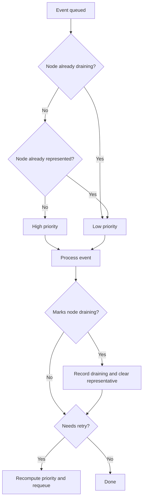

# ADR-041: Node Drainer — Priority Queue

## Context

During a large grouped health-event flood, node-drainer can delay the transition from `quarantined` to `draining`. Later nodes may wait behind a large ready queue before node-drainer processes an event that can mark them `draining`.

The current workqueue is FIFO for ready items. Under grouped event floods, thousands of events for a node whose drain has already started can sit ahead of the first drain-driving event for later nodes. The result is delayed drain start for those later nodes.

## Decision

Add priority scheduling to node-drainer's workqueue so events for nodes that have not reached `draining` are processed before duplicate/retry work for nodes that are already draining.

The immediate mitigation is intentionally simple:

```text
highest priority: work for a node not yet marked draining
lowest priority:  work for a node already marked draining
```

## Scope

This ADR changes only node-drainer scheduling order. It does not change drain action selection, eviction behavior, completed-drain skipping, custom-drain CR behavior, or remediation semantics.

The priority is node-level: events for nodes not yet marked `draining` are more urgent than events for nodes already marked `draining`. This is intentionally narrower than scope-aware coalescing; it optimizes drain start latency without introducing owner/follower event lifecycle state.

## Priority Model

Node-drainer already receives one queue item per event. The priority model changes the order in which ready queue items are processed; it does not change the event lifecycle.

The queue tracks two small in-memory sets:

- nodes that node-drainer has successfully marked `draining`;
- nodes that already have a high-priority representative queued.

```text
if node is not in draining set
   and node does not already have a high-priority representative:
  priority = high
else:
  priority = low
```

The node is added to the in-memory draining set only after node-drainer successfully updates the `dgxc.nvidia.com/nvsentinel-state=draining` label. The set is cleared when node-drainer handles unquarantine/removal of the draining label.

The high-priority representative set prevents a grouped flood from placing thousands of high-priority events for the same not-yet-draining node ahead of later nodes. The first queued event for a node gets the high-priority lane; additional events for that node are lower priority until the representative is processed or the node reaches `draining`.

This keeps the high-priority lane focused on work that can still improve the `Quarantined -> draining` SLO. Once a node is already draining, later duplicate events, completion checks, and retries for that node are less urgent.

## Evaluation Order

The drain evaluator remains the source of truth for what to do with an event. Priority scheduling only decides when a ready queue item should be processed.

```text
enqueue(event):
  if event.node is not marked draining
     and no high-priority representative exists for event.node:
    record event.node as represented
    add to high-priority ready queue
  else:
    add to low-priority ready queue

process(event):
  evaluate built-in/custom drain action as today

  if action marks node draining:
    update node label
    record node in in-memory draining set
    clear high-priority representative for node

  if event must be retried:
    recompute priority from current node draining state
    requeue with rate limiter
```



Priority is intentionally node-state and representation based, not "new event vs retry." In grouped floods, every duplicate event is initially new; prioritizing all new events equally does not help. The useful distinction is whether the event can still help move a node into `draining`, and whether that node already has work waiting in the high-priority lane.

## Evaluated Options

The following variants were tested with a grouped flood of 50,000 events across 50 KWOK nodes.

```text
Event order: grouped by node
Events per node: 1,000
Workload: long-running AllowCompletion pod per node
Checkpoint: about T+25m after generator completion
```

| Variant               | Draining | Quarantined | Queue depth | Result                                            |
|-----------------------|--:-------|--:----------|--:----------|---------------------------------------------------|
| Baseline              | 5/50     | 45/50       | 49,970     | Reproduces delayed drain start                    |
| Priority queue        | 21/50    | 29/50       | 20,172      | Best `Quarantined -> draining` progress           |
| Coalescing            | 16/50    | 30/50       | 31,125      | Reduces duplicate cost, but slower than priority  |
| Priority + coalescing | 15/50    | 35/50       | 13,507      | Lowest queue depth, but worse transition progress |


Priority queue is the chosen mitigation because it directly improves the transition to `draining` without changing drain ownership or health-event lifecycle semantics.

Other alternatives were considered but not selected for this ADR:

### Owner/follower coalescing on health events

Node-drainer could persist `drainRole=owner|follower` and `waitingForEventID` on health-event status so only one event drives each drain scope. This reduced queue depth in testing, but did not improve drain-start progress over node-state priority. It also introduces lifecycle semantics around follower cancellation, owner failure, cold-start recovery, metadata preservation, and scope ownership correctness.

If coalescing is revisited, followers should not repeatedly cycle through the queue while an owner is active. Follower work needs to be parked or otherwise kept out of the owner hot path.

### Persist a separate drain-scope lease

Node-drainer could persist one lease record per `(node, drainScope)` and have duplicate events wait on the lease owner. The lease would live in the health-event datastore, likely in a dedicated collection/table keyed by `(nodeName, scopeType, scopeValue)`, and would store the owning `HealthEvent.Id`, lease status, and timestamps. This centralizes ownership by scope, but adds a new persistent object and lifecycle to manage.

### Use Kubernetes Lease objects

Node-drainer could also represent drain ownership with Kubernetes `Lease` objects keyed by node and drain scope. `Lease` is a valid general coordination primitive, but using it here would move drain ownership into the Kubernetes API while drain status remains in the health-event datastore. That adds another state plane, RBAC and object lifecycle concerns, and cleanup requirements for every drain scope. Keeping ownership in the health-event datastore avoids that split and keeps ownership visible with the events that fault-quarantine, node-drainer, and remediation already use.

### Store ownership on node annotations

Node-drainer could store active drain ownership directly on the Kubernetes `Node`, alongside the existing quarantine annotation. This keeps ownership close to the node being drained, but it makes a highly mutable coordination structure part of the Node object, increases annotation size and update contention, and still leaves health-event status as the place where remediation observes drain progress.

### Move built-in drains to CRs

Another option is to move the existing in-tree built-in drain modes behind CRs, similar to custom drain. Each health event would create or follow a drain request object, and overlap handling would be expressed through CR ownership/status. This would make built-in and custom drain orchestration more uniform, but it has concrete costs: `Immediate`, `DeleteAfterTimeout`, and `AllowCompletion` would need CR status semantics that exactly preserve today's MongoDB/PostgreSQL health-event status transitions; drain progress would now be represented in both the CR status and the health-event status, creating two places that must stay synchronized; node-drainer would need to reconcile CR lifecycle, cleanup, retries, and cold-start recovery in addition to health-event recovery; existing metrics and labels would need to remain compatible; and every deployment would need the CRD/controller path even when no scheduler-specific custom drain is required.

## Observability

The implementation should add metrics and structured logs for:

- queue items assigned by priority level and reason;
- queue depth and requeue counts;

## Consequences

### Positive

- Improves `Quarantined -> draining` progress during grouped event floods.
- Keeps the existing drain execution and health-event lifecycle semantics.
- Avoids introducing owner/follower metadata, follower cancellation semantics, and cold-start ownership recovery.
- Preserves existing completed-drain behavior.

### Negative

- Does not eliminate duplicate events or duplicate health-event records.
- Does not reduce total backlog as much as coalescing can.
- Uses an in-memory node-draining set, so priority state is rebuilt on restart.

### Mitigations

- Keep the priority rule based on observable node state: nodes not yet `draining` first, already-draining nodes later.
- Keep retry semantics unchanged for real errors.
- Use metrics to verify priority queue mode, priority assignment, queue depth, and time-to-draining.
- Revisit coalescing only if duplicate backlog remains a critical problem after priority scheduling.

## References

- [ADR-004: Workload Eviction Strategies](./004-workload-eviction-strategies.md) — built-in node-drainer behavior and namespace-based drain modes.
- [ADR-015: Node Drain Extensibility](./015-custom-drain-extensibility.md) — custom drain behavior, explicitly out of scope for this ADR.
- [ADR-039: Health Event Deduplication](./039-health-event-deduplication.md) — upstream event deduplication; complementary but not sufficient for node-drainer scope coalescing.
