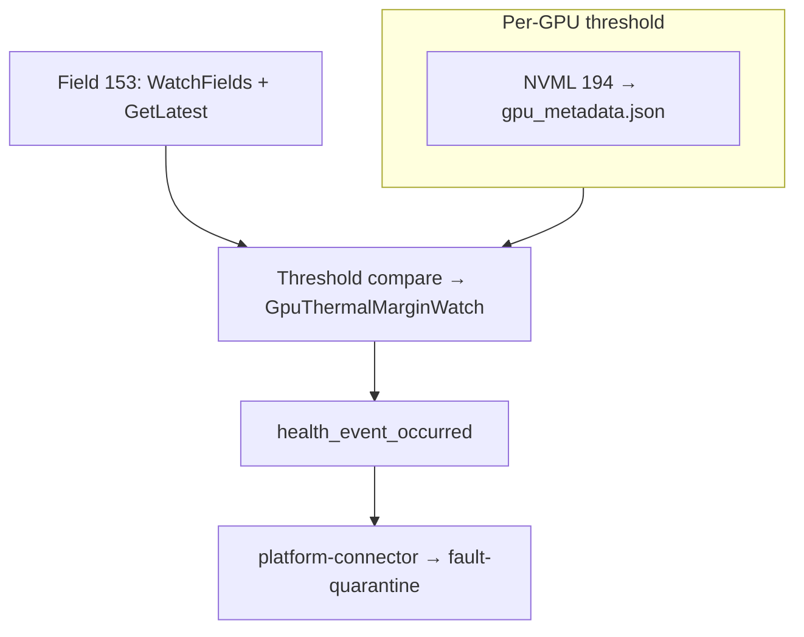

# ADR-042: GPU Health Monitor — GPU Thermal Margin (DCGM Field 153)

## Context

NVSentinel currently uses the DCGM health watch `DCGM_HEALTH_WATCH_THERMAL` to monitor for thermal throttling, which internally monitors the `DCGM_FI_DEV_THERMAL_VIOLATION` counter using the below DCGM logic to decide whether thermal throttling is happening.

- DCGM samples field 241 on a fixed interval.
- On each `health.Check()`, it compares the latest TVIOL sample to the earliest sample in the lookback window.
- If TVIOL increased, DCGM emits a thermal warning for that GPU.

The problem with the above logic is that there is no clarity on how far GPU temperatures crossed the thermal margin, whether the cause is workload or hardware. It does not provide quantifiable data on the severity of the issue.

Hence, as part of this ADR, the idea is to use `DCGM_FI_DEV_GPU_TEMP_LIMIT` as a signed thermal-margin signal to decide whether thermal headroom has crossed the hardware slowdown boundary.

**Goal.** Monitor GPU thermal margin via DCGM field 153 (`DCGM_FI_DEV_GPU_TEMP_LIMIT`), raise an NVSentinel `GpuThermalMarginWatch` when the margin crosses the hardware slowdown line, and clear it when the margin recovers with per-GPU thresholds.

## Definitions

### T.Limit (DCGM field 153)

Per [NVIDIA nvidia-smi temperature documentation](https://docs.nvidia.com/deploy/nvidia-smi/index.html#temperature), **GPU T.Limit Temp** is the thermal margin to maximum operating temperature; **GPU Slowdown / Shutdown T.Limit** are the offsets at which HW protection engages.

| Margin              | Meaning                                                                  |
| ------------------- | ------------------------------------------------------------------------ |
| `> 0`               | Headroom to max-operating / SW optimization (e.g. `23` = 23 °C margin)   |
| `≤ 0`               | At or past max-operating; GPU may optimize clocks for thermal conditions |
| `≤ slowdown_offset` | At or past **Slowdown T.Limit** — HW may clamp clocks                    |
| `≤ shutdown_offset` | At or past **Shutdown T.Limit** — emergency shutdown risk                |

### What is GpuThermalMarginWatch

Under load, the GPU reduces clocks to stay within thermal limits. SW thermal management can cap clocks first; if temperature continues to rise, HW protection engages and first slows down the GPU. If that still cannot control the temperature, HW shutdown is triggered to protect the GPU.

This ADR targets how NVSentinel should react when a GPU's signed thermal margin (**T.Limit**, field 153) crosses the GPU **hardware slowdown** line. Warm GPUs under load may throttle without crossing that margin; conversely, margin at or below the HW offset is the actionable boundary.

### Problem

**1. The HW slowdown offset differs by GPU SKU and is not exposed as a DCGM field.**

`GpuThermalMarginWatch` needs to compare the live T.Limit margin against the GPU's HW slowdown offset. That offset is not the same for every SKU, so hardcoding one value (for example, `−2 °C`) would be wrong:

| GPU SKU                       | T.Limit model | Slowdown offset      |
| ----------------------------- | ------------- | -------------------- |
| H100, GB200, GB300, L40, L40S | relative      | **−2**               |
| B200                          | relative      | **−3**               |
| A100                          | absolute      | **N/A** (no T.Limit) |

DCGM field 153 (`DCGM_FI_DEV_GPU_TEMP_LIMIT`) gives the live signed margin, but DCGM does not expose the per-SKU slowdown offset constant needed for the comparison.

**Solution:** read the slowdown offset once per GPU in `metadata-collector` using NVML field 194 (`NVML_FI_DEV_TEMPERATURE_SLOWDOWN_TLIMIT`) and publish it in `gpu_metadata.json`. `gpu-health-monitor` then reads that metadata during its normal poll loop and skips GPUs where the offset is unsupported or missing.

## Decision

Add an **in-monitor field watch** on field 153 in `DCGMWatcher`, compare each poll against the **per-GPU HW slowdown** threshold, and emit a health event **`GpuThermalMarginWatch`** through the existing health-event pipeline.

- **Fatal** when margin `<` slowdown offset (e.g. `−3` on H100 with threshold `−2`).
- **Clear** when margin is at or above the slowdown offset.

Note that `DCGM_HEALTH_WATCH_THERMAL` / `GpuThermalWatch` remains unchanged and complementary to this GpuThermalMarginWatch.

## Implementation



Runtime watches field 153 in `DCGMWatcher`; thresholds come from `gpu_metadata.json`.

### Threshold source: NVML via `metadata-collector`

`gpu-health-monitor` has DCGM only (no NVML). `metadata-collector` already `nvml.Init()`s and writes `gpu_metadata.json`. `go-nvml v0.13.0-1` provides `Device.GetFieldValues` and constant 194.

1. **`metadata-collector/pkg/nvml/wrapper.go`** — in `GetGPUInfo`, query field 194 with `Device.GetFieldValues`, require `NvmlReturn == SUCCESS`, require `VALUE_TYPE_SIGNED_INT`, decode the signed little-endian int, and set pointer nil when unsupported (A100, old drivers).
2. **`data-models/pkg/model` `GPUInfo`** — add `SlowdownTLimitC *int` (`omitempty`; absent ≠ zero — `0` is a valid margin).
3. **`gpu-health-monitor/metadata/reader.py`** — `get_slowdown_tlimit_c`; `None` means the GPU is not eligible for `GpuThermalMarginWatch` on that poll. The reader lazy-loads metadata, and missing thresholds are observable via `gpu_temp_limit_slowdown_threshold_missing_total`.
4. **`DCGMWatcher` poll loop** — on each `PollIntervalSeconds` cycle: `health.Check()`, then field-153 read/evaluate, then one `health_event_occurred` for all emitted watches. `GpuThermalMarginWatch` is merged only when at least one GPU has both threshold metadata and a non-blank field-153 sample. Its `HealthDetails.entity_ids` scopes healthy/unhealthy events to evaluated GPUs only. GPUs with missing threshold or blank field 153 are skipped for comparison. `platform_connector` deduplicates via `entity_cache`. If `GetLatest` fails, skip the watch for that cycle and increment the metric.

### Field watch and evaluator (`DCGMWatcher`)

When enabled, after `DCGM_HEALTH_WATCH_ALL`:

- Register field 153 on the same DCGM group; `WatchFields` at poll interval.
- Each poll cycle: `health.Check()` → read field 153 via `GetLatest` → threshold compare → merge `GpuThermalMarginWatch` for evaluated GPUs → one `health_event_occurred` call.

```text
Threshold metadata absent → emit nothing (GPU not watched)
Field 153 N/A / blank → skip evaluation for that GPU
margin < slowdown_threshold → FAIL (GPU_TEMP_HW_SLOWDOWN_VIOLATION, fatal/non-fatal decide via dcgmerrorsmapping.csv)
margin ≥ slowdown_threshold → PASS for that evaluated GPU (healthy / clear event)
```

**`platform_connector.py`** — guard in `_convert_dcgm_watch_name_to_check_name` so synthetic keys resolve to `GpuThermalMarginWatch`, and respect `HealthDetails.entity_ids` so skipped GPUs are not cleared as healthy.

**`dcgmerrorsmapping.csv` (mandatory):**

```csv
GPU_TEMP_HW_SLOWDOWN_VIOLATION,CONTACT_SUPPORT
```

**Metrics:** `gpu-health-monitor` only exports gap signals for this watch: `gpu_temp_limit_margin_blank_total` when DCGM field 153 is missing/blank and `gpu_temp_limit_slowdown_threshold_missing_total` when the NVML-derived slowdown offset is missing from metadata. `GetLatest` failures reuse the existing `dcgm_api_failures{error_name="dcgm_field_153_get_latest"}` counter.

### Behavior

| Transition                    | Event                                    | Fatal     |
| ----------------------------- | ---------------------------------------- | --------- |
| Margin `<` slowdown           | `GpuThermalMarginWatch` unhealthy (FAIL) | Yes (CSV) |
| Sustained violation           | None (dedup)                             | -         |
| Recovers to margin ≥ slowdown | healthy clear for the evaluated GPU      | -         |
| Threshold metadata absent     | None (GPU not watched on that poll)      | -         |
| Field 153 N/A                 | None (GPU not watched on that poll)      | -         |

### Key files

| File                                                          | Change                                                                       |
| ------------------------------------------------------------- | ---------------------------------------------------------------------------- |
| `gpu-health-monitor/dcgm_watcher/dcgm.py`                     | Field watch, threshold compare, `thermal_margin_enabled`                     |
| `gpu-health-monitor/dcgm_watcher/types.py`                    | `HealthDetails` dataclass                                                    |
| `gpu-health-monitor/dcgm_watcher/metrics.py`                  | Missing field/threshold counters                                             |
| `gpu-health-monitor/platform_connector/platform_connector.py` | Converts `DCGM_HEALTH_WATCH_THERMAL_MARGIN` to `GpuThermalMarginWatch`       |
| `gpu-health-monitor/cli.py`                                   | Pass `thermal_margin_enabled` and `metadata_reader`                          |
| `charts/gpu-health-monitor/templates/configmap.yaml`          | `[dcgmfieldsmonitoring]` section with `gputemplimitmonitoringenabled = true` |
| `charts/gpu-health-monitor/files/dcgmerrorsmapping.csv`       | `CONTACT_SUPPORT` row (fatal)                                                |
| `metadata-collector/pkg/nvml/wrapper.go`                      | NVML field reads                                                             |
| `data-models/pkg/model`                                       | Optional offset fields                                                       |
| `gpu-health-monitor/metadata/reader.py`                       | Accessors                                                                    |

## Rationale

- **Margin-based detection** matches how NVIDIA documents T.Limit and HW slowdown offsets; TVIOL-based `GpuThermalWatch` cannot tier severity or clear on margin recovery.
- Reuses `health_event_occurred` notify/clear/dedup instead of a new callback path.
- Severity is CSV-driven; threshold compare is a simple integer `<` test on each poll.
- Most new logic is confined to `dcgm.py` and the existing health-event path.

## Consequences

### Positive

- Proactive fatal event on HW-slowdown margin with per-device-correct thresholds.
- Complements `GpuThermalWatch`: margin crossed vs throttle time accumulated.
- Missing-data counters make unsupported or incomplete field/threshold data observable.
- Additive; existing DCGM health watches unchanged.

### Mitigations

- NVML offset probe is the capability gate (one path for A100 and old drivers).
- Field-watch rate tied to `PollIntervalSeconds`; cached `GetLatest`.
- Gap signals: `gpu_temp_limit_margin_blank_total`, `gpu_temp_limit_slowdown_threshold_missing_total`, and `dcgm_api_failures{error_name="dcgm_field_153_get_latest"}`.

## References

- [ADR-001: Health Event Detection Interface](./001-health-event-detection-interface.md) — `HealthEvent` path for this check.
- [NVIDIA nvidia-smi — Temperature](https://docs.nvidia.com/deploy/nvidia-smi/index.html#temperature) — T.Limit and slowdown/shutdown offset definitions.
- [NVIDIA nvidia-smi — Clocks event reasons](https://docs.nvidia.com/deploy/nvidia-smi/index.html#clocks-event-reasons) — SW/HW thermal slowdown context.
- [github.com/NVIDIA/go-nvml](https://github.com/NVIDIA/go-nvml) — `FI_DEV_TEMPERATURE_*_TLIMIT`, `Device.GetFieldValues`.
