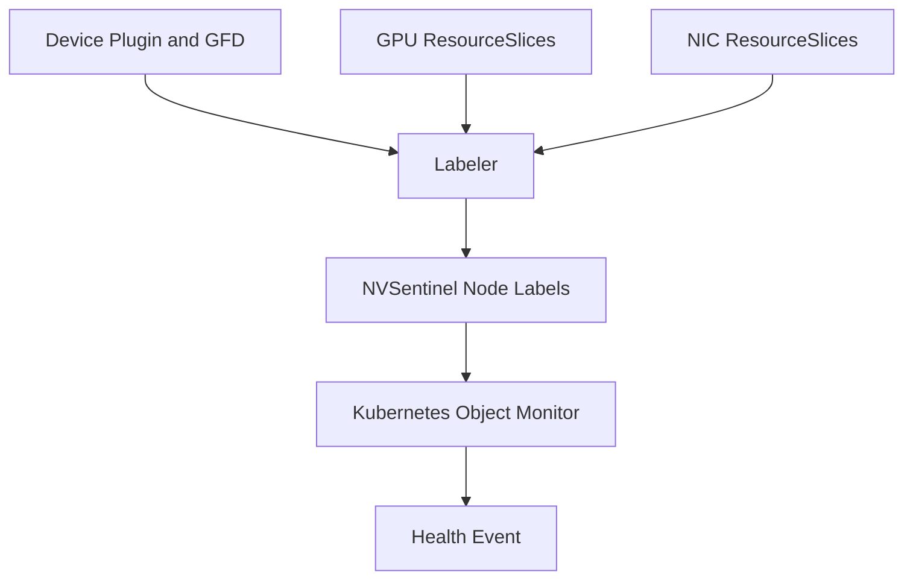

# ADR-043: Labeler - Expected Device Count Labels

## Context

NVSentinel needs a way to detect missing GPUs and NICs even when the kernel or driver does not emit a useful XID, SXID, or fallen-off-bus syslog line. A common failure mode is that a node reports fewer devices than its platform is expected to have; if no error log is produced, Kubernetes Object Monitor needs a normalized Kubernetes signal to consume.

Today the expected device count is implicit. Operators may know that a class of nodes should have eight GPUs or eight NICs, but NVSentinel does not persist that expectation in a normalized form that Kubernetes Object Monitor policies can consume.

This ADR defines that normalized device-count contract.

## Decision

Extend `labeler` to normalize device counts into NVSentinel-owned node labels that express both current and expected device counts. Kubernetes Object Monitor can then compare these labels and emit health events when the current count is lower than the expected count.

The labels are derived from the best available source for the deployment mode:

- device-plugin/GFD labels for legacy GPU deployments;
- DRA `ResourceSlice` device counts for GPU and NIC DRA deployments.

`labeler` owns the derived labels. Kubernetes Object Monitor consumes them.

## Device Count Class Contract

`labeler` is configured with device count classes. Each class declares:

- whether the class is enabled;
- the NVSentinel-owned labels to write;
- the grouping labels that define the hardware class;
- optional expected-count overrides;
- a CEL expression that returns the current count for the node.

The CEL environment is intentionally small and read-only. `labeler` builds the input context and the expression only counts from that context:

- `node`: the Kubernetes `Node` object being reconciled;
- `resourceSlices`: all raw `ResourceSlice` objects associated with that node.

Device count expressions can use either legacy node labels or DRA `ResourceSlice` data:

- for device-plugin deployments, the expression can read GPU Feature Discovery labels such as `node.metadata.labels['nvidia.com/gpu.count']`;
- for DRA deployments, the expression can count matching `ResourceSlice.spec.devices[]` entries from `resourceSlices`;
- DRA device semantics are driver-specific, so the expression is responsible for matching the right driver and device attributes for that class.

The expression must return an integer. If it errors or returns a non-integer, `labeler` skips the current-count update for that class and records the evaluation failure. The first implementation will support standard CEL list macros such as `filter`, `map`, and `size`, and will register a `sum(list<int>) -> int` helper so DRA counts can be expressed across multiple `ResourceSlice` objects.

Example shape:

```yaml
labeler:
  expectedDeviceCounts:
    enabled: true
    classes:
      - name: gpu
        enabled: true
        labels:
          current: nvsentinel.dgxc.nvidia.com/gpu.count.current
          expected: nvsentinel.dgxc.nvidia.com/gpu.count.expected
        groupingLabels:
          - node.kubernetes.io/instance-type
          - karpenter.sh/nodepool
          - nvidia.com/gpu.product
          - nvidia.com/gpu.sharing-strategy
        expectedCountOverrides:
          - matchLabels:
              nvidia.com/gpu.product: NVIDIA-GB200
            count: 8
        currentExpression: |
          int(node.metadata.labels['nvidia.com/gpu.count'])
      - name: nic
        enabled: true
        labels:
          current: nvsentinel.dgxc.nvidia.com/nic.count.current
          expected: nvsentinel.dgxc.nvidia.com/nic.count.expected
        groupingLabels:
          - node.kubernetes.io/instance-type
          - karpenter.sh/nodepool
        currentExpression: |
          sum(resourceSlices
            .filter(rs,
              has(rs.spec.driver) &&
              rs.spec.driver == 'dra.networking.k8s.aws' &&
              has(rs.spec.devices)
            )
            .map(rs, rs.spec.devices
              .filter(d,
                has(d.attributes) &&
                'dra.vpc.amazonaws.com/deviceType' in d.attributes &&
                has(d.attributes['dra.vpc.amazonaws.com/deviceType'].string) &&
                d.attributes['dra.vpc.amazonaws.com/deviceType'].string == 'roce'
              )
              .size()
            ))
```

Initial labels are current/expected pairs:

```text
nvsentinel.dgxc.nvidia.com/gpu.count.current
nvsentinel.dgxc.nvidia.com/gpu.count.expected
nvsentinel.dgxc.nvidia.com/nic.count.current
nvsentinel.dgxc.nvidia.com/nic.count.expected
```

- `current` is the count visible in the selected count source.
- `expected` is either an operator-provided override for the matching hardware class or the learned baseline for that class.
- Learned `expected` may rise automatically when a higher count is observed in the same class, but it must not fall automatically when `current` drops.
- Disabled classes are not compiled, evaluated, or written to node labels. This allows expensive or environment-specific CEL expressions to be contained without disabling the entire expected-count feature.

`labeler` only writes device count labels when the computed values are valid non-negative integers. Kubernetes Object Monitor policies can therefore compare the label values directly after checking that the labels exist.

The CEL environment will not provide arbitrary Kubernetes lookup/list functions. `labeler` controls the available device count context so expressions remain deterministic, cheap to evaluate, and easy to reason about.

## Expected Count And Grouping

Expected counts can be provided by operator overrides or learned per device count class and hardware-class partition. Operator overrides take precedence. If no override matches a node, the configured `groupingLabels` form the partition key. Nodes with the same values for that key are compared with each other, and nodes with different values are evaluated independently:

```text
partition = (device count class, grouping label values)
expected = max(current count for nodes in the same partition)
```

This supports heterogeneous clusters by preventing unrelated hardware from influencing each other's expected counts. For GPU counts, grouping labels can include values such as `nvidia.com/gpu.product`, `nvidia.com/gpu.sharing-strategy`, instance type, and nodepool. For NIC counts, grouping labels can include instance type and nodepool, while the class expression itself selects the DRA driver and device type.

For example, AWS RoCE DRA advertises RoCE interfaces as devices:

```yaml
spec:
  driver: dra.networking.k8s.aws
  nodeName: worker-1.example.internal
  devices:
  - name: rocep172s0
    attributes:
      dra.vpc.amazonaws.com/deviceType:
        string: roce
      dra.vpc.amazonaws.com/networkDevName:
        string: ens164
```

`expected` may decrease only through an explicit relearn path, such as:

- an admin removing the expected-count label from a node or hardware class;
- an explicit labeler command or configuration flag to relearn a class;
- a future configuration object that declares expected counts per class.

Cold start behavior should be conservative. If no expected label exists and only one node exists in a class, `labeler` may initialize expected from current, but that provides no protection against a device that was already missing before NVSentinel started. The ADR accepts this limitation for auto-learned baselines and leaves admin-provided expected counts as a future hardening path.

## Consumer Policy

Kubernetes Object Monitor consumes the normalized labels with a Node policy. The policy detects when the current count is lower than the expected count and asks fault-remediation to restart the VM.

```yaml
kubernetes-object-monitor:
  policies:
    - name: LessThanTotalGPUsRestart
      enabled: true
      resource:
        group: ""
        version: v1
        kind: Node
      predicate:
        expression: |
          'nvsentinel.dgxc.nvidia.com/gpu.count.current' in resource.metadata.labels &&
          'nvsentinel.dgxc.nvidia.com/gpu.count.expected' in resource.metadata.labels &&
          int(resource.metadata.labels['nvsentinel.dgxc.nvidia.com/gpu.count.current']) <
          int(resource.metadata.labels['nvsentinel.dgxc.nvidia.com/gpu.count.expected'])
      healthEvent:
        componentClass: Node
        isFatal: true
        message: "GPU count is below expected count"
        recommendedAction: RESTART_VM
        errorCode:
          - LESS_THAN_TOTAL_GPUS_RESTART
```

The same pattern applies to other device count classes by changing the label keys, policy names, messages, and error codes.



## Implementation

### CEL Evaluation

`labeler` compiles each device count class `currentExpression` at startup. The environment includes the `node` and `resourceSlices` variables described above, plus one non-standard helper:

```text
sum(list<int>) -> int
```

`sum` returns the total of the integer values in the list and returns `0` for an empty list. It exists so expressions can count devices across multiple `ResourceSlice` objects without adding broader Kubernetes query helpers.

Tests for this evaluator should cover multiple `ResourceSlice` objects for one node, slices without `spec.devices`, devices without the selected attribute, and selected attributes without a `string` value.

### RBAC

The labeler ClusterRole currently grants access to pods and nodes. DRA support requires read access to `ResourceSlice` objects:

```yaml
- apiGroups:
    - resource.k8s.io
  resources:
    - resourceslices
  verbs:
    - get
    - list
    - watch
```

Node patch/update permissions remain necessary for writing labels.

### Observability

Add metrics and structured logs for:

- current device count by node and device kind;
- expected device count by hardware class and device kind;
- label update success and failure counts;
- skipped updates due to missing labels, malformed source data, or CEL evaluation errors.

## Rationale

- `labeler` is already the component that watches node metadata and writes derived node labels.
- Normalizing device counts into labels keeps Kubernetes Object Monitor simple. It can evaluate one Node object instead of listing and aggregating all `ResourceSlice` objects for a node.
- Current and expected counts make the failure condition explicit and easy to audit from the Node object.

## Consequences

### Positive

- Enables missing-device detection without requiring XID, SXID, or syslog evidence.
- Supports both legacy device-plugin and DRA deployments through one label contract.
- Lets Kubernetes Object Monitor express missing-device-count detection as a small CEL policy.

### Negative

- Adds cross-node aggregation behavior to `labeler`.
- Requires new RBAC to watch `ResourceSlice` objects.
- Auto-learned expected counts are heuristic and depend on at least one healthy peer in the same hardware class.

### Mitigations

- Do not set current count to `0` when the count source is missing.
- Add metrics and logs for skipped device count updates.
- Document admin relearn procedures before enabling fatal remediation from these labels by default.

## Alternatives Considered

### Compute Counts Directly in Kubernetes Object Monitor

**Rejected** because Kubernetes Object Monitor evaluates one object at a time and does not list or aggregate all `ResourceSlice` objects for a node. Adding list and reduce helpers to CEL would make it a cross-object aggregation engine and would complicate policy evaluation, caching, RBAC, and performance.

### Use `nvidia.com/gpu.count` Everywhere

**Rejected** because `nvidia.com/gpu.count` is not guaranteed in DRA deployments. It is also affected by MIG and sharing configuration, so it is not a universal representation of physical GPU count.

### Require Admin-Provided Expected Counts Only

**Rejected** as the only mechanism because it increases setup burden and makes the feature harder to adopt. Admin-provided expected counts remain a useful future enhancement for fleets where auto-learning is not strong enough.

## Notes

- The first implementation should treat `nic.count.*` as the count selected by the configured NIC class expression.
- Fatal remediation should be enabled carefully. Operators may want STORE_ONLY behavior until expected-count learning has been validated in their fleet.

## References

- [Kubernetes Object Monitor](../kubernetes-object-monitor.md)
- [ADR-011: Kubernetes Object Monitor](./011-kubernetes-object-monitor.md)
