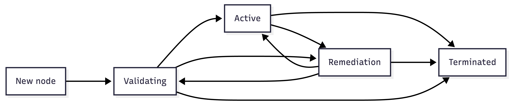

# ADR-045: Node Validation

## Context

If a cluster has deployed GPU Operator and NVSentinel, there is no mechanism to ensure that new GPU nodes or existing nodes which underwent remediation are validated prior to being marked as schedulable. New nodes are able to accept GPU workloads after the nvidia-device-plugin advertises GPU capacity on a given node. Additionally, existing nodes which were remediated by NVSentinel are able to accept GPU workloads after the fault-quarantine module unquarantines them. In either case, there is no ability for an operator to declare that a set of GPU performance tests must succeed prior to a node being returned to service.

Note that NVSentinel remediation actions do not include any verification that the remediation action performed successfully resolved the underlying GPU fault (outside of the same fault re-occurring and being re-emitted by the corresponding health monitor). Similarly, new nodes joining a cluster could represent either new hardware being deployed or existing hardware being re-provisioned. In either case, this hardware should be validated, especially if the underlying hardware previously belonged to a node that was terminated and returned for repair to the given provider.

A verification test in both contexts ensures that a given node meets its minimum performance requirements and reduces the probability that a customer workload will encounter a fatal error. A scheduling gate on completing a verification test gives an opportunity for NVSentinel to increase the scope of its health checking by performing:

* **GPU performance tests:** such as NCCL or Nemotron tests, which require exclusive GPU access
* **Disruptive health checks:** such as DCGM diagnostics
* **Inducing faults:** a performance or active health check may induce a fault that would otherwise only surface when a real customer workload runs

## Decision

We will introduce a validation-controller whose purpose is to reconcile validation requests for nodes. Clients can interact with a validation API and request that a set of nodes and corresponding GPUs be validated by the validation-controller. The 2 use-cases we are targeting include:

1. Validating new nodes
2. Validating existing nodes post-remediation

The validation-controller will orchestrate running validation across different clients, nodes, GPUs, and tests through a set of supported test providers. Test providers will create a Kubernetes resource that must be reconciled by a separate controller to execute the test. For example, we will start with supporting a K8s job provider which can validate a subset or all GPUs on a single node along with an NCCL provider which can validate GPUs across multiple nodes. As a result, it will be the responsibility of the validation-controller to map a set of validation requests across different nodes, GPUs, and tests to a set of provider requests.

**Why do we need a validation-controller?**

An alternative solution that avoids the need for a validation-controller would be for all clients requesting validation to directly interface with the supported test providers. This approach is not desirable because the validation-controller comes with the following benefits:

* **Support for validation sessions:** a quarantine session in NVSentinel is made up of a group of faults, all of which must be remediated prior to the node being unquarantined. A similar capability is provided with the validation-controller, where all validation requests against a given node must be satisfied prior to the node being uncordoned.
    * For example, if a new node requires validation and experiences a fault that results in NVSentinel also requesting validation, both sets of validation tests must succeed prior to the node being uncordoned.
* **Common validation interface:** a shared interface for requesting validation prevents all clients from needing to maintain logic to work with the different test providers, including our supported K8s job and NCCL test providers. A client who wants to validate a group of nodes or GPUs only needs to know the test name, and we will maintain a common entrypoint in the validation-controller.
* **Batching multiple nodes into a single validation request:** a validation request will allow targeting a single node or a group of nodes (along with a single GPU or all GPUs on a single node). If a test provider only supports targeting a single node, such as the K8s job provider, the validation-controller will handle creating a validation job per node without requiring the requesting client to create and track the execution of each job. Clients will only need to monitor the overall status for their validation request.

## Validation API and Configuration

In order to run validation tests against GPU nodes, a cluster operator will need the ability to define a set of supported validation tests. Additionally, a client requesting that a GPU node undergo validation will need to provide the following inputs:

```
nodes:
  - name: gpu-node-01
    gpuUUIDs:
      - GPU-abc123
    exclusiveAccess: true
  - name: gpu-node-02
    gpuUUIDs:
      - GPU-def456
    exclusiveAccess: false
  - name: gpu-node-03
    gpuUUIDs: []
    exclusiveAccess: true
tests:
  - dcgm-level4
  - nccl-loopback
```

**Validation API overview:**

* **nodes / gpuUUIDs:** the client will need to provide the impacted nodes along with the list of impacted GPUs per node as API input. If no GPUs are provided, we will assume that all GPUs on the given node need to be validated.
* **tests:** the client will need to pass the set of tests which should be executed against the given entities. While the ValidationConfiguration will support a set of default tests, clients will need the ability to specify which tests should be run depending on whether a new node is being validated or a specific fault was encountered.
    * All entities provided in the validation request will be targeted by the same set of tests. If a client would like to request a different set of tests depending on the impacted entities, they will need to create multiple validation requests.
* **exclusiveAccess:** a boolean which indicates whether the node is fully drained. If true, the node is idle and any GPU may be validated. If false, workloads may still be running on GPUs not included in the list of impacted entities, so we require at least 1 GPU to be provided in the list of impacted entities.
    * For example, if NVSentinel encountered an XID which required a GPU reset, only the impacted GPU will be eligible for validation due to the partial node drain executed before the reset. Conversely, if the XID required a node reboot, the node would be eligible for validation against all its GPUs due to the full node drain before the reboot.
    * This highlights that node draining is not the responsibility of the validation-controller, and validation clients must execute node drains prior to creating requests and notifying the controller if the node is partially or fully drained.

The section below on "Triggering Validation" covers how clients will interact with this API and whether this input is passed as a CRD, an NVSentinel HealthEvent, or as part of the node object.

The provided list of tests in the validation request must map to a supported test in the ValidationConfiguration. Upon receiving a validation request, the validation-controller will reference the active ValidationConfiguration:

```
apiVersion: nvsentinel.nvidia.com/v1alpha1
kind: ValidationConfiguration
metadata:
  name: default
spec:
  newNodeValidation:
    condition: NewNodeValidated
    criteria:
    - name: recently-joined
      expression: 'now() - timestamp(node.metadata.creationTimestamp) < duration("15m")'
    - name: gpu-present
      expression: '"nvidia.com/gpu.present" in node.metadata.labels'
    newNodeTests:
    - nccl-all-reduce
    batchPeriod: 5m
  schedulingGate:
    cordon:
      remove: true
    taints:
    - key: nvsentinel.nvidia.com/validation-pending
      value: "true"
      effect: NoSchedule
      remove: true
  readinessCriteria:
  - name: gpu-allocatable
    expression: 'node.status.allocatable["nvidia.com/gpu"] > 0'
  - name: device-plugin-ready
    expression: >
      pods.exists(p,
        p.metadata.labels["app"] == "nvidia-device-plugin-daemonset" &&
        p.status.conditions.exists(c, c.type == "Ready" && c.status == "True"))
  - name: not-under-quarantine
    expression: '!("nvsentinel.nvidia.com/quarantineHealthEvent" in node.metadata.annotations)'
  defaultTests:
  - dcgm-level4
  - nccl-loopback
  templateMountPath: /etc/nvsentinel/templates
  providers:
    nccl-provider:
      apiGroup: validation.nvidia.com
      version: v1alpha1
      supportsTestBatching: true
      retries: 2
      timeout: 30m
      successfulCondition:
        type: Succeeded
        status: "True"
      failedCondition:
        type: Failed
        status: "True"
      templateFile: nccl-test-template.yaml
    k8s-job-provider:
      apiGroup: batch
      version: v1
      supportsTestBatching: false
      retries: 5
      timeout: 30m
      successfulCondition:
        type: Complete
        status: "True"
      failedCondition:
        type: Failed
        status: "True"
      templateFile: k8s-job-template.yaml
  maxConcurrentGroups: 3
  tests:
    dcgm-level4:
      provider: nccl-provider
      exclusiveNodeAccess: false
      supportsBatchingGPUsPerNode: true
      minimumGPUsPerNodePerBatch: 1
      supportsBatchingNodes: true
      minimumNodesPerBatch: 1
      batchFailurePolicy: fail
    nccl-loopback:
      provider: nccl-provider
      exclusiveNodeAccess: false
      supportsBatchingGPUsPerNode: true
      minimumGPUsPerNodePerBatch: 2
      supportsBatchingNodes: true
      minimumNodesPerBatch: 1
      batchFailurePolicy: fail
      bandwidthGBps: 400
    nccl-all-reduce:
      provider: nccl-provider
      exclusiveNodeAccess: false
      supportsBatchingGPUsPerNode: true
      minimumGPUsPerNodePerBatch: 1
      supportsBatchingNodes: true
      minimumNodesPerBatch: 2
      batchFailurePolicy: fail
      bandwidthGBps: 350
    nemotron4-15b:
      provider: nccl-provider
      exclusiveNodeAccess: true
      supportsBatchingGPUsPerNode: true
      minimumGPUsPerNodePerBatch: 1
      supportsBatchingNodes: true
      minimumNodesPerBatch: 18
      batchFailurePolicy: ignore
      goodputRatio: 0.9
    cuda-smoke-test:
      provider: k8s-job-provider
      image: nvcr.io/nvidia/cuda-smoke-test:latest
      command: ["./run-test.sh"]
      exclusiveNodeAccess: false
      supportsBatchingGPUsPerNode: true
      minimumGPUsPerNodePerBatch: 1
      supportsBatchingNodes: false
      minimumNodesPerBatch: 1
      batchFailurePolicy: fail
```

**Validation configuration overview:**

* **newNodeValidation:** groups the configuration for detecting and testing new nodes.
    * **condition:** the name of the node condition the controller uses to track whether a node has already been validated. For a node to be targeted, the controller requires that this condition is absent or false and the operator-provided CEL expression evaluates to true. Once a ValidationRequest is created, the controller sets this condition to True on the node so that subsequent evaluations no longer match.
    * **criteria:** a set of CEL expressions evaluated against each node to determine whether it requires new node validation. All expressions must evaluate to true (along with the condition check above). The CEL environment exposes both the node being validated and the pods scheduled on it.
        * In the provided example, a node is eligible for new node validation when it was created within the last 15 minutes (to prevent triggering against existing nodes on the initial deployment of the validation-controller) and has the nvidia.com/gpu.present label.
    * **newNodeTests:** the list of tests to run for new nodes. These take precedence over defaultTests when a ValidationRequest is created for a new node.
    * **batchPeriod:** the window during which the controller collects eligible new nodes before creating ValidationRequests for them as a batch. This only applies to new node validation.
* **schedulingGate:** groups the scheduling gate controls the validation-controller manages during the lifecycle of a validation request.
    * **cordon.remove:** indicates whether nodes should be uncordoned after completing validation. A node will only be uncordoned once there are no pending, in-progress, or failed validation requests (a node may be targeted by multiple validation requests).
        * This behavior is similar to the fault-quarantine module, where a given quarantine session requires all unhealthy events to recover prior to removing the cordon for a node.
    * **taints:** the list of taints the controller removes from nodes when validation completes. Each taint specifies a key, an optional value, and an effect. The controller does not apply these taints. They are expected to be applied externally prior to the ValidationRequest being created.
    * **tolerations:** all test pods created by the validation-controller will automatically tolerate the unschedulable taint and every taint listed in taints, regardless of whether those taints are present on the node. This ensures test pods can always be scheduled on nodes that are gated from regular workloads.
* **readinessCriteria:** a set of CEL expressions which must all evaluate to true before a validation test can be started on a given node. This is primarily needed for new nodes undergoing validation to ensure that all GPU Operator and NVSentinel operands are ready on the given node.
    * Each entry is a CEL expression evaluated against an environment containing the node being validated and the pods scheduled on it.
    * In the provided example, we require the targeted node to report allocatable GPUs and the nvidia-device-plugin pod to be ready prior to running the requested test.
    * If an operator is externally applying a node cordon or taint and would like to block validation until these are applied, they could add these properties to the readinessCriteria.
    * The readinessCriteria not being met will result in both blocking nodes from starting validation and causing validation to fail if the criteria were initially met and then reverted.
* **defaultTests:** the default set of tests which will be run against validation requests which do not include any tests. This option will be useful if the same set of tests will be run for validating existing nodes, and if the operator does not want to make validation clients aware of test names.
* **providers:** includes test provider settings that apply to all tests using this provider.
    * **supportsTestBatching:** indicates which test providers support batching their tests into a single test provider request. In the example above, the nccl-provider supports batching, which allows all tests using that provider (dcgm-level4, nccl-loopback, nccl-all-reduce, and nemotron4-15b) to be included in a single CRD. Conversely, the k8s-job-provider does not support batching, so the cuda-smoke-test will not be batched with any other tests using that provider.
    * **retries:** the number of retries we will allow for all tests referencing this test provider. Note that this setting is at the test provider level and not at the individual test level because if a test provider supports batching, all tests may need to be retried together. Alternatively, we could require that test providers implement their own retry behavior by passing this setting through the test provider template.
    * **successfulCondition:** specifies the condition the validation-controller polls to determine whether an attempt was successful. The controller treats the attempt as successful when the condition with the given type has the specified status.
    * **failedCondition:** specifies the condition the validation-controller polls to determine whether an attempt has failed. The controller treats the attempt as failed when the condition with the given type has the specified status.
    * **timeout:** the maximum duration allowed for a single test group attempt using this provider before it is marked as failed. If the provider itself enforces a timeout (for example, K8s Jobs support activeDeadlineSeconds), this value is also passed to the provider resource via the template.
    * **templateFile:** the filename of a Go text/template, resolved relative to templateMountPath, rendered by the controller to construct the test provider CRD for each test group. The template has access to the test provider settings in the ValidationConfiguration, the ValidationRequest API input, and execution-specific metadata generated by the controller.
* **templateMountPath:** the directory from which templateFile paths are resolved.
* **maxConcurrentGroups:** the maximum number of test groups that may run concurrently. Groups are additionally constrained by node overlap. Two groups that share a node will never run at the same time regardless of this setting.
* **maximumNodesPerGroup:** this setting is initially out-of-scope and is not included in the example above. There is currently no way to limit the number of nodes per test group if the given test sets supportsBatchingNodes to true. It may be desirable to limit the number of nodes running per test group by adding logic to the validation-controller to not exceed this number of nodes per batch or by deferring to the test provider and passing this value to it. If this is implemented in the validation-controller, we will need to ensure that the minimumGPUsPerNodePerBatch is met per group which may require borrowing nodes between groups. For example, if maximumNodesPerGroup is enforced by the validation-controller we might need to create multiple nccl-provider CRDs. Alternatively, if maximumNodesPerGroup is enforced by the provider itself, we would only need to make sure this value is passed via the provider template.
* **tests:** the set of supported tests that can be requested by clients in validation requests. The test name is the only piece of the ValidationConfiguration that clients must be aware of when interacting with the validation API.

**Test configuration:**

* **provider:** indicates which test provider uses the given test. In our example, we support a nccl-provider which is used for the dcgm-level4, nccl-loopback, nccl-all-reduce, and nemotron4-15b tests, and a k8s-job-provider which is used for the cuda-smoke-test.
* **image:** the container image to use for a given test. In the provided example, this is required for tests using the k8s-job-provider. An operator could choose to hard-code this setting into their provider template.
* **command:** the command to run in the container for a given test. In the provided example, this is required for tests using the k8s-job-provider. An operator could choose to hard-code this setting into their provider template.
* **exclusiveNodeAccess:** indicates whether this test requires exclusive access to the node.
    * If false, the client must pass at least 1 GPU as part of the validation request which will be used as test input. Even if the validation request sets exclusiveAccess to true, it will still be required to include explicit GPUs in its request. It is the responsibility of the test provider to ensure that only the passed GPUs are validated. For example, a test provider could ensure that any test container requiring GPU access only has the specified GPUs injected, or it could choose to inject all GPUs and only validate the explicitly provided list (even if all GPUs are visible).
    * If true, the test will require access to all GPUs, meaning it does not require specific GPUs to be included in the validation input. If this setting is true, the validation request must also set exclusiveAccess to true (meaning the node is fully drained).
* **supportsBatchingGPUsPerNode:** indicates whether this test supports testing multiple GPUs on a given node in a single test. For example, the k8s-job-provider could choose to either test GPU1 and GPU2 as part of the same underlying job or create 1 job per GPU.
    * Note that if exclusiveNodeAccess is true, this also has to be true since we allow validation requests to pass an empty list of GPUs indicating all GPUs will be tested implicitly. However, if exclusiveNodeAccess is false, this setting could be true or false.
* **minimumGPUsPerNodePerBatch:** if supportsBatchingGPUsPerNode is true, this setting indicates the minimum number of GPUs that must be provided to the test.
    * As an example, dcgm-level4 supports 1 GPU per batch whereas nccl-loopback requires 2 GPUs per batch.
* **supportsBatchingNodes:** indicates whether this test supports testing multiple nodes in a single test. For example, the k8s-job-provider will only support a single node per test, so supportsBatchingNodes will be false. However, the nccl-provider has to support node batching to support multi-node NCCL tests, so supportsBatchingNodes will be true.
* **minimumNodesPerBatch:** if supportsBatchingNodes is true, this setting indicates the minimum number of nodes that must be provided to the test.
    * As an example, nccl-loopback supports 1 node per batch whereas nccl-all-reduce requires 2 nodes per batch.
* **batchFailurePolicy:** this setting defines what to do when a test cannot start due to it not meeting its configured minimumGPUsPerNodePerBatch or minimumNodesPerBatch. Possible values include:
    * **fail:** mark the overall validation request as failed if this individual test cannot be run.
    * **ignore:** do not run this individual test if the batch sizes are not satisfied and implicitly consider the test as successful.
* **bandwidthGBps:** an optional pass threshold for bandwidth-oriented tests such as NCCL tests. If set, the test is considered failed if the measured bandwidth falls below this threshold. This value is passed to the test provider, which is responsible for evaluating it as part of test execution prior to reporting success. The validation-controller is not responsible for enforcing this threshold.
* **goodputRatio:** an optional pass threshold for training-oriented tests such as Nemotron. If set, the test is considered failed if the measured goodput ratio falls below this threshold. This value is passed to the test provider, similar to bandwidthGBps.

**Test Provider Template ConfigMap:**

The template files referenced by each provider are mounted into the controller from a validation-templates ConfigMap.

```yaml
apiVersion: v1
kind: ConfigMap
metadata:
  name: validation-templates
  namespace: nvsentinel
data:
  nccl-test-template.yaml: |
    apiVersion: validation.nvidia.com/v1alpha1
    kind: NCCLTest
    metadata:
      name: {{.ValidationRequestName}}-{{.TestGroupName}}
      namespace: {{.Namespace}}
    spec:
      target:
        nodes:
          {{- range .Nodes}}
          - nodeName: {{.NodeName}}
            gpuUUIDs:
              {{- range .GPUUUIDs}}
              - {{.}}
              {{- end}}
          {{- end}}
      categories:
        {{- range .Tests}}
        - {{.}}
        {{- end}}
  k8s-job-template.yaml: |
    apiVersion: batch/v1
    kind: Job
    metadata:
      name: {{.ValidationRequestName}}-{{.TestGroupName}}
      namespace: {{.Namespace}}
    spec:
      activeDeadlineSeconds: {{.Timeout}}
      template:
        spec:
          runtimeClassName: nvidia
          nodeName: {{(index .Nodes 0).NodeName}}
          restartPolicy: Never
          containers:
            - name: test
              image: {{.Image}}
              command: {{.Command}}
              env:
                - name: NVIDIA_GPUS_VALIDATED
                  value: "{{join (index .Nodes 0).GPUUUIDs ","}}"
```

## Triggering Validation

**Option 1: CRD as the validation trigger (recommended)**

Rather than require clients to update node object status conditions and annotations or rely on the HealthEvent API, we could provide a ValidationRequest CRD to allow a client to declare that a particular node or a group of nodes should be validated.

```
apiVersion: nvsentinel.nvidia.com/v1alpha1
kind: ValidationRequest
metadata:
  name: gpu-node-validation
spec:
  nodes:
    - name: gpu-node-01
      gpuUUIDs:
        - GPU-abc123
      exclusiveAccess: true
    - name: gpu-node-02
      gpuUUIDs:
        - GPU-def456
      exclusiveAccess: false
    - name: gpu-node-03
      gpuUUIDs: []
      exclusiveAccess: true
  tests:
    - dcgm-level4
    - nccl-loopback
```

We will also support using a node label selector to prevent needing to explicitly list all nodes in the ValidationRequest. If a label selector is provided, we will not support passing the impacted GPUs, and exclusiveAccess will be true. We also require that the nodes and nodeSelector options be mutually exclusive.

```
apiVersion: nvsentinel.nvidia.com/v1alpha1
kind: ValidationRequest
metadata:
  name: gpu-node-validation
spec:
  nodeSelector:
    nvidia.com/gpu.product: NVIDIA-H100-80GB-HBM3
  tests:
    - dcgm-level4
    - nccl-loopback
```

* **Validating new nodes:** we will need the validation-controller to create ValidationRequests for new nodes. Creation of the CRD can be signaled by the absence of a node status condition called NewNodeValidated, which the controller then sets to True after the request is created.
* **Validating existing nodes:** existing nodes will be validated post-remediation by having fault-quarantine create a ValidationRequest CRD directly.
* **Supporting multiple clients:** any client requesting node validation only needs to create a ValidationRequest CRD without needing to modify the node object or interact with the HealthEvent API.
* **Overlapping validations:** it is possible for either multiple clients to request validation or for a new node validation to be superseded by a post-remediation validation. We allow any client, internal or external to NVSentinel, to create ValidationRequests.
    * Note that each ValidationRequest is processed independently. Two ValidationRequests targeting the same node will each run their own tests and cannot be deduplicated or combined.
* **Validating multiple nodes:** this approach allows a client to specify that a group of nodes should be validated in a single ValidationRequest.

**Option 2: Node object as the validation trigger (not recommended)**

A missing or false node status condition could be used to signal that a new or existing node needs to be validated. This approach would be similar to how the upstream node-readiness-controller detects whether a given node is ready to accept workloads.

We could define an arbitrary number of node status conditions which map to a given set of tests. However, unless we always validate all GPUs, clients will need the ability to pass the impacted GPUs and whether the node has been fully drained to the API. As a result, to support per-validation configuration rather than using the global defaults, we can leverage a node annotation similar to the structured quarantineHealthEvent annotation in the fault-quarantine module.

```
apiVersion: v1
kind: Node
metadata:
  name: gpu-node-01
  annotations:
    nvsentinel.nvidia.com/validation-request: |
      [
        {
          "nodeName": "gpu-node-01",
          "tests": ["dcgm-level4", "nccl-loopback"],
          "gpuUUIDs": ["GPU-abc123", "GPU-def456"],
          "exclusiveAccess": false
        },
        {
          "nodeName": "gpu-node-02",
          "tests": ["nccl-all-reduce", "nemotron4-15b"],
          "exclusiveAccess": true
        }
      ]
...
status:
  conditions:
    - type: NewNodeValidation
      status: "True"
    - type: ExistingNodeValidation
      status: "False"
```

* **Validating new nodes:** new nodes will be validated if the NewNodeValidation condition is missing. Since the nvsentinel.nvidia.com/validation-request annotation is only relevant to existing nodes, we will run a default set of tests from the ValidationConfiguration and assume that exclusiveAccess is true.
* **Validating existing nodes:** existing nodes will be validated post-remediation if the ExistingNodeValidation condition is false. A client can request validation-specific configuration through the nvsentinel.nvidia.com/validation-request annotation, and the controller will fall back to defaults defined in the ValidationConfiguration if not provided.
* **Supporting multiple clients:** any client requesting node validation would need to be aware of both the node status condition names and the name and structure of the validation-request annotation. While the node status conditions could be derived from the ValidationConfiguration, a client outside of NVSentinel would need to maintain this structure independently.
* **Overlapping validations:** it is possible for either multiple clients to request validation or for a new node validation to be superseded by a post-remediation validation. We would need to align all clients to either append their validation request to the existing annotation or allow clients to overwrite previous validations which may not have had a successful remediation.
* **Validating multiple nodes:** this approach does not allow a client to specify that a group of nodes should be validated, and the client would have to write to each node object independently.
    * Note that it is still possible for multiple nodes to be validated together even if they all independently must declare that validation is needed depending on the batching behavior for the required tests.

**Conclusion:** this approach would be recommended if all validation clients are in NVSentinel and if we only need to support declaring individual nodes as needing validation.

**Option 3: HealthEvent as the validation trigger (not recommended)**

Rather than require clients to update node object status conditions and annotations, we could update the HealthEvent API to support post-remediation validation. With a new HealthEvent status field, we could add the validation-controller as a new component in the breakfix workflow which is triggered after a node is unquarantined by fault-quarantine if the given fault requires post-remediation validation.

The section below on "Validation Clients" will cover how validation tests will be derived from all faults remediated during the current quarantine session. For now, we will assume that fault-quarantine already knows the set of validation tests required and is ready to invoke the validation API. After fault-quarantine receives the last healthy event, which results in an unquarantine event for the given node, it could pass all required validation tests to the validation-controller via the HealthEvent API:

```
{
  "_id": "ObjectId('6906a646fa62bde28eafe3cf')",
  "createdAt": "2025-11-02T00:31:02.943Z",
  "healthevent": {
...
  },
  "healtheventstatus": {
    "nodequarantined": "UnQuarantined",
    "userpodsevictionstatus": {
      "status": "InProgress"
    },
    "faultremediated": null,
    "validationrequest": [
      {
        "nodeName": "10.0.8.174",
        "tests": ["dcgm-level4", "nccl-loopback"],
        "gpuUUIDs": ["GPU-abc123"],
        "exclusiveAccess": false
      },
        {
          "nodeName": "gpu-node-02",
          "tests": ["nccl-all-reduce", "nemotron4-15b"],
          "exclusiveAccess": true
        }
    ]
  }
}
```

* **Validating new nodes:** we would need a dedicated health-monitor to monitor for new nodes and emit an unhealthy event with the required tests prior to emitting a healthy event to trigger the unquarantine and handoff to the validation-controller from fault-quarantine. An alternative approach would be to support triggering tests with a single event that includes the validation request and is emitted by a health-monitor directly (allowing a bypass of fault-quarantine).
* **Validating existing nodes:** as discussed above, existing nodes will be validated post-remediation by having the fault-quarantine module request that an existing node be validated.
* **Supporting multiple clients:** we would be able to support multiple clients requesting validation by having each client interact with the HealthEvent API.
* **Overlapping validations:** we will allow multiple clients to request validation for the same node. Each client creates a separate ValidationRequest that is processed independently.
* **Validating multiple nodes:** this approach does not allow a client to specify that a group of nodes should be validated, and will require 1 HealthEvent per node per GPU needing validation.

**Conclusion:** this approach would be recommended if all validation clients are in NVSentinel, we accept a HealthEvent API and MongoDB dependency on validation, and we only need to support declaring individual nodes as needing validation.

## Validation Clients

Assuming that we are proceeding with option 1 above using a CRD as the validation trigger, we will need to ensure that a ValidationRequest CRD is created for nodes in the following contexts.

**New node validation**

The validation-controller targets a node for new node validation when the condition specified by newNodeValidation.condition is absent or false and all newNodeValidation.criteria expressions evaluate to true. Once validation completes successfully, the controller sets the condition to True on the node so that subsequent evaluations no longer match. The newNodeValidation.newNodeTests field specifies which tests to run for new nodes, taking precedence over defaultTests. This allows the configuration to specify both a default group of tests and a group of tests specifically for new nodes. In this example, any ValidationRequest for a new node will run nccl-all-reduce:

```
apiVersion: nvsentinel.nvidia.com/v1alpha1
kind: ValidationConfiguration
metadata:
  name: default
spec:
...
  newNodeValidation:
    condition: NewNodeValidated
    criteria:
    - name: recently-joined
      expression: 'now() - timestamp(node.metadata.creationTimestamp) < duration("15m")'
    - name: gpu-present
      expression: '"nvidia.com/gpu.present" in node.metadata.labels'
    newNodeTests:
    - nccl-all-reduce
  defaultTests:
  - dcgm-level4
  - nccl-loopback
...
```

After we detect nodes missing the NewNodeValidated condition, we will create a ValidationRequest with a new node property to indicate that the tests under newNodeValidation.newNodeTests should be executed against the nodes. Multiple nodes detected within the batchPeriod are batched into a single ValidationRequest:

```
apiVersion: nvsentinel.nvidia.com/v1alpha1
kind: ValidationRequest
metadata:
  name: gpu-node-validation
spec:
  nodes:
    - name: gpu-node-01
      gpuUUIDs: []
      exclusiveAccess: true
    - name: gpu-node-02
      gpuUUIDs: []
      exclusiveAccess: true
  tests: []
  newNode: true
```

**Post-remediation validation**

The fault-quarantine module will need the ability to create a ValidationRequest after an unquarantine event if any of the unhealthy events during that quarantine session requested validation. If validation is required, fault-quarantine will create a ValidationRequest, release ownership of the node, but retain the node cordon. The validation-controller will be responsible for removing the cordon after all requested validations for the node complete.

As a result, fault-quarantine will need the ability to derive validation tests from unhealthy events. Possible options for mapping unhealthy events to validation tests include:

* Add a rule-set evaluation to the fault-quarantine module to derive validation tests from unhealthy events.
    * This option mirrors the existing fault-quarantine rule-set evaluation to determine whether a given unhealthy event should be remediated as part of the current quarantine session.
* Populate the list of validation tests directly in HealthEvents from each health-monitor.

To prevent needing to modify each health-monitor, we will go with option 1 and maintain a rule-set which will be evaluated against each unhealthy event that contributes to the current quarantine session. As a result, if a given HealthEvent would result in a validation test but does not contribute to the current quarantine session, we will not require that fault to be validated.

It is important to note that the validation rule-set must be valid according to the ValidationConfiguration. Specifically, any fault which requires a test that needs exclusive node access should result in full drains. Otherwise, these ValidationRequests will be rejected by the validation-controller. This can be optionally enforced within the rule-set itself by checking if the recommendedAction is COMPONENT\_RESET or not prior to recommending a given test.

The rule-set evaluation may result in zero or multiple tests being requested by validation. Here is an example validation rule-set that determines which tests to run per unhealthy event:

```
ruleSets:
  - name: syslog-xid-119-component-reset
    match:
      all:
        - kind: HealthEvent
          expression: >
            event.agent == 'syslog-health-monitor' &&
            event.recommendedAction == 'COMPONENT_RESET' &&
            event.errorCode.exists(e, e == '119')
    tests:
      - dcgm-level4

  - name: syslog-other
    match:
      all:
        - kind: HealthEvent
          expression: >
            event.agent == 'syslog-health-monitor' &&
            event.recommendedAction != 'COMPONENT_RESET'
    tests:
      - nccl-loopback

  - name: gpu-health-monitor-component-reset
    match:
      all:
        - kind: HealthEvent
          expression: >
            event.agent == 'gpu-health-monitor' &&
            event.recommendedAction == 'COMPONENT_RESET'
    tests:
      - dcgm-level4

  - name: gpu-health-monitor-other
    match:
      all:
        - kind: HealthEvent
          expression: >
            event.agent == 'gpu-health-monitor' &&
            event.recommendedAction != 'COMPONENT_RESET'
    tests:
      - nccl-loopback
```

After the tests have been determined, the other properties needed for the ValidationRequest are the node name, the GPUs impacted, and whether the node was fully or partially drained. The first 2 properties can be derived from the event directly. However, we will need to determine the value for exclusiveAccess based on the result of the node drain.

In general, we can set exclusiveAccess to false if the given unhealthy event had a COMPONENT\_RESET recommended action and set it to true on any other recommended action. However, it is possible that either full or partial drains are cancelled. As a result, we need to look up the drain status for all events needing validation that were ever part of the quarantineHealthEvent annotation during the session. In other words, it is not safe to proceed with a ValidationRequest unless the event which required the given tests had a successful drain.

To determine the drain state of the node and which ValidationRequests are permitted, we can follow this procedure:

1. Describe each HealthEvent that is part of the current quarantine session to determine its drain status.
    - Since HealthEvents can be resolved independently during a quarantine session, we will need to either evaluate HealthEvents when they are removed from the quarantineHealthEvent or track all HealthEvents and evaluate all of them when the unquarantine event occurs.
2. If the drain for the given HealthEvent is completed, accept the ValidationRequest from that fault.
3. For events with completed drains, set exclusiveAccess to false for COMPONENT\_RESET actions and set it to true for all other recommended actions.
4. Optionally, for events with cancelled drains, check whether the impacted entities overlap with those of any completed drain. For example, if there was a completed drain against the same GPU or if any event had a full drain, this would permit the ValidationRequest from cancelled events.

In summary, evaluation of a HealthEvent requires both the validation rule-set execution to determine its corresponding tests and checking the drain status for the event. These 2 results can be used to construct a ValidationRequest.

Suppose that we track the following validation tests from evaluating unhealthy events during a quarantine session:
```
      [
        {
          "healthEventID": "123",
          "tests": ["dcgm-level4", "nccl-loopback"],
          "gpuUUIDs": ["GPU-abc123"],
          "exclusiveAccess": false
        },
        {
          "healthEventID": "456",
          "tests": ["dcgm-level4", "nccl-loopback"],
          "gpuUUIDs": ["GPU-abc123"],
          "exclusiveAccess": false
        },
        {
          "healthEventID": "789",
          "tests": ["nccl-all-reduce", "nemotron4-15b"],
          "gpuUUIDs": ["GPU-abc456"],
          "exclusiveAccess": true
        }
      ]
```

When the unquarantine event occurs, the last step for fault-quarantine is to convert this state into ValidationRequest CRDs. We have the following options:

1. **[CHOSEN] Batch all events into a single ValidationRequest:** since a ValidationRequest includes a list of tests which target all impacted entities, batching all tests into a single request could result in us running a specific test on a GPU when it is not required.
    - An alternative approach would be to allow batching of events into the same ValidationRequest if the entities across events require the same tests. This would minimize the number of ValidationRequests and prevent running tests against GPUs which weren’t requested.
2. **Create 1 ValidationRequest per event:** the simplest option would be to create 1 ValidationRequest per HealthEvent.

In this example, option 1 produces the following ValidationRequest:

```yaml
apiVersion: nvsentinel.nvidia.com/v1alpha1
kind: ValidationRequest
metadata:
  name: gpu-node-01-validation
spec:
  nodes:
    - name: gpu-node-01
      gpuUUIDs:
        - GPU-abc123
        - GPU-abc456
      exclusiveAccess: true
  tests:
    - dcgm-level4
    - nccl-loopback
    - nccl-all-reduce
    - nemotron4-15b
```

## State Transitions

We need to define a contract for how nodes transition between validation, remediation, and active (able to serve workloads). Nodes under validation and remediation should both maintain a scheduling gate to prevent workloads from running on them while the nodes are in these states.

**Node Lifecycle State Machine**



- **Validation:** new nodes or nodes exiting remediation can enter the validation state. The ValidationConfiguration supports applying node cordons and taints via the schedulingGate section, making it possible to maintain a scheduling gate while validation is pending, running, or failed and remove it after validation succeeds.
- **Remediation:** nodes exiting remediation can either transition to validation or be directly returned to active capacity if the given fault does not require post-remediation validation. NVSentinel's fault-quarantine rule-set configuration outlines how cordons and taints are added and removed from nodes during each quarantine session. Note that NVSentinel will not remove the node cordon or taint originally added by fault-quarantine if it identifies that a node needs to be validated after the unquarantine event. This ensures there is no race condition with the scheduling gate being removed temporarily by fault-quarantine prior to the validation-controller re-adding it.
- **Remediation superseding validation:** in addition to an active node transitioning to the remediation state, it is possible for remediation to supersede validation. For example, if an NVSentinel health-monitor fires while a validation test is running, a node undergoing validation will be superseded by the remediation state. If this occurs, the node will be required to transition back to the validation state after the given fault is remediated so that the required tests can be retried. We will handle that situation as follows:

1. The validation-controller will identify that a node was superseded by remediation and fail the ValidationRequest. This is possible by having the readinessCriteria check for the fault-quarantine annotation since this is enforced during in-progress validation runs. An example of a full readinessCriteria that blocks or fails validation while a node is under remediation:
```
apiVersion: nvsentinel.nvidia.com/v1alpha1
kind: ValidationConfiguration
metadata:
  name: default
spec:
  readinessCriteria:
  - name: gpu-allocatable
    expression: 'node.status.allocatable["nvidia.com/gpu"] > 0'
  - name: device-plugin-ready
    expression: >
      pods.exists(p,
        p.metadata.labels["app"] == "nvidia-device-plugin-daemonset" &&
        p.status.conditions.exists(c, c.type == "Ready" && c.status == "True"))
  - name: not-under-quarantine
    expression: '!("nvsentinel.nvidia.com/quarantineHealthEvent" in node.metadata.annotations)'
```
2. The fault-quarantine, node-drainer, and fault-remediation modules will execute as they normally do. The node-drainer may be blocked temporarily while waiting for the test pods from validation to be cleaned up.
3. After the given faults have been remediated, fault-quarantine will release ownership of the node. However, it has been updated to preserve any pre-existing cordon or taint applied to the node before the faults occurred. This will result in the node maintaining its original scheduling gate from the validation-controller.
    - If any fault experienced during that quarantine session required validation, fault-quarantine will create a ValidationRequest of its own.
4. Once the fault-quarantine annotation has been removed, the validation-controller will see that the readinessCriteria has been met for the given node, and it will have an opportunity to retry the original ValidationRequest (assuming retries have not been exhausted).
5. The scheduling gate will not be removed by the validation-controller until the original ValidationRequest is successful (along with any additional ValidationRequests created by NVSentinel).

**Failing Validation**

Validation can fail due to either the ValidationRequest tests failing (after exhausting all retries) or any node with an active test no longer satisfying its readinessCriteria (which captures validation being superseded by NVSentinel). While we support external health-monitors detecting faults during validation and acting independently, we need to determine whether nodes which fail their ValidationRequest tests should automatically be moved to remediation. In other words, we need to decide whether validation failing should result in an unhealthy event for NVSentinel. This would result in remediation superseding validation (and would not remove the need for a successful ValidationRequest).

Options for transitioning nodes which fail validation to remediation:
1. [Recommended] Keep nodes in a validation failed state and do not automatically move nodes to remediation. Unless there is automation from NVSentinel to bisect a group of failed nodes, there is no benefit in moving nodes which failed validation to remediation if manual investigation is required. The investigation can occur while the nodes are in the validation state and validation can either be skipped or retried.
2. Require the validation-controller to move nodes which fail validation to remediation. We could require that all nodes move from validation to remediation if their ValidationRequest experiences a terminal failure. This could be implemented with either the validation-controller maintaining its own health-monitor or by adding a kubernetes-object-monitor policy which watches ValidationRequests.
3. Defer to each test provider to move nodes to remediation. Rather than require the validation-controller to move nodes which fail validation, test providers could independently move nodes to remediation. This could be preferable because test providers will likely have additional information about which group of nodes failed along with the failure reason.
    - Options 2 and 3 will both send an unhealthy event due to a given validation test failing. However, there is not a clear healthy event that can be leveraged by these health-monitors. Validation passing from a re-run cannot be used as a healthy event since this would violate the readinessCriteria (and complicate our state machine by requiring validation to supersede remediation). As a result, a manual signal to send a healthy event is likely required after manual investigation for options 2 and 3.

## Implementation

### Batching Algorithm

The following example walks through how the validation-controller processes a single ValidationRequest. Each ValidationRequest is processed independently. As a result, two concurrent ValidationRequests cannot share test groups even if they target the same nodes.

**Input**

```yaml
apiVersion: nvsentinel.nvidia.com/v1alpha1
kind: ValidationRequest
metadata:
  name: validation-request-1
spec:
  nodes:
    - name: Node1
      gpuUUIDs: [GPU1]
      exclusiveAccess: false
    - name: Node2
      gpuUUIDs: []
      exclusiveAccess: true
    - name: Node3
      gpuUUIDs: [GPU1, GPU2]
      exclusiveAccess: false
  tests:
    - dcgm-level4
    - nccl-loopback
    - cuda-smoke-test
```

**Step 1: ValidationRequests created**

A mutating webhook will enforce the following properties in ValidationRequests. This will prevent a validation session from starting against the targeted nodes, which is preferable to accepting the ValidationRequest and immediately marking it as failed.

1. At least 1 test name is specified and each test name exists in the ValidationConfiguration.
2. At least 1 node name or label selector is specified. Additionally, the node name and label selector options are mutually exclusive.
3. Nodes and tests must each be unique within a single ValidationRequest. Non-existent nodes are allowed and will be skipped during reconciliation.
4. If exclusiveAccess is false in the ValidationRequest, gpuUUIDs must not be empty.
5. If exclusiveNodeAccess is false in the test configuration, gpuUUIDs must not be empty in the ValidationRequest.
6. If exclusiveNodeAccess is true in the test configuration, exclusiveAccess must be true in the ValidationRequest.

When a ValidationRequest is created, the controller sets its phase to Pending and writes the validation-session annotation onto each targeted node to track which requests and entities are part of the current session.

```yaml
# ValidationRequest1
status:
  phase: Pending
  testGroups: []

# Node1
metadata:
  annotations:
    nvsentinel.nvidia.com/validation-session: |
      {"requests":[{"name":"validation-request-1","gpuUUIDs":["GPU1"],"tests":["dcgm-level4","nccl-loopback","cuda-smoke-test"]}]}

# Node2
metadata:
  annotations:
    nvsentinel.nvidia.com/validation-session: |
      {"requests":[{"name":"validation-request-1","gpuUUIDs":[],"tests":["dcgm-level4","nccl-loopback","cuda-smoke-test"]}]}

# Node3
metadata:
  annotations:
    nvsentinel.nvidia.com/validation-session: |
      {"requests":[{"name":"validation-request-1","gpuUUIDs":["GPU1","GPU2"],"tests":["dcgm-level4","nccl-loopback","cuda-smoke-test"]}]}
```

**Step 2: Flatten ValidationRequests per test**

The controller expands the ValidationRequest into a per-test map by applying the node entries to each requested test.

In-memory map:
```yaml
validation-request-1:
  dcgm-level4:
    Node1:
      gpuUUIDs: [GPU1]
      exclusiveAccess: false
    Node2:
      gpuUUIDs: []
      exclusiveAccess: true
    Node3:
      gpuUUIDs: [GPU1, GPU2]
      exclusiveAccess: false
  nccl-loopback:
    Node1:
      gpuUUIDs: [GPU1]
      exclusiveAccess: false
    Node2:
      gpuUUIDs: []
      exclusiveAccess: true
    Node3:
      gpuUUIDs: [GPU1, GPU2]
      exclusiveAccess: false
  cuda-smoke-test:
    Node1:
      gpuUUIDs: [GPU1]
      exclusiveAccess: false
    Node2:
      gpuUUIDs: []
      exclusiveAccess: true
    Node3:
      gpuUUIDs: [GPU1, GPU2]
      exclusiveAccess: false

```

**Step 3: Check node readiness**

The following conditions cause the ValidationRequest to remain pending and be re-evaluated when the blocking condition clears rather than being marked as failed:

1. Any node does not satisfy the readinessCriteria.
2. Any node already has an in-progress ValidationRequest (tracked on the node object with the active-validation-request annotation).

**Step 4: Check minimum batching requirements**

For each test in the flattened map, verify its minimumGPUsPerNodePerBatch and minimumNodesPerBatch requirements are satisfied. If not, apply the batchFailurePolicy for that test:
* **fail:** mark the ValidationRequest as failed if this individual test cannot be run.
* **ignore:** skip the test and treat it as implicitly successful.

**Step 5: Build test groups**

Split each test into groups based on supportsBatchingGPUsPerNode and supportsBatchingNodes. Since dcgm-level4 and nccl-loopback use nccl-provider with supportsBatchingGPUsPerNode and supportsBatchingNodes true, each produces one group covering all nodes. Since cuda-smoke-test uses k8s-job-provider with supportsBatchingGPUsPerNode true but supportsBatchingNodes false, each node gets its own test group.

In-memory test groups:
```yaml
dcgm-level4:
  group-1:
    Node1:
      gpuUUIDs: [GPU1]
    Node2:
      gpuUUIDs: []
    Node3:
      gpuUUIDs: [GPU1, GPU2]

nccl-loopback:
  group-1:
    Node1:
      gpuUUIDs: [GPU1]
    Node2:
      gpuUUIDs: []
    Node3:
      gpuUUIDs: [GPU1, GPU2]

cuda-smoke-test:
  group-1:
    Node1:
      gpuUUIDs: [GPU1]
  group-2:
    Node3:
      gpuUUIDs: [GPU1, GPU2]
```

**Step 6: Combine test groups by provider**

Combine groups that share the same test provider, have supportsTestBatching true, and cover identical node and GPU sets. In this example, dcgm-level4 and nccl-loopback both use nccl-provider, which sets supportsTestBatching to true. Since the 2 tests have identical entities, we merge the test groups. However, k8s-job-provider sets supportsTestBatching to false, so cuda-smoke-test groups are not merged together.

Final in-memory test groups for validation-request-1:
```yaml
dcgm-nccl-group-1:
  tests:
    - dcgm-level4
    - nccl-loopback
  nodes:
    Node1:
      gpuUUIDs: [GPU1]
    Node2:
      gpuUUIDs: []
    Node3:
      gpuUUIDs: [GPU1, GPU2]

cuda-smoke-group-1:
  tests:
    - cuda-smoke-test
  nodes:
    Node1:
      gpuUUIDs: [GPU1]

cuda-smoke-group-2:
  tests:
    - cuda-smoke-test
  nodes:
    Node3:
      gpuUUIDs: [GPU1, GPU2]
```

This results in 3 test groups for validation-request-1.

**Step 7: Start first set of test groups**

Test group execution is tracked directly on the ValidationRequest status. The active-validation-request annotation is set on each targeted node to enforce the one-request-per-node constraint. The controller starts test groups concurrently up to maxConcurrentGroups while ensuring that two groups may not run concurrently if they share any node. In this example, dcgm-nccl-group-1 covers Node1, Node2, and Node3, overlapping with both cuda-smoke-group-1 (Node1) and cuda-smoke-group-2 (Node3). As a result, dcgm-nccl-group-1 will run independently prior to cuda-smoke-group-1 and cuda-smoke-group-2 running concurrently.

```yaml
# ValidationRequest1
status:
  phase: Running
  testGroups:
    - name: dcgm-nccl-group-1
      provider: nccl-provider
      phase: Running
      attempts:
        - objectName: test-exec-dcgm-nccl-group-1-1
          phase: Running
          startTime: "2024-07-14T10:00:00Z"
    - name: cuda-smoke-group-1
      provider: k8s-job-provider
      phase: Pending
      attempts: []
    - name: cuda-smoke-group-2
      provider: k8s-job-provider
      phase: Pending
      attempts: []

# Node1
metadata:
  annotations:
    nvsentinel.nvidia.com/validation-session: |
      {"requests":[{"name":"validation-request-1","gpuUUIDs":["GPU1"],"tests":["dcgm-level4","nccl-loopback","cuda-smoke-test"]}]}
    nvsentinel.nvidia.com/active-validation-request: validation-request-1

# Node2
metadata:
  annotations:
    nvsentinel.nvidia.com/validation-session: |
      {"requests":[{"name":"validation-request-1","gpuUUIDs":[],"tests":["dcgm-level4","nccl-loopback","cuda-smoke-test"]}]}
    nvsentinel.nvidia.com/active-validation-request: validation-request-1

# Node3
metadata:
  annotations:
    nvsentinel.nvidia.com/validation-session: |
      {"requests":[{"name":"validation-request-1","gpuUUIDs":["GPU1","GPU2"],"tests":["dcgm-level4","nccl-loopback","cuda-smoke-test"]}]}
    nvsentinel.nvidia.com/active-validation-request: validation-request-1
```

**Step 8: Start second set of test groups**

```yaml
# ValidationRequest1
status:
  phase: Running
  testGroups:
    - name: dcgm-nccl-group-1
      provider: nccl-provider
      phase: Succeeded
      attempts:
        - objectName: test-exec-dcgm-nccl-group-1-1
          phase: Succeeded
          startTime: "2024-07-14T10:00:00Z"
          endTime: "2024-07-14T10:20:00Z"
    - name: cuda-smoke-group-1
      provider: k8s-job-provider
      phase: Running
      attempts:
        - objectName: test-exec-cuda-smoke-group-1-1
          phase: Running
          startTime: "2024-07-14T10:21:00Z"
    - name: cuda-smoke-group-2
      provider: k8s-job-provider
      phase: Running
      attempts:
        - objectName: test-exec-cuda-smoke-group-2-1
          phase: Running
          startTime: "2024-07-14T10:21:00Z"

# Node annotations unchanged from Step 7
```

**Step 9: Provider-level retry created**

```yaml
# ValidationRequest1
status:
  phase: Running
  testGroups:
    - name: dcgm-nccl-group-1
      provider: nccl-provider
      phase: Succeeded
      attempts:
        - objectName: test-exec-dcgm-nccl-group-1-1
          phase: Succeeded
          startTime: "2024-07-14T10:00:00Z"
          endTime: "2024-07-14T10:20:00Z"
    - name: cuda-smoke-group-1
      provider: k8s-job-provider
      phase: Running
      attempts:
        - objectName: test-exec-cuda-smoke-group-1-1
          phase: Failed
          failureReason: TestFailed
          startTime: "2024-07-14T10:21:00Z"
          endTime: "2024-07-14T10:29:00Z"
        - objectName: test-exec-cuda-smoke-group-1-2
          phase: Running
          startTime: "2024-07-14T10:30:00Z"
    - name: cuda-smoke-group-2
      provider: k8s-job-provider
      phase: Running
      attempts:
        - objectName: test-exec-cuda-smoke-group-2-1
          phase: Running
          startTime: "2024-07-14T10:21:00Z"

# Node annotations unchanged from Step 7
```

**Step 10: All test groups complete, node annotations cleared**

```yaml
# ValidationRequest1
status:
  phase: Succeeded
  testGroups:
    - name: dcgm-nccl-group-1
      provider: nccl-provider
      phase: Succeeded
      attempts:
        - objectName: test-exec-dcgm-nccl-group-1-1
          phase: Succeeded
          startTime: "2024-07-14T10:00:00Z"
          endTime: "2024-07-14T10:20:00Z"
    - name: cuda-smoke-group-1
      provider: k8s-job-provider
      phase: Succeeded
      attempts:
        - objectName: test-exec-cuda-smoke-group-1-1
          phase: Failed
          failureReason: TestFailed
          startTime: "2024-07-14T10:21:00Z"
          endTime: "2024-07-14T10:29:00Z"
        - objectName: test-exec-cuda-smoke-group-1-2
          phase: Succeeded
          startTime: "2024-07-14T10:30:00Z"
          endTime: "2024-07-14T10:38:00Z"
    - name: cuda-smoke-group-2
      provider: k8s-job-provider
      phase: Succeeded
      attempts:
        - objectName: test-exec-cuda-smoke-group-2-1
          phase: Succeeded
          startTime: "2024-07-14T10:21:00Z"
          endTime: "2024-07-14T10:36:00Z"
  startTime: "2024-07-14T10:00:00Z"
  completionTime: "2024-07-14T10:38:00Z"

# Node1
metadata:
  annotations: {}

# Node2
metadata:
  annotations: {}

# Node3
metadata:
  annotations: {}
```

### Design Decisions

* **One set of tests per ValidationRequest:** all entities listed in a single ValidationRequest will share the same set of tests. If different tests are required per entity, multiple ValidationRequests should be created.
* **Independent processing per ValidationRequest:** each ValidationRequest is processed independently. Two concurrent ValidationRequests targeting the same node will each run their own test groups and cannot share or deduplicate test executions across requests.
* **One in-progress ValidationRequest per node:** a given node can only be referenced by one in-progress ValidationRequest at a time. To quickly look up whether a node has an in-progress ValidationRequest, the controller leverages the nvsentinel.nvidia.com/active-validation-request node annotation rather than scanning all ValidationRequests.
* **Blocked ValidationRequests:** ValidationRequests can remain in a pending state if a node referenced in the request already has an in-progress ValidationRequest or a node does not meet its readinessCriteria. Tests that do not meet their batch minimums are not blocking and instead defer immediately to their batchFailurePolicy (fail or ignore). When the policy is fail, the test group is marked as failed with a BatchMinimumNotMet failure reason and no retry is attempted.
* **No partial success:** if any test group within a ValidationRequest fails after exhausting its retries, the entire ValidationRequest is marked as failed. Marking a subset of tests or entities as successful based on partial results is not supported.
* **Test group failure reasons:** each test group attempt tracks a failureReason of TestFailed, TestTimeout, NodeReadinessViolation, or BatchMinimumNotMet. A NodeReadinessViolation occurs if any node in the test group violates its readinessCriteria after the test started. In this case, the test provider CRD is immediately deleted and the test group is retried once the node satisfies its readiness criteria again. A BatchMinimumNotMet failure occurs when the test group cannot satisfy its minimumGPUsPerNodePerBatch or minimumNodesPerBatch requirements. In this case, no test provider CRD is created and the test group is immediately marked as failed without retrying, since the nodes and GPUs specified in the ValidationRequest will not change between retries. A ValidationRequest is marked as failed once any test group exhausts all its provider retries or receives a terminal BatchMinimumNotMet failure.
* **Retries:** retries operate at the test provider level only and are defined in providers[*].retries. Each retry is tracked as an additional attempt within the test group on the ValidationRequest status. BatchMinimumNotMet is immediately terminal and does not retry.
* **Test provider CRD deletion:** test provider CRDs are deleted by the controller on test group completion, regardless of whether the attempt succeeded or failed (TestFailed, TestTimeout, or NodeReadinessViolation). BatchMinimumNotMet failures do not create a test provider CRD and therefore require no cleanup. In addition, since test provider CRDs are owned by the ValidationRequest via OwnerReference, they will also be garbage collected if the ValidationRequest is deleted.
* **ValidationRequest deletion:** if a ValidationRequest is in-progress, a delete request is blocked with a finalizer until all owned test provider CRDs are cleaned up. A Pending, Succeeded, or Failed ValidationRequest can be deleted immediately.
  * When a ValidationRequest is deleted, it will be removed from the tracking node annotation, indicating that this request is no longer part of the current validation session.
* **Node deletion:** there is no finalizer that prevents a node from being deleted while it has an active ValidationRequest. If all test groups complete successfully after the node is deleted, the ValidationRequest will be marked as succeeded and any deleted nodes will be skipped for annotation updates. If a test group fails due to a deleted node, the ValidationRequest will be permitted to exhaust any test provider retries, skipping any non-existent nodes.
* **Skipping nodes or tests:** nodes referenced in a ValidationRequest will only be skipped if they have been deleted. Tests from a ValidationRequest will only be permitted to be skipped if the batchFailurePolicy is ignore. In both cases, the ValidationRequest status will explicitly list any skipped nodes or tests in a dedicated skipped section (skipped.nodes and skipped.tests). If every node has been skipped or every test has been skipped, the ValidationRequest is marked as Succeeded.
* **Identifying failed nodes:** each attempt within a test group includes a failedNodes field that gives per-attempt visibility into failed nodes, since different retries may fail due to different nodes. Initially, failedNodes is only populated for the NodeReadinessViolation failure reason, as the controller can directly identify which node violated its readiness criteria. As a follow-up, we could add support to consume failed node information directly from test providers for TestFailed and TestTimeout reasons.
* **Retrying or skipping validation:** a ValidationRequest can be skipped by deleting the CRD. This will result in the CRD being removed from each targeted node's validation-session annotation. Additionally, a failed ValidationRequest can be retried by recreating it.
* **Validation sessions:** a given node's validation-session will be made up of 1 or more ValidationRequests. A given request will only be removed after a matching ValidationRequest completes. To prevent needing an additional CRD object per node to track validation sessions, we will leverage a node annotation which is consistent with how fault-quarantine maintains quarantine sessions.
  * Compared to events arriving to the fault-quarantine module, we do not have the benefit of processing only new events, so we need to differentiate which ValidationRequests are part of the active session (to prevent old successful ValidationRequests from clearing a request in the current session).
  * As a result, the validation-session annotation will track the required tests and GPUs along with the corresponding ValidationRequest name.
  * In the normal case, we will clear out the annotation entry when the ValidationRequest with the same name completes successfully. However, we will also allow clearing out any old ValidationRequest in failed status which matches the same tests and GPUs to allow ValidationRequest retries to clear the annotation state (if an operator does not want to delete the ValidationRequest to skip the request).
  * If a ValidationRequest is pending or in-progress, we will not allow clearing the annotation state even if a successful ValidationRequest completed for the node, to prevent prematurely clearing the scheduling gate.

### Optional Functionality

In order to cut scope from this design, we could remove any of the following functionality.

1. Only support ValidationRequests from NVSentinel clients and do not support external clients. This would remove support for new node validation.
2. Only support tests which require the node to be fully drained and do not support tests which target specific GPUs.
3. Do not allow clients to specify which tests should be run and always rely on a default set of tests. This would require that NVSentinel would always have to run the same set of tests regardless of the fault needing validation.
4. Don't support batching across ValidationRequests and require clients to specify their desired node and test batching. This option has been implemented. Each ValidationRequest is now processed independently, removing the need for an intermediate CRD to coordinate across requests.
5. Do not support multiple test providers and require a universal NCCL provider that would have to support all test suites.
