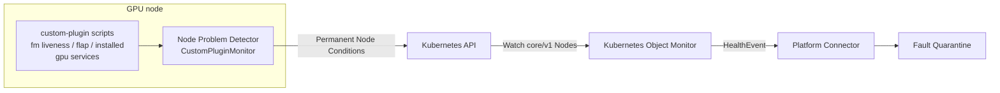

# ADR-050: Monitoring — GPU System Services via NPD Custom Plugins

## Context

NVSentinel has no monitoring of the *systemd unit layer* on GPU nodes. The
existing monitors observe adjacent layers:

- `gpu-health-monitor` polls DCGM via `pydcgm` for per-GPU device telemetry
  (PCIe, NVLink, thermal). With DCGM 4.5.2 its health watches also surface the
  per-GPU **fabric probe state** (`DCGM_FR_FABRIC_PROBE_STATE`: registration
  NotStarted / InProgress / Failed). It does not observe host process state:
  the fabric field is a **latched registration outcome**, not daemon liveness —
  issue #883's Node 1 showed `fabric.state` still reporting the pre-death value
  while `nvidia-fabricmanager` had been dead for 2.5 weeks, and the DCGM status
  enum has no value meaning "FM is not running".
- `syslog-health-monitor` tails journald/kernel logs for XID/SXID,
  fallen-off-bus, NIC errors, and GPU-reset events. It owns the journal-parsing
  machinery but does not observe systemd unit state.

Neither monitor can tell whether `nvidia-fabricmanager` is *running*, is
crash-looping under `Restart=`, or whether `nvidia-persistenced` is up. On
NVSwitch platforms a Fabric Manager that dies **after** registration completed
silently degrades multi-GPU workloads while the latched DCGM fabric state and
every log-level check still report healthy.

[ADR-053](053-npd-checks-integration.md) has since settled how NVSentinel
consumes node-level host checks: node-problem-detector (NPD) publishes
permanent Node Conditions, Kubernetes Object Monitor (KOM) watches
`core/v1/Node` with per-condition policies, and matching conditions become
HealthEvents on the existing platform-connector path. NVSentinel does **not**
install or configure NPD — several CSPs preinstall it, each slightly
differently — so anything NPD-side ships as documentation and reference
configuration that the operator applies to their own NPD deployment.

This ADR defines the systemd-layer checks as an extension of that path:
NPD `CustomPluginMonitor` configuration for the GPU-critical host services,
plus the opt-in KOM policies that turn the resulting conditions into
remediation-bearing HealthEvents.

## Problem Statement

Service-level health signals fall into two buckets relative to what NVSentinel
already collects:

1. **Already covered** — per-GPU device health and, since DCGM 4.5.2, per-GPU
   fabric registration/probe state are owned by `gpu-health-monitor`;
   journald/kernel log signals are owned by `syslog-health-monitor`.

2. **Not covered by any monitor** — systemd unit state: Fabric Manager process
   liveness and crash-loop (flap) behavior, and GPU-support service lifecycle
   (e.g. `nvidia-persistenced`). These require active host probing.

The design goal is to add the second bucket without re-collecting the first,
and — per ADR-053 — without introducing a new collection pipeline when the
NPD → KOM → HealthEvent path already exists for exactly this class of
node-local host check.

## Decision

Deliver GPU system-service monitoring as three documentation-and-configuration
artifacts, with no new NVSentinel component:

1. **NPD `CustomPluginMonitor` configurations** (documented; applied by the
   operator to their NPD install): plugin scripts probing systemd for the
   GPU-critical services, publishing four permanent Node Conditions — one
   single-condition monitor configuration per check.
2. **Opt-in KOM policies** following the ADR-053 pattern
   (`values-npd-remediation.yaml`): one policy per condition, carrying this
   ADR's taxonomy — fatality, error code, and per-condition recommended
   action.
3. **Operator documentation** covering script installation, NPD monitor
   configuration on the common deployment shapes (DaemonSet and host service,
   including preinstalled-NPD variants), and enabling the KOM policies.

Because the checks are active probes (unlike ADR-053's `SystemLogMonitor`
rules), a healthy observation clears its condition: the latching caveat noted
in ADR-053 does not apply to these checks.

## Check inventory

| Check | Description | NPD monitor | Type | Rationale | Action |
| --- | --- | --- | --- | --- | --- |
| `FabricManagerDown` | `nvidia-fabricmanager` unit is loaded but persistently not `active` (consecutive-probe debounce; see script contracts). On NVSwitch platforms a dead FM stops NVLink error-recovery coordination and new fabric registrations while DCGM's latched fabric state still reads healthy. | `CustomPluginMonitor` | Permanent | The systemd liveness gap is the core signal no existing monitor sees (issue #883). | `RESTART_BM` |
| `FabricManagerFlapping` | FM is crash-looping: the restarts observed inside a sliding window reach a threshold. Detected via systemd `NRestarts` deltas with reset disambiguation (below); reported independently of instantaneous `ActiveState`, which a crash-looping unit reads as `active` at most probe instants. | `CustomPluginMonitor` | Permanent | A flap condition tied to instantaneous liveness would be masked by whichever state the probe caught. | `RESTART_BM` |
| `FabricManagerNotInstalled` | The `nvidia-fabricmanager` unit is absent (`LoadState=not-found`) on a platform where the operator declared it required. Distinguishes misconfiguration from "disabled on purpose". | `CustomPluginMonitor` | Permanent | A silently missing FM on an NVSwitch platform hides exactly the failure class these checks exist for. | `CONTACT_SUPPORT` |
| `<Service>Down` (e.g. `NvidiaPersistencedDown`) | A configured GPU-support service is loaded but not `active`. **One condition type per service**: NPD binds each permanent rule to exactly one condition by type, so a shared condition would let one service's result overwrite another's status. The reference ships `NvidiaPersistencedDown`; additional services follow the same naming pattern with their own configuration file, condition, and KOM policy. | `CustomPluginMonitor` | Permanent | Support-service lifecycle has no DCGM watch. | `CONTACT_SUPPORT` |

**These checks observe host-systemd-managed services only.** Some
deployments run Fabric Manager elsewhere — the GPU Operator, for example,
can run FM inside the driver container
([`nvidia-driver-ctr`](https://github.com/NVIDIA/gpu-driver-container/blob/ccc2bd607912c8d8a4fd2bde2b0aaf1cac902d71/ubuntu24.04/nvidia-driver#L634-L660)),
where no host unit exists even though FM is running. On such nodes the
presence check would report a false `FabricManagerNotInstalled`, so
platform applicability is declared by configuration presence:

- **Required** (NVSwitch fleets with host-systemd-managed FM): install all
  FM configurations including the presence check.
- **Auto** (mixed or container-managed-FM fleets): omit the presence check;
  the liveness and flap checks skip a `not-found` unit rather than
  reporting it down, so they are inert where FM is container-managed.
- **Disabled** (PCIe-only fleets): omit the FM configurations entirely.

Monitoring container-managed FM is out of scope for this ADR and can be
addressed separately.

## Implementation

### Plugin script contracts

Scripts follow the NPD custom-plugin protocol: exit `0` healthy, `1`
unhealthy, any other value unknown; the message on stdout becomes the
condition message.

- **`check_fm_active.sh`** — `systemctl show nvidia-fabricmanager
  --property=LoadState,ActiveState,SubState`. `LoadState=not-found` exits `0`
  (not applicable on this host; see platform applicability).
  `ActiveState=active` confirms healthy (exit `0`) and resets the check's
  consecutive-failure count. Transitional states (`activating`,
  `deactivating`, `reloading`) neither confirm health nor count as down —
  the script holds its last confirmed state, so a service starting up or in
  a planned restart never fires the condition; systemd's own start timeout
  turns a stuck `activating` into `failed`, which does count. A non-running
  observation (`inactive`, `failed`) reports down (exit `1`, sub-state in
  the message) only when observed on a threshold of consecutive probes
  (default 3, ≈ 90 s at the reference interval): detection latency for a
  genuine death is threshold × `invoke_interval`, traded against firing on
  planned restarts.
- **`check_fm_flapping.sh`** — reads `NRestarts` and
  `ExecMainStartTimestamp`, keeping its baseline and restart-window samples
  in the per-check state (below); the window is boot-scoped by construction,
  and a crash loop spanning node reboots is out of scope here — cross-boot
  recurrence belongs to the analyzer-rule escalation path (see Remediation
  classification). `NRestarts` is not monotonic and a decrease is not itself
  a restart: `systemctl reset-failed` flushes the counter without restarting
  the process. On a decrease the script re-baselines, and records a restart
  observation only when `ExecMainStartTimestamp` changed across the reset; a
  pure counter flush records nothing. Exits `1` while the windowed count is
  at or above the threshold (defaults: 3 restarts within 600 s), `0` once
  the window drains.
- **`check_fm_installed.sh`** — exits `1` when `LoadState=not-found`, `0`
  otherwise. Only installed by operators declaring FM required and
  host-systemd-managed.
- **`check_gpu_service.sh <unit>`** — the liveness contract of
  `check_fm_active.sh`, parameterized (including the consecutive-probe
  debounce); one NPD rule per configured service.

**Per-check state.** Each check persists a small state file under the
**host's** `/var/run/nvsentinel/npd` (tmpfs — boot-scoped by construction): the
flap baseline and window samples, the liveness checks' consecutive-failure
counts, and each check's last confirmed state. The contract is part of the
operator documentation and applies per NPD deployment shape:

- **Host-service NPD:** scripts write `/var/run/nvsentinel/npd/<check>.state`
  directly.
- **DaemonSet NPD:** the pod MUST hostPath-mount the host's
  `/var/run/nvsentinel/npd` at the same path — a pod-local `/run` would reset
  baselines on every pod replacement, silently weakening flap detection and
  the debounce without a node reboot. If an operator chooses not to mount
  it, the boot-scoped guarantee explicitly degrades to pod-scoped and the
  documentation says so.
- The state directory is `root:root` mode `0700`; updates are atomic (write
  temp file + `rename`); an unreadable or invalid state file is treated as
  a fresh baseline (no phantom observations, no held state).

The scripts require the same host visibility NPD's own service checks use
(access to systemd via D-Bus or `systemctl`); the documentation records the
requirement for both host-service and DaemonSet NPD deployments rather than
prescribing one privilege model, since the operator owns the NPD install.

**Probe failures are bounded and never clear a fault.** Each script bounds
its own probes (`systemctl` with an internal timeout **shorter than** the
rule's `timeout`), so a wedged probe reports as the script's own deliberate
exit rather than as an NPD plugin timeout. On a probe failure (systemd/D-Bus
unreachable, timeout) the script reports its **last confirmed state**: a
check whose condition is unhealthy keeps reporting unhealthy — with a
"holding: probe failing" message — until a probe confirms recovery, and a
previously healthy check holds healthy for a bounded number of consecutive
failures (default 4) before reporting unknown. Recovery therefore always
requires a confirming observation; lost observability alone can neither set
nor clear a fault (see Recovery semantics for the KOM consequence).

### Reference NPD configuration

The reference ships as **one single-condition monitor configuration per
check** — four small files rather than one four-condition monitor. NPD
instantiates an independent `CustomPluginMonitor` per configuration file,
and each instance's status updates carry only that instance's own
conditions (v1.36.0 `custom_plugin_monitor.go` keeps a conditions slice per
monitor instance), so a condition is never published from a status
generated by another check's result — the property the Recovery-semantics
section relies on. The complete files ship in the operator documentation,
which also pins the NPD release the reference was validated against —
**v1.36.0** at the time of writing (the exit-status and permanent-condition
contract used here predates that release line; the restart behavior cited
here is verified against the v1.36.0 source). Every permanent rule
references a condition declared in `conditions` with its healthy default —
NPD rejects a configuration that omits this.

The `FabricManagerDown` configuration; the other three follow the same
shape with their own source, condition, reason, and script:

```json
{
  "plugin": "custom",
  "pluginConfig": {
    "invoke_interval": "30s",
    "timeout": "15s",
    "max_output_length": 120,
    "skip_initial_status": true
  },
  "source": "nvsentinel-gpu-services-fm-liveness",
  "metricsReporting": false,
  "conditions": [
    { "type": "FabricManagerDown", "reason": "FabricManagerActive", "message": "nvidia-fabricmanager is active" }
  ],
  "rules": [
    { "type": "permanent", "condition": "FabricManagerDown", "reason": "FabricManagerNotActive", "path": "/etc/npd-plugins/check_fm_active.sh", "timeout": "12s" }
  ]
}
```

| Configuration | `source` | Condition | Problem reason | Script |
| --- | --- | --- | --- | --- |
| `custom-plugin-fm-liveness.json` | `nvsentinel-gpu-services-fm-liveness` | `FabricManagerDown` | `FabricManagerNotActive` | `check_fm_active.sh` |
| `custom-plugin-fm-flap.json` | `nvsentinel-gpu-services-fm-flap` | `FabricManagerFlapping` | `FabricManagerFlapping` | `check_fm_flapping.sh` |
| `custom-plugin-fm-presence.json` | `nvsentinel-gpu-services-fm-presence` | `FabricManagerNotInstalled` | `FabricManagerUnitNotFound` | `check_fm_installed.sh` |
| `custom-plugin-persistenced.json` | `nvsentinel-gpu-services-persistenced` | `NvidiaPersistencedDown` | `NvidiaPersistencedNotActive` | `check_gpu_service.sh nvidia-persistenced` |

Operators register the files as a comma-separated list in one
`--config.custom-plugin-monitor` flag. Each monitor runs exactly one rule,
so a wedged probe delays only its own condition, and the recovery bound —
one `invoke_interval` plus the rule `timeout` — holds per condition by
construction; batch serialization across checks cannot arise. Each
additional GPU service adds one configuration file (condition plus rule)
and one KOM policy under the same pattern.

The `custom-plugin-fm-presence.json` configuration is installed only by
operators declaring FM required (see platform applicability above).

### Architecture



### KOM policies

Provided as opt-in values in the ADR-053 pattern, excluded from defaults for
the same reason: NVSentinel does not own the NPD install, and an operator may
already have different ownership or remediation rules for these conditions.
Each condition a policy matches is **defined by its reference NPD
configuration above** (the `conditions` entry with its healthy default) —
the operator applies those configurations to their NPD deployment first,
then enables these policies. Each policy watches `core/v1/Node`, matches its
condition at `status == "True"` with the expected reason, and keeps identity
fields stable between unhealthy and healthy HealthEvents.

The `FabricManagerDown` policy:

```yaml
- name: NPDFabricManagerDown
  enabled: true
  resource:
    group: ""
    version: v1
    kind: Node
  predicate:
    expression: |
      resource.status.conditions.exists(c,
        c.type == "FabricManagerDown" &&
        c.status == "True" &&
        c.reason == "FabricManagerNotActive")
  healthEvent:
    componentClass: Node
    isFatal: true
    message: "NPD reported nvidia-fabricmanager is not running"
    recommendedAction: RESTART_BM
    errorCode:
      - NPD_FABRIC_MANAGER_NOT_RUNNING
```

The `FabricManagerFlapping` policy:

```yaml
- name: NPDFabricManagerFlapping
  enabled: true
  resource:
    group: ""
    version: v1
    kind: Node
  predicate:
    expression: |
      resource.status.conditions.exists(c,
        c.type == "FabricManagerFlapping" &&
        c.status == "True" &&
        c.reason == "FabricManagerFlapping")
  healthEvent:
    componentClass: Node
    isFatal: true
    message: "NPD reported nvidia-fabricmanager is crash-looping"
    recommendedAction: RESTART_BM
    errorCode:
      - NPD_FABRIC_MANAGER_FLAPPING
```

The `FabricManagerNotInstalled` policy — `CONTACT_SUPPORT` because there is
no unit to restart, and a reboot will not install one:

```yaml
- name: NPDFabricManagerNotInstalled
  enabled: true
  resource:
    group: ""
    version: v1
    kind: Node
  predicate:
    expression: |
      resource.status.conditions.exists(c,
        c.type == "FabricManagerNotInstalled" &&
        c.status == "True" &&
        c.reason == "FabricManagerUnitNotFound")
  healthEvent:
    componentClass: Node
    isFatal: true
    message: "NPD reported the nvidia-fabricmanager unit is not installed"
    recommendedAction: CONTACT_SUPPORT
    errorCode:
      - NPD_FABRIC_MANAGER_NOT_INSTALLED
```

The `NvidiaPersistencedDown` policy — non-fatal: persistenced affects
initialization latency and settings persistence, not active workload
correctness:

```yaml
- name: NPDNvidiaPersistencedDown
  enabled: true
  resource:
    group: ""
    version: v1
    kind: Node
  predicate:
    expression: |
      resource.status.conditions.exists(c,
        c.type == "NvidiaPersistencedDown" &&
        c.status == "True" &&
        c.reason == "NvidiaPersistencedNotActive")
  healthEvent:
    componentClass: Node
    isFatal: false
    message: "NPD reported nvidia-persistenced is not running"
    recommendedAction: CONTACT_SUPPORT
    errorCode:
      - NPD_NVIDIA_PERSISTENCED_NOT_RUNNING
```

### Configuration matrix

What is enabled where, per fleet scenario — the operator declares the
scenario (they know how FM is deployed on their nodes):

| Fleet scenario | NPD side (monitor configurations registered) | NVSentinel side (KOM policies enabled in the opt-in values) |
| --- | --- | --- |
| NVSwitch, FM as host systemd service | `custom-plugin-fm-liveness.json`, `custom-plugin-fm-flap.json`, `custom-plugin-fm-presence.json`, `custom-plugin-persistenced.json` | `NPDFabricManagerDown`, `NPDFabricManagerFlapping`, `NPDFabricManagerNotInstalled`, `NPDNvidiaPersistencedDown` |
| NVSwitch, FM in the GPU Operator driver container | `custom-plugin-persistenced.json` only (FM liveness/flap would be inert on a `not-found` unit; FM presence would false-fire) | `NPDNvidiaPersistencedDown` only |
| PCIe-only (no FM) | `custom-plugin-persistenced.json` | `NPDNvidiaPersistencedDown` |

Both sides are explicit artifacts: the NPD side is the list of configuration
files registered on `--config.custom-plugin-monitor`, and the NVSentinel
side is the policy list in the opt-in values file (a policy is disabled by
removing it or setting `enabled: false`). Enabling a KOM policy whose NPD
configuration is not applied is safe but inert — the condition never
appears; the operator documentation pairs the two per scenario.

**Recovery semantics and their limits.** A KOM predicate matches only
`status == "True"` with the expected reason; anything else — including an
`Unknown` condition after a plugin timeout — reads as the predicate not
matching, which KOM reports as the healthy transition. The reference
configuration addresses this on two fronts:

- `skip_initial_status: true` plus the per-condition monitor split removes
  the restart reset documented for ADR-053 from these checks **by
  construction**: no monitor publishes anything until its first probe
  completes, and each status update carries only the emitting monitor's own
  — just-probed — condition (v1.36.0 `custom_plugin_monitor.go` keeps a
  conditions slice per monitor instance). A condition that was `True`
  before an NPD restart therefore stays `True` on the Node object until its
  own probe reports otherwise. A single four-condition monitor would not
  have this property: every per-result status would carry the full slice,
  briefly publishing not-yet-probed conditions at their defaults during the
  first post-restart batch — which is why the reference splits the
  configurations.
- Probe failures cannot cancel remediation **through the script path**:
  KOM's transition detector treats any non-matching observation — including
  `Unknown` — as the healthy edge, so each script holds its last confirmed
  state through probe failures, and bounds its internal probes at 8 s
  (under the 12 s rule timeout) so the NPD-side kill is normally
  unreachable. What the scripts cannot intercept is an `Unknown` that NPD
  itself generates without running them to completion: plugin exec failure,
  a script crash, or the outer-timeout kill (v1.36.0 `plugin.go` returns
  Unknown on each). Those paths are narrow — exec failure and crash are
  deploy-time misconfigurations the operator documentation validates for,
  and the kill requires the shell itself to wedge inside the 4 s of slack —
  but they are real, and they are exactly what KOM-side three-state
  handling (`Unknown` is not the healthy edge) closes platform-wide. That
  follow-up is therefore the completing piece for this ADR's recovery
  semantics, not optional hardening.

## Remediation classification: restart-fixable vs. hardware-return

Operational experience on NVSwitch platforms (NVL72/36) shows Fabric Manager
faults span two remediation classes: some clear with a service restart or node
reboot, while NVSwitch hardware faults have required returning entire racks. A
single node-local probe cannot make that distinction, and this ADR does not
pretend it can:

- **`recommendedAction` is the safe first try, not a verdict.** `RESTART_BM`
  on FM-down/flapping means the cheapest step with a real chance of clearing
  the fault; it does not assert the fault is software.
- **Classification is cross-signal and belongs downstream.** NVSwitch/SXID
  hardware errors arrive via `syslog-health-monitor`, fabric-probe failures
  via `gpu-health-monitor`, and unit-lifecycle conditions via this path;
  `health-events-analyzer` sees all three plus remediation history.
- **Escalation mechanism.** The KOM policy itself is static: every time
  the condition transitions to `True` it publishes the same fatal
  `RESTART_BM` event — nothing in this path suppresses the Nth trigger.
  The recurrence backstop is `health-events-analyzer`, which evaluates
  TOML-configured aggregation rules over the health-events collection and
  emits synthetic events into the standard quarantine/remediation
  pipeline: its shipped `MultipleRemediations` rule fires when a node
  accumulates **five or more** executed remediations within 7 days (the
  shipped default; the TOML rule is operator-tunable), and its event has
  **no automatic healthy clear** — the node stays quarantined pending
  operator investigation rather than being returned to service for another
  cycle. The backstop bounds the loop at the node level; it does not make
  it short — up to the threshold's worth of remediation cycles can execute
  before it fires. Fleets wanting a tighter bound for these conditions
  tune that rule or add the dedicated `NPD_FABRIC_MANAGER_*` rule below
  with a lower threshold. Suppressing the trigger itself —
  recurrence-aware action escalation, e.g. replacing `RESTART_BM` with
  `CONTACT_SUPPORT` on the same check after N occurrences, which
  fault-quarantine's event map already supports by overwriting a stored
  event whose `RecommendedAction` changed — is a platform-level
  capability shared by every recurring KOM condition, tracked as
  follow-up alongside a dedicated `NPD_FABRIC_MANAGER_*` analyzer rule.

## Rationale

- Reuses the ADR-053 pipeline end to end: no new collector, DaemonSet,
  privileged pod, transport, or transition cache — KOM already owns the Node
  watch, deduplication, and health-event publishing.
- Detection semantics live in the plugin contracts: platform applicability
  is declared by configuration presence, restart accounting disambiguates
  `reset-failed` from real restarts inside a boot-scoped window, startup
  and planned restarts are debounced, and a probe failure holds the last
  confirmed state so lost observability is never mistaken for recovery or
  failure.
- Active custom-plugin probes clear their conditions on recovery, avoiding
  the `SystemLogMonitor` latching documented in ADR-053.
- One collection path per signal is preserved: DCGM telemetry stays with
  `gpu-health-monitor`, journal patterns with `syslog-health-monitor`, and
  systemd unit state arrives only through these NPD checks.

## Consequences

### Positive

- Systemd-layer coverage for GPU-critical services with zero new NVSentinel
  components to build, ship, or operate.
- Operators on CSP-preinstalled NPD reuse their existing NPD deployment.
- Per-condition remediation mapping (`RESTART_BM` vs `CONTACT_SUPPORT`)
  arrives through the same opt-in values mechanism as ADR-053.

### Negative

- Not out-of-the-box: the operator must apply the NPD configuration and
  enable the KOM policies; fleets without NPD must deploy it first.
- Node Conditions carry only reason/message — richer per-check detail
  (restart counts, sub-states) travels as condition message text set at
  transition time.
- The per-check state files are a per-host contract the documentation must
  specify precisely (location under `/run`, format, boot-scoped lifetime).
- Recovery correctness leans on the per-check state under `/run`: an NPD
  restart cannot reset conditions (per-condition monitors plus
  `skip_initial_status`), and probe failures hold the last confirmed state
  rather than clearing faults. The residual exposure is a node reboot
  wiping the state directory mid-remediation, after which the first
  confirming probe re-reports within one cycle — mid-remediation, condition
  transitions are validated rather than trusted.
- Four small single-condition monitor configurations instead of one file:
  slightly more operator surface, traded for eliminating the restart-reset
  window by construction.

## References

- [ADR-053: Monitoring — Integrate Default NPD Node Conditions](053-npd-checks-integration.md)
- [Node Problem Detector](https://github.com/kubernetes/node-problem-detector)
- [Kubernetes Object Monitor configuration](../configuration/kubernetes-object-monitor.md)
- Issue #883 — NVSentinel not detecting fabric health on H100s
