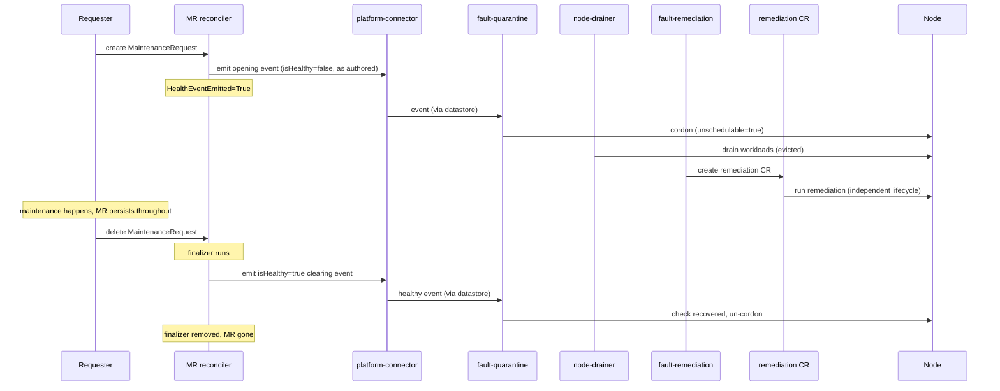

# ADR-051: API — MaintenanceRequest (MR)

## Table of contents

- [Context](#context)
- [Decision](#decision)
- [Implementation](#implementation)
  - [Component](#component)
  - [Module layout](#module-layout)
  - [CRD schema](#crd-schema)
  - [Example](#example)
  - [Status conditions](#status-conditions)
  - [MR reconciler state machine](#mr-reconciler-state-machine)
  - [Validating admission webhook](#validating-admission-webhook)
  - [RBAC](#rbac)
  - [Sequence: MR lifecycle](#sequence-mr-lifecycle)
- [Pipeline dependencies](#pipeline-dependencies)
- [Consequences](#consequences)
- [Alternatives Considered](#alternatives-considered)
- [Testing](#testing)
- [References](#references)

## Context

[ADR-040](040-external-remediation-request.md) introduced the `ExternalRemediationRequest` (ERR) — the **exit door** from NVSentinel node ownership. When NVSentinel detects a fault it cannot remediate itself, it creates an ERR. It then releases the node to an external system and waits for that system to signal completion.

ADR-040 does not cover the reverse direction. An external system often knows that **maintenance is coming** for a node — a CSP maintenance notification, a planned hardware repair, or an operator-scheduled intervention. That system needs NVSentinel to prepare the node (cordon, drain) before the maintenance begins. NVSentinel has no fault of its own here, because the signal comes from outside the cluster.

Without a formal entry point, external automation must bypass NVSentinel by cordoning nodes directly and competing over taints. The alternative is to duplicate NVSentinel's quarantine and drain logic. Both approaches undermine the ownership model that ADR-040 established.

## Decision

Introduce a new CRD, `MaintenanceRequest` (MR), in the existing `nvsentinel.dgxc.nvidia.com` API group. MR is the **entry door**. An external system or operator — the **requester** — creates an MR to tell NVSentinel *"maintenance is incoming for this node — prepare it."*

- The requester supplies a `healthEvent` that describes the preparation NVSentinel must perform, and a `startTime` that records when the maintenance window opens.
- On create, the reconciler emits the `healthEvent` **as authored**. The requester chooses `recommendedAction`, and the pipeline routes the event to the matching remediation. For example, `RESTART_VM` produces a RebootNode, and `CUSTOM` / `external-remediation` produces an ERR. Given the wiring in [Pipeline dependencies](#pipeline-dependencies), this drives the normal flow: quarantine (cordon), drain, and creation of the remediation CR by `fault-remediation`.
- The MR then **persists until the requester deletes it**. NVSentinel does not track the maintenance to completion. The existence of the MR is the statement "this node is under maintenance."
- **Deletion is the clear.** When the requester deletes the MR, the reconciler emits a matching `isHealthy=true` event. That event retracts the fault the MR raised, and the normal quarantine-recovery path un-cordons the node.

The MR reconciler and its validating webhook live in the existing `lifecycle-manager` component, alongside the validation-controller. See [Component](#component).

MR is the inbound counterpart to ERR's outbound "NVSentinel is releasing this node." The external-remediation handoff is the canonical case, but MR drives any remediation the pipeline already supports.

## Implementation

### Component

MR needs two capabilities from its host: a controller-runtime manager, to watch the CRD and manage the finalizer and status; and a health-event emitter, a `healthpub.Publisher` over the platform-connector's node-local socket.

`lifecycle-manager` already provides the first. It was introduced with the validation-controller (see [ADR: Node Validation](049-node-validation.md)) as the home for controllers that coordinate node lifecycle transitions, and it supplies the controller-runtime manager, leader election, a validating-webhook server with a certificate watcher, a ConfigMap-backed configuration file, a Helm chart, and RBAC scaffolding. MR therefore adds a reconciler and a webhook to a component that already runs, rather than creating one. It follows the existing per-controller enable flag convention (`--enable-validation-controller`, `controllers.validationRequest.enabled`) with `--enable-maintenance-controller` and `controllers.maintenanceRequest.enabled`.

`lifecycle-manager` does **not** provide the second. Nothing in it imports `healthpub` or opens the platform-connector socket today, so MR adds a `healthpub.Publisher` and a `hostPath` mount of `/var/run/nvsentinel`. This gives `lifecycle-manager` its first dependency on a node-local socket. The platform-connector runs as a per-node DaemonSet, so the socket exists on whatever node the pod is scheduled to, and `lifecycle-manager` already requires the `commons` module directly, so `healthpub` is available.

### Module layout

`lifecycle-manager` and its chart already exist. MR adds files to both; it creates no new component or chart.

```text
lifecycle-manager/                          (existing component)
├── api/v1alpha1/maintenance_request_types.go        (new — MR types)
├── internal/controller/maintenancerequest_controller.go   (new)
├── pkg/webhook/v1alpha1/                   (extended — MR validator)
└── main.go                                 (extended — MR controller + emitter wiring)

distros/kubernetes/nvsentinel/charts/lifecycle-manager/     (existing chart)
├── crds/                                   (new — MR CRD)
└── templates/                              (extended — socket mount, clusterrole, webhook)
```

The `api/`, `internal/controller/`, and `pkg/webhook/v1alpha1/` paths follow the layout the validation-controller established. The CRD itself follows janitor's ExtRR pattern rather than the validation-controller's, so `lifecycle-manager` gains a second generation path — see [CRD schema](#crd-schema).

### CRD schema

MR follows the same pattern janitor uses for ExtRR (ADR-040). The `.proto` file is the source of truth for the spec and status shapes. `protoc-gen-crd` generates the CRD YAML, and a thin Go wrapper supplies the Kubernetes machinery that the proto-generated types do not: `TypeMeta`, `ObjectMeta`, pointer `Spec` and `Status` fields, and `MarshalJSON`/`UnmarshalJSON` overrides that route those fields through `protojson`. Those overrides are required because `encoding/json` renders proto well-known types such as `Timestamp` in a form the CRD schema rejects.

This differs from the validation-controller, which generates its CRDs with `controller-gen` from hand-written Go types. `lifecycle-manager` therefore carries two generation paths. MR follows ExtRR because `spec.healthEvent` embeds the proto-generated `HealthEvent`, and keeping the proto as the source of truth avoids hand-mirroring that message and letting the copy drift.

Two consequences follow. The API version is `v1`, because `protoc-gen-crd` hardcodes that version. The API group stays `nvsentinel.dgxc.nvidia.com`, matching ERR, so `lifecycle-manager` serves this group alongside `nvsentinel.nvidia.com` for `ValidationRequest`.

Proto-generated through `protoc-gen-crd`, matching the ERR pattern:

```proto
message MaintenanceRequestSpec {
  // healthEvent describes the preparation NVSentinel must perform. The
  // reconciler re-emits this event into the pipeline as authored (the
  // requester's recommendedAction stands), so the normal quarantine → drain →
  // remediation flow fires for whichever action the event names.
  HealthEvent healthEvent = 1;

  // startTime is when the maintenance window opens. It is recorded for
  // observability and future scheduling; the node is prepared on creation today.
  google.protobuf.Timestamp startTime = 2;
}

message MaintenanceRequestStatus {
  // No completionTime: the MR is deleted to clear the fault, not retained.
  repeated Condition conditions = 1;
}

message MaintenanceRequest {
  option (protoc_gen_crd.k8s_crd) = {
    api_group: "nvsentinel.dgxc.nvidia.com",
    kind: "MaintenanceRequest",
    plural: "maintenancerequests",
    singular: "maintenancerequest",
    short_names: ["mr"],
    categories: ["nvsentinel"],
    scope: ST_CLUSTER,
    additional_columns: [
      {name: "Node",      type: CT_STRING, json_path: ".spec.healthEvent.nodeName"},
      {name: "StartTime", type: CT_STRING, format: CF_DATE, json_path: ".spec.startTime"}
    ]
  };
  MaintenanceRequestSpec spec = 1;
  MaintenanceRequestStatus status = 2;
}
```

### Example

```yaml
apiVersion: nvsentinel.dgxc.nvidia.com/v1
kind: MaintenanceRequest
metadata:
  name: csp-maintenance-ip-10-0-31-7
spec:
  startTime: "2026-05-13T03:00:00Z"
  healthEvent:
    agent: external-system
    checkName: csp-scheduled-maintenance
    componentClass: node
    recommendedAction: CUSTOM
    customRecommendedAction: external-remediation
    errorCode:
      - CSP-MAINT-AWS-EBS-RETIRE
    isFatal: false
    isHealthy: false
    message: "AWS scheduled maintenance 2026-05-13T03:00Z; node must be drained."
    metadata:
      cspEventId: evt-0a9bc8e74e2c2c10c
      source: aws-health
    nodeName: ip-10-0-31-7.us-west-2.compute.internal
    generatedTimestamp: "2026-05-13T02:00:00Z"
    id: he-mst-c6d92aa1-2f6e-4e8b-9e3d-b75f86b1aaaa
    version: 1
status:
  conditions:
    - type: HealthEventEmitted
      status: "True"
      reason: Emitted
      message: Submitted health event to platform-connector.
      lastTransitionTime: "2026-05-13T02:00:01Z"
      observedGeneration: 1
```

### Status conditions

| Condition | Initial | Terminal | Meaning |
|---|---|---|---|
| `HealthEventEmitted` | `Unknown (Initializing)` | `True (Emitted)` | The reconciler submitted the opening health event to the platform-connector. |

The MR carries one condition and no `completionTime`. Its lifecycle is *present = active, absent = cleared*, so there is no "cleared" state to track on a living object.

### MR reconciler state machine

**Init** (neither finalizer nor initial condition present):
1. Add the cleanup finalizer and seed `HealthEventEmitted=Unknown`.
2. Emit `spec.healthEvent` as authored. Stamp the MR's name and UID into `healthEvent.metadata["maintenanceRequestName"]` and `["maintenanceRequestUID"]`. That metadata serves **observability only**: it lets an operator trace a remediation back to the MR that triggered it. Nothing consumes it, and no other component changes for it.
3. On success, set `HealthEventEmitted=True`. On failure, return an error and requeue. The emit is gated on `HealthEventEmitted != True`, so the reconciler retries a failed emission rather than stranding it.

**Open** (`HealthEventEmitted=True`): idle. The reconciler takes no further action, and it does **not** watch the remediation it triggered. The MR stays in this state until the requester deletes it.

**Finalizer** (DeletionTimestamp set):
1. If the reconciler emitted the opening event, emit the clearing event. It carries `isHealthy=true`, the same `agent`, `checkName`, and `nodeName`, and `recommendedAction=NONE`, because it must clear the check rather than trigger a second remediation. If the reconciler never emitted the opening event, skip this step, because there is no fault to retract.
2. On success, remove the finalizer. On failure, return an error and retry, so the MR remains until the clear succeeds.

For this first iteration NVSentinel performs **no automatic cleanup**. The requester deletes the MR when it wants the node marked healthy again. Auto-deletion on remediation completion is deliberately deferred (see [Alternatives Considered](#alternatives-considered)).

MR and the remediation it triggers are otherwise fully decoupled: no owner-reference, label, or watch links them. The remediation CR runs its own lifecycle, and its own reconciler or TTL cleans it up (ADR-040 for ERR, ADR-037 for the others).

### Validating admission webhook

| Check | On create | On update |
|---|---|---|
| `spec.healthEvent.nodeName` is non-empty | ✓ | ✓ |
| `spec.healthEvent.isHealthy` is `false` | ✓ | ✓ |
| Node named by `nodeName` exists | ✓ | — |
| `spec.startTime` is in the future | ✓ | if changed |
| `spec.healthEvent` is immutable | — | ✓ |
| No other MaintenanceRequest for the same node | ✓ | — |

The webhook freezes the whole event, not only `nodeName`. The clearing event reuses the original `agent`, `checkName`, and `nodeName` to match the fault the MR opened. If those fields could drift, the clear would target a different check and would silently fail to un-cordon the node. The `isHealthy` check closes a second gap: a "healthy" opening event would mark the MR emitted without ever raising a fault.

The `startTime` check rejects a request that is backdated at creation, because a maintenance window that has already opened cannot be prepared for. On update the webhook applies the check only when `startTime` changes. An MR persists through its window and beyond, so re-checking an unchanged `startTime` would reject every later update to an MR whose window has already opened. Scoping the check to changes still validates a reschedule.

The `startTime` check must live in the webhook rather than in CRD `x-kubernetes-validations` CEL rules. Those rules must be deterministic, so their CEL environment exposes no current time and cannot evaluate whether a timestamp is in the future.

The duplicate check is a best-effort early rejection, not a race guarantee. It uses an informer-backed lister, so two concurrent creates can both observe "no MR" and both pass. Idempotent downstream handling, not admission, ultimately upholds the single-active invariant.

### RBAC

```text
# kubebuilder:rbac:groups=nvsentinel.dgxc.nvidia.com,resources=maintenancerequests,verbs=get;list;watch;update;patch
# kubebuilder:rbac:groups=nvsentinel.dgxc.nvidia.com,resources=maintenancerequests/status,verbs=get;update;patch
# kubebuilder:rbac:groups=nvsentinel.dgxc.nvidia.com,resources=maintenancerequests/finalizers,verbs=update
# kubebuilder:rbac:groups=core,resources=nodes,verbs=get;list;watch
```

The reconciler needs no access to janitor's remediation CRDs, because it does not watch them. Access to `nodes` is read-only, for the webhook's node-existence check. No other component needs new permissions.

### Sequence: MR lifecycle

The diagram shows the `CUSTOM` / external-remediation case. Other actions follow the same shape with a different remediation CR.



## Pipeline dependencies

MR only *emits* an event. Whether that event flows through quarantine, drain, and remediation depends on the pipeline being configured to act on it:

1. **A `fault-quarantine` ruleset that matches the MR-emitted event.** `fault-quarantine` cordons only events that match one of its rulesets. A generic external-origin event matches none of the default agent-specific or check-specific rulesets, so `fault-quarantine` skips it and no cordon or drain occurs. A dedicated ruleset for MR-originated events, matched on the emitter's `agent`, covers every MR in one place. This is the only hard prerequisite, and it applies whatever the action.
2. **A `fault-remediation` action for the chosen `recommendedAction`.** Built-in actions such as `RESTART_VM` → RebootNode and `TERMINATE_NODE` → TerminateNode already have templates, so MR works against them today. Only the `CUSTOM` / `external-remediation` path needs the action that renders an ERR, which does not exist yet. `fault-remediation` must also be **idempotent on re-publish**: the MR re-emits on retry and the datastore assigns each event its own id, so the producer must not create a second CR for a node that already has an active one.

The MR does not associate itself with the remediation it triggers. No association labels or other cross-component wiring are required.

## Consequences

**Positive:**
- Very small first iteration: two emissions, one condition, one finalizer. It adds no cross-CRD watches, owner-references, or GC coupling, and no new code paths in any other component.
- Simple lifecycle (*present = active, absent = cleared*), with exactly one place where the clear can happen, whoever deletes the MR.
- Drives any remediation the pipeline supports, not only the ERR handoff.
- Reuses an existing component, so it adds no new image, chart, deployment, or operational surface.
- The requester controls when NVSentinel takes the node back. That is correct when the external maintenance window, rather than the in-cluster remediation, determines that the work is done.

**Negative / tradeoffs:**
- **A forgotten MR leaves a node cordoned indefinitely.** Nothing reclaims it. MRs therefore become an operational surface that needs monitoring, such as an alert on MRs well past their `startTime`. This is the main cost of dropping automatic cleanup.
- Deletion of an MR always emits the clear, even when the remediation it triggered is still in flight. The node un-cordons while that remediation continues independently.
- NVSentinel does not retain MRs after completion, so there is no built-in historical record of completed maintenance.
- MR adds a reconciler, a webhook, and an emitter to `lifecycle-manager`, and gives that component its first dependency on the platform-connector's node-local socket.
- A `fault-quarantine` ruleset that matches MR-emitted events must land with MR or before it. The `CUSTOM` case also needs the ERR-producing action, which does not exist yet.

## Alternatives Considered

**A `kubernetes-object-monitor` (KOM) policy instead of a controller.** KOM is already a controller-runtime manager that watches any configured GVK through a TOML policy. It evaluates CEL `predicate` and `nodeAssociation` expressions against the object, then publishes a health event on each transition: unhealthy when the object starts to match, healthy when it stops matching or is deleted. That is precisely MR's open/close model, already built, so a policy over the MR CRD would need no new reconciler at all:

```toml
[[policies]]
name = "maintenance-request-reboot"
enabled = true
[policies.resource]
group = "nvsentinel.dgxc.nvidia.com"
version = "v1"
kind = "MaintenanceRequest"
[policies.predicate]
expression = 'resource.spec.action == "reboot"'
[policies.nodeAssociation]
expression = 'resource.spec.healthEvent.nodeName'
[policies.healthEvent]
componentClass    = "node"
isFatal           = false
message           = "Maintenance requested: node reboot"
recommendedAction = "RESTART_VM"
```

It was rejected because every field under `[policies.healthEvent]` is a static literal. KOM assembles the published event from the *policy*, not from the object it watches; only the node name comes from the object. Four consequences follow:

| | MaintenanceRequest controller | KOM policy |
|---|---|---|
| Publishing a new kind of fault | Create an MR; no NVSentinel change | Add a policy and release NVSentinel first |
| Per-request detail (`message`, `errorCode`, metadata) | Taken from each MR, so every request describes itself | Fixed in the policy — every matching MR emits identical text |
| Clearing the fault on delete | The finalizer holds the MR until the clear succeeds, and retries | Emitted after the fact; if the publish fails, KOM drops its state and the clear is lost |
| Status reported on the MR | `HealthEventEmitted` condition | None — KOM does not write to the objects it watches |

The first two are the deciding ones. Each new fault type would need its own policy block, so a requester could not introduce one without a change to NVSentinel and a release, and no single request could carry the detail that makes it diagnosable. A contained KOM enhancement — sourcing event fields from the watched object, for example `fromField = "spec.healthEvent"` — would close both. It would not close the other two, because KOM has no finalizer and writes no status to the objects it watches, so it was not enough to change the decision.

Two other hosts were considered and dismissed earlier. **janitor** is a controller-runtime manager with a webhook server, but it emits no health events and node-maintenance coordination is not its remit. **csp-health-monitor** is a native emitter, but it is a poll/emit loop with no manager, webhook server, or leader election.

**Auto-delete the MR when the triggered remediation completes (deferred, not rejected).** The reconciler would watch janitor's remediation CRDs, associate one back to its MR, and delete the MR when that CR sets `Status.CompletionTime`. This closes the loop without requiring the requester to act, and it removes the forgotten-MR failure mode. It is deferred for two reasons. First, it costs cross-CRD watches, an association mechanism that the pipeline must propagate, and read RBAC on janitor's CRDs. Second, "the remediation completed" does not always mean "the maintenance is over" — for an external repair, the requester is the authority. This is the most likely follow-up once the basic flow is proven.

**Clear through a status condition and a separate emit path.** An earlier model derived a "cleared" condition and emitted the clear on a distinct trigger, keeping the object after completion. Deletion-as-clear collapses that into one finalizer path and removes the retained-object machinery.

**The MR reconciler creates the remediation CR directly, skipping the health event.** This is simpler in the short term, but it bypasses quarantine and drain entirely and makes the requester responsible for draining the node first. That violates the ADR-040 principle that every node handed to a remediation has passed through NVSentinel's quarantine and drain.

**MR as a label or annotation on the Node.** This is simpler, but it is not observable as a first-class resource and not auditable through standard tooling. It also requires granting external systems `patch` on Nodes, a far broader privilege than `create` on one CRD.

## Testing

- **Reconciler unit tests:**
  - The opening emit sets `HealthEventEmitted` correctly, and retries after a failure.
  - The finalizer emits the clear on delete, and retries after a failure.
  - The finalizer is not removed until the clear succeeds.
  - The reconciler skips the clear when it never emitted the opening event.
  - The clearing event reuses the original `agent`, `checkName`, and `nodeName`, with `isHealthy=true` and `recommendedAction=NONE`.
- **Webhook unit tests:** one per row of the validation table.
- **E2E** (`tests/maintenance_request_test.go`):
  - Happy path: create an MR, confirm the node is quarantined and drained, confirm an ERR is produced, delete the MR, confirm the node un-cordons.
  - Action-agnostic: repeat with `recommendedAction=RESTART_VM`, which produces a RebootNode.
  - MR persists: the MR is not removed on its own while the remediation completes, and the node stays cordoned until the requester deletes the MR.
  - Duplicate rejection: the webhook rejects a second MR for the same node.

## References

- [ADR-040: External Remediation Request](040-external-remediation-request.md) — the outbound handoff API this ADR complements.
- [ADR-036: Custom Remediation Actions](036-custom-remediation-actions.md) — defines the `CUSTOM` recommended-action path MR uses for the ERR case.
- [ADR-009: Fault Remediation Triggering](009-fault-remediation-triggering.md) — the pipeline the MR's health event flows through.
- [ADR: Node Validation](049-node-validation.md) — introduced the `lifecycle-manager` component and its validation-controller, whose conventions MR follows.
