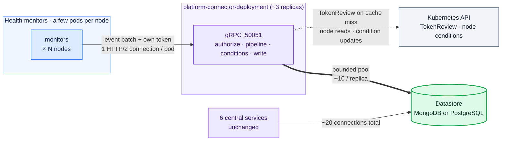
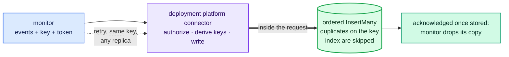
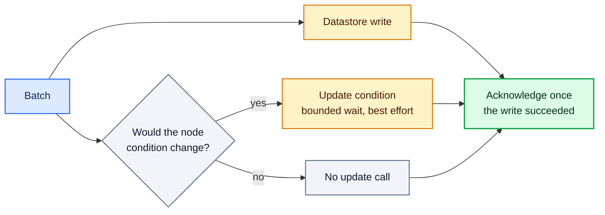
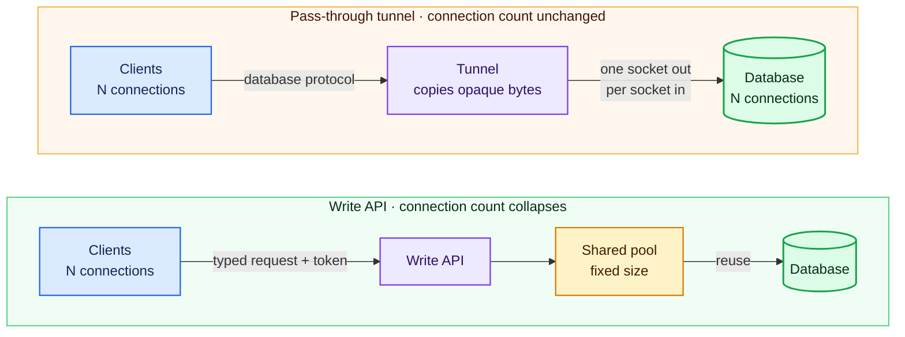

# ADR-052: Deployment Platform Connector

## Summary

- **This mode is not the default.** It is for clusters above roughly 20,000 nodes, where the platform connectors' database connections start to use too much memory on the MongoDB primary and keep growing with every node added. Smaller clusters should stay on the DaemonSet setup.
- Every platform connector pod opens about 3 database connections, and all of them land on the MongoDB primary. At 100,000 nodes that is about 300,000 connections, and the primary needs a 91 GiB memory limit to carry them and still do its normal work ([issue #1595](https://github.com/NVIDIA/NVSentinel/issues/1595)).
- With this mode, health monitors send their events straight to a small central Deployment, the **deployment platform connector**, over gRPC, each with its own ServiceAccount token, instead of to the platform connector pod on their own node.
- The central service does the same work as today (pipeline, node condition updates, datastore writes), but through a small fixed pool of database connections, so connections stop growing with the fleet. It answers a monitor only after the batch is stored and, when the batch changes the node's condition, after that update too. It keeps no queue of its own, so a crash loses nothing and each monitor's events stay in order.
- Monitors now send over the network and several replicas share the work, so one protection is added: every batch carries an idempotency key, so a batch that is sent twice is never stored twice.
- This is an experimental feature that Helm flags turn on and off.

## Contents

- [Context](#context)
- [Decision](#decision)
- [Implementation](#implementation)
  - [Architecture](#architecture)
  - [Changes from the DaemonSet role](#changes-from-the-daemonset-role)
  - [Write API](#write-api): [Delivery guarantees](#delivery-guarantees), [Idempotency](#idempotency), [store-client changes](#store-client-changes)
  - [Authentication](#authentication): [Transport security and observability](#transport-security-and-observability)
  - [Node condition updates](#node-condition-updates)
  - [Event pipeline](#event-pipeline)
  - [Scaling and availability](#scaling-and-availability): [Connections](#connections), [TokenReview load](#tokenreview-load)
  - [Configuration](#configuration)
  - [Future scope: pass-through tunnel](#future-scope-pass-through-tunnel), [Future scope: shared node informer](#future-scope-shared-node-informer), [Future scope: persistent queue](#future-scope-persistent-queue)
- [Rationale](#rationale)
- [Consequences](#consequences)
- [Alternatives Considered](#alternatives-considered)
- [References](#references)
- [Appendix: tunnel versus write API](#appendix-tunnel-versus-write-api)

## Context

This ADR adds a deployment mode to the platform connector so that database connections stop growing with the fleet.

Every NVSentinel component that needs the datastore connects to MongoDB (or PostgreSQL) through the shared `store-client` library. Most of them are small, single-replica Deployments. The platform connector is different: it runs as a DaemonSet, one pod on every node, and each pod opens its own database connections (about 3, all to the MongoDB primary). Each open connection costs roughly 0.27 MiB of database memory even when idle, so the count grows with the fleet:

| Fleet size    | Connections from platform connectors | Memory those connections take on the primary |
|---------------|--------------------------------------|----------------------------------------------|
| 1,000 nodes   | ~3,000                               | ~0.8 GiB                                     |
| 10,000 nodes  | ~30,000                              | ~8 GiB                                       |
| 20,000 nodes  | ~60,000                              | ~16 GiB                                      |
| 100,000 nodes | ~300,000                             | ~79 GiB                                      |

The platform connector only inserts health events; it never reads. The six central services (fault-quarantine, node-drainer, health-events-analyzer, fault-remediation, event-exporter, csp-health-monitor) use change streams and queries, hold about 20 connections no matter how big the fleet is, and are not touched by this design. (Two of them also publish health events, so their publish path changes like any monitor's.)

## Decision

Run the platform connector as a small central Deployment, the **deployment platform connector**. Health monitors send their health events directly to it over gRPC and authenticate every request with a projected ServiceAccount token. For each batch it runs the event pipeline, writes the events to the datastore through `store-client` with a small fixed connection pool, updates the node condition when the batch changes it, and only then acknowledges. It keeps no queue of its own. A monitor that gets no acknowledgement retries with backoff, as it does today. The per-node DaemonSet is no longer needed. The six central services keep connecting to the database directly.

Acknowledging only after the write is what keeps events in order. A monitor sends its next batch only after the previous one is acknowledged, so a batch is in the datastore before the next one leaves the monitor, whichever replica handles it. It also means a replica never holds anything a monitor considers delivered, so a crash or restart loses nothing.

One global flag turns the mode on, and a per-monitor flag chooses where each monitor publishes. How to roll this out across a fleet (ordering, staging, rollback) is out of scope here and will be designed separately once the end state is agreed.

In this document, "deployment platform connector" means the platform connector running as this central Deployment. Its Kubernetes objects are named `platform-connector-deployment` so they cannot collide with the DaemonSet's.

## Implementation

### Architecture



The write path's connection count no longer depends on fleet size: at 100,000 nodes it drops from roughly 300,000 connections to a few dozen. Each server replica holds about 10 pooled connections plus a few monitoring connections, about 16 per replica or 50 across 3. The central services keep their ~20.

### Changes from the DaemonSet role

The central role reuses the gRPC service, event pipeline, k8s connector and store connector as they are, and adds the changes below. Anything not listed here works as it does today.

| Change for the central role | Why |
|-----------------------------|-----|
| No queue: the request handler calls the store connector and the k8s connector directly, in parallel, and acknowledges when both have finished | Today a consume loop feeds each of them from an unbounded in-memory queue, and the pod acknowledges before writing. That is fine for one node but not for the fleet: a datastore outage would fill the pod, a crash would lose everything queued, and with several replicas a monitor's batches could be stored out of order (["Delivery guarantees"](#delivery-guarantees)). The connectors' own code is unchanged, and the optional external gRPC sink (ADR-033) is called the same way, with a bounded wait and best effort |
| TCP listener with TLS, serving the same `PlatformConnector` gRPC service | Replaces the node-local Unix socket |
| Node scope comes from the caller's token | Today the pod checks that a caller's token belongs to the node the pod itself runs on. A central replica runs on no particular node, so it reads the node from the token and accepts only events that name that node (["Authentication"](#authentication)) |
| Per-event idempotency keys | Monitors retry over the network, so a batch whose acknowledgement was lost is sent again and must be detectable (["Idempotency"](#idempotency)) |
| The store connector no longer requires a node name | A central pod is not tied to one node |
| Connections are closed after a set age or a set idle time, and shutdown waits a bounded time for open connections | Closing connections after a while lets monitors spread back across replicas (["Connections"](#connections)); the bounded wait stops one unresponsive client from blocking shutdown |
| Node conditions are updated only when the batch would change them | A batch that repeats what the node already shows, including a resend, gets no update call, which saves the call and its latency (["Node condition updates"](#node-condition-updates)) |
| An ingress NetworkPolicy for the gRPC port | Namespaces with default isolation would otherwise block it |

### Write API

Monitors call the same `PlatformConnector` gRPC service as today, just at the `platform-connector-deployment` Service address instead of the socket path.

#### Delivery guarantees

- The acknowledgement means stored. The server writes the batch to the datastore inside the request and acknowledges only when the write has succeeded. Today's acknowledgement means accepted and queued; this one is stronger, and monitors need no change to benefit from it.
- One monitor's events are stored in the order it sent them, on any replica. The monitor sends one batch at a time and waits for the acknowledgement, so a batch is in the datastore before the next one is sent. Different monitors on the same node are not ordered against each other, but they never were, and they report different checks. Consumers therefore see each check's events in order and need no staleness check.
- The monitor's client retries a failed or unanswered send with backoff for a time window (minutes by default) and then drops the batch and counts the drop. That is the same bounded best effort a monitor has today. The window is sized to ride out replica restarts, rollouts and a MongoDB primary election, and the request timeout leaves room for the datastore write and a node condition update. If a monitor crashes, the batches waiting in its client are lost; that is accepted, as it is for the platform connector's in-memory queue today. The idempotency key makes a repeated send safe (["Idempotency"](#idempotency)).
- The server keeps nothing between requests, so a replica crash or restart loses nothing a monitor considers delivered. A datastore outage is felt by the monitors directly: their sends fail, they retry within their window, and if the outage outlasts the window they drop, as they do today when the platform connector pod on their node cannot write. There is no second buffer in the server; ["Future scope: persistent queue"](#future-scope-persistent-queue) records how one could be added later.
- The node condition update runs in parallel with the write and is best effort; the write alone decides the reply (["Node condition updates"](#node-condition-updates)).

#### Idempotency

Clients retry, so a batch could be stored twice if the server stored it but the acknowledgement got lost on the way back, for example because the monitor's request timed out while the write was still finishing. Every batch therefore carries a client-generated idempotency key in the `idempotency-key` gRPC header (the standard [HTTP Idempotency-Key](https://developer.mozilla.org/en-US/docs/Web/HTTP/Reference/Headers/Idempotency-Key) semantics). The database enforces the key, because a retry may reach a different replica.

The key is enforced per event rather than per batch, because MongoDB can store part of a batch and fail the rest. The server builds each event's key from the caller's pod UID, the client's key and the event's position in the batch, so two callers can never collide. A partial unique index rejects duplicates, and a duplicate on that index counts as success, so a retry inserts only the events that are still missing. The key is mandatory, its format is checked, and the server always writes the key into the stored event itself; it never trusts a key already present in an incoming event.

- A client uses one key per batch and keeps using that same key every time it retries that batch. It must also send the same events with it, because the server only compares keys; it never compares the events themselves. If a client reused a key for a different batch, that batch would be silently treated as a duplicate and dropped.
- The unique index must exist before any replica writes, otherwise duplicates from that time would never be caught. So a small Job that ships with the Helm release creates the index once, and every replica checks that the index is really there, with the right field, uniqueness and filter, before it reports itself ready. A replica that is not ready receives no traffic, so no client can write before the guarantee is in place. It is a plain Job, not a Helm hook: replicas are not ready until the index exists, and a post-install hook runs only once the pods are ready, so the two would wait for each other. The index definition lives once in `store-client`, shared by the Job and the replicas' readiness check, and covers PostgreSQL too.
- The index is partial: it only covers documents that have the key field. The millions of events written before this change have no key, so they are left alone and nothing has to be rewritten. Both MongoDB and PostgreSQL support this kind of index.

**Normal write and retry:**



#### store-client changes

1. Make pool limits configurable (MongoDB uses the driver default of 100 today; PostgreSQL is hardcoded to 25).
2. Add an ordered `InsertMany` that skips a duplicate on the idempotency index and carries on with the rest, and stops at any other failure, naming the violated index. Ordered, because MongoDB keeps the order of a batch only for ordered inserts, and a batch can hold a fatal and a later healthy event for the same check that consumers must see in that order. A resend costs one extra round trip per duplicate. PostgreSQL inserts the rows one at a time in the same order.
3. Add a small index-management operation: create once, verify the full definition.

### Authentication

Monitors authenticate exactly as they do on the socket today (ADR-030): a projected ServiceAccount token on every request, checked through TokenReview, with the same cross-node allowlist for the four components that report about other nodes (csp-health-monitor, kubernetes-object-monitor, slurm-drain-monitor, health-events-analyzer). The check moves to the central service under its own audience, so the event path still has exactly one token validation. Three things change:

- Every caller must present a token. The socket accepted callers with no credential and filled in its own node name for them. Over the network there is no local node to fall back on, so a batch without a pod-bound token is rejected.
- Node scope comes from the token instead of the connector. The socket checked that a token's node claim matched the node it was running on. The central service has no node of its own, so it pins each batch to the node named in the caller's token.
- The option to fall back to node-local scope when TokenReview is unavailable has no central equivalent. The server rejects requests and clients retry within their windows.

#### Transport security and observability

Tokens now cross the pod network, so TLS is required. Both the chart and the server refuse a plaintext listener unless an explicitly named insecure development mode is set. Cert-manager issues the certificate, and the server picks up rotated certificates without a restart. A NetworkPolicy lets only publisher pods reach the gRPC port; every publishing component labels its pods for this, including health-events-analyzer and csp-health-monitor.

A replica is ready when the idempotency index is verified. Replicas stay ready during a datastore outage, so the Service never empties. The signals to alert on are request latency, failed writes, and condition updates that failed or ran out of time.

### Node condition updates

The k8s connector code is unchanged. What changes is when it runs and what the reply waits for:

- The condition update runs inside the request, in parallel with the datastore write, and the acknowledgement waits for both. A monitor sends its next batch only after the acknowledgement, so its condition updates land in the order it sent them, on any replica.
- A replica updates the node only when the batch would change what the node already shows: a check going from healthy to unhealthy or back, a new fault joining an existing one, or one of several faults clearing. It decides that by reading the node's current condition, as the k8s connector does today before every update, and comparing the batch with it. Everything else is a repeat of what the node already shows, and a repeat gets no update call. Monitors differ here: some report on every cycle, so most of their events are repeats; the GPU and NIC monitors report only changes, so nearly every event of theirs is a transition. Either way a resend of the same batch never updates the node twice.
- Condition updates are best effort, as they are today. The replica keeps the k8s connector's existing retries for conflicts and passing errors, inside a short, bounded wait. If the update still fails after the write succeeded, the batch is acknowledged and the failure is counted. The node then shows the old state until the monitor next reports that entity: on the next cycle for a monitor that repeats, or at the next change or restart for one that reports only changes. Fault-quarantine and node-drainer work from the datastore, so a stale condition never causes a wrong cordon or drain.
- One narrow case can leave a condition wrong the same way: a monitor's request times out on a slow replica, the monitor resends to another replica, and the slow replica's older update lands last. The node shows the older state until the monitor next reports that entity, as above.
- Kubernetes Event objects follow the same rule: written on changes only, best effort.



### Event pipeline

The pipeline (transformation, dedup, metadata enrichment) runs unchanged in the central service, inside the request and before the writes, so its stages must stay quick: anything slow added to the pipeline later would slow every acknowledgement. Two details change:

- Node metadata is read from the Kubernetes API and cached as today. The cache and the client's rate limit are sized for the whole fleet instead of one node, so the API server sees the same number of reads as today, now from three pods. A metadata miss never blocks storage.
- Each replica keeps its own dedup state, so with 3 replicas the same duplicate can slip through up to 3 times per window. Dedup never drops datastore writes; it only stops duplicates from triggering cluster changes (ADR-039). So duplicates may reach remediation checks more often, but they do not add stored events. Whether downstream remediation tolerates that is checked before the switchover.

### Scaling and availability

#### Connections

Any replica can serve any request, because every durable fact lives in the database. So the service scales horizontally, and each added replica costs about 16 database connections. The pool has to cover the writes in flight at once, since writes now happen inside requests; that is still a small fixed number per replica, set by the load test. The plain ClusterIP Service balances connections, one replica per connection, with no extra load balancer. Each monitor pod holds one HTTP/2 connection, so at 100,000 nodes each of 3 replicas holds about 100,000 connections. A gRPC connection costs tens of kilobytes of server memory (its read and write buffers, both tunable), so this comes to several GiB per replica at default buffer sizes. It is part of the pod sizing, and the load test measures it.

A monitor stays on the same replica for as long as its connection lives, and two server settings bound that lifetime. `MaxConnectionAge` makes the server close a connection once it has been open for a set time (minutes, with some randomness so that connections do not all expire together). The client reconnects at once, and the Service picks a replica afresh, which may be a different one. This is what spreads monitors back across replicas after a rollout, without any coordination. `MaxConnectionIdle` makes the server close a connection that has carried no requests for a set time, freeing its memory; a monitor that publishes every minute never reaches it. The expected ingest is one small batch per monitor pod per check interval, a few thousand batches per second across the fleet; the load test runs at these rates.

#### TokenReview load

The same token validations move from the socket to the central service, one cached validation per token per two-minute cache window, so the volume does not grow. At the 100,000-node target with about three monitor pods per node (~300,000 caller tokens):

| Fleet activity                                | TokenReviews per second |
|-----------------------------------------------|-------------------------|
| Every pod writes in every window (worst case) | ~2,500 (~830 per replica at 3 replicas) |
| 5% of pods write per window                   | ~125                    |
| Reconnect wave, transient until caches rewarm | ~2,500 fleet-wide (~830 per replica at 3 replicas) |

We plan for the worst case, because dedup does not stop monitors from sending. Two of today's constants become configuration: the cache capacity (every token in the fleet plus the extra ones that exist while tokens rotate, about 450,000 entries per replica instead of today's fixed 4,096) and the TokenReview client's QPS and burst. The connection age limit must stay well above the cache window: if monitors moved between replicas more often than that, most validations would land on a replica that has not cached their token yet.

### Configuration

```yaml
global:
  platformConnectorDeployment:   # facts the server and every publisher share
    grpcPort: 50051
    tls:
      mode: required   # cert-manager issued certificate; the only alternative is
                       # the explicitly named insecureDevelopmentMode
    auth:
      audience: "platform-connector-deployment.nvsentinel.nvidia.com"
      tokenExpirationSeconds: 3600

platformConnector:
  deployment:
    enabled: false     # the switchover flag; deploys the deployment platform
                       # connector and its index migration Job
    replicas: 3
    auth:
      crossNodePublishers: []   # override for the derived list of components
                                # allowed to name other nodes
    datastore:
      maxPoolSize: 10   # database connections per replica; must cover the
                        # writes in flight at once
  daemonset:
    enabled: true      # turn off once every monitor publishes to the deployment

gpuHealthMonitor:      # every monitor chart exposes the same knob
  publishTo: socket    # socket | deployment
```

Tuning values (the standard gRPC request limits, the wait for a condition update, cache capacities, Kubernetes and TokenReview client rates) are configuration, chosen during implementation and the load test. The only ordering rule this ADR sets is that the index migration Job and server readiness come before monitor traffic, and the readiness gate enforces that. Everything else about the transition, including when the DaemonSet's flag is turned off, belongs to the separate rollout design.

### Future scope: pass-through tunnel

Later, an authenticated TCP pass-through tunnel (see ["Appendix: tunnel versus write API"](#appendix-tunnel-versus-write-api)) could carry the central services' database traffic: the server would validate a token per connection and then copy bytes without looking at them, so change streams, transactions and the database's end-to-end TLS keep working. It would not reduce connection counts, so it is out of scope for now. Its value is network control: one controlled path to the database, an identity check for clusters that do not enforce NetworkPolicies, and a Kubernetes identity behind every database connection.

### Future scope: shared node informer

The central replicas read nodes from the Kubernetes API to enrich events (through a cache) and before updating a condition, as each pod does today, so the mode does not change how many reads the API server sees. Later, one shared node informer per replica could replace those reads with a single watch and local lookups, taking the read off the acknowledgement path and cutting the API calls. It is not needed for the mode to work.

### Future scope: persistent queue

If a datastore outage longer than the monitors' retry window ever has to be survived without loss, a persistent queue can be added in front of the write, together with the delivery guarantees it would need. Nothing in this design blocks that: the write sits behind the store connector, which is where a queue would go.

## Rationale

- Database connections stop growing with the fleet: at 100,000 nodes the write path drops from roughly 300,000 connections to about 50, and the central services are unchanged.
- The central role reuses the existing gRPC service, token stack and `store-client`, so behavior stays the same as today. A proof of concept ran the central role end to end on a kind cluster, with the earlier queued write path.
- Writing inside the request keeps the server stateless, so there is no queue to bound, drain or make durable, and no coordination between replicas.
- Database credentials leave the fleet: no per-node pod carries one, and rotating the write path's credential touches 3 pods instead of every node.
- No dependency on an unmaintained third-party proxy (mongobetween), and PostgreSQL benefits just as much.

## Consequences

### Positive

- Database connections, and the memory they cost, stop growing with the fleet.
- Write access is tied to each publisher's identity and its own node, wherever the token is used. No per-node pod carries a database credential.
- The read path is untouched. An outage of the deployment platform connector delays writes but cannot affect change streams or the central services.
- The server holds nothing a monitor considers delivered, so a replica crash loses nothing, and each monitor's events are stored in order.

### Negative

- The write path now depends on one central service. If it is down, every monitor's writes stop at once and the whole fleet buffers in its clients for the retry window, where today a platform connector pod failure affects only its own node.
- Custom or token-less socket publishers, and the injected preflight checks that run under tenant ServiceAccounts, cannot publish to the central service as they are, because they cannot be put on the allowlist. Each must be deprecated together with the socket, keep a thin node-local shim, or get its own identity and a network rule that lets it in. That decision is outside this ADR but has to be made before the DaemonSet is removed.
- The server keeps no buffer. A datastore outage is felt by every monitor at once, a MongoDB primary election shows up as a burst of retries, and an outage longer than the monitors' retry window loses events at the edge, as it does today.
- Node condition updates are best effort, and when a batch changes the node they add Kubernetes API latency to the acknowledgement. After a failed update or a client time-out a condition can be wrong until the monitor next reports that entity, which for a monitor that reports only changes can be a long time.

### Mitigations

- The load test at the modeled rates is the gate before any switchover, and the mode is off by default.
- The shared Go and Python clients carry the one-at-a-time sending, retry and key logic once, and the per-monitor flag lets monitors switch one at a time.
- Every drop and failure is counted where it happens (client drops, failed writes, condition updates that failed or ran out of time). A persistent queue is recorded as future scope in case client-side retries turn out to be too tight.
- Repeats need no update call, the condition update keeps its existing retries inside a bounded wait, and fault-quarantine and node-drainer never depend on conditions, so a stale condition is a display problem, not a remediation problem.

## Alternatives Considered

### Acknowledge when queued, write later

**Rejected.** Earlier drafts of this design kept today's reply: the server acknowledged a batch as soon as it was queued and wrote it later from an in-memory queue. Run centrally, that needed a lot of machinery: bounds and per-node quotas on the queue, a drain step before every planned stop, a server-side retry window, forced-drop metrics, and a per-fault watermark inside each node condition so that several replicas could update conditions safely. It still lost every queued batch on a crash. And it could store a monitor's events out of order: when a monitor's connection moved to another replica while the old one was behind, the newer batch was written first, and fault-quarantine reacts to events in the order they are stored. Writing inside the request removes all of that for a slightly longer reply.

### Sequence numbers with gap filling

**Rejected.** Keep the queue, number every batch per monitor, and have each consumer (fault-quarantine, health-events-analyzer, the condition writer) hold an event back until the numbers before it have arrived, the way TCP reassembles packets. It gives exact order when nothing is lost. But every consumer has to carry the reassembly logic and remember its position per monitor, and because a monitor gives up on a batch after its retry window, a gap can be permanent. The consumer then needs a give-up timer of several minutes, during which every later event from that monitor waits: a fatal event stuck behind a lost one would wait minutes before anyone cordons the node.

### Pinning each node to one replica

**Rejected.** Give the replicas stable names and have each monitor pick its replica by hashing its node name, so one replica is the only writer for a node, as the DaemonSet pod is today. Order per node holds while that replica is up. But every rollout, crash or node drain takes it down, and then either the nodes pinned to it stop publishing until it is back, so a third of the fleet pauses on every restart, or they fail over to another replica and the ordering problem comes straight back. The safe version needs a hand-off protocol in the database, and the four components that report about many nodes would have to split each batch by node and hold a connection to every replica.

### Node conditions from a change-stream consumer

**Deferred.** A consumer reading the datastore's change stream could update node conditions in exact storage order and survive restarts through resume tokens. It would be new stateful code, a fourth reader of the whole event stream, and it would make the datastore a hard dependency for node conditions, which today are updated even when the datastore is down. Updating conditions inside the request keeps that independence. If best-effort conditions ever prove insufficient, this is the way to make them durable.

### mongobetween

[mongobetween](https://github.com/coinbase/mongobetween) is the third-party MongoDB connection pooler that issue #1595 originally proposed. **Rejected** for four reasons. Clients cannot authenticate to it: its handshake offers no authentication, so the database credentials inside the proxy would be protected only by network reachability. It is built for `mongos` shard routers, and its README says direct replica set use is not battle tested, while NVSentinel's default deployment is a replica set. It is MongoDB-only, while NVSentinel also supports PostgreSQL. And it has been unmaintained for about two years (Go 1.18, reflection into driver internals, a MongoDB 4.2 wire-version handshake). Its lessons and parts of its code remain reusable (Apache 2.0) if a pooled MongoDB-protocol endpoint is ever needed.

## References

- [Issue #1595: Deploy a MongoDB connection proxy to keep connection count constant as fleet scales](https://github.com/NVIDIA/NVSentinel/issues/1595)
- [mongobetween](https://github.com/coinbase/mongobetween) and Coinbase's [scaling write-up](https://blog.coinbase.com/scaling-connections-with-ruby-and-mongodb-99204dbf8857)
- [ADR-033: gRPC Sink Connector for Platform-Connectors](033-grpc-sink-connector.md)
- [ADR-030: gRPC TLS and Authentication for Janitor-Provider Connection](030-grpc-tls-authentication.md)
- [Publisher authentication reference](../configuration/authentication.md)
- [ADR-002: Storage Layer Selection](002-storage-layer-selection.md)

## Appendix: tunnel versus write API

A service between clients and a database can work in one of two ways, and the choice decides whether it can reduce database connections.

A **pass-through tunnel** copies bytes in both directions without interpreting them. Database features (change streams, cursors, transactions, end-to-end TLS) keep working because the protocol is unchanged, but each client connection still needs its own database connection. A tunnel gives a controlled network path, not fewer connections.

An **API in front of the database** accepts application-level requests instead of database-protocol connections: a client sends a typed request with its token, and the API does the write through a small shared pool. Because it understands each request, it can serve 100,000 clients with a handful of database connections. The trade-off is that it supports only the operations it implements.



The write path needs the API approach because it is the only option that reduces connections as the fleet grows. The tunnel stays future scope for network control.
