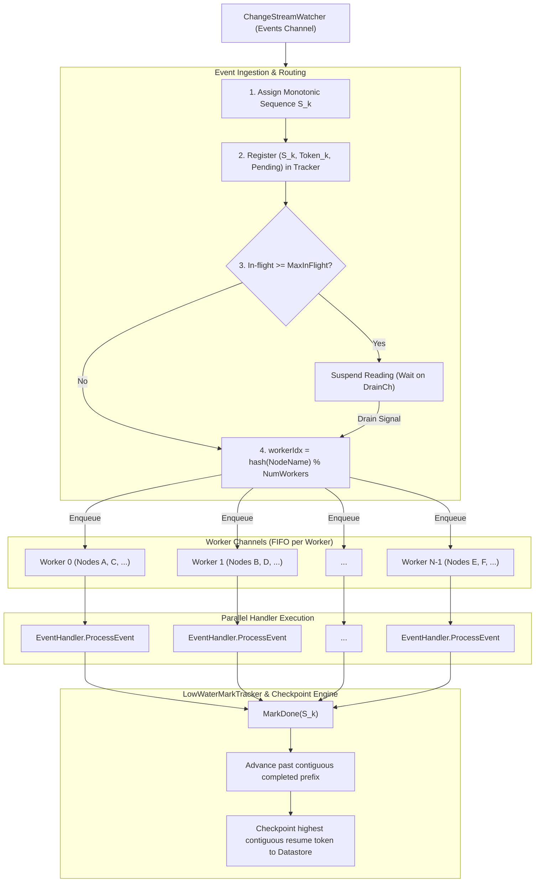

# ADR-056: `Performance` — Concurrent Node-Partitioned Event Processing

## Table of contents

- [Context](#context)
- [Decision](#decision)
- [Implementation](#implementation)
- [Rationale](#rationale)
- [Consequences](#consequences)
- [Alternatives Considered](#alternatives-considered)
- [Testing](#testing)
- [Rollout](#rollout)
- [References](#references)

## Context

`health-events-analyzer` monitors the database change stream for incoming health events, correlates them over time windows via rule-driven database aggregation queries, and emits synthetic remediation events when failure patterns match configured rules.

In production and scale testing, `health-events-analyzer` operates on a strict serial processing loop. Metrics benchmarked in issue #1800 indicate:
- Handling duration per event averages **17.67 ms** (sum 1,838.81 s over 104,090 events).
- Wall-clock time remains constant (17.5–19.4 ms) across offered rates from 1.8 to 55 events/s.
- This creates an effective processing ceiling of approximately **57 events/s** per replica.
- Most of the 17.67 ms is spent in database network round-trips (I/O wait) executing aggregation pipelines; CPU usage accounts for only ~5.8 ms per event.
- Vertical scaling (allocating more CPU/memory cores) does not increase throughput because execution is I/O-bound in a single synchronous `for/select` loop.
- Horizontal scaling (`replicaCount > 1`) is unsupported: there is no partitioning or leader election; all replicas share a single resume token keyed by `clientName: health-events-analyzer`, leading to duplicate execution and conflicting checkpoints.
- At an ambient rate of 0.1 events per node per second, a single replica saturates at ~570 nodes. A 100,000-node fleet implies an offered load of 10,000 events/s against a 57 events/s ceiling.

PR #1676 established the prerequisite for parallelization: it enforced a mandatory same-node filter (`healthevent.nodename: <incoming_event.nodename>`) as the first stage of every rule pipeline. Events for different nodes do not influence each other's evaluations.

## Decision

1. **Partition events by node across a concurrent worker pool**:
   Events are hashed by `healthevent.nodename` into dedicated FIFO worker channels. Events for the same node are processed serially in strict chronological order; events for distinct nodes are processed concurrently across $N$ workers.
2. **Implement low-water mark checkpointing**:
   Because concurrent execution allows out-of-order completion across nodes, the change stream resume token must not be updated to whichever event finished last. The resume token is advanced only to the highest contiguous sequence number where every earlier event has been fully resolved (completed or marked processed per error policy).
3. **Encapsulate concurrent processing in `store-client`**:
   The concurrent processor is implemented in `store-client/pkg/client` as `PartitionedEventProcessor`, satisfying the existing `client.EventProcessor` interface.
4. **Preserve strict backward compatibility**:
   Worker count defaults to `1` in `EventProcessorConfig` and Helm charts (`workers: 1`). When `workers <= 1`, behavior remains single-threaded.

## Implementation

### Architecture Overview

### Key Components

1. **`LowWaterMarkTracker`** (`store-client/pkg/client/low_water_mark.go`):
   - Maintains an ordered sequence of in-flight events.
   - Assigns ascending sequence numbers $S_1, S_2, \dots$.
   - On `MarkDone(seq)`, marks the sequence resolved.
   - Scans from the head of the window; pops contiguous resolved events and returns the latest contiguous resume token.
   - Thread-safe via `sync.Mutex`.

2. **`PartitionedEventProcessor`** (`store-client/pkg/client/partitioned_event_processor.go`):
   - Implements `client.EventProcessor`.
   - Manages $N$ worker goroutines and per-worker buffered channels.
   - Maps events to workers via `hash(nodeName) % N` using FNV-32a. Events without a node name route to worker 0.
   - Enforces backpressure: when uncheckpointed in-flight events reach `MaxInFlight`, suspends reading from the watcher. Note that `MaxInFlight` bounds registered in-flight events; upstream buffers (including the PostgreSQL watcher and adapter channels of up to 100 events each) and materialized payloads can also reside in memory.
   - Handles poison events vs transient errors: when `MarkProcessedOnError=true` (as in `health-events-analyzer`), only terminal poison errors (such as unmarshaling failures or document ID errors) are marked resolved in the tracker to prevent stream stalling. Transient conditions—specifically context cancellations (`context.Canceled`) and timeouts (`context.DeadlineExceeded`)—are never marked as completed, ensuring the low-water mark does not advance past them and that they are retried on pod restart rather than permanently lost.
   - Preserves checkpoint ordering: serializes watermark advancement and datastore writes under a checkpoint mutex, and retains unpersisted checkpoint tokens for shutdown retry.

3. **`health-events-analyzer` Integration**:
   - `health-events-analyzer/main.go`: adds CLI flags `--workers` (default `1`) and `--max-in-flight` (default `1000`).
   - `health-events-analyzer/pkg/reconciler/reconciler.go`: configures `EventProcessorConfig.Workers` and `MaxInFlight`.
   - `distros/kubernetes/nvsentinel/charts/health-events-analyzer/values.yaml`: adds `workers: 1` and `maxInFlight: 1000`.

## Rationale

- **Node Scoping Is Enforced:** PR #1676 added mandatory same-node `$match` stages to all analyzer rules. Events on Node A can never satisfy or affect evaluations on Node B. Parallelizing across nodes is logically sound.
- **Node-Keyed FIFO Maintains Invariant:** Hashing node names to dedicated worker channels guarantees that events on the same node are handled sequentially, preventing duplicate remediation triggers or out-of-order state transitions.
- **Low-Water Mark Prevents Data Loss:** If a pod restarts while Worker 2 has finished Event 2 but Worker 1 is still processing Event 1, checkpointing Token 2 would permanently lose Event 1. Low-water marking guarantees that only contiguous completed prefixes are checkpointed.
- **`store-client` Abstraction:** Keeping the concurrency and checkpointing logic inside `store-client` makes it independently testable, reusable across other change stream consumers, and decoupled from analyzer business logic.

## Consequences

### Positive
- **Linear Throughput Scaling:** With $N$ workers, maximum throughput increases from ~57 events/s to $\approx N \times 57$ events/s (e.g., 16 workers yield ~900 events/s; 64 workers yield ~3,600 events/s).
- **Zero Query Semantic Changes:** No database queries, rule configurations, or aggregation pipelines need modification.
- **Contained Memory Usage:** `MaxInFlight` backpressure bounds registered in-flight events during database latency spikes. Note that heap usage is not bounded by `MaxInFlight` alone; it also includes upstream datastore buffers (such as the PostgreSQL watcher and adapter channels buffering up to 100 events each) and variable-sized event payloads materialized prior to registration.

### Negative
- **Increased Datastore Connection Concurrency:** $N$ concurrent workers make $N$ simultaneous aggregation queries. The database connection pool must support this concurrency.
- **Potential Head-of-Line Blocking per Worker:** A very slow query on Node A may delay Node C if both hash to the same worker.

### Mitigations
- **Event Timeouts:** Per-event timeout enforcement is opt-in via `EventProcessorConfig.EventTimeout`. It is disabled when unset or non-positive (`<= 0`) so existing handlers run without synthetic timeouts unless explicitly configured.
- **Sized Connection Pool:** The datastore connection pool defaults in `store-client` accommodate concurrent operations; default worker count is conservative (`workers: 1`).

## Alternatives Considered

### 1. Multiple Replicas with Sharded Streams
**Rejected for now** because: MongoDB change streams do not natively partition by document key across distinct consumer groups without sharded collections and separate resume tokens. Adding sharding across replicas introduces distributed coordination, whereas node-partitioned concurrency inside a single replica achieves the required scale without distributed state.

### 2. Multi-Rule Aggregation Merging
**Complementary, not mutually exclusive.** Merging rules that share `$match` criteria into single `$facet` pipelines reduces MongoDB round trips. However, serial execution would remain capped by the latency of that merged query. Partitioning provides the structural fix.

## Testing

- Unit tests in `store-client/pkg/client/low_water_mark_test.go`:
  - Watermark advances only when the lowest incomplete sequence resolves.
  - Out-of-order completions (e.g., sequences 3, 2, 1) properly return token 3.
  - Gaps in completion hold the watermark at the gap.
  - High concurrency stress test with `-race`.
- Unit tests in `store-client/pkg/client/partitioned_event_processor_test.go`:
  - Verify same-node events execute sequentially.
  - Verify different-node events execute concurrently.
  - Verify backpressure blocks consumption when `MaxInFlight` is reached.
  - Verify terminal poison errors advance the watermark under `MarkProcessedOnError=true`.
  - Verify transient timeouts (`context.DeadlineExceeded`) and context cancellations are never checkpointed as processed.
  - Verify worker channels discard buffered tasks on cancellation during shutdown.
  - Verify serialization of watermark advancement and datastore checkpointing under `checkpointMu`.
  - Verify unpersisted checkpoint tokens are retained and retried on shutdown with a bounded context.
- Integration tests in `health-events-analyzer/pkg/reconciler/reconciler_test.go`:
  - Verify reconciler initializes and processes events under multi-worker configuration.
  - Verify rule matching, synthetic remediation event generation, and gRPC publishing.

## Rollout

1. Merge `store-client` changes with default `Workers: 1`.
2. Update `health-events-analyzer` to wire the new options with Helm default `workers: 1`.
3. Enable `workers: 16` in staging and scale environments to benchmark throughput under load.

## References

- ADR-007: Intelligence — Health Event Correlation
- ADR-054: Observability — change stream consumer lag metrics
- GitHub Issue #1800: Let health-events-analyzer process events concurrently, partitioned by node
- GitHub PR #1676: feat(health-event-analyser): scope HEA rules to incoming event's node
