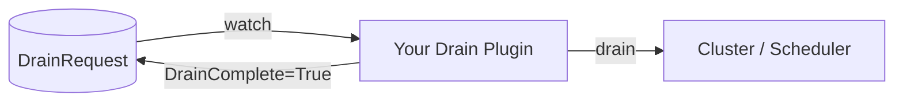

# Tutorial: Writing a Drain Plugin

This tutorial walks you through building a **drain plugin** with
[Kubebuilder](https://book.kubebuilder.io) — from `kubebuilder init` to a deployed controller that
drains a node on NVSentinel's behalf.

By the end you will have:

- A Kubebuilder project whose controller reconciles **`DrainRequest`** custom resources and drains a node.
- A **custom drain policy** the built-in drainers don't have: it **only drains on allowed weekdays**
  and defers (requeues) otherwise — showing how a plugin gates a drain instead of just deleting pods.
- A container image for it, built and deployed with the generated `make` targets.
- Verification of **both paths** — a deferred drain and a completed drain — by flipping one env var.

> **Who is this for?** Teams **already running NVSentinel** who need NVSentinel's drain step to
> hand off to a custom plugin (Slurm, NVCF, a custom workload manager, …) instead
> of evicting pods directly.

> **Just want the AI to do it?** Jump to [Appendix: One-shot AI prompt](#appendix-one-shot-ai-prompt).

---

## Prerequisites

- **`go`** 1.24+ — builds the controller.
- **`kubebuilder`** 4.x — scaffolds the project. It vendors `controller-gen` and `kustomize`
  through the generated `Makefile`, so you don't install those separately.
- **`docker`** — builds and pushes the container image (`make docker-build docker-push`).
- **`kubectl`** with access to any Kubernetes cluster — deploys and verifies the plugin
  (`make deploy`).

Install Kubebuilder if you don't have it:

```bash
# https://book.kubebuilder.io/quick-start#installation
curl -L -o kubebuilder "https://go.kubebuilder.io/dl/latest/$(go env GOOS)/$(go env GOARCH)"
chmod +x kubebuilder && sudo mv kubebuilder /usr/local/bin/
```

---

## 1. What is a drain plugin

NVSentinel remediates a faulty node in stages: **detect → quarantine (cordon) → drain →
remediate**. The **drain** stage is owned by the **node-drainer**. By default node-drainer
evicts pods itself (built-in modes: `Immediate`, `AllowCompletion`, `DeleteAfterTimeout`).

That is not always enough. Some clusters need the drain coordinated by custom policies. A **drain
plugin** lets you replace node-drainer's eviction step with your own logic.

When **custom drain** is enabled, node-drainer no longer evicts pods. Instead it:

1. Renders a Go template you ship (a **drain-template** ConfigMap) into a **`DrainRequest`**
   custom resource — **one per health event**
2. **Polls** that `DrainRequest`'s status, waiting for a configured condition
   (`DrainComplete=True`).
3. Once the condition is set, marks the drain complete and **deletes** the `DrainRequest`.

Your plugin is a standard **Kubernetes controller** that reconciles `DrainRequest` objects: do
whatever draining your environment needs, then set `status.conditions[DrainComplete]=True`.



You ship **two things** and flip **one switch**:

| You ship | What it is |
|----------|------------|
| A **controller** | Reconciles `DrainRequest`, drains, sets `DrainComplete=True`. |
| A **drain-template ConfigMap** | Tells node-drainer how to render a `DrainRequest` from a health event. |
| **node-drainer Helm values** | `customDrain.enabled=true`. |

---

## 2. The contract — the `DrainRequest` CRD

The CRD is `DrainRequest` in group/version **`nvsentinel.nvidia.com/v1alpha1`**, **namespaced**
(node-drainer creates them in `nvsentinel`). You define this CRD yourself — its `spec` and
`status` fields are described below.

**`spec`** — node-drainer fills this in from the triggering `HealthEvent` via your template. A
plugin only has to define the fields it actually uses, so for this tutorial we keep the spec to
**two fields**:

| Field | Type | Notes |
|-------|------|-------|
| `nodeName` | string | The node being drained. Handy for logging/status; our plugin puts it in the completion message. |
| `podsToDrain` | map<string,[]string> | namespace → pod names node-drainer determined are evictable for this event. Your plugin drains exactly these. Empty = nothing to do. |

> node-drainer offers more optional context you can add if your drain logic needs it — `checkName`,
> `recommendedAction`, `errorCode`, `healthEventID`, `entitiesImpacted`, `metadata`, `reason`.
> Fields your CRD doesn't declare are simply pruned. node-drainer derives the CR's name and
> namespace from the health event, not from `spec`, so none of these are strictly required.

**`status`** — what *your plugin* writes:

```go
type DrainRequestStatus struct {
    Conditions []metav1.Condition `json:"conditions,omitempty"`
}
```

### The completion contract

node-drainer waits for a `status.conditions[]` entry whose **Type** and **Status** match its
configuration. The convention (and what this tutorial uses) is:

```
Type: DrainComplete   Status: True
```

Setting that condition is the **one thing your reconcile must guarantee** once the node is truly
drained. Everything else is up to you.

### The golden rules

1. **Reconcile is idempotent.** It can be called many times for the same `DrainRequest`. Make it
   a no-op once `DrainComplete=True`.
2. **Only set `DrainComplete=True` when the drain is actually done.** — requeue and re-check until then.
3. **One `DrainRequest` per health event.** node-drainer deletes it after completion.

---

## 3. Scaffold the project with Kubebuilder

Create an empty directory and initialize a Kubebuilder project. The `--domain` becomes the CRD
group suffix and the `--repo` is your Go module path — neither needs to be inside the NVSentinel
repo.

```bash
mkdir demo-drainer && cd demo-drainer
kubebuilder init --domain nvidia.com --repo github.com/example/demo-drainer
```

Now scaffold the API **and** its controller. Using `--group nvsentinel` with the
`nvidia.com` domain produces the contract group `nvsentinel.nvidia.com`:

```bash
kubebuilder create api \
  --group nvsentinel --version v1alpha1 --kind DrainRequest \
  --resource --controller
```

This generates the standard Kubebuilder layout:

```text
demo-drainer/
├── PROJECT                                  # Kubebuilder project metadata
├── Makefile                                 # generate/manifests/docker-build/deploy targets
├── Dockerfile                               # multi-stage, distroless, non-root
├── cmd/main.go                              # manager entrypoint (DrainRequest already registered)
├── api/v1alpha1/
│   ├── drainrequest_types.go                # ← you edit: spec/status fields
│   ├── groupversion_info.go                 # GroupVersion = nvsentinel.nvidia.com/v1alpha1
│   └── zz_generated.deepcopy.go             # generated by `make generate`
├── internal/controller/
│   └── drainrequest_controller.go           # ← you edit: reconcile logic + RBAC markers
└── config/                                  # kustomize: CRD, RBAC, manager Deployment, samples
```

You only edit two files (`drainrequest_types.go`, `drainrequest_controller.go`); the `Makefile`
regenerates everything else.

---

## 4. Define the API types

Open `api/v1alpha1/drainrequest_types.go` and replace the scaffolded `DrainRequestSpec` /
`DrainRequestStatus` with the contract fields. Leave the generated `DrainRequest`,
`DrainRequestList`, and `SchemeBuilder.Register(...)` as Kubebuilder wrote them.

```go
// DrainRequestSpec is filled in by node-drainer from the triggering HealthEvent.
// We keep it minimal: the node being drained plus the pods to evict.
type DrainRequestSpec struct {
	// NodeName is the node being drained (context for logging/status).
	NodeName string `json:"nodeName,omitempty"`
	// PodsToDrain maps namespace -> pod names that node-drainer determined are
	// evictable for this event. Empty means "nothing to do".
	PodsToDrain map[string][]string `json:"podsToDrain,omitempty"`
}

// DrainRequestStatus is written by your plugin. node-drainer polls Conditions.
type DrainRequestStatus struct {
	Conditions []metav1.Condition `json:"conditions,omitempty"`
}
```

Make sure the `DrainRequest` type keeps the status subresource marker Kubebuilder added:

```go
// +kubebuilder:object:root=true
// +kubebuilder:subresource:status
type DrainRequest struct {
	metav1.TypeMeta   `json:",inline"`
	metav1.ObjectMeta `json:"metadata,omitempty"`

	Spec   DrainRequestSpec   `json:"spec,omitempty"`
	Status DrainRequestStatus `json:"status,omitempty"`
}
```

Regenerate the deepcopy methods and the CRD manifest from these markers:

```bash
make generate   # api/v1alpha1/zz_generated.deepcopy.go
make manifests  # config/crd/bases/nvsentinel.nvidia.com_drainrequests.yaml
```

> Using the standard `DrainRequest` kind means node-drainer's template shape renders straight
> into it. If you need a different schema, change these types and your template together —
> node-drainer is schema-agnostic and only cares about the GVK and the completion condition.

---

## 5. Implement the controller

Open `internal/controller/drainrequest_controller.go`. Replace the generated `Reconcile` body and
`SetupWithManager`, add two small helpers, and update the RBAC markers. Our worked example does
something the built-in drainers don't: it **only drains on allowed weekdays**. When today is an
allowed day it evicts exactly the pods node-drainer listed in `spec.podsToDrain`; on any other day
it records *why* on the CR and **requeues until the next allowed day** without touching a single
pod. This is the key pattern for a gated drain — returning `ctrl.Result{RequeueAfter: …}` instead of
completing. The allowed days come from a `DRAIN_DAYS` environment variable (default
`Mon,Tue,Wed,Thu,Fri`), which also makes both paths easy to verify.

```go
package controller

import (
	"context"
	"fmt"
	"strings"
	"time"

	corev1 "k8s.io/api/core/v1"
	apierrors "k8s.io/apimachinery/pkg/api/errors"
	"k8s.io/apimachinery/pkg/api/meta"
	metav1 "k8s.io/apimachinery/pkg/apis/meta/v1"
	"k8s.io/apimachinery/pkg/runtime"
	ctrl "sigs.k8s.io/controller-runtime"
	"sigs.k8s.io/controller-runtime/pkg/client"
	logf "sigs.k8s.io/controller-runtime/pkg/log"

	nvsentinelv1alpha1 "github.com/example/demo-drainer/api/v1alpha1"
)

// node-drainer polls for this exact condition; it MUST match the
// statusConditionType/Status configured in node-drainer's customDrain block.
const drainCompleteConditionType = "DrainComplete"

// drainDeferredConditionType is set while the weekday gate is holding the drain back.
const drainDeferredConditionType = "DrainDeferred"

// DrainRequestReconciler reconciles a DrainRequest object. It only drains on the
// weekdays in DrainDays (evaluated in UTC); on any other day it defers.
type DrainRequestReconciler struct {
	client.Client
	Scheme    *runtime.Scheme
	DrainDays map[time.Weekday]bool
}

// +kubebuilder:rbac:groups=nvsentinel.nvidia.com,resources=drainrequests,verbs=get;list;watch;update;patch
// +kubebuilder:rbac:groups=nvsentinel.nvidia.com,resources=drainrequests/status,verbs=get;update;patch
// +kubebuilder:rbac:groups="",resources=pods,verbs=get;delete

func (r *DrainRequestReconciler) Reconcile(ctx context.Context, req ctrl.Request) (ctrl.Result, error) {
	log := logf.FromContext(ctx)

	dr := &nvsentinelv1alpha1.DrainRequest{}
	if err := r.Get(ctx, req.NamespacedName, dr); err != nil {
		return ctrl.Result{}, client.IgnoreNotFound(err)
	}

	// Idempotent: once we've reported completion there is nothing left to do.
	if meta.IsStatusConditionTrue(dr.Status.Conditions, drainCompleteConditionType) {
		return ctrl.Result{}, nil
	}

	// --- The gate. This is what makes the plugin different: only drain on an
	// allowed weekday. On any other day, record why and requeue until the next
	// allowed day instead of touching any pods. ---
	now := time.Now().UTC()
	if !r.DrainDays[now.Weekday()] {
		wait := durationUntilNextAllowedDay(now, r.DrainDays)
		log.Info("drain deferred: outside drain window",
			"today", now.Weekday(), "requeueAfter", wait)

		meta.SetStatusCondition(&dr.Status.Conditions, metav1.Condition{
			Type:    drainDeferredConditionType,
			Status:  metav1.ConditionTrue,
			Reason:  "OutsideDrainWindow",
			Message: fmt.Sprintf("%s is not an allowed drain day; deferring", now.Weekday()),
		})
		if err := r.Status().Update(ctx, dr); err != nil {
			return ctrl.Result{RequeueAfter: 5 * time.Second},
				fmt.Errorf("update deferred status for %s/%s: %w", dr.Namespace, dr.Name, err)
		}

		return ctrl.Result{RequeueAfter: wait}, nil
	}

	// --- Allowed day: evict exactly the pods node-drainer listed for us.
	// spec.podsToDrain maps each namespace to the pod names to evict; it is
	// already filtered by the drain policy (namespace scope, partial-drain
	// entity impact, evictability), so we just act on it.
	//
	// Delete only *starts* termination, so we must NOT report completion here.
	// We issue the delete once per pod (idempotent) and requeue, reporting
	// completion only once every listed pod has actually disappeared. ---
	total, remaining := 0, 0
	for ns, names := range dr.Spec.PodsToDrain {
		for _, name := range names {
			total++

			pod := &corev1.Pod{}
			switch err := r.Get(ctx, client.ObjectKey{Namespace: ns, Name: name}, pod); {
			case apierrors.IsNotFound(err):
				continue // already gone — this pod is drained
			case err != nil:
				return ctrl.Result{RequeueAfter: 10 * time.Second},
					fmt.Errorf("get pod %s/%s: %w", ns, name, err)
			}

			// Still present: issue the delete once (idempotent), then wait.
			if pod.DeletionTimestamp.IsZero() {
				if err := r.Delete(ctx, pod); err != nil && !apierrors.IsNotFound(err) {
					return ctrl.Result{RequeueAfter: 10 * time.Second},
						fmt.Errorf("delete pod %s/%s: %w", ns, name, err)
				}
			}
			remaining++
		}
	}

	if remaining > 0 {
		// Pods are still terminating: do NOT mark complete yet. Requeue and
		// re-check until the node is actually drained.
		log.Info("waiting for pods to terminate",
			"node", dr.Spec.NodeName, "remaining", remaining, "total", total)

		return ctrl.Result{RequeueAfter: 10 * time.Second}, nil
	}

	log.Info("node drained", "node", dr.Spec.NodeName, "pods", total, "day", now.Weekday())

	// --- All listed pods are gone: NOW report completion. This is the contract
	// node-drainer waits on. ---
	meta.SetStatusCondition(&dr.Status.Conditions, metav1.Condition{
		Type:    drainDeferredConditionType,
		Status:  metav1.ConditionFalse,
		Reason:  "DrainWindowOpen",
		Message: fmt.Sprintf("drained on %s", now.Weekday()),
	})
	meta.SetStatusCondition(&dr.Status.Conditions, metav1.Condition{
		Type:    drainCompleteConditionType,
		Status:  metav1.ConditionTrue,
		Reason:  "DrainComplete",
		Message: fmt.Sprintf("Drained %d pod(s) from %s", total, dr.Spec.NodeName),
	})
	if err := r.Status().Update(ctx, dr); err != nil {
		return ctrl.Result{RequeueAfter: 5 * time.Second},
			fmt.Errorf("update status for %s/%s: %w", dr.Namespace, dr.Name, err)
	}

	return ctrl.Result{}, nil
}

// durationUntilNextAllowedDay returns how long to wait until 00:00 UTC of the
// next day present in allowed, looking up to 7 days ahead.
func durationUntilNextAllowedDay(now time.Time, allowed map[time.Weekday]bool) time.Duration {
	for i := 1; i <= 7; i++ {
		day := now.AddDate(0, 0, i)
		if allowed[day.Weekday()] {
			midnight := time.Date(day.Year(), day.Month(), day.Day(), 0, 0, 0, 0, time.UTC)
			return midnight.Sub(now)
		}
	}
	// No day is allowed at all; re-check in a day rather than never.
	return 24 * time.Hour
}

// ParseDrainDays turns "Mon,Tue,Wed,Thu,Fri" into a weekday set. main.go calls
// this with the DRAIN_DAYS env var so the policy is configurable at runtime.
func ParseDrainDays(csv string) (map[time.Weekday]bool, error) {
	names := map[string]time.Weekday{
		"sun": time.Sunday, "mon": time.Monday, "tue": time.Tuesday, "wed": time.Wednesday,
		"thu": time.Thursday, "fri": time.Friday, "sat": time.Saturday,
	}

	out := map[time.Weekday]bool{}

	for _, part := range strings.Split(csv, ",") {
		key := strings.ToLower(strings.TrimSpace(part))
		if key == "" {
			continue
		}

		day, ok := names[key]
		if !ok {
			return nil, fmt.Errorf("invalid weekday %q", part)
		}

		out[day] = true
	}

	if len(out) == 0 {
		return nil, fmt.Errorf("no valid weekdays in %q", csv)
	}

	return out, nil
}

func (r *DrainRequestReconciler) SetupWithManager(mgr ctrl.Manager) error {
	return ctrl.NewControllerManagedBy(mgr).
		For(&nvsentinelv1alpha1.DrainRequest{}).
		Complete(r)
}
```

The `pods` RBAC marker means you must regenerate the ClusterRole:

```bash
make manifests  # updates config/rbac/role.yaml with pods:delete
```

Finally, feed the `DRAIN_DAYS` env var into the reconciler in `cmd/main.go`. Kubebuilder generated a
`DrainRequestReconciler{Client, Scheme}` literal — add the `DrainDays` field and a tiny env helper:

```go
// where the reconciler is constructed
drainDays, err := controller.ParseDrainDays(getEnvDefault("DRAIN_DAYS", "Mon,Tue,Wed,Thu,Fri"))
if err != nil {
	setupLog.Error(err, "invalid DRAIN_DAYS")
	os.Exit(1)
}

if err := (&controller.DrainRequestReconciler{
	Client:    mgr.GetClient(),
	Scheme:    mgr.GetScheme(),
	DrainDays: drainDays,
}).SetupWithManager(mgr); err != nil {
	setupLog.Error(err, "unable to create controller", "controller", "DrainRequest")
	os.Exit(1)
}

// ... elsewhere in the file (package main) ...
func getEnvDefault(key, def string) string {
	if v := os.Getenv(key); v != "" {
		return v
	}
	return def
}
```

Build to confirm everything compiles:

```bash
go build ./...
```

That's a complete, contract-correct drain plugin. Everything else is packaging and wiring.

---

## 6. Build and push the image

Kubebuilder already generated a multi-stage, distroless `Dockerfile`. Build and push it with the
`Makefile` targets, pointing `IMG` at a registry your cluster can pull from (Docker Hub here —
replace `<dockerhub-user>`):

```bash
docker login   # once, to authenticate

export IMG=docker.io/<dockerhub-user>/demo-drainer:dev
make docker-build docker-push IMG=$IMG
```

> Use a **public** repo so the cluster can pull without credentials. For a private repo, add an
> `imagePullSecret` to the manager via `config/`.

---

## 7. Deploy and verify

Use the generated kustomize harness to install the CRD, RBAC, and controller, then verify the plugin
two ways. **[§7b](#7b-verify-the-plugin-independently)** hands it a `DrainRequest` by hand — fast, and
needs no other NVSentinel components. **[§7c](#7c-verify-the-full-remediation-flow-end-to-end)** wires
the plugin into NVSentinel and drives the real end-to-end flow — inject a real GPU fault and watch
NVSentinel cordon the node, create the `DrainRequest`, and your plugin drain the workload.

### 7a. Deploy with `make`

`make install` applies the CRD; `make deploy` applies the RBAC and the manager Deployment
(kustomize puts the manager in the `demo-drainer-system` namespace and grants a cluster-wide
ClusterRole, so it reconciles `DrainRequest`s in any namespace):

```bash
make install                 # CRD only
make deploy IMG=$IMG         # RBAC + manager Deployment

kubectl rollout status deploy/demo-drainer-controller-manager -n demo-drainer-system
```

### 7b. Verify the plugin independently

Create a workload and hand the plugin a `DrainRequest` **by hand**. We verify **both** the weekday
gate — draining is deferred on a disallowed day, and completes once the day is allowed — by flipping
the `DRAIN_DAYS` env var (which restarts the manager and re-reconciles the request each time).

```bash
# Create a workload and let the scheduler place it on some node.
kubectl create namespace workload
kubectl create deployment victim --image=nginx --replicas=1 -n workload
kubectl rollout status deploy/victim -n workload

# Collect the pods on the node they landed on — the set node-drainer would put
# in spec.podsToDrain in production.
NODE=$(kubectl get pods -n workload -l app=victim -o jsonpath='{.items[0].spec.nodeName}')
PODS=$(kubectl get pods -n workload -l app=victim \
  --field-selector spec.nodeName=$NODE -o jsonpath='{.items[*].metadata.name}')

# Two weekday abbreviations: today, and one that is guaranteed NOT today.
TODAY=$(date -u +%a)
NOT_TODAY=$([ "$TODAY" = "Sun" ] && echo Mon || echo Sun)

MGR="deploy/demo-drainer-controller-manager -n demo-drainer-system"
```

**Path 1 — deferred (disallowed day).** Point the policy at a day that isn't today, then submit the
request:

```bash
kubectl set env $MGR DRAIN_DAYS=$NOT_TODAY
kubectl rollout status deploy/demo-drainer-controller-manager -n demo-drainer-system

kubectl apply -f - <<YAML
apiVersion: nvsentinel.nvidia.com/v1alpha1
kind: DrainRequest
metadata:
  name: manual-drain-test
  namespace: default
spec:
  nodeName: $NODE
  podsToDrain:
    workload:
$(for p in $PODS; do echo "    - $p"; done)
YAML

# The plugin defers instead of draining: DrainDeferred=True, DrainComplete unset.
kubectl get drainrequest manual-drain-test -n default \
  -o jsonpath='{range .status.conditions[*]}{.type}{"  "}{.status}{"  "}{.reason}{"  "}{.message}{"\n"}{end}'

# The pods are untouched.
kubectl get pods -n workload -o wide
```

Expected (the message names *today*, which is not in the allowed set):

```text
DrainDeferred  True  OutsideDrainWindow  <today> is not an allowed drain day; deferring
```

**Path 2 — completed (allowed day).** Now allow today. Restarting the manager re-reconciles the
existing request immediately:

```bash
kubectl set env $MGR DRAIN_DAYS=$TODAY
kubectl rollout status deploy/demo-drainer-controller-manager -n demo-drainer-system

# The plugin deletes the pods and requeues until they are actually gone, then
# reports completion. Wait for the condition rather than reading it immediately.
kubectl wait --for=condition=DrainComplete drainrequest/manual-drain-test -n default --timeout=90s

kubectl get drainrequest manual-drain-test -n default \
  -o jsonpath='{range .status.conditions[?(@.type=="DrainComplete")]}{.type}{"  "}{.status}{"  "}{.reason}{"  "}{.message}{"\n"}{end}'

# The pods we listed are gone. (The Deployment schedules replacements with new
# names — in production the node is already cordoned by fault-quarantine, so
# replacements don't land back on it.)
kubectl get pods -n workload -o wide
```

Expected:

```text
DrainComplete  True  DrainComplete  Drained 1 pod(s) from <your-node>
```

> In production node-drainer creates the `DrainRequest` in `nvsentinel`; the cluster-wide
> ClusterRole means the same controller handles it there too.

### 7c. Verify the full remediation flow (end-to-end)

This wires the plugin into NVSentinel and drives the real path — **detect → quarantine (cordon) →
drain → complete** — observable as the node's state label moving `quarantined → draining →
drain-succeeded`.

#### Step 1 — Configure the cluster to use your plugin

node-drainer only creates `DrainRequest`s when **custom-drain mode** is enabled and pointed at your
CR. Two config pieces do that, and both must be part of your NVSentinel deployment:

**a. A drain-template ConfigMap** — node-drainer renders this Go template into a `DrainRequest`. Our
minimal CRD defines `nodeName` and `podsToDrain`, so those are the only fields we render
(`.PodsToDrain` is exactly the set our controller acts on):

```yaml
apiVersion: v1
kind: ConfigMap
metadata:
  name: demo-drain-template
  namespace: nvsentinel
data:
  drain-template.yaml: |
    apiVersion: nvsentinel.nvidia.com/v1alpha1
    kind: DrainRequest
    spec:
      nodeName: {{ .HealthEvent.NodeName }}
      podsToDrain:
      {{- range $namespace, $pods := .PodsToDrain }}
        {{ $namespace }}:
        {{- range $pods }}
        - {{ . }}
        {{- end }}
      {{- end }}
```

**b. node-drainer Helm values** pointing at your CR. `customDrain` is mutually exclusive with
`userNamespaces` (leave the latter empty), and the condition fields must match what your controller
sets:

```yaml
node-drainer:
  userNamespaces: []            # must be empty when customDrain is enabled
  customDrain:
    enabled: true
    templateConfigMapName: "demo-drain-template"
    templateMountPath: "/etc/drain-template"
    templateFileName: "drain-template.yaml"
    namespace: "nvsentinel"
    apiGroup: "nvsentinel.nvidia.com"
    version: "v1alpha1"
    kind: "DrainRequest"
    resource: "drainrequests"     # must equal the CRD's spec.names.plural
    statusConditionType: "DrainComplete"
    statusConditionStatus: "True"
    timeout: "1800"
```

With the two pieces above applied, node-drainer renders the template into a `DrainRequest` for any
node it decides to drain, polls its status, and — once your controller sets `DrainComplete=True` —
marks the node drained and deletes the CR.

**c. Allow today in the plugin.** The weekday gate must be open, or the plugin defers and node-drainer
times out waiting:

```bash
kubectl set env deploy/demo-drainer-controller-manager -n demo-drainer-system DRAIN_DAYS=$(date -u +%a)
kubectl rollout status deploy/demo-drainer-controller-manager -n demo-drainer-system
```

> **Deploy NVSentinel with this configuration.** The rest of this section needs a full NVSentinel
> install — `platform-connectors`, `fault-quarantine`, `node-drainer` (with the `customDrain` values
> above), and `gpu-health-monitor` — all running, plus your plugin from [§7a](#7a-deploy-with-make).

#### Step 2 — Run a workload on the node you'll fault

Pick the GPU node you'll inject the fault into, then pin the workload to it so the pods you expect to
be drained actually land there. node-drainer fills `podsToDrain` from **non-system** namespaces that
have evictable pods on the node:

```bash
# The node you'll inject the error into (replace with your target GPU node).
NODE=<your-gpu-node>

kubectl create namespace workload
kubectl create deployment victim --image=nginx --replicas=2 -n workload

# Pin the pods to $NODE so the drain acts on this exact node.
kubectl patch deployment victim -n workload --type merge \
  -p "{\"spec\":{\"template\":{\"spec\":{\"nodeName\":\"$NODE\"}}}}"
kubectl rollout status deploy/victim -n workload
```

#### Step 3 — Inject an XID error

Inject a fatal XID (95, an uncontained ECC error) into a GPU on `$NODE` through DCGM.
`gpu-health-monitor` watches the same DCGM and turns it into a fatal GPU health event:

```bash
dcgmi test --host nvidia-dcgm.gpu-operator.svc:5555 --inject --gpuid 1 -f 230 -v 95
```

- `-f 230` is `DCGM_FI_DEV_XID_ERRORS`; `-v 95` injects **XID 95**; `--gpuid 1` picks the GPU.
- Run it against the DCGM instance on `$NODE` (e.g. `kubectl exec` into the `nvidia-dcgm` pod on that
  node)

#### Step 4 — Verify: cordon → DrainRequest → workload drained

Watch the node march through the stages:

```bash
watch -n2 "kubectl get node $NODE -o custom-columns=\
NAME:.metadata.name,\
CORDONED:.spec.unschedulable,\
STATE:.metadata.labels.dgxc\.nvidia\.com/nvsentinel-state"
```

Expected `STATE` progression: `<none>` → `quarantined` (fault-quarantine cordoned it) → `draining`
(node-drainer started) → `drain-succeeded`.

node-drainer creates the CR (`drain-<node>-<eventID>` in `nvsentinel`) and your plugin acts on it. The
CR is short-lived — node-drainer **deletes it** once your plugin sets `DrainComplete=True` — so watch
promptly or read the plugin's logs:

```bash
# The CR node-drainer rendered from your template, with spec.podsToDrain filled in.
kubectl get drainrequests -n nvsentinel
kubectl get drainrequest -n nvsentinel -o yaml | grep -A20 'spec:'

# Your plugin doing the eviction.
kubectl logs -l control-plane=controller-manager -n demo-drainer-system --tail=20
```

Finally, confirm the workload was drained — the node reaches `drain-succeeded` and the victim pods are
gone (the Deployment schedules replacements, but the node stays cordoned so they don't land back on
it):

```bash
kubectl get node "$NODE" -o jsonpath='{.metadata.labels.dgxc\.nvidia\.com/nvsentinel-state}{"\n"}'
kubectl get pods -n workload -o wide
```

Recover the node when you're done:

```bash
kubectl uncordon "$NODE"
```

> Tear down with `make undeploy && make uninstall` (and `kubectl delete ns workload`).

---

## Appendix: One-shot AI prompt

Paste this to an AI coding agent. It is **self-contained**: the plugin is a standalone Kubebuilder
project that can be created in **any repository** (it does not need to be inside the NVSentinel
repo). Replace the bracketed parts.

```text
Create a new NVSentinel drain plugin named "[my-drainer]" that drains a node ONLY on allowed
weekdays (a time-gated drain policy): when today is an allowed day it evicts the pods in
spec.podsToDrain; on any other day it defers by requeuing until the next allowed day without
touching any pods. The allowed days come from a DRAIN_DAYS env var (default "Mon,Tue,Wed,Thu,Fri").
Scaffold it with Kubebuilder (go.kubebuilder.io/v4) as a standalone project that can live in any
repo; follow this spec exactly. (The gate and the drain action are swappable — e.g. gate on a
maintenance window/SLO, or drain via the Eviction API or a scheduler call instead of deleting pods.)

A drain plugin reconciles DrainRequest custom resources (group/version
nvsentinel.nvidia.com/v1alpha1, namespaced). In production node-drainer creates one DrainRequest
per health event (name drain-<node>-<eventID> in namespace nvsentinel), polls its status, and
considers the drain done when the controller sets status.conditions[] Type="DrainComplete"
Status="True".

- Scaffold with: `kubebuilder init --domain nvidia.com --repo github.com/<your-org>/[my-drainer]`
  then `kubebuilder create api --group nvsentinel --version v1alpha1 --kind DrainRequest
  --resource --controller`. The nvidia.com domain + nvsentinel group yields the contract group
  nvsentinel.nvidia.com; define the CRD yourself.
- In api/v1alpha1/drainrequest_types.go define a minimal DrainRequestSpec with nodeName (string) and
  podsToDrain (map[string][]string), plus DrainRequestStatus{conditions []metav1.Condition}.
  (node-drainer can also supply checkName, recommendedAction, errorCode, healthEventID,
  entitiesImpacted ([]{type,value}), metadata, reason — add a field only if you use it; unknown
  fields are pruned.) Keep the +kubebuilder:object:root and +kubebuilder:subresource:status markers
  on the DrainRequest type. Run `make generate` (deepcopy) and `make manifests` (CRD) before building.
- In internal/controller/drainrequest_controller.go implement a reconciler that: gets the
  DrainRequest and ignores NotFound; is a no-op once DrainComplete=True (idempotent); THEN evaluates
  the gate — if time.Now().UTC().Weekday() is not in the configured DrainDays set, set a
  DrainDeferred=True condition (reason OutsideDrainWindow) and return ctrl.Result{RequeueAfter:
  durationUntilNextAllowedDay} WITHOUT deleting anything; otherwise evict EXACTLY the pods in
  spec.podsToDrain (a map[namespace][]podName node-drainer already filtered by policy; do not
  re-derive your own set). Because Delete only STARTS termination, do NOT report completion in the
  same pass: for each listed pod Get it, skip if already NotFound, otherwise issue Delete once
  (idempotent) if DeletionTimestamp is zero and count it as still-remaining; if any pod remains,
  return ctrl.Result{RequeueAfter: ...} WITHOUT marking complete; only once every listed pod is gone
  set DrainDeferred=False and DrainComplete=True via meta.SetStatusCondition + Status().Update. Add a
  ParseDrainDays(csv) helper (Mon..Sun ->
  time.Weekday set) and a durationUntilNextAllowedDay(now, allowed) helper (00:00 UTC of the next
  allowed day, up to 7 days ahead). RBAC markers: pods:get;delete (plus drainrequests and
  drainrequests/status). Re-run `make manifests`.
- In cmd/main.go read DRAIN_DAYS from the environment (default "Mon,Tue,Wed,Thu,Fri"), parse it with
  ParseDrainDays, and pass the result as the reconciler's DrainDays field; exit non-zero on a parse
  error.
- Build the image with the generated Dockerfile via `make docker-build docker-push IMG=<your-image>`
  (distroless, non-root — already scaffolded).
- Deploy with the generated kustomize harness: `make install` (CRD) and `make deploy IMG=<your-image>`
  (RBAC + manager). Then VERIFY BOTH PATHS INDEPENDENTLY: create a demo Deployment, put its pod
  names in a DrainRequest's spec.podsToDrain, then (1) `kubectl set env` the manager DRAIN_DAYS to a
  day that is NOT today and confirm the request gets DrainDeferred=True and the pods are untouched,
  and (2) set DRAIN_DAYS to today (restart re-reconciles) and confirm DrainComplete=True and the
  listed pods are deleted. Separately, as a NON-verification reference, show the production wiring: a
  drain-template ConfigMap whose Go template renders spec.podsToDrain from .PodsToDrain, plus the
  node-drainer Helm customDrain block (enabled=true, userNamespaces=[], templateConfigMapName,
  apiGroup/version/kind/resource for the CR, statusConditionType=DrainComplete,
  statusConditionStatus=True, and a timeout large enough to cover the maximum deferral). Make clear
  the wiring is not needed to verify the plugin.

Ensure `go build ./...` and `make manifests generate` pass.
```
