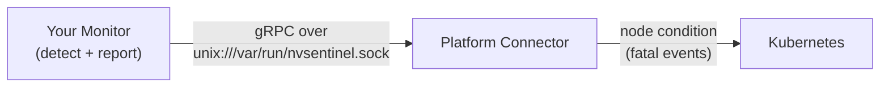

# Tutorial: Writing a New Health Monitor

This tutorial walks you through building a brand-new **health monitor**
from an empty directory to a deployed, fault-reporting component — without
needing any GPU hardware.

By the end you will have:

- A working Go health monitor that detects a fault and reports it to NVSentinel.
- A container image for it, deployed to a live cluster as a DaemonSet.
- Verification that NVSentinel sees the fault (it surfaces as a Kubernetes node condition).

> **Who is this for?** Teams **already running NVSentinel** who want to extend it with a new
> fault detector.

> **Just want the AI to do it?** Jump to [Appendix: One-shot AI prompt](#appendix-one-shot-ai-prompt).

## Prerequisites

- **Tools:** `docker` and `kubectl`.
- **A cluster with NVSentinel running.** Verification needs NVSentinel already running — at minimum
  `platform-connectors` (it sets the node condition this tutorial verifies). See
  [`DEVELOPMENT.md`](../../DEVELOPMENT.md) if you need to bring a cluster up locally, and confirm the
  core pods are green with `kubectl get pods -n nvsentinel` *before* verifying — otherwise a failed
  verification just means an unhealthy cluster, not a broken monitor.

---

## 1. What is a health monitor

NVSentinel detects faults on cluster nodes and remediates them (cordon → drain →
break-fix). The thing that *detects* a fault is a **health monitor**.

A health monitor is just a standalone process that:

1. Observes something (GPU via DCGM, kernel logs, a cloud API, a file in `/proc`, …).
2. Decides whether a node/component is healthy or not.
3. Sends a **`HealthEvent`** to the **platform-connector** over a local **gRPC Unix
   domain socket**.

The platform-connector turns fatal events into Kubernetes **node conditions** — and that's
where this tutorial ends. **Your monitor only has to detect and report.**



Key consequences of this design:

- Your monitor **never talks to the Kubernetes API** to cordon/drain. It only emits events.
- The transport is a **Unix socket on the node**, shared via a `hostPath` volume.
- The contract is a single gRPC method and a single message type. That's all you implement.

---

## 2. The contract (the only API you must speak)

The contract lives in [`data-models/protobufs/health_event.proto`](../../data-models/protobufs/health_event.proto).
Go types are generated into the package `github.com/nvidia/nvsentinel/data-models/pkg/protos`.

There is exactly **one RPC**:

```protobuf
service PlatformConnector {
  rpc HealthEventOccurredV1(HealthEvents) returns (google.protobuf.Empty) {}
}

message HealthEvents {
  uint32 version = 1;             // set to 1
  repeated HealthEvent events = 2;
}
```

You send a batch (`HealthEvents`) containing one or more `HealthEvent`s.

### The `HealthEvent` message

| Field | Type | Required? | Notes |
|-------|------|-----------|-------|
| `version` | uint32 | yes | Set to `1`. |
| `agent` | string | yes | Your monitor's name, e.g. `"demo-health-monitor"`. Downstream consumers match on this. |
| `componentClass` | string | yes | Logical component, e.g. `"GPU"`, `"NIC"`, `"Node"`. |
| `checkName` | string | yes | The specific check, e.g. `"NetworkReachability"`. |
| `isHealthy` | bool | yes | `true` = recovery/clear; `false` = a fault. |
| `isFatal` | bool | yes | `true` = serious fault (surfaces as a node condition); `false` = informational (becomes a Kubernetes Event). |
| `message` | string | recommended | The raw error/diagnostic message as reported by the source (e.g. the hardware, DCGM, syslog). |
| `nodeName` | string | yes (node faults) | The affected node. Usually from the `NODE_NAME` env (downward API). |
| `recommendedAction` | enum | recommended | See the `RecommendedAction` table below. Use `NONE` for healthy events. |
| `customRecommendedAction` | string | optional | Used with `recommendedAction = CUSTOM` to name a custom remediation action. |
| `generatedTimestamp` | Timestamp | yes | `timestamppb.Now()`. |
| `processingStrategy` | enum | yes | `EXECUTE_REMEDIATION` (act on it) or `STORE_ONLY` (observe only). |
| `entitiesImpacted` | repeated Entity | optional | Sub-components affected, e.g. `{entityType:"GPU", entityValue:"3"}`. |
| `errorCode` | repeated string | optional | Vendor/error codes. |
| `metadata` | map<string,string> | optional | Free-form key/values. |

The two enums you care about:

```protobuf
enum ProcessingStrategy {
  UNSPECIFIED = 0;          // normalized to EXECUTE_REMEDIATION by platform-connector
  EXECUTE_REMEDIATION = 1;  // normal: downstream modules may cordon/drain/remediate
  STORE_ONLY = 2;           // observability-only: persisted/exported, never mutates the cluster
}
```

`RecommendedAction` values (from
[`data-models/protobufs/health_event.proto`](../../data-models/protobufs/health_event.proto)):

| Value | Meaning |
|-------|---------|
| `NONE` (0) | No action (use for healthy/recovery events). |
| `COMPONENT_RESET` (2) | Reset the component. |
| `CONTACT_SUPPORT` (5) | Escalate to support. |
| `RUN_FIELDDIAG` (6) | Run field diagnostics. |
| `RESTART_VM` (15) | Restart the VM. |
| `RESTART_BM` (24) | Restart the bare-metal host. |
| `REPLACE_VM` (25) | Replace the VM. |
| `RUN_DCGMEUD` (26) | Run DCGM EUD. |
| `CUSTOM` (27) | Custom action; set `customRecommendedAction` to its name. |
| `UNKNOWN` (99) | Unknown. |

### The golden rules

1. **`agent` is your identity.** Downstream consumers match on it, so pick a stable, unique name.
2. **Prefer emitting on state transitions, not every poll.** Send an unhealthy event when a
   fault appears and a healthy event when it clears. This is a best-effort optimization to cut
   noise, not a correctness requirement — repeated events are deduped, so re-sending the same
   state is safe.
3. **A healthy event clears the node condition.** Send `isHealthy=true`,
   `recommendedAction=NONE` when things recover.
4. **`isFatal=true` is what triggers action.** Fatal events surface as a Kubernetes node
   condition; non-fatal events become Kubernetes Events instead.

---

## 3. Choose your workload model

A monitor can observe almost anything — node-local state (`/proc`, `/sys`, GPUs, logs), the
Kubernetes API, or an external service. That choice only affects the **Kubernetes workload
type**:

- **DaemonSet** (one pod per node) — for node-local state; each pod reports its own node.
- **Deployment** (single replica) — for a single cluster-wide source (the K8s API or an
  external API); it sets `nodeName` from the observed entity instead of from `NODE_NAME`.

The publishing path is identical either way. This tutorial builds a **DaemonSet**, the most
common shape.

Our worked example is a **`demo-health-monitor`** that periodically opens a TCP connection to a
configurable endpoint (`CHECK_TARGET`) the node depends on. It reports the node unhealthy when
the endpoint is unreachable and healthy again once it recovers.

---

## 4. Scaffold the module

Your monitor is an ordinary, standalone Go module. It depends on two NVSentinel Go modules:

- `github.com/nvidia/nvsentinel/data-models` — the event contract (the `HealthEvent` types).
- `github.com/nvidia/nvsentinel/commons` — the shared publisher (`commons/pkg/healthpub`), which
  adds socket-presence gating, retries, and Prometheus metrics over the raw gRPC client.

Create the module (any module path works):

```bash
mkdir demo-health-monitor && cd demo-health-monitor
go mod init github.com/<your-org>/demo-health-monitor
```

Add the two dependencies. They live in subdirectories of the NVSentinel repo and aren't
published as tagged releases, so fetch them by commit (`@main`, or pin a specific commit for
reproducibility). Because `commons` refers to `data-models` by an internal placeholder version,
add one `replace` so your build resolves the real commit:

```bash
export GOTOOLCHAIN=auto   # the modules need Go 1.26+; this fetches it automatically

# 1. Fetch the contract module, then capture the exact version go resolved.
go get github.com/nvidia/nvsentinel/data-models@main
DM=$(go list -m github.com/nvidia/nvsentinel/data-models | awk '{print $2}')

# 2. Point commons' internal data-models placeholder at that same version.
go mod edit -replace github.com/nvidia/nvsentinel/data-models=github.com/nvidia/nvsentinel/data-models@"$DM"

# 3. Fetch the publisher module.
go get github.com/nvidia/nvsentinel/commons@main
```

---

## 5. Write the monitor

Create `main.go`. The structure is: parse config from env → dial the socket → poll →
build an event on each state change → publish it through the shared `healthpub` publisher.

```go
package main

import (
	"context"
	"errors"
	"fmt"
	"log/slog"
	"net"
	"os"
	"os/signal"
	"strconv"
	"syscall"
	"time"

	"google.golang.org/grpc"
	"google.golang.org/grpc/credentials/insecure"
	"google.golang.org/protobuf/types/known/timestamppb"

	"github.com/nvidia/nvsentinel/commons/pkg/healthpub"
	pb "github.com/nvidia/nvsentinel/data-models/pkg/protos"
)

const (
	agentName      = "demo-health-monitor"
	componentClass = "Node"
	checkName      = "NetworkReachability"
)

func main() {
	if err := run(); err != nil {
		slog.Error("fatal error", "error", err)
		os.Exit(1)
	}
}

func run() error {
	// --- Configuration from environment ---
	nodeName := os.Getenv("NODE_NAME")
	if nodeName == "" {
		return fmt.Errorf("NODE_NAME env var must be set")
	}
	// checkTarget is a host:port the node should always be able to reach. When it
	// becomes unreachable we report the node unhealthy. The default is the in-cluster
	// Kubernetes API, which is reachable from any pod; override it for your dependency.
	checkTarget := envOrDefault("CHECK_TARGET", "kubernetes.default.svc:443")
	socketPath := envOrDefault("SOCKET_PATH", "/var/run/nvsentinel.sock")

	pollSeconds, err := strconv.Atoi(envOrDefault("POLL_INTERVAL_SECONDS", "10"))
	if err != nil {
		return fmt.Errorf("invalid POLL_INTERVAL_SECONDS: %w", err)
	}
	// time.NewTicker panics on a zero or negative duration, so reject bad values
	// before we build the ticker.
	if pollSeconds <= 0 {
		return fmt.Errorf("POLL_INTERVAL_SECONDS must be > 0, got %d", pollSeconds)
	}

	dialTimeout, err := strconv.Atoi(envOrDefault("CHECK_TIMEOUT_SECONDS", "3"))
	if err != nil {
		return fmt.Errorf("invalid CHECK_TIMEOUT_SECONDS: %w", err)
	}
	if dialTimeout <= 0 {
		return fmt.Errorf("CHECK_TIMEOUT_SECONDS must be > 0, got %d", dialTimeout)
	}

	ctx, stop := signal.NotifyContext(context.Background(), os.Interrupt, syscall.SIGTERM)
	defer stop()

	// --- Connect to platform-connector over the Unix socket ---
	target := "unix://" + socketPath
	conn, err := grpc.NewClient(target, grpc.WithTransportCredentials(insecure.NewCredentials()))
	if err != nil {
		return fmt.Errorf("dial %s: %w", target, err)
	}
	defer conn.Close()
	client := pb.NewPlatformConnectorClient(conn)

	// Publish through the shared publisher instead of the raw client: it gates on
	// socket presence, retries transient errors, and exports Prometheus metrics.
	pub := healthpub.New(client, target, agentName)

	slog.Info("starting", "agent", agentName, "node", nodeName,
		"checkTarget", checkTarget, "socket", socketPath)

	// --- Poll loop (edge-triggered: only send on health changes) ---
	ticker := time.NewTicker(time.Duration(pollSeconds) * time.Second)
	defer ticker.Stop()

	var lastHealthy *bool
	for {
		select {
		case <-ctx.Done():
			slog.Info("shutting down")
			return nil
		case <-ticker.C:
			// Healthy when we can open a TCP connection to checkTarget within the timeout.
			checkErr := checkReachable(checkTarget, time.Duration(dialTimeout)*time.Second)
			healthy := checkErr == nil
			slog.Info("connectivity check", "target", checkTarget, "healthy", healthy)

			// Only emit when health state flips.
			if lastHealthy != nil && *lastHealthy == healthy {
				continue
			}

			event := buildEvent(nodeName, checkTarget, checkErr)
			err := pub.Publish(ctx, &pb.HealthEvents{
				Version: 1,
				Events:  []*pb.HealthEvent{event},
			})
			if errors.Is(err, healthpub.ErrPlatformConnectorUnavailable) {
				// PC is down: do NOT advance lastHealthy so the next poll
				// re-emits this state with a fresh timestamp.
				slog.Warn("platform-connector unavailable; will retry next tick")
				continue
			}
			if err != nil {
				slog.Error("publish failed after retries", "error", err)
				continue // also do not advance lastHealthy
			}

			slog.Info("sent health event", "healthy", healthy)
			lastHealthy = &healthy
		}
	}
}

// checkReachable returns nil if a TCP connection to addr (host:port) succeeds within
// timeout, otherwise the underlying dial error (surfaced verbatim in the event message).
func checkReachable(addr string, timeout time.Duration) error {
	conn, err := net.DialTimeout("tcp", addr, timeout)
	if err != nil {
		return err
	}
	return conn.Close()
}

func buildEvent(nodeName, target string, checkErr error) *pb.HealthEvent {
	healthy := checkErr == nil
	event := &pb.HealthEvent{
		Version:            1,
		Agent:              agentName,
		ComponentClass:     componentClass,
		CheckName:          checkName,
		NodeName:           nodeName,
		GeneratedTimestamp: timestamppb.Now(),
		ProcessingStrategy: pb.ProcessingStrategy_EXECUTE_REMEDIATION,
		IsHealthy:          healthy,
		IsFatal:            !healthy,
	}
	if healthy {
		event.Message = fmt.Sprintf("%s reachable", target)
		event.RecommendedAction = pb.RecommendedAction_NONE
	} else {
		// Surface the raw dial error verbatim.
		event.Message = checkErr.Error()
		event.RecommendedAction = pb.RecommendedAction_CONTACT_SUPPORT
	}
	return event
}

func envOrDefault(key, fallback string) string {
	if v := os.Getenv(key); v != "" {
		return v
	}
	return fallback
}
```

Tidy and build:

```bash
go mod tidy
go build ./...
```

That's a complete, contract-correct health monitor. Everything else is packaging,
deployment, and hardening.

---

## 6. Containerize

Package the monitor as a container image with a small multi-stage `Dockerfile` in the monitor
directory. Because dependencies are fetched from the module proxy (not local paths), the build
context is just the monitor directory itself:

```dockerfile
FROM public.ecr.aws/docker/library/golang:1.26.3-trixie AS builder
WORKDIR /src

# Manifests first for better layer caching. go.mod/go.sum already pin the
# data-models/commons versions and the replace directive.
COPY go.mod go.sum ./
RUN go mod download

COPY . .
RUN CGO_ENABLED=0 go build -ldflags="-s -w" -o demo-health-monitor .

FROM gcr.io/distroless/static-debian13
COPY --from=builder /src/demo-health-monitor /demo-health-monitor
ENTRYPOINT ["/demo-health-monitor"]
```

Build the image and push it to a registry your cluster can pull from. We use Docker Hub
here — replace `<dockerhub-user>` with your Docker Hub username. Run from the monitor directory:

```bash
cd demo-health-monitor

docker login     # once, to authenticate to Docker Hub

docker build -t docker.io/<dockerhub-user>/demo-health-monitor:dev .

# Push so the cluster can pull it.
docker push docker.io/<dockerhub-user>/demo-health-monitor:dev
```

> If you use a **private** repository, make sure the cluster has the required image pull
> credentials (e.g. an `imagePullSecret` in the `nvsentinel` namespace, referenced from the
> DaemonSet's `spec.template.spec.imagePullSecrets`). A public repository needs none.

---

## 7. Run and verify

Deploy the image as a DaemonSet, then trigger a fault and watch it flow through the pipeline.
(Needs the [Prerequisites](#prerequisites).)

**Apply the DaemonSet.** We start `CHECK_TARGET` at a guaranteed-unreachable, reserved
[TEST-NET](https://www.rfc-editor.org/rfc/rfc5737) address so the monitor reports a fault right
away — then we'll point it at a reachable endpoint to clear it. It mounts the platform-connector
socket (`hostPath` `/var/run/nvsentinel` → `/var/run`) and sets `NODE_NAME` via the downward API:

```bash
kubectl apply -f - <<'YAML'
apiVersion: apps/v1
kind: DaemonSet
metadata:
  name: demo-health-monitor
  namespace: nvsentinel
  labels:
    app.kubernetes.io/name: demo-health-monitor
spec:
  selector:
    matchLabels:
      app.kubernetes.io/name: demo-health-monitor
  template:
    metadata:
      labels:
        app.kubernetes.io/name: demo-health-monitor
    spec:
      containers:
        - name: demo-health-monitor
          image: docker.io/<dockerhub-user>/demo-health-monitor:dev
          imagePullPolicy: IfNotPresent
          env:
            - name: NODE_NAME
              valueFrom:
                fieldRef:
                  fieldPath: spec.nodeName
            - name: CHECK_TARGET
              value: "192.0.2.1:9"
            - name: POLL_INTERVAL_SECONDS
              value: "10"
            - name: SOCKET_PATH
              value: "/var/run/nvsentinel.sock"
          volumeMounts:
            - name: socket
              mountPath: /var/run
      volumes:
        - name: socket
          hostPath:
            path: /var/run/nvsentinel
            type: DirectoryOrCreate
YAML
```

Confirm the pods are up:

```bash
kubectl rollout status ds/demo-health-monitor -n nvsentinel
kubectl get pods -l app.kubernetes.io/name=demo-health-monitor -n nvsentinel
```

### Trigger and verify

> Assumes the [Prerequisites](#prerequisites) are met, these steps are cluster-agnostic.

Because `CHECK_TARGET` is unreachable, within one poll interval the monitor emits an
**unhealthy, fatal** `HealthEvent`. Platform-connector turns fatal events into a **Kubernetes
node condition** automatically, using your `checkName` (`NetworkReachability`) as the condition
**Type**. Pick any node a monitor pod runs on and watch the condition appear:

```bash
# Any node running the monitor (each pod reports its own node).
NODE=$(kubectl get pods -n nvsentinel -l app.kubernetes.io/name=demo-health-monitor \
  -o jsonpath='{.items[0].spec.nodeName}')

# 1. Monitor detected the unreachable endpoint and sent an unhealthy (fatal) event.
kubectl logs -l app.kubernetes.io/name=demo-health-monitor -n nvsentinel

# 2. Platform-connector recorded it on the node as a condition (Type == your checkName).
kubectl get node "$NODE" \
  -o jsonpath='{range .status.conditions[?(@.type=="NetworkReachability")]}{.type}{"  "}{.status}{"  "}{.reason}{"  "}{.message}{"\n"}{end}'
```

You should see the condition reported as a fault:

```text
NetworkReachability  True  NetworkReachabilityIsNotHealthy  dial tcp 192.0.2.1:9: ... Recommended Action=CONTACT_SUPPORT;
```

> **Note the inverted semantics:** NVSentinel sets `Status=True` to mean *a fault is present*
> (and `Status=False` for healthy). The condition `Type` is exactly your `checkName`, and
> `Reason` is `<checkName>IsNotHealthy` / `<checkName>IsHealthy`. The same condition is visible
> under **Conditions** in `kubectl describe node "$NODE"`.

Clear the fault — point `CHECK_TARGET` at a reachable endpoint (`kubernetes.default.svc:443` is
reachable from any in-cluster pod). On the next poll the monitor emits a healthy event and the
condition flips back (`Status=False`, `Reason=NetworkReachabilityIsHealthy`,
`Message="No Health Failures"`):

```bash
kubectl set env ds/demo-health-monitor -n nvsentinel CHECK_TARGET=kubernetes.default.svc:443
kubectl rollout status ds/demo-health-monitor -n nvsentinel

kubectl get node "$NODE" \
  -o jsonpath='{range .status.conditions[?(@.type=="NetworkReachability")]}{.type}{"  "}{.status}{"  "}{.reason}{"  "}{.message}{"\n"}{end}'
```

The condition now reports healthy:

```text
NetworkReachability  False  NetworkReachabilityIsHealthy  No Health Failures
```

That's the end of the path this tutorial covers: your monitor detects a fault and NVSentinel
surfaces it as a node condition.

> If nothing arrives at the platform-connector, the usual cause is the socket mount.
> See [`docs/runbooks/health-monitor-uds-failures.md`](../runbooks/health-monitor-uds-failures.md).

---

## Appendix: One-shot AI prompt

Paste this to an AI coding agent. It is **self-contained**: the monitor is a standalone module
that can be created in **any repository** (it does not need to be inside the NVSentinel repo).
Replace the bracketed parts.

```text
Create a new NVSentinel health monitor named "[my-monitor]" that detects [the condition]
by [the method, e.g. "checking TCP reachability of an endpoint", "reading /proc/loadavg",
or "watching <K8s resource>"]. It is a standalone Go program that can live in any repo;
follow this spec exactly.

- Create a new Go module in its own directory with any module path (e.g.
  github.com/<your-org>/[my-monitor]). It depends on two NVSentinel modules that are NOT
  published as tagged releases, so fetch them by commit and add one replace so commons can
  resolve data-models:
    export GOTOOLCHAIN=auto
    go get github.com/nvidia/nvsentinel/data-models@main
    DM=$(go list -m github.com/nvidia/nvsentinel/data-models | awk '{print $2}')
    go mod edit -replace github.com/nvidia/nvsentinel/data-models=github.com/nvidia/nvsentinel/data-models@"$DM"
    go get github.com/nvidia/nvsentinel/commons@main
- Emit contract-correct HealthEvents (agent="[my-monitor]", a stable componentClass and
  checkName), edge-triggered (only on health-state changes), with
  ProcessingStrategy_EXECUTE_REMEDIATION; healthy events use RecommendedAction_NONE.
- Publish via commons/pkg/healthpub (github.com/nvidia/nvsentinel/commons/pkg/healthpub) to
  the platform-connector Unix socket (unix:///var/run/nvsentinel.sock) and treat
  ErrPlatformConnectorUnavailable as "retry next cycle" without advancing dedup state.
- Validate env config: NODE_NAME (required) plus the poll interval and any check timeout;
  reject non-positive durations before constructing a time.Ticker.
- Add a multi-stage Dockerfile whose build context is the monitor directory itself (COPY
  go.mod/go.sum, go mod download, COPY ., build a static binary). No local module copying.
- Provide a DaemonSet manifest (namespace nvsentinel) that mounts the platform-connector
  socket (hostPath /var/run/nvsentinel -> /var/run) and sets NODE_NAME via the downward API.
- Show the deploy commands against a running NVSentinel cluster: docker build, docker push
  to a registry the cluster can pull from (e.g. Docker Hub), then kubectl apply the DaemonSet
  (image referencing the pushed tag).
- Show how to verify: a fatal event surfaces as a Kubernetes node condition whose Type equals
  the checkName (kubectl get node <node> -o jsonpath over .status.conditions; Status=True
  means a fault is present). Stop at the node condition.

Ensure `go mod tidy` and `go build ./...` pass.
```
