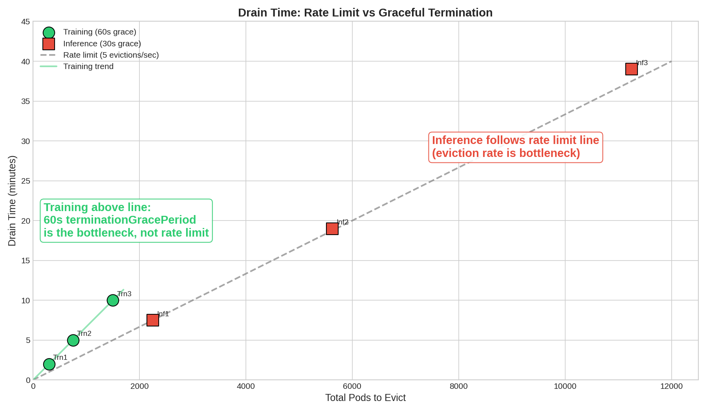

# Concurrent Drain Operations Scale Test Results

**Cluster:** 1503 nodes (3 system + 1500 customer aws-cpu-m7i.xlarge nodes)  
**NVSentinel Version:** v0.4.0  
**Node Drainer Config:** `evictionTimeoutInSeconds=60`, `mode=Immediate` for test-workload namespace  
**Test Date:** December 8, 2025

---

## Test Overview

**Objective:** Validate Node Drainer Manager's ability to handle concurrent drain operations at scale

**Description:** When nodes are cordoned due to fatal health events, Node Drainer evicts user pods to allow maintenance or repair. This test measures NDM performance when draining many nodes concurrently.

### Workloads Tested

Two **simulated** workload patterns mimic the resource characteristics of real customer use cases. These are not actual inference or training workloads — they are simple Python containers configured to match typical pod density, resource requests, and termination behavior:

- **Inference-sim workload:** 15 small pods per node, 22,500 total pods across 1,500 nodes. Mimics inference serving patterns with many lightweight pods and fast shutdown. (pod `terminationGracePeriodSeconds=30`, ~100m CPU each)
- **Training-sim workload:** 2 large pods per node, 3,000 total pods across 1,500 nodes. Mimics training job patterns with fewer resource-intensive pods and longer graceful shutdown. (pod `terminationGracePeriodSeconds=60`, 1.5 CPU each)

*Note: Effective grace period = min(evictionTimeoutInSeconds, terminationGracePeriodSeconds). Since Node Drainer uses evictionTimeoutInSeconds=60, the pod's terminationGracePeriodSeconds is the effective limit.*

### Test Matrix for the 1500 node cluster

| Test | Workload | Scale | Nodes Drained | Pods/Node | Pods Evicted |
|------|----------|-------|---------------|-----------|--------------|
| **Inf1** | Inference | 10% | 150 | 15 | ~2,250 |
| **Inf2** | Inference | 25% | 375 | 15 | ~5,625 |
| **Inf3** | Inference | 50% | 750 | 15 | ~11,250 |
| **Trn1** | Training | 10% | 150 | 2 | ~300 |
| **Trn2** | Training | 25% | 375 | 2 | ~750 |
| **Trn3** | Training | 50% | 750 | 2 | ~1,500 |

*Scale = percentage of the 1,500-node cluster experiencing simultaneous failures requiring drain.*

### Measurement Methodology

FQM (cordon) and Node Drainer (eviction) run **in parallel**, not sequentially:

```
Time:    T0          T1              T2                  T3
         |-----------|---------------|-------------------|
         FQM         First node      FQM finishes        Last pod
         starts      cordoned        (all nodes          evicted
                     (NDM starts     cordoned)           (NDM done)
                     draining)
```

**Key measurements:**
- **FQM Cordon Time** = T2 - T0 (measured by fqm-scale-test tool)
- **NDM Drain Time** = T3 - T1 (from node-drainer logs: first eviction to last eviction)
- **Total Time** = T3 - T0 (wall-clock from test start to last eviction complete)

Because FQM and NDM overlap, Total Time < FQM Cordon + NDM Drain. NDM starts draining as soon as the first node is cordoned (T1), while FQM continues cordoning remaining nodes.

**How we measure drain time:**

*Prometheus metrics (aggregate):*
```bash
# Total handling time across all events
curl -s "localhost:9090/api/v1/query?query=node_drainer_event_handling_duration_seconds_sum"

# Number of events processed  
curl -s "localhost:9090/api/v1/query?query=node_drainer_event_handling_duration_seconds_count"

# Average per event = sum / count
```

*Log timestamps (wall-clock time):*
```bash
# First eviction timestamp
kubectl logs deployment/node-drainer -n nvsentinel | grep "Pod eviction initiated" | head -1

# Last eviction timestamp  
kubectl logs deployment/node-drainer -n nvsentinel | grep "Pod eviction initiated" | tail -1

# Wall-clock drain time = last timestamp - first timestamp
```

**Note:** Prometheus gives aggregate handling time (sum of all event durations). Log timestamps give wall-clock time (first eviction to last eviction). These differ because events are processed in parallel.

**Important:** Drain starts as soon as the first node is cordoned, not after FQM finishes. If you measure "drain time" starting from when FQM finishes, you'll underestimate the actual drain duration.

---

## Results Summary

### Training Workload Running on Cluster (2 large pods/node, ~3,000 total pods)

| Test | Nodes | Pods Evicted | FQM Cordon | NDM Drain (wall) | Total Time* |
|------|-------|--------------|------------|------------------|-------------|
| **Trn1** | 150 | ~300 | 62.5s | **~2min** | **~2min** |
| **Trn2** | 375 | ~750 | 150.5s | **~5min** | **~5min** |
| **Trn3** | 750 | ~1,500 | 299.9s | **~10min** | **~10min** |

*Total Time reflects overlap between FQM and NDM (see [Measurement Methodology](#measurement-methodology))

### Inference Workload Running on Cluster (15 small pods/node, ~22,500 total pods)

| Test | Nodes | Pods Evicted | FQM Cordon | NDM Drain (wall) | Total Time* |
|------|-------|--------------|------------|------------------|-------------|
| **Inf1** | 150 | ~2,250 | 62.6s | **~7.5min** | **~8min** |
| **Inf2** | 375 | ~5,625 | 150.4s | **~19min** | **~22min** |
| **Inf3** | 750 | ~11,250 | 304.7s | **~39min** | **~44min** |

*Total Time reflects overlap between FQM and NDM (see [Measurement Methodology](#measurement-methodology))

### Pod Count vs Drain Time



**Inference (red squares):** Follow the theoretical 5 evictions/sec line because the Kubernetes client rate limit is the bottleneck.

**Training (green circles):** Above the line because they have fewer pods and don't hit the rate limit. Instead, drain time is dominated by the 60s `terminationGracePeriodSeconds` — evictions complete quickly, but we wait for graceful termination.

---

## Node Drainer Metrics

| Metric | Trn1 | Trn2 | Trn3 | Inf1 | Inf2 | Inf3 |
|--------|------|------|------|------|------|------|
| Events received | ~300 | ~750 | ~1,500 | 300 | 750 | 1097 |
| Total evictions | 299 | 750 | 1,500 | 2,264 | 5,700 | 11,683 |
| Processing errors | 0 | 0 | 0 | 0 | 0 | 0 |
| Wall-clock drain time | ~2min | ~5min | ~10min | ~7.5min | ~19min | ~39min |
| API throttle events | 0 | 0 | 0 | 44 | 110 | 226 |

*Events received includes requeues for status verification. Inf3 shows 1097 events (lower than expected 1500) likely due to Prometheus scrape timing or pod restart during long test.

---

## Understanding the Drain Bottleneck

At scale, the Node Drainer's eviction rate is limited by the Kubernetes client's built-in rate limiter. This section documents the bottleneck and how to measure it.

### Summary of Findings (Inf3 test)

| Metric | Value | How Calculated |
|--------|-------|----------------|
| Total evictions | 11,683 | `kubectl logs deployment/node-drainer -n nvsentinel \| grep -c "Pod eviction initiated"` |
| Eviction rate | 5/sec sustained | Log timestamps show burst in first second, then 5/sec |
| Expected drain time | 11,683 ÷ 5 = 2,337s = **38.9 min** | Matches observed ~39 min ✓ |
| Throttle events | 226 | `kubectl logs ... \| grep -c "client-side throttling"` |
| Total throttle delay | 439s (7.3 min) | Sum of all `delay="X.Xs"` values in throttle logs |
| Failed evictions | 0 | `kubectl logs ... \| grep -c "eviction failed"` |
| Processing errors | 0 | Prometheus: `node_drainer_processing_errors_total` |

### Two Throttling Mechanisms Identified

**1. Kubernetes Client-Go Rate Limiter (Primary Bottleneck)**

The Kubernetes Go client has a built-in rate limiter with QPS (queries per second) and Burst settings. Default values are typically QPS=5, Burst=10-100.

Evidence from node-drainer logs:
```bash
# Count evictions per second
kubectl logs deployment/node-drainer -n nvsentinel | grep "Pod eviction initiated" \
  | grep -oP '"time":"[^"]+"' | sed 's/"time":"//; s/"//; s/\.[0-9]*Z//' \
  | cut -d'T' -f2 | cut -d':' -f1,2,3 | uniq -c | head -20

# Output:
#      13 23:25:05   <-- Initial burst
#       5 23:25:06   <-- Sustained rate limit kicks in
#       5 23:25:07
#       5 23:25:08
#       ... (continues at 5/sec)
```

**2. API Server Client-Side Throttling (Secondary)**

When the rate limiter delays requests, it logs explicit throttle warnings:
```
"Waited before sending request" delay="2.96s" reason="client-side throttling, not priority and fairness"
```

Commands to analyze throttle delays:
```bash
# Count throttle events
kubectl logs deployment/node-drainer -n nvsentinel | grep -c "client-side throttling"
# Output: 226

# Sum all throttle delays
kubectl logs deployment/node-drainer -n nvsentinel | grep "client-side throttling" \
  | grep -oP 'delay="[0-9.]+' | sed 's/delay="//' \
  | awk '{sum += $1} END {printf "%.1f seconds\n", sum}'
# Output: 439.0 seconds

# Average delay per throttle
kubectl logs deployment/node-drainer -n nvsentinel | grep "client-side throttling" \
  | grep -oP 'delay="[0-9.]+' | sed 's/delay="//' \
  | awk '{sum += $1; count++} END {printf "%.2f seconds\n", sum/count}'
# Output: 1.94 seconds
```

### Drain Time Scales Linearly with Pod Count

Because the Kubernetes client limits evictions to ~5/sec, drain time scales linearly with the number of pods:

| Test | Evictions | Expected at 5/sec | Actual Drain Time |
|------|-----------|-------------------|-------------------|
| Inf1 | ~2,250 | 450s = 7.5min | **~7.5min**  |
| Inf2 | ~5,625 | 1,125s = 18.75min | **~19min** |
| Inf3 | ~11,250 | 2,250s = 37.5min | **~39min** |

The actual drain times closely match the expected times based on the 5/sec rate limit.

### Verification Commands

To verify all evictions succeeded and there were no errors:
```bash
# Confirm zero failures
kubectl logs deployment/node-drainer -n nvsentinel | grep -iE "eviction failed|failed to evict" | wc -l

# Confirm zero processing errors
curl -s "localhost:9090/api/v1/query?query=node_drainer_processing_errors_total" | jq -r '.data.result[0].value[1]'

# Count successful evictions
kubectl logs deployment/node-drainer -n nvsentinel | grep -c "Pod eviction initiated"
```

### Can This Be Fixed?

**Yes, potentially.** The node-drainer could be configured with higher QPS/Burst settings for the Kubernetes client. However:

1. **Trade-off:** Higher QPS could overload the API server at scale
2. **Configuration:** Would require code changes to node-drainer (not just config)
3. **API Server Limits:** Even with higher client QPS, API server may have its own limits (Priority and Fairness)

**Recommendation:** Test with increased QPS/Burst settings (e.g., QPS=50, Burst=100) and monitor API server health. This is a tuning decision, not a bug fix.

---

## Cluster Capacity and Pod Rescheduling

When nodes are cordoned, evicted pods attempt to reschedule on remaining healthy nodes. Whether they succeed depends on available cluster capacity.

**Inference workload (15 small pods/node, ~100m CPU each):**
- Baseline: 22,500 pods across 1,500 nodes
- At 50% cordon (750 nodes): pods redistribute to remaining 750 nodes at ~30 pods/node
- ✅ **Sufficient capacity** — m7i.xlarge nodes (~4 vCPU) can handle 30 small pods

**Training workload (2 large pods/node, 1.5 CPU each):**
- Baseline: 3,000 pods across 1,500 nodes
- At 50% cordon (750 nodes): would need ~4 pods/node on remaining nodes (6 CPU)
- ❌ **Insufficient capacity** — m7i.xlarge nodes (~4 vCPU) cannot fit 4 training pods

**What happens when capacity is insufficient:**
- Pods are still evicted successfully (drain completes)
- Evicted pods go to `Pending` state waiting for resources
- Pods reschedule when capacity becomes available (nodes uncordoned or repaired)

This does not affect drain performance — Node Drainer measures eviction completion, not pod rescheduling.


## Test Environment

- **Cluster:** rs3 (1500 nodes)
- **NVSentinel Version:** v0.4.0
- **MongoDB:** 3-replica, 6Gi memory per replica
- **Inference workload (Inf1, Inf2, Inf3):** inference-sim (15 pods/node, 30s terminationGracePeriodSeconds)
- **Training workload (Trn1, Trn2, Trn3):** training-sim (2 pods/node, 60s terminationGracePeriodSeconds)
- **Test Date:** December 8, 2025

### Node Drainer Configuration

The node-drainer was configured with `Immediate` eviction mode for the test-workload namespace:

```toml
evictionTimeoutInSeconds = "60"
systemNamespaces = "^(nvsentinel|kube-system|gpu-operator|gmp-system|network-operator|skyhook)$"
deleteAfterTimeoutMinutes = 60
notReadyTimeoutMinutes = 5

[[userNamespaces]]
name = "test-workload"
mode = "Immediate"

[[userNamespaces]]
name = "*"
mode = "AllowCompletion"
```

**Configuration Parameters:**

| Parameter | Value | Description |
|-----------|-------|-------------|
| `evictionTimeoutInSeconds` | 60 | Grace period passed to Kubernetes Eviction API for `Immediate` mode. Pods have up to 60s to terminate gracefully before force deletion. |
| `mode` | `Immediate` | Actively evicts pods using Kubernetes Eviction API. Required for drain testing. |
| `deleteAfterTimeoutMinutes` | 60 | For `DeleteAfterTimeout` mode only - time from health event creation before force deletion. |
| `notReadyTimeoutMinutes` | 5 | Pods in NotReady state longer than this are skipped from eviction. |

**Eviction Modes:**
- **Immediate**: Evicts pods immediately using Kubernetes Eviction API with `evictionTimeoutInSeconds` as grace period. Used for these tests.
- **AllowCompletion**: Waits for pods to terminate on their own (respects terminationGracePeriodSeconds). Does NOT actively evict.
- **DeleteAfterTimeout**: Waits up to `deleteAfterTimeoutMinutes` from health event time, then force deletes remaining pods.

**AllowCompletion Mode and Throttling:** We also tested AllowCompletion mode at 10% and 25% scale with the inference workload. Result: **0 throttle events** in both cases. This is expected because AllowCompletion doesn't call the Eviction API — it only monitors pod status and waits for natural completion, so the client-go rate limiter is never triggered.

**Note:** The default node-drainer configuration uses `AllowCompletion` mode for all user namespaces. For drain tests to actively evict pods, you must configure `Immediate` mode for the test namespace.


