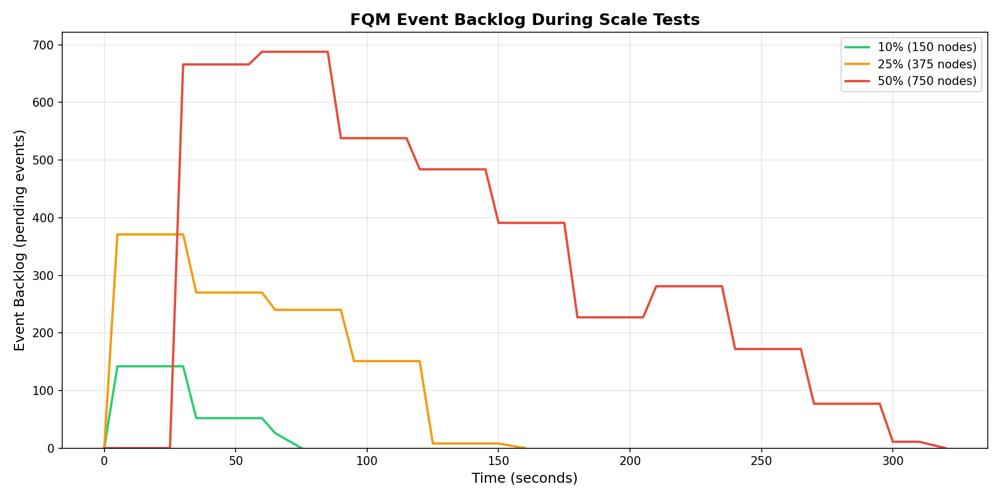

# FQM Latency & Queue Depth Performance

**Objective:** Measure FQM (Fault Quarantine Module) performance for cordoning nodes in response to fatal health events.

---

## Test Environment

**Cluster:** 1503 nodes (3 system + 1500 customer aws-cpu-m7i.xlarge nodes)  
**NVSentinel Version:** v0.4.0  
**MongoDB:** 3 replicas, 6Gi memory per replica  
**Test Date:** December 5, 2025

### Test Approach

**Phase 1: End-to-End Tests** measure the complete pipeline latency from signal to cordon. This captures real-world performance including all component interactions.

**Phase 2: Microbenchmarks** isolate individual pipeline stages using Prometheus metrics and direct MongoDB benchmarks to identify bottlenecks.

### Pipeline Measured

```
┌─────────────┐    ┌───────────────────┐    ┌─────────┐    ┌─────────────┐    ┌───────────┐
│  SIGUSR1    │───▶│ Event Generator   │───▶│ Platform│───▶│  MongoDB    │───▶│    FQM    │───▶ Node Cordoned
│  (T0)       │    │ (gRPC/UDS)        │    │Connector│    │  (insert)   │    │ (change   │
└─────────────┘    └───────────────────┘    └─────────┘    └─────────────┘    │  stream)  │
                                                                              └───────────┘
     [A]                  [B]                   [C]              [D]              [E]
```

**End-to-End Latency** = T(cordon) - T(SIGUSR1) — measures [A] through [E]

---

## Test Setup & Execution

### Build the Test Tool

```bash
cd tests/scale-tests/cmd/fqm-scale-test
go build -o fqm-scale-test .
```

### Reset Cluster Between Tests

```bash
# Run the reset script
cd tests/scale-tests/scripts
./reset-cordoned-nodes.sh

# Clear MongoDB state (via mongodb-shell.sh in repo root)
db.HealthEvents.deleteMany({})
db.ResumeTokens.deleteMany({})

# Disable node-drainer during tests
kubectl scale deployment/node-drainer -n nvsentinel --replicas=0
```

### Run Tests

```bash
cd tests/scale-tests/cmd/fqm-scale-test

./fqm-scale-test                # 10% cluster (150 nodes, default)
./fqm-scale-test -nodes=375     # 25% cluster
./fqm-scale-test -nodes=750     # 50% cluster
```

**Options:** `-workers=50` (default), `-timeout=600` (seconds), `-stagger=0` (0=blast mode)

---

## FQM Latency Results

| Scale | Nodes | Time to Complete | Peak Queue | Avg Rate |
|-------|-------|------------------|------------|----------|
| 10% | 150 | **62.2s** | 142 | 2.50/sec |
| 25% | 375 | **154.6s** | 371 | 2.50/sec |
| 50% | 750 | **303.7s** | 688 | 2.54/sec |

**Test Methodology:** All SIGUSR1 signals are sent as fast as possible using a 50-worker pool, then we poll every 5 seconds to count cordoned nodes until all are complete. "Time to Complete" measures from first signal sent until last node cordoned.

**Test Parameters:** Lightweight mode (worker pool), no stagger, Circuit breaker DISABLED, Node drainer DISABLED

---

## Key Findings

- ✅ **100% cordoning success rate** at all scales (10%, 25%, 50%)
- ✅ **~2.5 nodes/sec** consistent cordoning rate across all scales
- ✅ **Event handling latency** stays consistent: P50 ~0.37s, P90 ~0.48s
- ✅ **Peak backlog scales linearly** with load: 142 → 371 → 688
- ✅ **FQM processes events sequentially** (one at a time from change stream queue) — Platform Connector writes in parallel (~5ms each, zero backlog)

---

## Event Backlog Over Time



The graph shows event backlog (pending events waiting to be processed by FQM) during each test. All three tests show the same pattern: backlog spikes when events arrive, then drains at ~2.5 nodes/sec as FQM processes them. Minor fluctuations reflect Prometheus scrape timing (15-30s intervals) relative to FQM's continuous event processing.

---

## Prometheus Metrics — FQM Event Handling `[D]→[E]`

Measures FQM processing time from receiving MongoDB change stream event to cordoning node.

| Scale | Nodes | Event Handling P50 | Event Handling P90 | Event Handling P99 | Peak Backlog |
|-------|-------|-------------------|-------------------|-------------------|--------------|
| 10% | 150 | 0.37s | 0.47s | 0.50s | 142 |
| 25% | 375 | 0.37s | 0.48s | 0.50s | 371 |
| 50% | 750 | 0.38s | 0.48s | 0.50s | 688 |

---

## Phase 2: Microbenchmarks

### Platform Connector Workqueue Latency `[C]→[D]`

Measures time events spend in Platform Connector's queue before writing to MongoDB.

| Metric | Value |
|--------|-------|
| Avg Work Duration (MongoDB write) | **~5ms** |
| Peak Queue Depth | **0** |
| Total Events Received | 4733 |

**Finding:** Platform Connector has **zero queue backlog** — events are written to MongoDB as fast as they arrive. MongoDB writes complete in ~5ms. FQM then processes events sequentially from the change stream.

**How we verified:** Queried Prometheus during the 750-node test:
```promql
# Average time to write to MongoDB
sum(rate(platform_connector_workqueue_work_duration_seconds_databaseStore_sum[5m])) 
  / sum(rate(platform_connector_workqueue_work_duration_seconds_databaseStore_count[5m]))
# Result: 0.0047s (~5ms)

# Peak queue depth during test
max_over_time(sum(platform_connector_workqueue_depth_databaseStore)[5m])
# Result: 0 (no backlog)
```

### MongoDB Insert+Update Benchmark `[D]`

Direct MongoDB performance, isolated from other components. We use 1000 operations (more than our largest 750-node test) to demonstrate that MongoDB can handle sustained write load. If MongoDB completes 1000 insert+update pairs faster than FQM processes 750 events, this confirms MongoDB is not the bottleneck.

| Benchmark | Duration | Rate |
|-----------|----------|------|
| 1000 insert+update pairs | **140.2s** | **140ms/op** |

```javascript
// Run in mongosh via: scripts/mongodb-shell.sh in the root of the repo
const start = new Date();
for (let i = 0; i < 1000; i++) {
  const id = ObjectId();
  db.HealthEvents.insertOne({
    _id: id,
    healthevent: {agent: 'benchmark', isfatal: true, nodename: 'test-'+i},
    healtheventstatus: {nodequarantined: null}
  });
  db.HealthEvents.updateOne(
    {_id: id},
    {$set: {'healtheventstatus.nodequarantined': 'Quarantined'}}
  );
}
print(`Duration: ${new Date() - start}ms for 1000 insert+update pairs`);
```

---

## Microbenchmark Summary

The component-level measurements help explain where time is spent in the pipeline:

| Component | Measured Latency | Contribution to Total |
|-----------|------------------|----------------------|
| Signal sending [A]→[B] | ~20s for 750 nodes | Parallel (masked by worker pool) |
| Platform Connector [C]→[D] | ~5ms async | Parallel (1500 pods, masked) |
| MongoDB writes [D] | ~143ms sync | Parallel (hidden by concurrent writes) |
| **FQM processing [D]→[E]** | **~370ms per event** | **Sequential (dominates total time)** |

**Key Insight:** While MongoDB sync writes take ~143ms each, the 1500 Platform Connector pods write in parallel, completing all 750 events within the ~20s Phase 1 window. FQM then processes events sequentially from the change stream at ~370ms each, accounting for ~90% of the total end-to-end time.

**Verification:** 750 events × 370ms = 277s, plus ~20s Phase 1 = ~297s. Actual measured: 307s. The ~10s difference is attributed to change stream latency and measurement overhead.

---

## Prometheus Queries

```promql
# FQM Event Handling Duration
histogram_quantile(0.90, sum(rate(fault_quarantine_event_handling_duration_seconds_bucket[5m])) by (le))

# FQM Event Backlog Count
fault_quarantine_event_backlog_count

# Platform Connector Write Queue Latency
histogram_quantile(0.90, sum(rate(platform_connector_workqueue_latency_seconds_bucket{queue="databaseStore"}[5m])) by (le))
```

